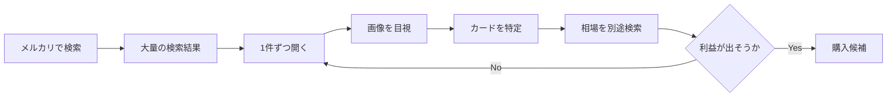
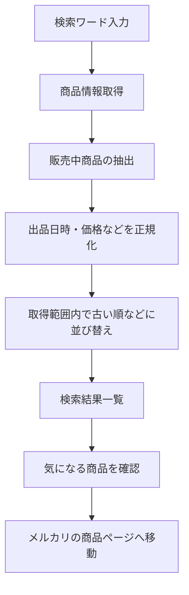
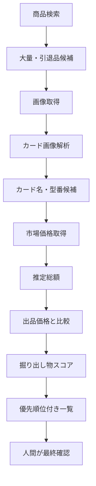
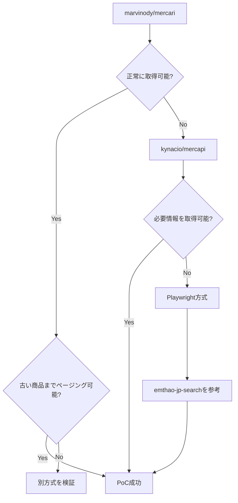
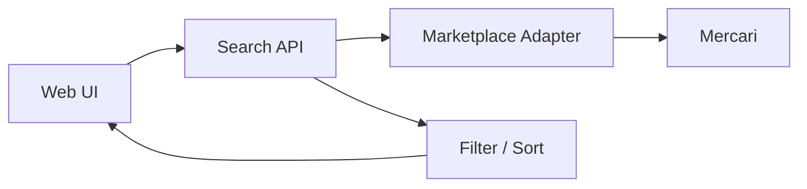
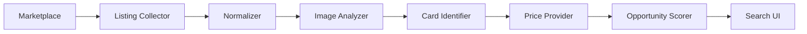

# Card Digger（仮称）— アプリコンセプト案

> メルカリなどの大量出品・引退品の中から、価値が見落とされている可能性のある商品を効率よく発見するための検索・分析アプリ。

---

## 1. 概要

### コンセプト

**大量出品・引退品を「人が1件ずつ探す」作業を減らし、見る価値のある出品を効率よく絞り込む。**

ポケモンカード（以下、ポケカ）の引退品や大量まとめ売りでは、出品タイトルや説明文だけでは中身の価値を判断しにくいことがあります。

一方で、メルカリ標準の検索機能では、たとえば以下のような探索には限界があります。

- 販売中の商品を「古い出品順」で探したい
- 大量出品・引退品だけを効率よく巡回したい
- 長期間見逃されている出品を探したい
- 商品画像の中から価値のありそうなカードを探したい
- 出品価格とカードの推定総額を比較したい

本アプリでは、まず **検索・並び替え・絞り込み** を実現し、将来的には **画像解析や相場比較による「掘り出し物候補」のランキング** まで発展させる。

---

## 2. 解決したい課題

### 現在の探索方法



この方法には次の問題がある。

| 課題 | 内容 |
|---|---|
| 検索効率 | 「古い順」など、目的に合った並び替えができない |
| 情報量 | 大量出品では画像に数十〜数百枚のカードが写っている |
| 相場確認 | 気になるカードを1枚ずつ別サイト等で調べる必要がある |
| 見落とし | 写真の端や大量のカードの中に価値のあるカードが混在する可能性がある |
| 時間 | 多数の商品を人間が継続的に確認する必要がある |

---

## 3. アプリの目的

### 最終的な目的

単なる「メルカリ検索アプリ」ではなく、

> **大量出品の中から、人間が確認する価値の高い商品を優先順位付けする探索支援ツール**

を目指す。

### 基本思想

```text
検索する
  ↓
候補を減らす
  ↓
価値を推定する
  ↓
人間が確認する
```

完全自動で購入判断を行うのではなく、**人間の調査コストを減らすこと**を中心に据える。

---

## 4. 想定ユーザー

初期ターゲットは以下。

- ポケカのコレクター
- 引退品・まとめ売りをよく購入する人
- カード相場をある程度理解している人
- 大量出品から掘り出し物を探している人
- PSA鑑定候補や古いカードを探している人

将来的にはポケカ以外にも拡張できる。

```text
ポケカ
 ↓
ワンピースカード
 ↓
ガンダムカード
 ↓
その他TCG
 ↓
フィギュア・ゲーム・ホビー
```

そのため、アプリ名や内部設計は「Mercari」「Pokémon」に強く依存させすぎない方がよい。

---

## 5. コアとなるユーザーフロー

### MVP



### 将来



---

# 6. MVP

## MVPのゴール

**「メルカリ標準検索では探しにくい販売中の商品を、独自条件で検索・整理できる」**

ところまでを最初の完成地点とする。

実装時の機能範囲、取得上限、画面挙動、Seller Knowledgeの計算方法は
[MVP実装仕様](mvp-spec.md)を正本とする。

### 必須機能

#### 商品検索

- キーワード検索
- 販売中商品の取得
- 商品名
- 商品価格
- 商品URL
- 商品画像URL
- 出品日時
- 出品からの経過日数
- 取得範囲内の古い順 / 新しい順
- 価格順

#### 画像ベースの一覧表示

検索結果はテキスト中心ではなく、**商品画像を大きく表示するカード / グリッドUI**を基本とする。

```text
┌─────────────────────┐
│      商品画像       │
│                     │
├─────────────────────┤
│ ポケカ 引退品       │
│ ¥12,000             │
│ 632日前             │
│                     │
│ [商品を見る]        │
│ [Sellerを分析]      │
└─────────────────────┘
```

MVPでは検索結果の全Sellerを自動分析しない。Seller Knowledgeは、ユーザーが
「Sellerを分析」を選んだ後のSeller画面だけに表示する。

画像を一覧上で直接確認できることで、

```text
検索結果
  ↓
画像を見て一次選別
  ↓
気になる商品だけ詳細確認
```

という流れを実現し、人間の確認時間を減らす。

画像取得が不安定な場合でも、最低限以下は保証する。

- 商品タイトル
- 商品価格
- 商品URL
- 元のMercari商品ページへ遷移するリンク

#### 出品者分析

検索結果の商品からSeller ID等を取得できる場合、出品者単位でも確認できるようにする。

取得・表示候補：

- 出品者名
- Seller ID
- 評価
- 評価件数
- Profile上の累計販売件数
- 取得した販売中商品数（最大100件）
- 取得した売却済み商品数（最大100件）
- 販売中・売却済みの取得一覧と打ち切り理由
- 各商品のタイトル
- 価格
- サムネイル
- 商品URL
- 出品日時

特に、出品者の他の商品から、

- ポケカ関連商品の件数
- TCG関連商品の件数
- 取得した商品の中でのポケカ / TCG比率
- `SAR` / `SR` / `PSA` / `旧裏` / `プロモ` などの専門用語利用

を確認できるようにする。

#### 簡易 Seller Knowledge Indicator

MVPでは高度なAI判定までは行わず、出品者がポケカ・TCGに詳しそうかを示す**簡易指標**を表示する。

例：

```text
Seller Knowledge
----------------
分析対象       142
ポケカ関連      63
TCG関連         91
TCG比率        64.1%

専門用語あり    35

推定:
ポケカ専門性   高
標本信頼度     高
```

この値は購入可否を決めるものではなく、

> 「この出品者は相場を理解している可能性が高いか」

を人間が判断するための補助情報とする。

### MVP後に検討する機能

- 除外キーワード
- 検索条件保存
- お気に入り
- 「確認済み」フラグ
- 商品メモ
- 大量出品らしさの簡易判定
- Seller Knowledgeによるフィルター
- 「TCG専門性が低い出品者」優先表示

---

## MVPでまだ実装しないもの

初期段階では以下を後回しにする。

- AIによる画像認識
- カード価格の自動査定
- 自動購入
- 自動値下げ交渉
- 大規模な定期クロール
- 複数マーケットプレイス対応

まずは **商品データを安定して取得できるか** を確認する。

---

# 7. Phase 0 — 技術検証

本プロジェクトで最も重要なフェーズ。

UIを作る前に、Mercariから必要な情報を取得できるかを検証する。

## 検証項目

### P0-1. 検索結果を取得できるか

例：

```text
ポケカ 引退品
```

について商品一覧をプログラムから取得する。

---

### P0-2. 出品日時を取得できるか

必要な情報：

```json
{
  "name": "ポケモンカード 引退品",
  "price": 12000,
  "createdAt": "2025-01-20T12:34:56",
  "url": "...",
  "imageUrl": "..."
}
```

---

### P0-3. 古い順で取得・ソートできるか

理想：

```text
2022-05-01
2022-08-15
2023-01-20
2024-...
```

API側で `created_time ASC` が利用できなければ、取得後にアプリ側でソートする。

---

### P0-4. 十分に古い商品までページングできるか

これは非常に重要。

```text
最新20件だけ取得
```

では、本アプリの目的を達成できない。

必要なのは、


まで取得可能であること。

---

### P0-5. 商品画像URLを取得できるか

将来の画像認識に必要。

---

### P0-6. Seller ID / 出品者情報を取得できるか

検索結果の商品から、以下へ辿れるか確認する。

```text
商品
 ↓
Seller ID
 ↓
出品者プロフィール
 ↓
出品一覧
```

確認項目：

- Seller ID
- 出品者名
- 評価
- 評価件数
- 出品数

---

### P0-7. 一人の出品者の商品一覧を取得できるか

取得したSeller IDから、

- 現在販売中の商品
- 売却済み商品（取得可能な場合）
- 商品タイトル
- 商品価格
- 商品URL
- サムネイル
- 出品日時

を一定件数以上取得できるか確認する。

特に、Seller Knowledge Indicatorに使うため、

```text
取得した商品
 ↓
ポケカ関連
 ↓
TCG関連
 ↓
専門用語
```

を判定可能な情報が取得できることを確認する。

---

### P0-8. アクセス制限・認証・仕様変更への耐性

確認するもの：

- 401 / 403
- Rate Limit
- Cookie
- Token
- IP制限
- Browser依存
- API変更

---

# 8. 調査したライブラリ・参考実装

> 調査時点：2026年8月  
> いずれもメルカリ公式API SDKではない。実際に採用する前にPoCで現在の動作確認が必要。
>
> **Phase 0-E更新:** 3方式の同条件PoC後、`kynacio/mercapi`方式を選定した。詳細は
> [Mercari取得方式の選定結果](phase-0-e-selection.md)を参照。

## 比較

> GitHub更新状況の調査日：2026-08-30

| 候補 | 種類 | 言語 | 今回の適性 | 最終コミット | GitHub更新状況 | GitHub Release | 特徴 |
|---|---|---|---:|---|---|---|---|
| `marvinody/mercari` | 非公式API Wrapper | Python | ★★★☆☆ | 2025-03-28 | **低め / 停滞気味**。2025年に更新はあるが、その後約1年5か月更新なし。401 Unauthorizedなどの未解決Issueが残る | なし | `created` と Created Time / ASC を扱えるためPoCには非常に有用。ただし現在のMercari APIでの動作確認が必須 |
| `kynacio/mercapi` | 非公式API Wrapper | Python | ★★★★★ | 2026-02-10 | **比較的活発**。2025年11月〜2026年2月に検索API・Shop・Auctionなど現行レスポンスへの追従修正あり | なし | 型付けされた体系的なAPI Wrapper。出品者プロフィール・商品一覧も扱え、本アプリとの適合度が高い |
| `neotruong/emthao-jp-search` | 参考アプリ | TypeScript / Node.js | ★★★★☆ | 2026-05-11 | **新しいが更新頻度は未知数**。2026-05-10〜11に7コミットでPhase 1を実装・デプロイ。その後の更新は確認できない | なし | PlaywrightでMercari検索APIレスポンスを取得する比較的新しい参考実装 |

### 更新状況から見た評価

#### `marvinody/mercari`

- 最終コミット：**2025-03-28**
- 2025-02〜03には商品詳細取得やAuction関連の修正が入っている
- 一方で、2024-07に報告された `/v2/entities:search` の **401 Unauthorized** Issueが未解決のまま残っている
- READMEでは作者が「現在は自身ではこのライブラリを使っていない」と明記している
- GitHub Releasesは作成されていない

そのため、

> **機能仕様は今回のPoCに非常に合うが、メイン実装として依存するには保守リスクがある**

と評価する。

PoCでは最初に `created_time + ASC` の挙動確認に利用し、正常動作しなければ早めに別方式へ切り替える。

---

#### `kynacio/mercapi`

- 最終コミット：**2026-02-10**
- 最新コミットでは、Mercariの**現在のAPIレスポンスに合わせたShop badge / Auction情報の解析修正**が行われている
- 2025-11にも以下の修正が集中している
  - `search:entities` APIの修正
  - Shop Product APIレスポンスのJSON解析修正
  - Itemモデル・テスト拡充
- 元の `take-kun/mercapi` の実装を引き継ぎつつ、Mercari側の変更に追従する更新が確認できる
- GitHub Releasesは作成されていない

3候補の中では、

> **現在のMercari仕様への追従状況と、本アプリで必要な機能の両面から最有力候補**

とする。

特に、

- 商品検索
- 商品詳細
- Seller Profile
- Sellerの商品一覧

を一つのWrapperで扱える点はMVPと相性がよい。

---

#### `neotruong/emthao-jp-search`

- 最終コミット：**2026-05-11**
- 2026-05-10にPhase 1が実装・デプロイされ、翌5月11日までに計7コミット
- Mercari取得ではPlaywrightから `/v2/entities:search` のJSONレスポンスをinterceptする
- ページングやキャッシュ、Playwright実行環境など、実アプリで必要になる処理まで実装されている
- 一方、リポジトリ自体が非常に新しく、コミット履歴も7件のみ
- 2026-05-11以降の更新は調査時点で確認できない
- GitHub Releasesは作成されていない

そのため、

> **長期保守されているライブラリとしてではなく、2026年時点のMercari取得方法を知るための参考実装**

として高く評価する。

---

### 更新状況を考慮したPoC優先順位

機能だけを見ると `marvinody/mercari` の `created_time + ASC` は魅力的だが、更新状況を含めると優先順位は次のようにする。

```text
1. kynacio/mercapi
   │
   │ 現在のAPIへの追従状況が比較的良い
   │ Seller情報も取得可能
   ▼
2. marvinody/mercari
   │
   │ created_time + ASC の技術検証に利用
   │ 動かなければ深追いしない
   ▼
3. Playwright
   │
   │ emthao-jp-searchを参考
   ▼
4. 独自Mercari Adapter
```

ただしPhase 0では、**`marvinody/mercari` の古い順検索を短時間で先に試す**価値はある。

つまり、

- **採用候補としての優先度**：`mercapi` > Playwright > `marvinody/mercari`
- **古い順検索PoCの試行順**：`marvinody/mercari` → `mercapi` → Playwright

と区別する。

---

## 8.1 `marvinody/mercari`

GitHub:

<https://github.com/marvinody/mercari>

PyPI:

<https://pypi.org/project/mercari/>

### 特徴

MercariのHTMLを直接スクレイピングするのではなく、Mercari Web側のAPIリクエストを再現するPython Wrapper。

取得オブジェクトには以下が含まれる。

- `id`
- `productURL`
- `imageURL`
- `productName`
- `price`
- `status`
- `created`
- `updated`

`created` はUnix Timestampとして取得できる。

また、READMEでは検索条件として、

```python
MercariSort.SORT_CREATED_TIME
MercariOrder.ORDER_ASC
```

を持つ設計になっている。

### 今回のメリット

今回検証したい、

> 「販売中の商品を出品日時の古い順に取得できるか」

に最も直接的に対応している。

### 注意点

READMEでは作者自身が現在このライブラリを利用していない旨も記載している。

また、Mercari側の認証・API変更によって動作しなくなる可能性がある。

### 評価

**Phase 0で最初に試す候補。**

採用を決めるのではなく、

```text
created_time + ASC
```

が現在も正常に動くかを短いスクリプトで確認する。

---

## 8.2 `kynacio/mercapi`

GitHub:

<https://github.com/kynacio/mercapi>

### 特徴

PythonからMercariのAPIを扱うWrapper。

READMEでは以下をサポートしている。

- Mercari通常商品の検索
- 商品詳細
- Mercari Shops
- 出品者プロフィール
- 出品者の商品
- 型ヒント
- レスポンスモデル

基本例：

```python
from mercapi import Mercapi

m = Mercapi()
results = await m.search("ポケカ 引退品")
```

### 今回のメリット

単純な実験用というより、

**Mercariデータを扱うPythonの基盤ライブラリ**

として使いやすそう。

### 確認が必要な点

公開READMEだけでは、

```text
created_time ASC
```

を検索パラメータとして直接扱えるかが明確ではない。

そのため、

```text
検索
 ↓
商品データ取得
 ↓
created_at取得
 ↓
アプリ側でsort
```

という方式になる可能性がある。

### 評価

**第2候補。**

`marvinody/mercari` が動かなかった場合だけでなく、将来的に商品詳細などを幅広く扱う場合にも比較対象とする。

---

## 8.3 `neotruong/emthao-jp-search`

GitHub:

<https://github.com/neotruong/emthao-jp-search>

### 種類

これはライブラリではなく、

- Mercari
- Yahoo Auctions
- PayPay Flea Market

などを横断検索するアプリの参考実装。

### 技術構成

バックエンド：

```text
Node.js
+ Express
+ Playwright
```

フロントエンド：

```text
Vite
+ React
```

### Mercariの取得方式

READMEではMercariについて、

```text
Playwright
 ↓
Mercari Web
 ↓
https://api.mercari.jp/v2/entities:search
 ↓
JSONレスポンスをintercept
```

という方式を採用している。

### 今回のメリット

APIの認証処理を完全に自前で再現するのではなく、

**実ブラウザが行う通信を利用する**

という設計を参考にできる。

特に、

```text
Python Wrapperが認証変更で動かない
```

場合の代替案として重要。

### 評価

**ライブラリとして導入するより、Playwright版PoCの参考実装として利用する。**

---

# 9. 技術検証の優先順位



### 検証順

古い順検索の可否だけは `marvinody/mercari` が最短で確認できるため、Phase 0では次の順で試す。

1. `marvinody/mercari` で `created_time + ASC` のみ短時間で検証
2. `kynacio/mercapi` で検索・Seller情報・ページングを総合検証
3. Playwright + Browser通信
4. 必要なら独自クライアント

### 本採用候補の優先度

更新状況・Seller機能・将来の保守性まで含めると、現時点では次の順とする。

1. `kynacio/mercapi`
2. Playwrightベースの独自Mercari Adapter
3. `marvinody/mercari`

---

# 10. 想定アーキテクチャ

## Phase 0

```text
CLI
 │
 ▼
Mercari Client
 │
 ├─ marvinody/mercari
 ├─ mercapi
 └─ Playwright PoC
 │
 ▼
Normalized Item
 │
 ▼
JSON
```

共通データ形式を早い段階で定義しておく。

```ts
type MarketplaceItem = {
  id: string;
  title: string;
  price: number;
  url: string;
  imageUrls: string[];
  createdAt: Date;
  status: "on_sale" | "trading" | "sold_out" | "unknown";
  sellerId: string;
};
```

これにより取得方式を変更しても、アプリ本体への影響を減らせる。

---

## Phase 1



---

## Phase 2以降



---

# 11. 「掘り出し物スコア」の構想

将来的には出品ごとにスコアを付与する。

例：

```text
出品価格      ¥10,000

画像解析
  ↓
カードA       ¥5,000
カードB       ¥8,000
カードC       ¥3,000
その他        ¥2,000

推定総額      ¥18,000

想定差額      +¥8,000

掘り出し物スコア
87 / 100
```

## スコア候補

- 出品価格
- 推定カード総額
- 推定利益率
- 出品からの日数
- いいね数
- 写真枚数
- カード枚数
- 高額カード候補
- タイトルの具体性
- 商品説明の具体性
- 出品者がカード相場を理解していそうか
- カード状態
- 再販時の流動性

重要なのは、

**AIが「買うべき」と断定するのではなく、人間が見るべき商品をランキングすること。**

---

# 12. 開発ロードマップ

## Phase 0 — Technical PoC

**目的：Mercariから必要データを取得できることを証明する。**

- 検索
- 出品日時
- ページング
- 販売状態
- 画像URL
- エラー挙動

### 完了条件

「ポケカ 引退品」を検索し、十分な件数について以下をJSON出力できる。

```text
商品名
価格
出品日時
URL
画像
```

---

## Phase 1 — Search MVP

**目的：人間による探索を効率化し、「見るべき商品」と「見るべき出品者」を素早く判断できるようにする。**

### 商品検索

- Web UI
- キーワード検索
- 価格フィルター
- 取得範囲内の古い順
- 新しい順
- 商品画像のグリッド表示
- 元Mercari商品ページへのリンク
- 取得範囲・最古日時・打ち切り理由の表示

### 出品者分析

- Seller ID取得
- 出品者プロフィール表示
- 販売中・売却済みを各最大100件取得
- 商品サムネイル一覧
- ポケカ関連商品数
- TCG関連商品数
- 取得範囲内のポケカ / TCG比率
- 標本信頼度
- 簡易Seller Knowledge Indicator
- 出品者の元ページへのリンク

MVPでは、

```text
検索
 ↓
画像で一次選別
 ↓
商品を確認
 ↓
出品者を見る
 ↓
他の商品を確認
 ↓
相場知識がありそうか判断
```

という一連のフローを完成させる。

---

## Phase 2 — Listing Analysis

**目的：大量出品を分析する。**

- 画像取得
- カード領域検出
- カード候補特定
- OCR補助
- 型番候補

---

## Phase 3 — Market Value

**目的：商品価格と中身の価値を比較する。**

- カード相場データ
- 推定総額
- 利益率
- 手数料考慮
- PSA候補評価

---

## Phase 4 — Opportunity Ranking

**目的：見るべき出品だけを上位にする。**

```text
全出品
 ↓
候補抽出
 ↓
画像解析
 ↓
価値推定
 ↓
Opportunity Score
 ↓
Top Listings
```

---

## Phase 5 — Multi Marketplace

Mercari以外へ拡張する。

```text
Mercari
Yahoo! Auctions
PayPay Flea Market
その他マーケット
       ↓
共通フォーマット
       ↓
Card Digger
```

---

# 13. リポジトリ構成案

技術検証段階ではシンプルにする。

```text
card-digger/
├── README.md
├── docs/
│   └── concept.md
│
├── poc/
│   ├── mercari-wrapper/
│   ├── mercapi/
│   └── playwright/
│
├── src/
│   ├── marketplace/
│   │   ├── types.ts
│   │   └── mercari/
│   │
│   ├── search/
│   └── domain/
│
└── tests/
```

PoCと本番コードを分離することで、

**失敗した技術検証を無理に本体へ残さない**

構成にする。

---

# 14. 最初に作成するGitHub Issues案

## Technical PoC

- [ ] `mercari` Wrapperで検索結果を取得する
- [ ] `created` を取得する
- [ ] `SORT_CREATED_TIME + ORDER_ASC` を検証する
- [ ] 販売中商品のみ取得する
- [ ] ページング可能件数を検証する
- [ ] 古い出品まで遡れるか確認する
- [ ] 商品画像URLを取得する
- [ ] 検索結果に商品画像を表示できるか確認する
- [ ] 商品からSeller IDを取得する
- [ ] 出品者プロフィールを取得する
- [ ] 一人の出品者の商品一覧を取得する
- [ ] 売却済み商品一覧を取得可能か確認する
- [ ] 出品者の商品からポケカ / TCG関連比率を算出する
- [ ] 簡易Seller Knowledge Indicatorを試作する
- [ ] 401 / 403時の挙動を確認する
- [ ] `mercapi` でも同じ条件を検証する
- [ ] Playwright方式を検証する
- [ ] 3方式を比較し採用方式を決定する

---

# 15. 技術選定について

Phase 0-E / 0-Fの設計で、MVPの基準構成を次に決定した。

```text
TypeScript + React + Vite
          ↓
Python + FastAPI
          ↓
MarketplacePort
          ↓
Mercari Adapter
          ↓
管理下のmercapi Fork
```

- `mercapi`とAdapterはPython 3.11以上で同じProcessから利用する
- Domain / Use caseをFastAPIから分離する
- FrontendはMercari EndpointとFork固有型を参照しない
- Database、認証、Playwright FallbackはMVPへ含めない
- Package Versionは実装開始時に確認し、Lockfileとcommit SHAで固定する

Adapterの詳細は[Phase 0-F仕様](phase-0-f-adapter-spec.md)、画面・API・MVP範囲は
[MVP実装仕様](mvp-spec.md)を参照する。

---

# 16. リスク・注意事項

## Mercari側の仕様変更

非公式API WrapperはMercari側の変更で突然利用できなくなる可能性がある。

そのため、アプリ本体が特定ライブラリへ直接依存しないよう、

```text
Application
     │
Marketplace Interface
     │
Mercari Adapter
     │
Implementation
```

というAdapter構造を推奨する。

---

## 利用規約

Mercari公式ガイドでは、事前の書面による許可なくサービス外で商業目的にMercariのサービス・情報・システム等を利用することや、関連システム・ソフトウェア・プロトコル等のリバースエンジニアリングなどを禁止行為として記載している。

公式ガイド：

<https://help.jp.mercari.com/guide/articles/900/>

したがって、技術的に取得可能であっても、

**技術的に可能 = 利用して問題ない**

とは限らない。

特に以下へ発展させる場合は、利用規約や適切な利用方法を再確認する。

- 公開サービス化
- 商用化
- 大量クロール
- 継続監視
- データの再配布
- Mercari内部APIへの直接依存

---

# 17. 成功条件

## PoC成功

以下が確認できればPhase 1へ進む。

- [ ] Mercari検索結果を取得できる
- [ ] 販売状態を取得できる
- [ ] 出品日時を取得できる
- [ ] 十分古い商品まで遡れる
- [ ] 商品画像を取得できる
- [ ] 実用的な速度で検索できる
- [ ] 取得方式をAdapter化できる

---

## MVP成功

ユーザーが、

```text
「ポケカ 引退品」
       ↓
検索
       ↓
画像一覧で高速に確認
       ↓
取得範囲内の古い順などで絞り込み
       ↓
気になる商品を選択
       ↓
出品者の商品一覧を確認
       ↓
ポケカ / TCG専門性を判断
       ↓
本当に見るべき出品だけ確認
```

できればMVPとして成功とする。

MVPの価値は、単に「古い順検索」を実現することではなく、

> **商品画像と出品者情報を同じ探索フローに統合し、人間の確認時間を減らすこと**

に置く。

---

# 18. 将来像

Card Diggerの価値は「検索結果をたくさん表示すること」ではない。

最終的には、

> **大量の出品の中から「この10件だけ確認すればよい」と提示できること**

を目指す。

```text
10,000 listings
      ↓
1,000 candidates
      ↓
100 interesting listings
      ↓
10 opportunities
      ↓
Human Decision
```

人間が持つカード知識・状態判断・購入判断を置き換えるのではなく、

**人間が本当に判断すべき対象まで探索空間を縮める。**

これを本アプリの中心的な価値とする。

---

# 参考資料

- marvinody/mercari  
  <https://github.com/marvinody/mercari>
- marvinody/mercari Commit History  
  <https://github.com/marvinody/mercari/commits/master>
- mercari - PyPI  
  <https://pypi.org/project/mercari/>
- kynacio/mercapi  
  <https://github.com/kynacio/mercapi>
- kynacio/mercapi Commit History  
  <https://github.com/kynacio/mercapi/commits/main>
- neotruong/emthao-jp-search  
  <https://github.com/neotruong/emthao-jp-search>
- neotruong/emthao-jp-search Commit History  
  <https://github.com/neotruong/emthao-jp-search/commits/main>
- メルカリ「その他、不適切と判断される行為」  
  <https://help.jp.mercari.com/guide/articles/900/>

---

## Phase 0-E選定後の方針

```text
kynacio/mercapiの管理下Fork
       ↓
Mercari Adapter
       ↓
Phase 1: Search + Seller Analysis MVP
       ↓
Phase 2: Image Analysis
       ↓
Phase 3: Value Estimation
       ↓
Phase 4: Opportunity Ranking
```

PlaywrightはMVPの実行経路に含めず、Mercari側の仕様変更を調査する診断用PoCとして保持する。
`marvinody/mercari`は商品詳細とSeller要件を満たさないため不採用とした。

なお、3方式ともServer側の古い順にはならなかった。MVPでは取得上限と打ち切り理由を保持し、
**「取得した範囲内で古い順」**として表示する。Mercari全体の販売中商品を漏れなく最古順で
取得できるとは扱わない。

選定の条件、追加検証、再選定基準は[Phase 0-Eの結果](phase-0-e-selection.md)に記録している。
