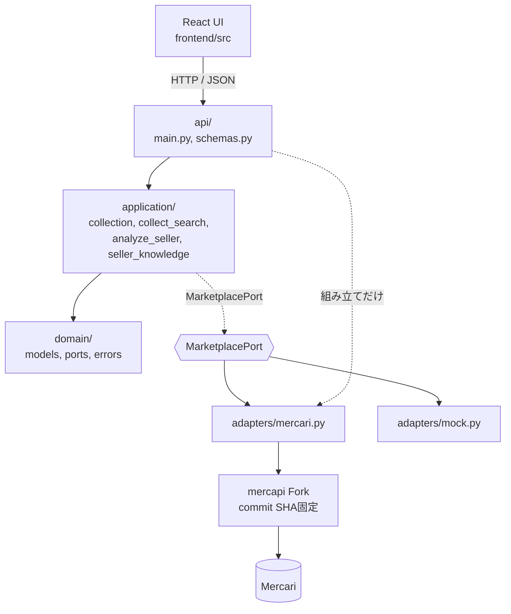

# アーキテクチャと用語

## 文書ステータス

- 決定日: **2026-09-02**
- ステータス: **層・依存の向き・固有語の正本**
- 対象: 層、import方向、外部依存、Card Digger固有語と一般名の対応、Marketplace追加時に触る場所
- 前提: [MVP実装仕様](../product/mvp-spec.md) / [Mercari Adapter実装仕様](../phase-0/phase-0-f-adapter-spec.md)

## 1. この文書がある理由

構造の情報が4つの文書へ散っていた。**「`RequestGate`とは何か」を1か所で答えられる場所が無い。**

| 問い | これまでの在り処 |
|---|---|
| どんな技術を使うか | [MVP仕様 §2](../product/mvp-spec.md#2-mvpの技術構成) |
| どのFileがどこにあるか | [MVP仕様 §2.1](../product/mvp-spec.md#21-repository構成) / `src/backend/README.md` |
| Adapterは何を担当するか | [Adapter仕様 §3](../phase-0/phase-0-f-adapter-spec.md#31-mercapi-forkの責務) |
| Test用語の意味 | [Test運用規約 用語](test-policy.md#用語) |
| **層の依存の向き** | **どこにも無い**（`README.md`に1行だけ） |
| **`RequestGate`等の固有語の意味** | **どこにも無い** |

この文書は**構造と語彙**を引き受ける。各文書の決定内容は複製せず、正本へLinkする。

**Marketplaceを増やす見込みがあることが、もう一つの理由である。** どこを触ればよいかを
先に書いておかないと、2つ目を足すときにMercari固有の判断が上の層へ滲む。

---

## 2. 層と依存の向き



**矢印は「使ってよい向き」である。** 逆向きは無い。

| 層 | 置くもの | importしてよいもの |
|---|---|---|
| `domain/` | 型、`MarketplacePort`、Error Code | 標準ライブラリだけ |
| `application/` | 収集Policy、停止条件、Seller Knowledge | `domain`のみ |
| `adapters/` | Fork呼び出し、正規化、Error分類、時計 | `domain` + `mercapi` |
| `api/` | Endpoint、JSON、Status規則、**組み立て** | すべて |
| `frontend/` | 画面、Sort / Filter | Backend APIのJSONだけ |

`api/`だけが全部を知っている。これは**組み立て役（Composition Root）**が1か所であるべきだからで、
`api/main.py`が実Adapterを作る唯一の場所である。

### 2.1 なぜApplicationがAdapterを知らないのか

**同じUse caseを、実Mercariと固定データの両方で動かすため。** `MarketplacePort`という
Interfaceだけに依存させておくと、`MercariAdapter`と`MockAdapter`を差し替えられる。

これは一般に **Ports and Adapters**（Hexagonal Architecture）と呼ばれる形で、
`MarketplacePort`が**Port**、`MercariAdapter` / `MockAdapter`が**Adapter**にあたる。

### 2.2 状態の寿命 — 置き場所は「何についての事実か」で決まる

層は「**誰が誰を使ってよいか**」を決める。寿命は「**その状態を誰と共有するか**」を決める。
**別の軸である。** 層だけを見ていると、正しい層に置いたまま間違った寿命で持つことになる。

#### 判断の規則

> **その状態が「何についての事実」かを1文で言う。言えれば置き場所が決まる。**

| 状態 | 何についての事実か | 置き場所 |
|---|---|---|
| 最後にMercariを叩いた時刻 | **Mercariについての事実。** 相手は1つしかない | アプリに1つ |
| 今いくつ収集が走っているか | **アプリ全体についての事実** | アプリに1つ |
| どの収集が実行中か | 同上 | アプリに1つ |
| 連続で拒否された回数 | **Mercariについての事実。** 401/403/429/Challengeは相手がこちらを拒んで
  いることで、拒む相手は1つしかない | アプリに1つ |
| 安全停止をいつ始めたか | 同上 | アプリに1つ |
| 再試行した回数 | **その収集についての事実。** `CollectionMeta`に出る値 | 収集ごと |

**「連続で拒否された回数」は2026-09-05に置き場所が変わった。** それまでは「その収集についての事実
（この実行の中で連続）」と書いてあったが、**その読み方では3に到達できない。** 収集は最初の失敗で
止まるので、収集ごとに数えると値は最大1にしかならない。数えたかったのは最初から
「Mercariが**こちらを**拒み続けているか」であり、それはMercariについての事実である。
経緯は[§5.2](#52-requestgateは3つのpatternを1つにしたもの)。

**約束の対象が1つなら、状態も1つでなければならない。** 「Mercariについての事実」を収集ごとに
持つと、3つの収集がそれぞれ2秒待ったつもりで、相手から見れば同時に3本届く。

#### この規則が生まれた経緯（2026-09-02）

[MVP仕様 §5.3](../product/mvp-spec.md#53-収集範囲)は「**すべての**Mercari Requestは
同時実行数1、開始間隔2秒以上」と定めている。実装はこうなっていた。

```text
修正前
  RequestGate が「最後に叩いた時刻」を持っていた。
  Gate は収集ごとに作り直されるため、約束は1回のHTTP Requestの内側でしか成立していなかった。
  → 検索を2本同時に投げて実測したところ、同時に0.00秒差で到達し、
     直列化しても間隔は0.06秒だった。

修正後
  寿命の違う状態を分けた。
  ・最後に叩いた時刻 → RequestPacer（アプリに1つ）。Gate はこれに待たせてもらう
  ・同時実行の制限   → Semaphore（アプリに1つ）
  ・同じ収集の重複   → Single-flight（アプリに1つ）
  再試行回数と連続拒否数は「その収集の話」なので RequestGate に残した。
  → 再測定で 最小間隔 2.00秒、同時到達なし、同じ検索3本で Mercariへ2回。

残り
  安全停止（Circuit Breaker）だけは収集単位のまま。
  一度止まると戻らない状態なので、回復条件（half-open）を決めてからでないと共有できない。

2026-09-05
  回復条件を「時間経過で解除」と決め、安全停止も SafetyBrake としてアプリに1つにした。
  ・連続拒否数と停止開始時刻 → SafetyBrake（アプリに1つ）
  ・再試行回数は「その収集の話」なので RequestGate に残った（これだけになった）
  → 実測で 3 Request目に stop_reason=safety_stop へ到達。4 Request目はMercariへ出ない。
```

**設計で迷って選んだのではない。動いていてTestも緑のまま、測って初めて0.06秒が見えた。**
前後の実測値は[TODO](../planning/todo.md#実装中に見つかった1件--2秒間隔と安全停止がrequestをまたがない)に残す。

#### アプリに1つ持つもの

| 実体 | 一般名 | 守るもの |
|---|---|---|
| `RequestPacer` | Rate Limiter | 開始間隔2秒以上 |
| `MarketplaceAccess`のSemaphore | Bulkhead | 同時実行数1 |
| `MarketplaceAccess`の実行中一覧 | **Single-flight** | 同じ収集を二重に走らせない |
| `SafetyBrake` | **Circuit Breaker** | 連続3回拒否で止め、60秒後に1回だけ試す |

4つとも`application/access.py`の`MarketplaceAccess`が抱え、`create_app()`で**1つだけ**作る。

#### 間違えやすい3点

| よくある理解 | 実際 |
|---|---|
| 「**間隔**をアプリに持たせた」 | 持たせたのは**最後に叩いた時刻**。`2.0`は定数で、どこにコピーしても害が無い |
| 「**uvicornが**持っている」 | `create_app()`で1つ作っているだけ。uvicornには何も足していない。だから**Testでも同じ共有が効く**し、**`--workers 2`では2つできて壊れる** |
| 「2秒間隔を直せば全部直る」 | 3つは互いの代わりにならない。Semaphoreだけでは間隔が0.06秒のまま、Pacerだけでは応答が2秒を超えると2本重なる |

**module levelのglobalにしない。** `create_app()`で作って渡す。globalはTestで差し替えられず、
状態がTest間に漏れる。`Clock` / `Sleeper`と同じ作法である。

---

## 3. 依存の向きは、実測で守られている

書いてあるだけでは守られない。2つの手段で検査している。

| 手段 | 何を検査するか | 結果（2026-09-02） |
|---|---|---|
| `tests/unit/test_layering.py` | `domain` / `application`が`mercapi`をimportしないこと。**関数の中のimportもASTで拾う** | 緑 |
| `tests/contract/test_marketplace_port.py` | `MarketplacePort`の**全実装**が同じ約束を守ること | 2実装で緑 |

加えて、Adapterより上の**コード行**にMercari固有語が残っていないかを数えた
（docstringとコメントを除く）。

```text
domain/       0行
application/  0行
api/          5行   ← すべて _mercari_marketplace()。組み立て役そのもの
```

**5行はすべて`api/main.py`の組み立て部分**であり、意図どおりである。Endpointの処理本体は
`MarketplacePort`しか見ていない。

> **限界。** 実Marketplaceの実装は1つしかない。`MarketplacePort`が本当にMarketplace中立か、
> 2つ目を書くまで**検証されていない**。`MockAdapter`は中立性の証明にはならない。
> [§6](#6-marketplaceを増やすときに触る場所)はその前提で読む。

---

## 4. 外部依存

| 依存先 | 何を任せているか | 壊れたときどこで分かるか |
|---|---|---|
| **Mercari** | 商品・Seller情報の提供元 | **L1〜L3では分からない。** [L4ライブ受入検証](../phase-0/phase-0-f-live-acceptance.md)だけが検知する |
| **`mgmaru/mercapi` Fork** | Mercari APIのHTTP呼び出し、DPoP署名、応答のModel化 | ForkのUnit Test（L1）とAdapterのUnit Test（L2） |
| FastAPI / uvicorn | HTTP待受、Validation、JSON化 | `tests/api/`（L3扱い） |
| React / Vite | 画面 | Frontend Component Test |

Versionの固定値は[MVP仕様 §2.2](../product/mvp-spec.md#22-固定したpackage-version2026-09-02)。
ForkはBranchでもTagでもなく**40文字のcommit SHA**で固定する。

**Fixtureは固定されている。** そのためMercariが応答形式を変えてもL1〜L3は緑のままになる。
これはBugではなく性質であり、その盲点を埋める唯一の手段がL4である
（[Test運用規約 §3](test-policy.md#3-test層)）。

### 4.1 外部アクセスの条件と、2秒間隔の出所

Mercariへのアクセスは**同時実行数1、開始間隔2秒以上**とする。Phase 1での実体は
`application/collection.py`の`MIN_REQUEST_INTERVAL_SECONDS = 2.0`である。

#### この値には根拠が書かれていない

初出は[共通検証プロトコル §5](../phase-0/poc-validation.md#5-測定手順)で、**Phase 0で3方式を
同じ条件で比較するための測定条件**として置かれた。そこから8文書へそのまま引き継がれ、
MVPの実装Policyになっている。

**そのどれにも、なぜ2秒なのかは書かれていない。**

| 問い | 答え |
|---|---|
| Mercariが公表しているLimitか | **いいえ。** どの文書にもそのような記述はない |
| 429を観測して決めた値か | **いいえ。** 429は3回のL4で**一度も出ていない** |
| 測定して導いた閾値か | **いいえ** |
| 実体は何か | **自分で決めた保守的な値** |

#### 実測で言えること、言えないこと

```text
言えること    2秒間隔なら安全である
              （L4を3回、各110〜123 Requestを2秒間隔で送り、429は0件）

言えないこと  2秒が必要かどうか
              （限界へ近づいていないので、どこが限界かを知らない）
```

**限界を調べてはならない。** それは第三者サービスへの負荷試験になる。共通検証プロトコルも
「負荷試験ではなく通常取得中の観測」としている。

#### なぜ保守的でよいのか — 緩める理由が1つも無い

**根拠が無いことと、守らなくてよいことは違う。** 次の5点はいずれも、緩める側ではなく
締める側を支持する。

| # | 理由 |
|---|---|
| 1 | **相手は第三者のサービスである。** 取得は許諾を得た行為ではなく公開情報の閲覧の延長であり、相手の想定の内側に収まっていることが前提になる |
| 2 | **失敗のコストが非対称である。** 緩めて得るのは1検索あたり数秒。失うのは401 / 403 / 429 / Challengeで**取得そのものができなくなる**ことで、復旧手段はこちらに無い |
| 3 | **限界を測れない。** 測る行為が負荷試験になるため、「安全と分かっている値」から動く合理的な手順が存在しない |
| 4 | **利用者1人のLocal実行で、スループット要求が無い。** 1回の検索が十数秒かかっても、探索という用途に支障が無い |
| 5 | **[Mercari利用規約の確認が未了である。](../planning/todo.md#利用規約・運用上の確認)** 何が許容されるか分かっていない段階では、控えめな側へ倒すのが筋である |

> **将来これを読む人へ。** この2秒は**Mercariに課された制限ではない**ので、破っても
> 規約違反の判定が出るわけではない。同時に**根拠が無いから緩めてよい値でもない**。
> 上の5点が変わらない限り、緩める理由は無い。

#### 変えるとしたら

| 変える方向 | 条件 |
|---|---|
| **短くする** | 上の5点のうち複数が変わったとき。とくに利用規約の確認が済み、許容範囲が判明したとき |
| **長くする** | 429やChallengeを一度でも観測したとき。**観測は根拠になる** |

数字を変えるときは、この節と`MIN_REQUEST_INTERVAL_SECONDS`の両方を同じ変更で直す。

---

## 5. 用語集

### 5.1 一般名がある固有語

**左が一般名を持つかどうかは、実務上の違いになる。** 一般名があるものは、その一般名の
「普通はこうする」を借りられる。

| Card Diggerの名前 | 一般的な名前 | 同じか |
|---|---|---|
| `MarketplacePort` | **Port**（Ports and Adapters / Hexagonal） | ほぼ同じ |
| `MercariAdapter` / `MockAdapter` | **Adapter** | 同じ |
| `create_app()` | **Composition Root** | 同じ |
| `Clock` / `Sleeper`の注入 | **Dependency Injection** | 同じ |
| `Fake Fork Client` | **Fake**（Test Doubleの一種） | 同じ |
| `RequestGate` | **Retry Policy** | ほぼ同じ（[§5.2](#52-requestgateは3つのpatternを1つにしたもの)） |
| `RequestPacer` | **Rate Limiter / Throttler** | ほぼ同じ |
| `SafetyBrake` | **Circuit Breaker** | 同じ（2026-09-05にhalf-openを入れた。[§5.2](#一般名と比べると足りない部分が名前で分かった)） |
| `MarketplaceAccess.collect()` | **Single-flight**（Goの`singleflight`が有名） | 同じ |
| 同時実行数1 | **Bulkhead / Semaphore** | 同じ |
| 安全停止 | **Circuit Breakerのopen状態** | 同じ |

### 5.2 `RequestGate`は3つのPatternを1つにしたもの

**一般的なソフトウェア用語ではない。Card Digger固有の名前である。**
`src/backend/card_digger/application/collection.py`にあり、**Application層**に属する。
Adapterでもmercapiでも`api/`でもない。

中身は、よく知られたPatternをまとめたものである。**当初は3つを1つのClassに入れていた。**

| 機能 | 一般名 |
|---|---|
| 前のRequest開始から2秒空ける | **Rate Limiting / Throttling** |
| Timeout・Network・5xxだけ1回再試行する | **Retry with a bounded budget** |
| 拒否が3回続いたら以後アクセスしない | **Circuit Breaker** |

**3つのうち2つを外へ出した。** どちらも寿命が違ったためで、判断の規則と経緯は
[§2.2](#22-状態の寿命--置き場所は何についての事実かで決まる)にある。

| 出したもの | 出した先 | いつ |
|---|---|---|
| 開始間隔 | `RequestPacer` | 2026-09-02 |
| 連続拒否と安全停止 | `SafetyBrake` | 2026-09-05 |

`RequestGate`はどちらも手放したのではなく**委譲**しており、`2.0`も`60.0`も知らない。
**残ったのは1回だけの再試行と、その回数だけ**である。回数は`CollectionMeta`に出る値で、
その収集の外では意味を持たない。

**なぜApplication層にあるか。** 「2秒空ける」「3回でやめる」はMercariの仕様でもForkの仕様でもなく、
**Card Diggerが自分で決めたPolicy**だからである。Adapter仕様 §3.1 がこれをForkへ入れないと
明記している。

#### 一般名と比べると、足りない部分が名前で分かった

Circuit Breakerは通常3状態を持つ。

```text
closed（通常）  ──失敗が続く──▶  open（遮断）  ──一定時間後──▶  half-open（試す）
     ▲                                                              │
     └──────────────────── 成功したら戻る ─────────────────────────┘
```

**2026-09-05まで`half-open`が無かった。** `stopped`は一度立つと戻らず、Requestごとに
新しく作られるので実害が出ていなかっただけである。**同時に、3回連続の拒否にも到達できなかった。**
1つの収集は最初の失敗で止まるので、収集ごとに数える限り値は最大1にしかならない。
**「戻らない」と「到達しない」は同じ1つの置き場所の誤りだった。**

`SafetyBrake`が3状態すべてを持つ。`half-open`はFieldではなく**連続拒否数を`3-1`に置いた状態**
として表す。もう1回拒否されれば3に届いて閉じ、成功すれば0に戻る。
**互いに合っていなければならない値を2つ持つと、合わなくなる余地を持つことになる。**

**`half-open`は自分からRequestを出さない。** 待ち時間が終わることは「次に誰かが求めた取得を
断らなくなる」だけで、背景での再試行はしない。これは
[MVP仕様 §9](../product/mvp-spec.md#9-ui状態とerror表示)の「自動再試行せず、時間を置くよう表示」
そのものである。決めた経緯と待ち時間の出所は
[TODO](../planning/todo.md#決めた--時間経過で解除2026-09-05)。

> **一般名に当てはめる価値はここにあった。** 「Circuit Breakerだ」と言った瞬間に、
> half-openが無いことが欠落として見える。固有名のままでは、欠けていること自体に気付けない。
> **欠落が見えたのが2026-09-02、埋めたのが2026-09-05である。**

### 5.3 一般名を持たない固有語

| 名前 | 意味 |
|---|---|
| **収集（Collection）** | 「1回の検索」「1人のSellerの1状態」のような、**Page送りを含む1まとまりの取得** |
| `CollectionMeta` | その収集が**どこまで到達したか**。件数、ページ数、範囲、打ち切り理由、部分成功かどうか |
| **停止理由（`stop_reason`）** | 収集が終わった理由。7種類（目標到達 / 終端 / ページ上限 / 件数上限 / 時間上限 / Error / 安全停止） |
| **部分成功（`partial`）** | Errorや安全停止で予定を完了できなかったが、**取れた分は返す**状態 |
| **L1〜L4** | Test層。L1〜L3は外部通信なし、**L4だけ実Mercariへ接続する**（[Test運用規約 §3](test-policy.md#3-test層)） |
| **ライブ受入検証（L4）** | 実Mercariへ接続する**手動・低頻度の作業**。Green / RedではなくMarkdownの結果文書を作る |
| **Seller Knowledge** | 出品Titleから推定する専門性の指標。**購入判断ではなく探索順の補助** |

**`CollectionMeta`がこのProductの中心にある。** 「取れた範囲」と「Mercari全体」を混同させないことが
Product要件だからで、件数だけを返して範囲を黙るAPIにはしていない。

---

## 6. Marketplaceを増やすときに触る場所

Yahoo!フリマのような2つ目を足す場合を想定する。

### 6.1 触る

| 場所 | やること | 規模 |
|---|---|---|
| `adapters/<name>.py` | `MarketplacePort`を実装する | 大 |
| `adapters/error_mapping.py`相当 | そのClientの例外を`ErrorCode`へ分類する | 中 |
| `tests/contract/test_marketplace_port.py` | `@pytest.fixture(params=["mercari", "mock"])`へ足す | **1行** |
| `api/main.py` | 組み立てでどのAdapterを使うか選ぶ | 小 |
| `pyproject.toml` | そのClientの依存を足す | 小 |

**Contract Testへ1行足すだけで、既存の約束が全部その実装へ流れる。** これが
`MarketplacePort`を置いている最大の見返りである。

### 6.2 触らない

| 場所 | 理由 |
|---|---|
| `application/collection.py` | 間隔・上限・停止理由はMarketplace非依存 |
| `application/collect_search.py` / `analyze_seller.py` | `MarketplacePort`しか見ていない |
| `application/seller_knowledge.py` | **Titleの文字列しか見ない。** 判定KeywordはTCG固有であってMarketplace固有ではない |
| `domain/` | 型はすでにMarketplace中立 |
| `api/schemas.py` | 同上 |

### 6.3 2つ目を足すときに初めて決まること

**今は答えを書かない。** 1つしか実装していない段階で決めると、Mercariの都合を一般化してしまう。

| 論点 | 現状 |
|---|---|
| `MarketplaceItem`に出所を示すFieldが無い | 画面の「Mercariで商品を見る」を出し分けられない |
| `ListingStatus`の語彙がMercari由来 | `on_sale` / `trading` / `sold_out`が他で同じ意味とは限らない |
| `ErrorCode.CHALLENGE` | Bot検知画面という概念が他にあるか未確認 |
| 収集上限（10ページ / 1,000件 / 30秒） | Mercariの1ページ約120件を前提にした数字 |
| 複数Marketplaceの結果を混ぜるか | [MVP仕様 §4](../product/mvp-spec.md#4-mvpに含めない機能)が「複数Marketplace」を対象外にしている |

---

## 7. 分かっている構造上の弱点

| # | 弱点 | 状態 |
|---|---|---|
| 1 | **`uvicorn --workers 2`で、共有している4つが2つずつできる。** 間隔も安全停止も壊れる | **恒久的な限界。** 1 Process前提とし、[src/backend/README.md](../../src/backend/README.md)へ明記した |
| 2 | `MarketplacePort`の中立性が、実Marketplace1つでしか確かめられていない | 2つ目を足すまで検証不能 |
| 3 | `created_at`が「出品日時」かを検証する手段が無い | **恒久的な限界。** 画面へ明示する（[TODO](../planning/todo.md#created_atcreated-最優先)） |

**消さずに残す。** 弱点の欄が空の文書は、弱点が無いことではなく探していないことを意味する。
