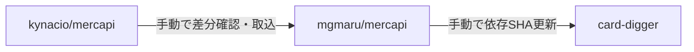

# mercapi Fork運用手順

## 文書ステータス

- 決定日: **2026-08-30**
- ステータス: **Fork作成・更新・依存更新の運用基準として採用**
- 対象Repository: `kynacio/mercapi`、`mgmaru/mercapi`、`mgmaru/card-digger`
- 技術仕様: [Phase 0-F Mercari Adapter実装仕様](../phase-0/phase-0-f-adapter-spec.md)
- Test実施方法: [Test運用規約](test-policy.md)

この文書は、管理下の`mercapi` Forkを安全に作成・更新し、Card Diggerから再現可能な形で
利用するための手順を定義する。Forkへ追加する機能やAdapterのContractは技術仕様を正本とし、
この文書ではRepository間の変更の流れと運用上の確認事項を扱う。

## 1. Repositoryの役割

| Repository | 呼称 | 役割 | Card Digger側からの変更 |
|---|---|---|---|
| `kynacio/mercapi` | `upstream` | Fork元。一般公開されている本家実装 | 直接Pushしない |
| `mgmaru/mercapi` | Fork / `origin` | Sellerページング機能を追加して管理する依存ライブラリ | BranchとPull Requestで変更する |
| `mgmaru/card-digger` | Application | ForkをMercari Adapter経由で利用する | 検証済みFork commit SHAだけを参照する |

ForkとCard Diggerは別Repository、別Directoryとして管理する。ForkのソースをCard Diggerへ
コピーせず、Git submoduleにもせず、PythonのVCS依存として利用する。

## 2. 更新を止める2つの境界



### 2.1 upstreamからFork

`kynacio/mercapi`が更新されても、`mgmaru/mercapi`のBranchは自動では更新しない。
GitHubに更新差分が表示されても、`Sync fork`、Merge、Rebase、Cherry-pickのいずれかを
明示的に実行するまでForkの利用コードは変わらない。

この境界は**手動取込**によって管理する。commit SHA固定がupstreamの更新を止めているわけではない。

### 2.2 ForkからCard Digger

`mgmaru/mercapi`が更新されても、Card Diggerの依存指定を変更しない限り利用コードは変わらない。
Card DiggerはBranch名やVersion範囲ではなく、Test済みの完全なcommit SHAへ固定する。

```text
mgmaru/mercapi

abc123...  ← Card Diggerが現在使用
    ↓
def456...  ← Forkの最新版

Card Diggerの依存SHAを変更するまではabc123...を使用し続ける。
```

この境界は**依存SHA固定**によって管理する。Forkの`main`をPushしてもCard Diggerへは
自動反映されない。

時系列では次のようになる。

| 状態 | `kynacio/mercapi` | `mgmaru/mercapi` | Card Diggerの依存先 | Card Diggerのコードが変わるか |
|---|---|---|---|---|
| 初期状態 | `U1` | `F1`（`U1`が基点） | `F1`のSHA | いいえ |
| upstreamだけ更新 | `U2` | `F1`のまま | `F1`のSHA | いいえ |
| 更新をForkへ手動取込 | `U2` | `F2` | `F1`のSHA | いいえ |
| 依存SHAを手動更新 | `U2` | `F2` | `F2`のSHA | **はい** |

したがって、upstreamの更新をForkへ入れる判断と、Forkの更新をCard Diggerへ入れる判断は
独立している。

### 2.3 自動化の範囲

- upstream同期を自動実行しない
- Card Diggerの依存SHAを自動更新しない
- Dependabot等を導入する場合も、Pull Request作成と通知までに限定する
- 自動Mergeは行わず、後述するTestと確認を必須にする

## 3. 初回Forkの作成

### 3.1 作成前の確認

- `kynacio/mercapi`のライセンスを確認する
- Fork、変更、再配布、商用利用に必要な条件を確認する
- 元のLICENSE、著作権表示、Noticeを削除しない
- 公開RepositoryのForkは公開される前提で、Secretや個人情報を置かない
- 変更基点を検証済みcommit
  `20ba68fd42677997c4c91b4e4eb17c1e7e387efa`に固定する

### 3.2 GitHub上でForkする

1. <https://github.com/kynacio/mercapi>を開く
2. `Fork`を選ぶ
3. Ownerに`mgmaru`を選ぶ
4. Repository名を`mercapi`にする
5. Forkを作成する

GitHubではFork名は初期状態でupstreamと同名になる。別名も指定できるが、本プロジェクトでは
Repositoryの所有者を含む`mgmaru/mercapi`で区別する。

### 3.3 Card Diggerとは別DirectoryへCloneする

ローカルでは、例えば次のように兄弟Directoryとして配置する。

```text
workspace/
├── card-digger/
└── mercapi/
```

```bash
git clone https://github.com/mgmaru/mercapi.git
cd mercapi
git remote add upstream https://github.com/kynacio/mercapi.git
git remote -v
git fetch upstream
git switch -c feat/seller-items-pagination 20ba68fd42677997c4c91b4e4eb17c1e7e387efa
```

Remoteは次の関係になっていることを確認する。

```text
origin    https://github.com/mgmaru/mercapi.git
upstream  https://github.com/kynacio/mercapi.git
```

`origin`は自分のForkへのFetch / Push、`upstream`は本家からのFetchに使う。通常の作業で
`upstream`へPushしない。

## 4. Forkへ機能を追加する

1. `feat/seller-items-pagination`で固定Response Fixtureと失敗するTestを追加する
2. Seller商品の状態別FilterとCursorページングをPublic APIへ実装する
3. 既存Testと追加Testをすべて実行する
4. License、公開API、後方互換への影響を確認する
5. Branchを`origin`へPushする
6. `mgmaru/mercapi`内で変更内容をレビューして`main`へ反映する
7. Test済みcommitの完全なSHAを記録する
8. 必要なら`kynacio/mercapi`へPull Requestを作成する

ForkへCard Digger固有の収集上限、画面文言、Seller Knowledgeを実装しない。追加範囲は
[Adapter仕様の責務分離](../phase-0/phase-0-f-adapter-spec.md#3-責務の境界)に従う。

手順1のFixtureは生Responseではなく、[Test運用規約 §5](test-policy.md#5-fixture規約)の
匿名化・最小化規則に従った構造標本とする。

## 5. Card DiggerからForkを利用する

Application Packageを作成した時点で、採用した依存管理ツールの設定ファイルへForkの完全な
commit SHAを記載し、生成されるLockfileもコミットする。

```text
mercapi @ git+https://github.com/mgmaru/mercapi.git@FULL_40_CHARACTER_COMMIT_SHA
```

実際には`FULL_40_CHARACTER_COMMIT_SHA`を、`git rev-parse HEAD`で確認した40文字のSHAへ
置き換える。Branch名の`main`、作業Branch名、移動可能なTagは依存先に指定しない。

依存追加時には次を確認する。

- 依存設定が`mgmaru/mercapi`を指している
- 省略していない40文字のcommit SHAを指定している
- Lockfileが同じRevisionを解決している
- 新規環境で依存を再構築できる
- Mercari AdapterのUnit TestとContract Testが成功する
- ライブ受入検証の結果と実行日を記録している

> Python Applicationの依存管理ツールはApplication基盤の実装時に決定する。この文書では、
> 使用ツールにかかわらず「完全なFork commit SHA」と「Lockfile」の両方を固定することを必須とする。

## 6. upstream更新をForkへ取り込む

upstreamの新機能を追い続けること自体を目的にしない。Mercariの仕様変更への追従、脆弱性修正、
不具合修正など、Card Diggerに必要な理由がある場合だけ取り込む。

### 6.1 事前確認

1. 現在利用しているupstream基点SHAを確認する
2. `git fetch upstream`で情報だけを取得する
3. commit一覧とコード差分を確認する
4. 取り込む理由と影響範囲を記録する
5. Forkの`main`から同期確認用Branchを作る

```bash
git fetch upstream
git log --oneline --decorate main..upstream/main
git diff main...upstream/main
git switch -c chore/sync-upstream-YYYYMMDD main
```

`Sync fork`を差分未確認のまま実行しない。upstreamのDefault Branch名が`main`でない場合は、
実際のRemote Branch名に読み替える。

### 6.2 取込後の検証

- Mergeまたは必要なcommitだけのCherry-pickを行う
- Conflictは独自拡張の意図を確認して解消する
- Forkの全Unit Test（L1）を実行する
- Sellerページングの固定Fixture Testを実行する
- Card DiggerのAdapter Unit / Contract Test（L2 / L3）を実行する
- 必要な場合だけ、低頻度のライブ受入検証（L4）を行う
- 層の定義と実行時期は[Test運用規約 §3](test-policy.md#3-test層)・[§9](test-policy.md#9-ライブ受入検証l4の実施規約)に従う
- 合格後にForkの`main`へ反映する

この時点ではCard Diggerの依存SHAを変更しない。Forkの更新とCard Diggerへの採用は別の変更として
扱う。

## 7. Fork更新をCard Diggerへ反映する

1. Forkの旧SHAと採用候補の新SHAを確認する
2. 旧SHAから新SHAまでの差分をレビューする
3. ForkのTest結果を確認する
4. Card Diggerの作業Branchで依存SHAとLockfileを更新する
5. Adapter Unit / Contract Testを実行する
6. 必要な場合だけ、低頻度のライブ受入検証を行う
7. Pull Requestまたはcommitへ旧SHA、新SHA、更新理由、Test結果を記録する
8. 合格後にCard Diggerへ反映する

更新記録には最低限、次を残す。

| 項目 | 記録内容 |
|---|---|
| 更新理由 | 取り込む修正、仕様変更、脆弱性対応など |
| upstream | 以前と新しい基点SHA |
| Fork | 以前と新しい完全なcommit SHA |
| Card Digger | 依存SHAを変更したcommit |
| Test | Fork Unit、Adapter Unit / Contract、ライブ検証の結果 |
| 既知の制約 | 未解決Error、互換性、再検証条件 |

## 8. 問題発生時の戻し方

新しいFork commitで問題が発生した場合は、まずCard Diggerの依存指定を直前の検証済みSHAへ戻す。
Forkの履歴を書き換えなくても、Card Digger側だけで利用版を切り戻せる。

```text
新SHAで障害を確認
    ↓
Card Diggerの依存SHAを旧SHAへ戻す
    ↓
Lockfileを再生成する
    ↓
Testして緊急修正を反映する
    ↓
Fork側ではRevertまたは修正commitを作る
```

- ForkのDefault BranchをForce Pushしない
- Card Diggerが参照中のcommitを到達不能にしない
- 不具合commitを消すのではなく、Revertまたは追加修正で履歴を残す
- 切戻し理由、旧SHA、新SHA、影響範囲をCard Diggerのcommitへ記録する

## 9. 作業チェックリスト

### 初回作成

- [ ] ライセンスと再配布条件を確認した
- [ ] `mgmaru/mercapi`をForkした
- [ ] `origin`と`upstream`を正しく登録した
- [ ] 検証済みupstream SHAから作業Branchを作った
- [ ] LICENSEと著作権表示を維持した

### upstreamからの更新取込

- [ ] 自動同期せず、差分を確認した
- [ ] 取込理由と対象commitを記録した
- [ ] 同期確認用Branchで作業した
- [ ] Fork Unit / Fixture Testが成功した
- [ ] Adapter Unit / Contract Testが成功した
- [ ] 必要なライブ受入検証を完了した

### Card Diggerの依存更新

- [ ] Forkの完全なcommit SHAを指定した
- [ ] Lockfileを更新した
- [ ] 新規環境で依存を再構築できた
- [ ] 旧SHA、新SHA、更新理由を記録した
- [ ] Adapter Testが成功した
- [ ] 問題時に戻せる旧SHAを確認した

## 10. 参考資料

- [GitHub Docs: Forks](https://docs.github.com/en/pull-requests/reference/forks)
- [GitHub Docs: Fork a repository](https://docs.github.com/en/pull-requests/how-tos/work-with-forks/fork-a-repo)
- [GitHub Docs: Configuring a remote repository for a fork](https://docs.github.com/en/pull-requests/how-tos/work-with-forks/configuring-a-remote-repository-for-a-fork)
- [pip documentation: VCS Support](https://pip.pypa.io/en/stable/topics/vcs-support/)
