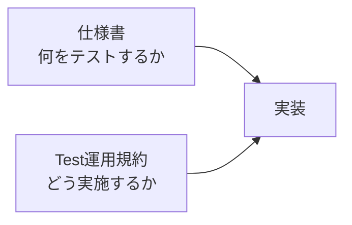
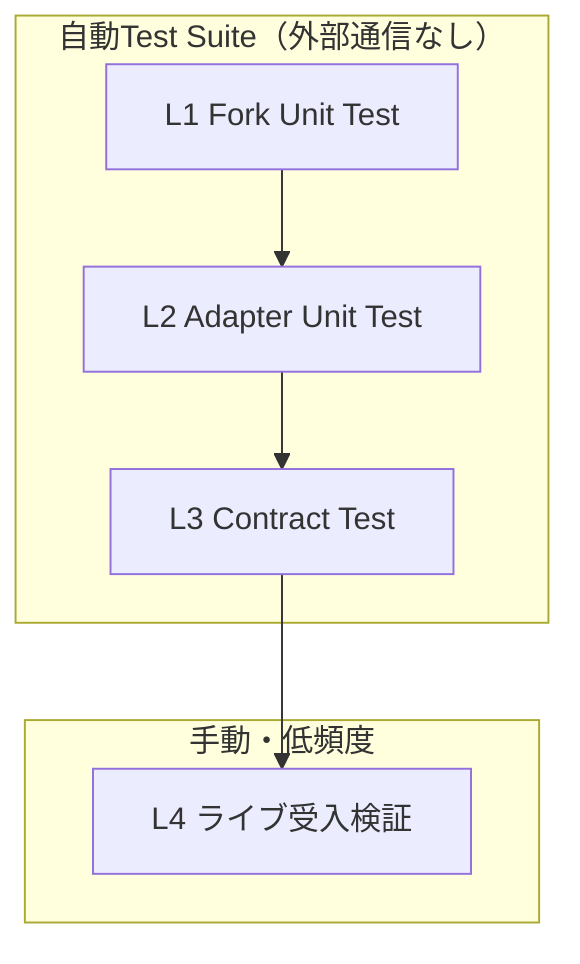

# Test運用規約

## 文書ステータス

- 決定日: **2026-08-31**
- ステータス: **Phase 0-F以降のTest実施基準として採用**
- 対象: `mercapi` Fork、Mercari Adapter、Domain / Use case、Backend API、Frontend、E2E
- 技術仕様: [Phase 0-F Mercari Adapter実装仕様](../phase-0/phase-0-f-adapter-spec.md)
- Product要件: [MVP実装仕様](../product/mvp-spec.md)
- Repository運用: [mercapi Fork運用手順](mercapi-fork-operations.md)
- 検証条件: [Phase 0 共通検証プロトコル](../phase-0/poc-validation.md)

各仕様書を「**何をテストするか**」の正本とし、この文書を「**どう実施するか**」の正本とする。
矛盾が出た場合はコードで解決せず、先にこの文書か対象仕様書を更新する。

---

## 1. この文書の位置づけ



| 問い | 正本 |
|---|---|
| Forkで何を検証するか | [Adapter仕様 §10.1](../phase-0/phase-0-f-adapter-spec.md#101-forkのunit-test) |
| Adapterで何を検証するか | [Adapter仕様 §10.2](../phase-0/phase-0-f-adapter-spec.md#102-adapterのunit--contract-test) |
| ライブで何を確認するか | [Adapter仕様 §10.3](../phase-0/phase-0-f-adapter-spec.md#103-ライブ受入検証) |
| MVPで何を検証するか | [MVP仕様 §11](../product/mvp-spec.md#11-testと完了条件) |
| Auctionの合格基準 | [Auction追加検証 §6](../phase-0/phase-0-f-auction-validation.md#6-合格基準) |
| **Framework・配置・Fixture・実行時期・完了判定** | **この文書** |

---

## 2. Testを実施する理由

Card Digger固有の理由に限定する。一般論としてのTestの利点は根拠にしない。

| # | 理由 | 根拠 |
|---|---|---|
| 1 | Adapter境界の便益は「壊れたことを検知できる」ことであり、検知手段がTestしかない | [Adapter仕様 §1](../phase-0/phase-0-f-adapter-spec.md#1-目的) |
| 2 | 検証条件が低頻度アクセスに固定されており、実サービスに対する試行錯誤ができない | [共通検証プロトコル §5](../phase-0/poc-validation.md#5-測定手順) |
| 3 | 防ぎたい失敗が例外を出さない「静かな失敗」に集中している | [Adapter仕様 §6](../phase-0/phase-0-f-adapter-spec.md#6-domain型) / [§8.3](../phase-0/phase-0-f-adapter-spec.md#83-停止理由) |
| 4 | Fork運用手順がTestをGateとして前提にしている | [Fork運用手順 §6.2](mercapi-fork-operations.md#62-取込後の検証) / [§7](mercapi-fork-operations.md#7-fork更新をcard-diggerへ反映する) |
| 5 | 429・Timeout・安全停止・各上限は実サービスで再現できない | [Adapter仕様 §8](../phase-0/phase-0-f-adapter-spec.md#8-収集policy) / [§9](../phase-0/phase-0-f-adapter-spec.md#9-errorと再試行) |

### 静かな失敗の例

次はいずれも例外を出さず、画面上も正常に見える。Assertionでしか検出できない。

- Auctionの現在価格を確定落札額として表示する
- 未知形状を`fixed_price`へ寄せる
- 必須Field欠落のRecordを黙って除外する
- `ERROR` / `SAFETY_STOP`を成功完了として隠す
- `trading`を`unknown`や`sold_out`へ変換する

---

## 3. Test層



| 層 | 名称 | 対象 | 外部通信 | 実行 | Repository |
|---|---|---|---|:---:|---|
| L1 | Fork Unit Test | ForkのPublic APIと応答モデル | なし | 変更ごと | `mgmaru/mercapi` |
| L2 | Adapter Unit Test | 正規化、Error分類、収集Policy、停止理由 | なし | 変更ごと | `card-digger` |
| L3 | Contract Test | `MarketplacePort`の全実装 | なし | 変更ごと | `card-digger` |
| L4 | ライブ受入検証 | 実Mercari | **あり** | 手動・低頻度 | `card-digger` |

- **L1〜L3だけを自動Test Suiteとする。**
- **L4はTest Suiteに含めない。** CI、watch、Pre-commit、Pre-pushで実行しない。
- Phase 1のBackend API Test・Frontend Component Test・E2E受入FlowはL3と同じ扱いとし、
  Mock Adapterと固定Fixtureだけを使う。

---

## 4. 実行環境と配置

### 4.1 Framework

| 対象 | 採用 | 理由 |
|---|---|---|
| Backend / Adapter | `pytest` + `pytest-asyncio` | Adapterがasync。同一Contractを複数実装へ流すParametrizeを明確に書ける |
| Fork | Fork Repositoryの既存Test構成に従う | 上流のCoding Styleを優先する |
| PoC (`poc/`) | 標準ライブラリ`unittest`を継続 | 既存資産があり、依存を増やさない |
| Frontend | Phase 1のApplication基盤実装時に決定する | MVP着手時まで確定不要 |

> Python依存管理Toolは[MVP仕様 §2.1](../product/mvp-spec.md#21-repository構成)のとおりApplication基盤実装時に決定する。
> 本文のコマンドはTool固有の前置き（`uv run`、`poetry run`、`.venv/bin/`など）を省略して記載する。

### 4.2 配置

```text
src/backend/
├── card_digger/
└── tests/
    ├── conftest.py          # Clock、Fake Fork Client、共通Fixture Loader
    ├── fixtures/
    │   ├── README.md        # Fixture一覧と観測元（実値は書かない）
    │   ├── search/
    │   ├── item/
    │   ├── seller/
    │   └── seller_items/
    ├── unit/                # L2
    └── contract/            # L3
```

### 4.3 実行コマンド

```bash
# Application Package Root（src/backend）で実行する
pytest tests              # L2 + L3
pytest tests/unit         # L2のみ
pytest tests/contract     # L3のみ
```

- L4はTestコマンドではなく、専用Scriptと手順書から手動実行する。
- 実行手順は`src/backend/README.md`へ記載する。

---

## 5. Fixture規約

### 5.1 定義

Fixtureは、**観測したResponseの構造だけを写した、手書き・最小化・匿名化済みのJSON**とする。

- 生ResponseのDumpをそのまま置かない
- Git管理対象とする
- 1 Fixture = 1検証観点

### 5.2 匿名化規則

| 対象 | Fixtureでの扱い |
|---|---|
| 商品ID | `m000000000001`形式のダミー |
| Seller ID / `profile_id` | `100000001`形式のダミー |
| Seller名・Nickname | `seller-sample-1`などの固定文字列 |
| 商品Title | 検証観点に必要な語だけを含む合成Title |
| 画像URL | `https://example.test/image-1.webp` |
| 商品URL | `https://jp.mercari.com/item/<ダミーID>` |
| 日時 | 固定値。相対日数が必要な場合はTest側で基準時刻を注入する |
| 価格 | 実値を使わず、境界値（`1`、`0`、欠落など）を選ぶ |
| `pager_id` / Cursor | 連番などの決定的なダミー |
| Cookie / DPoP / `Authorization` / Header | **保持しない** |
| 検証に不要なField | **削除する** |

- 未知Field耐性を検証するFixtureに限り、`__unknown_field`のような**明示的なダミー未知Field**を追加する。
- 実データから推測できる情報（実在Seller、実在商品）をFixtureへ残さない。

### 5.3 最小化

- 配列は観点を満たす最小件数にする（終端・Cursor検証は2〜3件で足りる）
- 30件Page相当が必要な場合だけ、生成Helperで機械的に増やす
- Fixtureへ検証と無関係なNestを残さない

### 5.4 出所の記録

`tests/fixtures/README.md`へ次を表で残す。**実値は書かない。**

| 記録項目 | 例 |
|---|---|
| Fixture名 | `seller_items/page_1_has_next.json` |
| 取得元 | Seller商品一覧 / 検索 / 商品詳細 |
| 観測日 | `2026-08-31` |
| 対象commit SHA | `20ba68fd...` |
| 検証観点 | `has_next=true`で末尾`pager_id`をCursorへ引き継ぐ |

### 5.5 禁止事項

- 生Response JSONのCopy & Paste
- 実Seller名、実商品Title、実画像URL、実商品IDの記載
- Cookie、DPoP、Token、Request Headerの記載
- Fixtureへの個人情報の混入

---

## 6. 生Responseの取り扱い境界

[Adapter仕様 §2](../phase-0/phase-0-f-adapter-spec.md#2-決定事項)の「生Responseを保存しない」は、
**Applicationの実行時永続化とGit管理対象への保存**を指す。Fixtureはこの禁止に反しない。

```text
実Mercari Response
   │
   ├─→ artifacts/            Git管理外 / 検証後に破棄 / 共有しない
   │     生Response・Header・実ID・画像Body
   │
   └─→ 匿名化・最小化（手作業）
         │
         └─→ tests/fixtures/  Git管理 / 実データを含まない
```

| 対象 | 実行時のApplication | 検証時の`artifacts/` | `tests/fixtures/` | 結果文書 |
|---|:---:|:---:|:---:|:---:|
| 生Response | 保存しない | 一時保存可 | 匿名化後のみ | 書かない |
| Cookie / DPoP / Token / Header | 保存しない | 記録しない | 保持しない | 書かない |
| 画像本体 | 保存しない | 保存しない | 保持しない | 書かない |
| Seller名・商品Title | 保存しない | 一時保存可 | ダミーのみ | 書かない |
| 集計値・Field名・型 | — | 保存する | — | 書く |

---

## 7. テスト可能性のための設計制約

**0-F-4の実装着手前に確定する。**後から追加できないため、Domain型・Adapter設計と同時に決める。

| # | 制約 | 理由 | 関連仕様 |
|---|---|---|---|
| 1 | Use caseは`clock`を注入して受け取る | `max_duration` 30秒と365日基準を固定時刻で検証するため | [§8.1](../phase-0/phase-0-f-adapter-spec.md#81-商品検索) / [§8.2](../phase-0/phase-0-f-adapter-spec.md#82-seller商品) |
| 2 | `MercariAdapter`はFork ClientをConstructorで受け取る | 外部通信なしで正規化とError分類を検証するため | [§10.2](../phase-0/phase-0-f-adapter-spec.md#102-adapterのunit--contract-test) |
| 3 | Use caseは`MarketplacePort`だけに依存する | 同じContract TestをMock Adapterへも流すため | [§7](../phase-0/phase-0-f-adapter-spec.md#7-marketplace-interface) |
| 4 | Request間隔の待機を注入可能な`sleep`にする | 実時間を待たずに停止条件Testを回すため | [§8](../phase-0/phase-0-f-adapter-spec.md#8-収集policy) |
| 5 | 例外→共通Error Codeの変換を純粋関数へ分離する | Fixtureなしで全Codeを網羅するため | [§9](../phase-0/phase-0-f-adapter-spec.md#9-errorと再試行) |

### 禁止する実装

- `datetime.now()`をAdapter / Use caseの内部で直接呼ぶ
- `asyncio.sleep`をAdapter / Use caseの内部で直接呼ぶ
- Adapterの内部でFork Clientを生成する

---

## 8. Contract Testの適用方法

```text
Contract Test群（定義は1つ）
   ├─→ MercariAdapter + Fake Fork Client + Fixture
   └─→ Mock Adapter
```

### 規則

- 同一のTestを両実装へParametrizeして適用する
- 検証対象は`MarketplacePort`の公開Method、戻り値の型、必須Field、Error Codeだけとする
- Mercari固有のField名やFork固有型をContract Testへ書かない
- Fork固有型とPrivate Memberの非参照は、`domain` / `application`層のimportを走査する
  静的Testで確認する（[Adapter仕様 §11](../phase-0/phase-0-f-adapter-spec.md#11-phase-0-f完了条件)）

---

## 9. ライブ受入検証（L4）の実施規約

### 実施条件

[共通検証プロトコル §5](../phase-0/poc-validation.md#5-測定手順)と同一とする。

- 同時実行数1、外部Request開始間隔2秒以上
- 自動再試行なし
- 401 / 403 / 429 / Challengeが合計3回連続したら停止し、回避を試みない
- 認証回避、CAPTCHA回避、Proxy切替、複数Accountを使用しない

### 実行時期

| 契機 | L1〜L3 | L4 |
|---|:---:|:---:|
| コード変更 | 毎回 | 実行しない |
| Fork依存SHAの更新 | 毎回 | 必要な場合だけ |
| upstream取込 | 毎回 | 必要な場合だけ |
| Phase完了判定 | 毎回 | **実行する** |
| Release前 | 毎回 | **実行する** |
| 定期実行 | しない | **しない** |

### 記録

- 結果はMarkdownへ記録し、実行日時・環境・対象commit SHAを必ず残す
- Cookie、Token、Header、生Response、Seller名を結果文書へ書かない
- Error、安全停止、条件差を成功として隠さない

---

## 10. 完了判定規約

- `todo.md`のCheckboxは、**対応するTestがGreenのときだけ**閉じる
- Testがない項目は「完了」ではなく「未検証」として残す
- L4未実施のままPhase 0-Fを完了扱いにしない
- Fixtureが§5の匿名化規則を満たすことを、Phase完了判定時に確認する

---

## 11. やらないこと

| 項目 | 理由 |
|---|---|
| Coverage率の目標設定 | 仕様書の検証観点を満たすかどうかで判定する |
| 実サービスへ通信する自動Test | 検証条件のアクセス頻度を守れない |
| Card Digger側からForkの内部実装を検証するTest | ForkのUnit TestはFork Repositoryの責任範囲 |
| PoC Runnerのネットワーク経路のTest | 既存PoCの「純粋関数だけUnit Test」方針を継続する |
| 出力全体のSnapshot Test | 差分の意味を判断できず、静かな失敗を通してしまう |
| Fixtureへ生Responseをそのまま置くこと | §5・§6の匿名化境界に反する |

---

## 12. チェックリスト

### Testを追加するとき

- [ ] 対象の検証観点が仕様書のどの項目かを特定した
- [ ] L1〜L4のどの層かを決めた
- [ ] 外部通信を行わないことを確認した
- [ ] 現在時刻・待機・Client生成を注入で置き換えた

### Fixtureを追加するとき

- [ ] 生ResponseのCopyではなく、手書きの最小構造にした
- [ ] §5.2の匿名化規則をすべて適用した
- [ ] Cookie、DPoP、Token、Headerを含めていない
- [ ] 1 Fixture = 1検証観点にした
- [ ] `tests/fixtures/README.md`へ出所と検証観点を追記した

### L4を実行するとき

- [ ] 同時実行数1、間隔2秒以上を守った
- [ ] 自動再試行を行わなかった
- [ ] 3回連続の安全Errorで停止する準備をした
- [ ] 結果文書へ個人情報と生Responseを書かなかった
- [ ] 実行日時、環境、対象commit SHAを記録した
