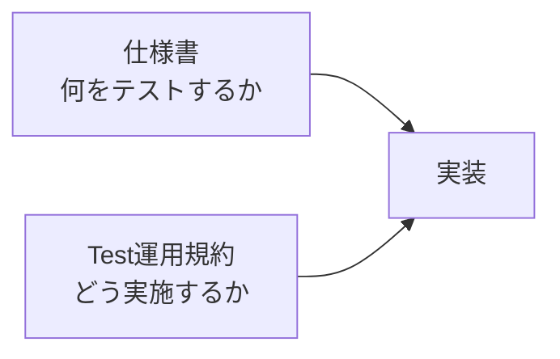
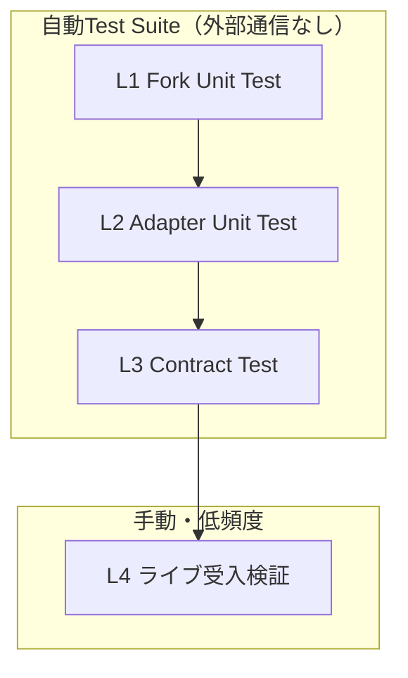

# Test運用規約

## 文書ステータス

- 決定日: **2026-08-31**
- ステータス: **Phase 0-F以降のTest実施基準として採用**
- 対象: `mercapi` Fork、Mercari Adapter、Domain / Use case、Backend API、Frontend、E2E
- 技術仕様: [Phase 0-F Mercari Adapter実装仕様](../phase-0/phase-0-f-adapter-spec.md)
- Product要件: [MVP実装仕様](../product/mvp-spec.md)
- Repository運用: [mercapi Fork運用手順](mercapi-fork-operations.md)
- 検証条件: [Phase 0 共通検証プロトコル](../phase-0/poc-validation.md)

各仕様書を「**何をテストするか**」の正本とし、この文書を「**どう実施するか**」の正本とする。
矛盾が出た場合はコードで解決せず、先にこの文書か対象仕様書を更新する。

---

## 用語

| 用語 | 意味 | この文書での使い方 |
|---|---|---|
| Test Suite | 1つのコマンドでまとめて実行するTestの集合 | 「自動Test Suite」＝`pytest tests`で走るL1〜L3。L4は入れない |
| Fixture | Testが使う**固定された入力データ** | Mercari応答を模したJSON File。規約は[§5](#5-fixture規約) |
| Unit Test | **1つの実装**が単体で正しく動くかを確認するTest | L1・L2 |
| Contract Test | **Interfaceの約束**を、その全実装へ同じTestで確認するTest | L3。`MarketplacePort`の全実装へ適用する |
| Mock Adapter | 外部通信せず固定データを返す`MarketplacePort`実装 | 開発とPhase 1のE2E受入Flowで使う |
| Fake Fork Client | `mercapi` Forkの代わりにFixtureを返す差し替え部品 | L2・L3で`MercariAdapter`へ注入する |
| ライブ受入検証 | 実Mercariへ接続して**実測値を記録する手動作業** | L4。Green / RedではなくMarkdownの結果文書を作る |
| Runner | 人が手で起動する**実行Script** | Testと違い、実サービスへ接続して実測値を記録する。`poc/mercapi/run.py`、`src/backend/scripts/live_acceptance.py`など |
| 注入 | 依存物を内部で生成せず外から渡す設計 | 時計・待機・Fork Client。制約は[§7](#7-テスト可能性のための設計制約) |

### Unit TestとContract Testの違い

どちらも外部通信しない。違いは「何を保証するか」にある。

```text
Unit Test      「MercariAdapterは この入力を こう変換する」    ← 実装ごとに書く
Contract Test  「MarketplacePortの実装は 必ずこの約束を守る」  ← 1つ書いて、全実装へ流す
```

| 観点 | Unit Test | Contract Test |
|---|---|---|
| 対象 | **1つの実装** | **Interfaceの全実装** |
| 保証する内容 | その実装が仕様どおり動く | すべての実装が**同じ約束**を守る |
| 失敗が意味すること | その実装のBug | 実装間の**ズレ**。差し替えると壊れる |
| Testの書き方 | 実装ごとに書く | 1つ書いて全実装へ流す |
| Card Diggerでの例 | `MercariAdapter`がAuction価格を取得時点価格へ正規化する | `search_items_page`が必ず必須Fieldを満たすItemを返す |
| 対応する層 | L1・L2 | L3 |

Card Diggerには`MarketplacePort`の実装が2つできる。

| 実装 | 用途 |
|---|---|
| `MercariAdapter` | 本番。Fork経由でMercariから取得する |
| `Mock Adapter` | 開発と[MVP仕様 §11](../product/mvp-spec.md#11-testと完了条件)のE2E受入Flow |

MVPのE2EはMock Adapterで動く。両者の挙動がズレると、**E2Eが緑なのに本番だけ壊れる**。
これを防ぐのがContract Testであり、Unit Testでは代替できない。適用方法は[§8](#8-contract-testの適用方法)。

---

## 1. この文書の位置づけ



| 問い | 正本 |
|---|---|
| Forkで何を検証するか | [Adapter仕様 §10.1](../phase-0/phase-0-f-adapter-spec.md#101-forkのunit-test) |
| Adapterで何を検証するか | [Adapter仕様 §10.2](../phase-0/phase-0-f-adapter-spec.md#102-adapterのunit--contract-test) |
| ライブで何を確認するか | [Adapter仕様 §10.3](../phase-0/phase-0-f-adapter-spec.md#103-ライブ受入検証) |
| MVPで何を検証するか | [MVP仕様 §11](../product/mvp-spec.md#11-testと完了条件) |
| Auctionの合格基準 | [Auction追加検証 §6](../phase-0/phase-0-f-auction-validation.md#6-合格基準) |
| **Framework・配置・Fixture・実行時期・完了判定** | **この文書** |

---

## 2. Testの目的と役割

### 2.1 Testが果たす3つの役割

Testは「品質を上げるための追加作業」ではなく、**仕様と実装のズレを検出し続ける仕組み**として置く。

| 役割 | 内容 | これがないとどうなるか |
|---|---|---|
| **仕様を実行可能にする** | 文書上の決定を、機械が毎回検証できる形へ固定する | 仕様は書かれているが、守られているか誰も確認できない |
| **静かな失敗を検出する** | 例外を出さずに誤った値を返す状態を捕まえる | 画面は正常に見えたまま、利用者へ誤った情報を出す |
| **変更を安全にする** | Fork更新・依存SHA更新・Refactorの可否を判断する根拠にする | 変更のたびに全機能を手で確認するか、確認せずに壊す |

どの層がどのズレを検出するかは[§3 各層が答える問い](#各層が答える問い)にまとめる。

### 2.2 Card Digger固有の理由

一般論としてのTestの利点は根拠にしない。次の5点に限定する。

| # | 理由 | 根拠 |
|---|---|---|
| 1 | Adapter境界の便益は「壊れたことを検知できる」ことであり、検知手段がTestしかない | [Adapter仕様 §1](../phase-0/phase-0-f-adapter-spec.md#1-目的) |
| 2 | 検証条件が低頻度アクセスに固定されており、実サービスに対する試行錯誤ができない | [共通検証プロトコル §5](../phase-0/poc-validation.md#5-測定手順) |
| 3 | 防ぎたい失敗が例外を出さない「静かな失敗」に集中している | [Adapter仕様 §6](../phase-0/phase-0-f-adapter-spec.md#6-domain型) / [§8.3](../phase-0/phase-0-f-adapter-spec.md#83-停止理由) |
| 4 | Fork運用手順がTestをGateとして前提にしている | [Fork運用手順 §6.2](mercapi-fork-operations.md#62-取込後の検証) / [§7](mercapi-fork-operations.md#7-fork更新をcard-diggerへ反映する) |
| 5 | 429・Timeout・安全停止・各上限は実サービスで再現できない | [Adapter仕様 §8](../phase-0/phase-0-f-adapter-spec.md#8-収集policy) / [§9](../phase-0/phase-0-f-adapter-spec.md#9-errorと再試行) |

### 2.3 静かな失敗の例

次はいずれも例外を出さず、画面上も正常に見える。Assertionでしか検出できない。

- Auctionの現在価格を確定落札額として表示する
- 未知形状を`fixed_price`へ寄せる
- 必須Field欠落のRecordを黙って除外する
- `ERROR` / `SAFETY_STOP`を成功完了として隠す
- `trading`を`unknown`や`sold_out`へ変換する

---

## 3. Test層



| 層 | 名称 | 対象 | 外部通信 | 実行 | Repository |
|---|---|---|---|:---:|---|
| L1 | Fork Unit Test | ForkのPublic APIと応答モデル | なし | 変更ごと | `mgmaru/mercapi` |
| L2 | Adapter Unit Test | 正規化、Error分類、収集Policy、停止理由 | なし | 変更ごと | `card-digger` |
| L3 | Contract Test | `MarketplacePort`の全実装 | なし | 変更ごと | `card-digger` |
| L4 | ライブ受入検証 | 実Mercari | **あり** | 手動・低頻度 | `card-digger` |

### 各層が答える問い

L1〜L3とL4は、**確認している対象が違う**。L4はL1〜L3を実Mercariへ向けて再実行する作業ではない。

```text
L1〜L3   コード  ←→  仕様        「書いたコードが仕様どおりか」
L4       仕様    ←→  実Mercari   「仕様の前提が現実と合っているか」
```

| 層 | 答える問い | 壊れたときに分かること |
|---|---|---|
| L1 | ForkのPublic APIは仕様どおりか | Fork実装のBug |
| L2 | Adapterは与えられたデータを正しく変換するか | Adapter実装のBug |
| L3 | すべての`MarketplacePort`実装が同じ約束を守るか | Mock と本番実装のズレ |
| L4 | **Mercariの実応答が仕様の前提どおりか** | **Mercari側の仕様変更** |

Fixtureは固定されているため、Mercariが応答形式を変えてもL1〜L3は緑のままになる。
これはBugではなくFixtureの性質であり、その盲点を埋める唯一の手段がL4である。

- **L1〜L3だけを自動Test Suiteとする。**
- **L4はTest Suiteに含めない。** CI、watch、Pre-commit、Pre-pushで実行しない。
- CIで実行するJobの構成とMerge基準は[CIとMerge基準](ci-policy.md)を正本とする。
- Phase 1のBackend API Test・Frontend Component Test・E2E受入FlowはL3と同じ扱いとし、
  Mock Adapterと固定Fixtureだけを使う。

---

## 4. 実行環境と配置

### 4.1 Framework

| 対象 | 採用 | 理由 |
|---|---|---|
| Backend / Adapter | `pytest` + `pytest-asyncio` | Adapterがasync。同一Contractを複数実装へ流すParametrizeを明確に書ける |
| Fork | `pytest` + `pytest-asyncio` + `httpx.MockTransport` | 上流のFrameworkへ合わせる。ただし新規cassetteは記録しない（[§4.4](#44-forkのtestに関する例外)） |
| PoC (`poc/`) | 標準ライブラリ`unittest`を継続 | 既存資産があり、依存を増やさない |
| Frontend | Phase 1のApplication基盤実装時に決定する | MVP着手時まで確定不要 |

> Python依存管理Toolは**`uv`**とする（[MVP仕様 §2](../product/mvp-spec.md#2-mvpの技術構成)）。
> 本文のコマンドは`uv run`を前置きして実行する。

### 4.2 配置

```text
src/backend/
├── card_digger/
└── tests/
    ├── conftest.py          # Clock、Fake Fork Client、共通Fixture Loader
    ├── fixtures/
    │   ├── README.md        # Fixture一覧と観測元（実値は書かない）
    │   ├── search/
    │   ├── item/
    │   ├── seller/
    │   └── seller_items/
    ├── unit/                # L2
    └── contract/            # L3
```

### 4.3 実行コマンド

```bash
# Application Package Root（src/backend）で実行する
uv run pytest tests              # L2 + L3
uv run pytest tests/unit         # L2のみ
uv run pytest tests/contract     # L3のみ
```

- L4はTestコマンドではなく、専用Scriptと手順書から手動実行する。
- 実行手順は`src/backend/README.md`へ記載する。

### 4.4 ForkのTestに関する例外

upstream `kynacio/mercapi`のTestは`vcrpy` / `pytest-recording`で**実通信をcassetteへ記録**する。
記録済みcassetteには`dpop` JWT、実商品ID、実Title、実画像URLが平文で含まれ、
[§5](#5-fixture規約)の匿名化規則と[§6](#6-生responseの取り扱い境界)の保存境界に反する。
Forkは公開Repositoryのため、記録すればそのまま公開される。

そのためForkへ追加するTestは次とする。

| 項目 | 決定 |
|---|---|
| Framework | upstream既存の`pytest` + `pytest-asyncio`をそのまま使う |
| 通信の差し替え | **`httpx.MockTransport`**。`vcrpy`を新規に使わない |
| Fixture | [§5](#5-fixture規約)に従うJSON |
| 新規cassette | **実通信から記録しない** |
| 既存cassetteのResponse Body | **改変しない** |
| 既存cassetteのRequest URI | コード変更へ追随する目的に限り、**根拠を記録して更新できる** |

既存cassetteを一律に凍結しない。Request URIだけは、Fork側のコードが送るRequestが変わったときに
追随させる必要がある。更新する場合は次を満たす。

- Response Bodyを1バイトも変更しない
- 更新後のBodyが、新しいRequestに対する応答として妥当であることを**実測で示す**
- 何を根拠に妥当と判断したかを[TODO](../planning/todo.md)へ記録する

#### MockTransportを選ぶ理由

`httpx.MockTransport`は、実際に通信するTransportを差し替えるhttpx標準の部品である。
Fork本体のコードを変えずに、通信だけを止められる。

```text
Fork のコード → httpx.AsyncClient → Transport → api.mercari.jp
                                    ↑ ここだけ差し替える
```

| 理由 | 内容 |
|---|---|
| Request検証 | [Adapter仕様 §10.1](../phase-0/phase-0-f-adapter-spec.md#101-forkのunit-test)の8項目中4項目が「何を送ったか」の検証で、`assert`で直接書ける |
| 応答の返し分け | 1回のTestで1ページ目と2ページ目を返し分けられ、Cursor引き継ぎを検証できる |
| 無通信の保証 | 通信する経路が存在しない。**設定ではなく構造で**L1の無通信を保証できる |

`vcrpy`は「cassetteが無ければ録画する」モードを持ち、設定を誤るとTest実行が実通信になる。
MockTransportにはその事故が構造的に起こらない。

---

## 5. Fixture規約

### 5.1 定義

Fixtureは、**観測したResponseの構造だけを写した、手書き・最小化・匿名化済みのJSON**とする。

- 生ResponseのDumpをそのまま置かない
- Git管理対象とする
- 1 Fixture = 1検証観点
- **L1〜L3だけで使う。** L4はFixtureを使わず実応答を扱う
- 模擬データだが**想像で作らない。** 実際に観測した構造に基づく（[§5.5](#55-出所の記録)）
- 実サービスで再現できない異常系の扱いは[§5.4](#54-異常系fixtureの作り方)に従う

Fixtureを使う理由は、**実サービスでは狙って起こせない状況を再現できる**ことにある。

| | 実Mercariへ通信するTest | Fixtureを読むTest |
|---|---|---|
| 結果 | 実行のたびに変わる | 常に同じ |
| 速度 | 遅い（間隔2秒以上） | 一瞬 |
| 異常系 | 429や壊れた応答を起こせない | 自由に用意できる |
| 頻度制限 | 触れる | 無関係 |

`tests/fixtures/seller_items/page_1_has_next.json`

```json
{
  "data": [
    {
      "id": "m000000000001",
      "name": "sample-auction-item",
      "price": 1200,
      "seller_id": "100000001",
      "status": "on_sale",
      "pager_id": 9,
      "auction": { "id": "a000000001", "highestBid": 1200, "totalBid": 3 }
    }
  ],
  "meta": { "has_next": true }
}
```

> **`pytest`の`@pytest.fixture`とは別物。** `pytest`のFixtureはTestの準備処理を指す機能名であり、
> この文書のFixtureは**固定入力データのFile**を指す。同じ単語で意味が異なるため、
> 実装時は`load_fixture()`のような明示的な関数名でFileの読み込みと区別する。

### 5.2 匿名化規則

| 対象 | Fixtureでの扱い |
|---|---|
| 商品ID | `m000000000001`形式のダミー |
| Seller ID / `profile_id` | `100000001`形式のダミー |
| Seller名・Nickname | `seller-sample-1`などの固定文字列 |
| 商品Title | 検証観点に必要な語だけを含む合成Title |
| 画像URL | `https://example.test/image-1.webp` |
| 商品URL | `https://jp.mercari.com/item/<ダミーID>` |
| 日時 | 固定値。相対日数が必要な場合はTest側で基準時刻を注入する |
| 価格 | 実値を使わず、境界値（`1`、`0`、欠落など）を選ぶ |
| `pager_id` / Cursor | 連番などの決定的なダミー |
| Cookie / DPoP / `Authorization` / Header | **保持しない** |
| 検証に不要なField | **削除する** |

- 未知Field耐性を検証するFixtureに限り、`__unknown_field`のような**明示的なダミー未知Field**を追加する。
- 実データから推測できる情報（実在Seller、実在商品）をFixtureへ残さない。

### 5.3 最小化

- 配列は観点を満たす最小件数にする（終端・Cursor検証は2〜3件で足りる）
- 30件Page相当が必要な場合だけ、生成Helperで機械的に増やす
- Fixtureへ検証と無関係なNestを残さない

### 5.4 異常系Fixtureの作り方

`has_next=true`なのに空、末尾`pager_id`の欠落、429などは実サービスで狙って起こせない。
ここで「想像で作らない」という原則と衝突して見えるが、**想像を2種類に分ければ矛盾しない。**

#### 想像には2種類ある

| 種類 | 内容 | 可否 |
|---|---|:---:|
| **構造（形）の想像** | Field名、階層、型を推測する | **禁止** |
| **状態（値・組み合わせ）の想像** | 観測した構造の中で値を変える・Fieldを消す | **必須** |

異常系で入るのは後者だけとする。観測済みの正常Fixtureを起点に、**新しいField名を発明せず**
値とFieldの有無だけを変える。

```jsonc
// 観測済み（正常）
{ "data": [ { "id": "m000000000001", "pager_id": 9 } ], "meta": { "has_next": true } }

// 派生① 末尾pager_id欠落 → pager_id を消しただけ
{ "data": [ { "id": "m000000000001" } ],                "meta": { "has_next": true } }

// 派生② 空Response + has_next=true → data を空にしただけ
{ "data": [],                                           "meta": { "has_next": true } }

// 派生③ 終端 → has_next を false にしただけ
{ "data": [ { "id": "m000000000001", "pager_id": 9 } ], "meta": { "has_next": false } }
```

次は禁止する。Mercariが実際にどう返すか観測しておらず、存在しない形をTestすることになる。

```jsonc
// NG: Error Responseの形を推測した
{ "error": { "code": "RATE_LIMITED", "retryAfter": 60 } }

// NG: 値域を観測していない
{ "auction": { "status": "ENDED" } }
```

#### 異常系の大半はFixtureではない

[§9のError分類](../phase-0/phase-0-f-adapter-spec.md#9-errorと再試行)の多くは、Response Bodyの
問題ではなく**通信そのものの失敗**である。Fake Fork Clientに例外を投げさせるだけで再現でき、
Mercariの応答形を知る必要がない。

| Error Code | 再現方法 | 応答形の観測 |
|---|---|:---:|
| `rate_limited_429` / `forbidden_403` / `unauthorized_401` | Fake Fork Clientに例外を投げさせる | **不要** |
| `timeout` / `network_error` | 同上 | **不要** |
| `upstream_5xx` | 同上 | **不要** |
| `parse_error` | 派生Fixtureを読ませる | 構造のみ（観測済み） |

```python
# 429のTest。Fixtureを1件も使わない
adapter = MercariAdapter(client=FakeForkClient(raises=HTTPStatusError(429)))

result = await adapter.search_items_page("ポケカ 引退品")

assert result.code == "rate_limited_429"
assert result.retry_count == 0  # 429は自動再試行しない
```

Fixtureが要るのは、**正常な形をしているのに内容が矛盾している**場合だけに絞られる。

#### 何を確認しているのか

異常系Testは「Mercariがこう壊れるはずだ」という**予測ではない。**

```text
NG  「Mercariはこう壊れる」を予測するTest      ← 予測が外れたら無意味になる
OK  「この入力が来たらParse Errorにする」の確認 ← 自分たちの仕様の確認
```

[Adapter仕様 §5](../phase-0/phase-0-f-adapter-spec.md#5-forkへ追加するpublic-api)の
「`has_next=true`なのに商品が空、または末尾`pager_id`がない場合はParse Errorにする」は
**Card Digger側の決定**であり、Mercariの挙動予測ではない。その決定が実装されているかを確認する。

したがって、その応答が実際には一度も来なくてもTestは無駄にならない。**来たときに黙って通さない**
ことを保証している。

### 5.5 出所の記録

`tests/fixtures/README.md`へ次を表で残す。**実値は書かない。**

| 記録項目 | 例 |
|---|---|
| Fixture名 | `seller_items/page_1_has_next.json` |
| **区分** | `observed` / `derived` / `assumed` |
| 取得元 | Seller商品一覧 / 検索 / 商品詳細 / Seller Profile |
| 派生元 | `derived`のとき、起点にしたFixture名 |
| 観測日 | `2026-08-31` |
| 対象commit SHA | `20ba68fd...` |
| 検証観点 | `has_next=true`で末尾`pager_id`をCursorへ引き継ぐ |

#### 区分

構造をどこまで観測できているかを、Fixtureごとに必ず区別する。

| 区分 | 意味 | 扱い |
|---|---|---|
| `observed` | 観測した構造を最小化・匿名化した | そのまま使う |
| `derived` | 観測済み構造から値・Fieldの有無を変えた（[§5.4](#54-異常系fixtureの作り方)） | そのまま使う。派生元を必ず記録する |
| `assumed` | **構造自体を観測できていない** | 合格の根拠にしない。観測候補として残す |

`assumed`が必要になった場合、それは「Testが弱い」のではなく**まだ検証していない領域がある**という
シグナルである。隠さず記録し、L4またはPoCでの観測対象として[TODO](../planning/todo.md)へ残す。

### 5.6 禁止事項

- 生Response JSONのCopy & Paste
- 実Seller名、実商品Title、実画像URL、実商品IDの記載
- Cookie、DPoP、Token、Request Headerの記載
- Fixtureへの個人情報の混入
- **観測していないField名・階層・型を推測してFixtureを作ること**（[§5.4](#54-異常系fixtureの作り方)）
- `assumed`区分のFixtureを合格の根拠に使うこと

---

## 6. 生Responseの取り扱い境界

[Adapter仕様 §2](../phase-0/phase-0-f-adapter-spec.md#2-決定事項)の「生Responseを保存しない」は、
**Applicationの実行時永続化とGit管理対象への保存**を指す。Fixtureはこの禁止に反しない。

```text
実Mercari Response
   │
   ├─→ artifacts/            Git管理外 / 検証後に破棄 / 共有しない
   │     生Response・Header・実ID・画像Body
   │
   └─→ 匿名化・最小化（手作業）
         │
         └─→ tests/fixtures/  Git管理 / 実データを含まない
```

| 対象 | 実行時のApplication | 検証時の`artifacts/` | `tests/fixtures/` | 結果文書 |
|---|:---:|:---:|:---:|:---:|
| 生Response | 保存しない | 一時保存可 | 匿名化後のみ | 書かない |
| Cookie / DPoP / Token / Header | 保存しない | 記録しない | 保持しない | 書かない |
| 画像本体 | 保存しない | 保存しない | 保持しない | 書かない |
| Seller名・商品Title | 保存しない | 一時保存可 | ダミーのみ | 書かない |
| 集計値・Field名・型 | — | 保存する | — | 書く |

---

## 7. テスト可能性のための設計制約

**0-F-4の実装着手前に確定する。**後から追加できないため、Domain型・Adapter設計と同時に決める。

| # | 制約 | 理由 | 関連仕様 |
|---|---|---|---|
| 1 | Use caseは`clock`を注入して受け取る | `max_duration` 30秒と365日基準を固定時刻で検証するため | [§8.1](../phase-0/phase-0-f-adapter-spec.md#81-商品検索) / [§8.2](../phase-0/phase-0-f-adapter-spec.md#82-seller商品) |
| 2 | `MercariAdapter`はFork ClientをConstructorで受け取る | 外部通信なしで正規化とError分類を検証するため | [§10.2](../phase-0/phase-0-f-adapter-spec.md#102-adapterのunit--contract-test) |
| 3 | Use caseは`MarketplacePort`だけに依存する | 同じContract TestをMock Adapterへも流すため | [§7](../phase-0/phase-0-f-adapter-spec.md#7-marketplace-interface) |
| 4 | Request間隔の待機を注入可能な`sleep`にする | 実時間を待たずに停止条件Testを回すため | [§8](../phase-0/phase-0-f-adapter-spec.md#8-収集policy) |
| 5 | 例外→共通Error Codeの変換を純粋関数へ分離する | Fixtureなしで全Codeを網羅するため | [§9](../phase-0/phase-0-f-adapter-spec.md#9-errorと再試行) |

### 禁止する実装

- `datetime.now()`をAdapter / Use caseの内部で直接呼ぶ
- `asyncio.sleep`をAdapter / Use caseの内部で直接呼ぶ
- Adapterの内部でFork Clientを生成する

---

## 8. Contract Testの適用方法

```text
Contract Test群（定義は1つ）
   ├─→ MercariAdapter + Fake Fork Client + Fixture
   └─→ Mock Adapter
```

### Test中の外部通信

**Contract Test中の`MercariAdapter`は実Mercariへ通信しない。** Fork Clientの代わりに、Fixtureを
返すFake Fork Clientを注入する。通信してしまえば、それはL3ではなくL4になる。

```text
本番実行
  Use case → MarketplacePort → MercariAdapter → mercapi Fork → 実Mercari

Contract Test（L3）
  Test → MarketplacePort ─┬→ MercariAdapter → Fake Fork Client → Fixture
                          └→ Mock Adapter   → 固定データ
                             ※どちらも外部通信しない
```

| 場面 | `MercariAdapter` | `Mock Adapter` |
|---|---|---|
| 本番実行 | Fork経由で**実Mercariへ通信する** | 使わない |
| L2 / L3 Test | Fake Fork ClientがFixtureを返す。**通信しない** | 固定データを返す。**通信しない** |
| L4 | **実Mercariへ通信する** | 使わない |

[§7の設計制約](#7-テスト可能性のための設計制約)でFork Clientを注入可能にしているのは、この差し替えを
成立させるためである。

### いつ書き、いつ実行するか

Contract Testは`MercariAdapter`の完成後にだけ書くものではない。`MarketplacePort`を定義した直後に
書き、実装が増えるたびに適用対象へ加える。

| 順序 | 作業 | Contract Testの状態 |
|---|---|---|
| 1 | Domain型と`MarketplacePort`を定義する | 守るべき約束が決まる |
| 2 | **Contract Testを書く** | まだ実行対象がない |
| 3 | Mock Adapterを実装する | Mockに対して緑になる |
| 4 | `MercariAdapter`を実装する | **両実装へ流して初めてズレを検出できる** |

先にContract Testを書くことで、それが`MarketplacePort`の実行可能な仕様になり、Mock Adapterが
「Testを通すためだけの簡易実装」になることを防ぐ。Mock Adapterは
[MVP仕様 §11](../product/mvp-spec.md#11-testと完了条件)のE2E受入Flowで実際に使う部品である。

### 書き方

Test本体は1つだけ書き、対象実装を切り替えて同じTestを流す。

```python
# tests/contract/test_marketplace_port.py
@pytest.fixture(params=["mercari", "mock"])
def port(request) -> MarketplacePort:
    if request.param == "mercari":
        return MercariAdapter(client=FakeForkClient(load_fixture("search/page_1.json")))
    return MockAdapter(items=mock_items())


async def test_search_returns_items_with_required_fields(port):
    page = await port.search_items_page("ポケカ 引退品")

    assert page.items
    for item in page.items:
        assert item.id
        assert item.price_yen >= 1
        assert item.url.startswith("https://")
        assert item.sale_format in SaleFormat
```

このTestは`MercariAdapter`と`Mock Adapter`の**両方**で実行される。
片方だけが満たす挙動があれば、その時点で失敗する。

### 規則

- 同一のTestを両実装へParametrizeして適用する
- 検証対象は`MarketplacePort`の公開Method、戻り値の型、必須Field、Error Codeだけとする
- Mercari固有のField名やFork固有型をContract Testへ書かない
- Fork固有型とPrivate Memberの非参照は、`domain` / `application`層のimportを走査する
  静的Testで確認する（[Adapter仕様 §11](../phase-0/phase-0-f-adapter-spec.md#11-phase-0-f完了条件)）

---

## 9. ライブ受入検証（L4）の実施規約

### L4の性格

L4はTest Runnerで実行するTestではなく、**実測して記録する作業**である。
性格はPhase 0-A〜0-CのPoC実測に近い。

| | L1〜L3 | L4 |
|---|---|---|
| 実行方法 | `pytest tests` | 専用Scriptと手順書を手動実行 |
| 入力 | 固定Fixture | 実Mercariの応答 |
| 判定 | Assertionの成否 | 率（成功率80%以上、必須Field 100%など） |
| 成果物 | Green / Red | **実測値を記録したMarkdown** |
| 再現性 | 常に同じ | 実行時期で変わる |

判定基準は[Adapter仕様 §10.3](../phase-0/phase-0-f-adapter-spec.md#103-ライブ受入検証)を正本とする。

### 実施条件

[共通検証プロトコル §5](../phase-0/poc-validation.md#5-測定手順)と同一とする。

- 同時実行数1、外部Request開始間隔2秒以上
- 自動再試行なし
- 401 / 403 / 429 / Challengeが合計3回連続したら停止し、回避を試みない
- 認証回避、CAPTCHA回避、Proxy切替、複数Accountを使用しない

### 実行時期

| 契機 | L1〜L3 | L4 |
|---|:---:|:---:|
| コード変更 | 毎回 | 実行しない |
| Fork依存SHAの更新 | 毎回 | 必要な場合だけ |
| upstream取込 | 毎回 | 必要な場合だけ |
| Phase完了判定 | 毎回 | **実行する** |
| Release前 | 毎回 | **実行する** |
| 定期実行 | しない | **しない** |

### 記録

- 結果はMarkdownへ記録し、実行日時・環境・対象commit SHAを必ず残す
- Cookie、Token、Header、生Response、Seller名を結果文書へ書かない
- Error、安全停止、条件差を成功として隠さない

---

## 10. 完了判定規約

- `todo.md`のCheckboxは、**対応するTestがGreenのときだけ**閉じる
- Testがない項目は「完了」ではなく「未検証」として残す
- L4未実施のままPhase 0-Fを完了扱いにしない
- Fixtureが§5の匿名化規則を満たすことを、Phase完了判定時に確認する

---

## 11. やらないこと

| 項目 | 理由 |
|---|---|
| Coverage率の目標設定 | 仕様書の検証観点を満たすかどうかで判定する |
| 実サービスへ通信する自動Test | 検証条件のアクセス頻度を守れない |
| Card Digger側からForkの内部実装を検証するTest | ForkのUnit TestはFork Repositoryの責任範囲 |
| PoC Runnerのネットワーク経路のTest | 既存PoCの「純粋関数だけUnit Test」方針を継続する |
| 出力全体のSnapshot Test | 差分の意味を判断できず、静かな失敗を通してしまう |
| Fixtureへ生Responseをそのまま置くこと | §5・§6の匿名化境界に反する |

---

## 12. チェックリスト

### Testを追加するとき

- [ ] 対象の検証観点が仕様書のどの項目かを特定した
- [ ] L1〜L4のどの層かを決めた
- [ ] 外部通信を行わないことを確認した
- [ ] 現在時刻・待機・Client生成を注入で置き換えた

### Fixtureを追加するとき

- [ ] 生ResponseのCopyではなく、手書きの最小構造にした
- [ ] §5.2の匿名化規則をすべて適用した
- [ ] Cookie、DPoP、Token、Headerを含めていない
- [ ] 1 Fixture = 1検証観点にした
- [ ] 新しいField名・階層・型を発明していない
- [ ] 異常系は、そもそもFixtureが必要かを確認した（例外を投げるだけで足りないか）
- [ ] `observed` / `derived` / `assumed`の区分を決めた
- [ ] `tests/fixtures/README.md`へ区分・派生元・出所・検証観点を追記した

### L4を実行するとき

- [ ] 同時実行数1、間隔2秒以上を守った
- [ ] 自動再試行を行わなかった
- [ ] 3回連続の安全Errorで停止する準備をした
- [ ] 結果文書へ個人情報と生Responseを書かなかった
- [ ] 実行日時、環境、対象commit SHAを記録した
