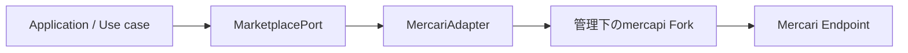

# Phase 0-F — Mercari Adapter実装仕様

## 文書ステータス

- 決定日: **2026-08-30**
- ステータス: **実装基準として採用**
- 対象: Phase 0-Fの`mercapi` Fork、Mercari Adapter、取得Policy、Contract Test
- 前提: [Phase 0-Eの選定結果](phase-0-e-selection.md)
- Product側の挙動: [MVP実装仕様](../product/mvp-spec.md)

この文書はPhase 0-Fの正本とする。実装中に判断が分かれた場合は、コードだけで挙動を決めず、
この文書とTODOを先に更新する。

## 1. 目的

Applicationと`mercapi`の間に安定した境界を作り、Mercari側やForkの型・Parameter変更を
Adapterの内側へ閉じ込める。



Phase 0-Fでは画面を作らない。PythonのDomain型、Interface、Adapter、収集Policy、Mock、Testを
完成させ、Phase 1から利用できる状態を作る。

## 2. 決定事項

| 項目 | 決定 |
|---|---|
| Adapter実装言語 | Python 3.11以上。採用ライブラリ`mercapi`と同じProcessで利用する |
| 採用方式 | 管理下の`kynacio/mercapi` Forkだけを本番取得経路にする |
| 依存固定 | Branch名やVersion範囲ではなく、検証済みcommit SHAへ固定する |
| Application境界 | `MarketplacePort`だけを参照し、`mercapi`の型を参照しない |
| Seller一覧 | `on_sale`と`sold_out`を別Request・別Cursorで取得する |
| `trading` | Domain上は独立状態として保持する。MVPでは専用収集を行わない |
| 古い順 | Server側の順序を信用せず、取得範囲内だけをApplication側でSortする |
| 商品詳細 | Adapterに用意するが、MVP検索一覧では自動取得しない |
| Playwright | 自動Fallbackに使わず、仕様調査・障害診断用PoCに限定する |
| 永続化 | Phase 0-Fでは行わない。Cookie、Token、生Response、画像本体を保存しない |

## 3. 責務の境界

### 3.1 `mercapi` Forkの責務

Forkには、Mercariを利用する一般的なPython Clientとして成立する機能だけを追加する。

- Seller商品一覧で状態を指定できる
- `max_pager_id`をRequestへ渡せる
- 各Seller商品の`pager_id`をResponseモデルへ保持する
- `meta.has_next`をResponseモデルへ保持する
- 次ページ用Cursorを公開型から取得できる
- 既存の`items(profile_id)`との後方互換を維持する
- 固定Response FixtureによるUnit Testを持つ

Card Digger固有の次の処理はForkへ入れない。

- 最大ページ数、最大件数、最大実行時間
- 365日以上前を探す停止条件
- ページ間の重複排除
- Client側の古い順・価格順Sort
- Seller Knowledgeの分類とScore
- Card DiggerのError表示文言
- Application用Cacheや永続化

### 3.2 Mercari Adapterの責務

- `mercapi`モデルをDomain型へ変換する
- URL、日時、価格、販売状態を正規化する
- 必須Field欠落を成功扱いにしない
- `mercapi`例外・HTTP Errorを共通Errorへ分類する
- `MarketplacePort`を実装する
- ForkのPublic APIだけを利用する

### 3.3 Application / Use caseの責務

- 複数ページの収集と停止条件
- 商品IDによる重複排除
- Phase 1へ渡す取得範囲・最古日時・打ち切り理由のMetadata
- Seller Knowledgeの計算
- Loadingと手動再実行

## 4. 管理下Forkの作成・更新手順

実装開始前にGitHub上で`kynacio/mercapi`をForkし、Card Diggerとは別Repositoryとして管理する。

```text
kynacio/mercapi
    ↓ Fork
mgmaru/mercapi
    ↓ 特定commitを依存指定
card-digger
```

作業手順は次で固定する。

1. GitHub上で`mgmaru/mercapi`を作成する
2. ForkをCard Diggerとは別DirectoryへCloneする
3. Fork元を`upstream` Remoteとして登録する
4. `feat/seller-items-pagination` Branchを作成する
5. Fixture Testを先に追加する
6. Public APIとResponse Modelを実装する
7. ForkのBranchをPushする
8. 必要なら`kynacio/mercapi`へPull Requestを作る
9. Card Diggerから、Test済みのFork commit SHAを指定する

```bash
git clone https://github.com/mgmaru/mercapi.git
cd mercapi
git remote add upstream https://github.com/kynacio/mercapi.git
git switch -c feat/seller-items-pagination
```

Fork元の変更は自動で取り込まない。`upstream`更新を取り込む場合は、固定Fixture、ForkのUnit Test、
Card DiggerのContract Test、低頻度のライブ検証を通してから依存SHAを更新する。

## 5. Forkへ追加するPublic API

名称は上流のCoding Styleに合わせて調整できるが、次の情報と挙動は変更しない。

```python
@dataclass(frozen=True)
class SellerItemsPage:
    items: tuple[SellerItem, ...]
    has_next: bool
    next_max_pager_id: str | None

async def items_page(
    profile_id: str,
    statuses: tuple[str, ...],
    *,
    limit: int = 30,
    max_pager_id: str | None = None,
) -> SellerItemsPage:
    ...
```

### Parameter規則

- `profile_id`: 空文字を拒否する
- `statuses`: `on_sale`、`trading`、`sold_out`だけを許可し、1件以上を必須にする
- `limit`: `1..30`。MVPでは30固定で使う
- `max_pager_id`: 1ページ目は`None`、2ページ目以降は直前Responseの値を使う

### Response規則

- `items`はResponse順を保持する
- `has_next=false`なら`next_max_pager_id=None`にする
- `has_next=true`なら、末尾商品の`pager_id`を`next_max_pager_id`にする
- `has_next=true`なのに商品が空、または末尾`pager_id`がない場合はParse Errorにする
- Cursorを推測・生成しない
- Unknown Fieldは無視できるが、必須Field欠落はErrorにする

## 6. Domain型

Pythonの`dataclass(frozen=True)`または同等の不変Modelとして定義する。日時はTimezone付き
`datetime`、金額は日本円の整数、Collectionは呼出側で変更できない型を使う。

```python
class ListingStatus(str, Enum):
    ON_SALE = "on_sale"
    TRADING = "trading"
    SOLD_OUT = "sold_out"
    UNKNOWN = "unknown"

@dataclass(frozen=True)
class ItemCondition:
    id: str | None
    name: str | None

@dataclass(frozen=True)
class MarketplaceItem:
    id: str
    title: str
    price_yen: int
    url: str
    image_urls: tuple[str, ...]
    created_at: datetime
    listing_status: ListingStatus
    seller_id: str
    item_condition: ItemCondition | None = None
    like_count: int | None = None

@dataclass(frozen=True)
class Seller:
    id: str
    name: str
    rating: float | None
    rating_count: int | None
    total_sales_count: int | None
    url: str

@dataclass(frozen=True)
class PageInfo:
    has_next: bool
    next_cursor: str | None

@dataclass(frozen=True)
class SearchPage:
    items: tuple[MarketplaceItem, ...]
    page_info: PageInfo

@dataclass(frozen=True)
class SellerItemsPage:
    items: tuple[MarketplaceItem, ...]
    requested_status: ListingStatus
    page_info: PageInfo
```

### 必須Field

| 型 | 必須Field |
|---|---|
| `MarketplaceItem` | ID、Title、1円以上の価格、HTTPS URL、1件以上の画像URL、出品日時、状態、Seller ID |
| `Seller` | ID、名前、HTTPS Seller URL |
| Page | `has_next`と整合するCursor |

必須Fieldが欠けたRecordは黙って除外しない。Field名と操作を含むParse Errorとして、その取得操作を
失敗させる。`item_condition`、`like_count`、評価、評価件数、販売件数だけはNullableとする。

## 7. Marketplace Interface

```python
class MarketplacePort(Protocol):
    async def search_items_page(
        self,
        keyword: str,
        cursor: str | None = None,
    ) -> SearchPage:
        ...

    async def get_item(self, item_id: str) -> MarketplaceItem:
        ...

    async def get_seller(self, seller_id: str) -> Seller:
        ...

    async def get_seller_items_page(
        self,
        seller_id: str,
        status: ListingStatus,
        cursor: str | None = None,
    ) -> SellerItemsPage:
        ...
```

### Interface規則

- `search_items_page`はMVPでは`on_sale`、カテゴリ・価格指定なし、
  `SORT_CREATED_TIME / ORDER_ASC`固定で要求する
- `SORT_CREATED_TIME / ORDER_ASC`は検証条件を維持するため送るだけで、順序保証には使わない
- AdapterはServer側の古い順を保証しない
- `get_item`は画面から明示的に必要になった場合だけ呼ぶ
- Seller商品は`on_sale`と`sold_out`を一つずつ指定する
- `UNKNOWN`はRequest Parameterとして使用できない
- Applicationへ`mercapi` Object、生Response、DPoP、Header、Cookieを返さない

## 8. 収集Policy

複数ページを集める処理はAdapterではなくUse case層へ置く。すべて同時実行数1、外部Requestの
開始間隔2秒以上とする。

### 8.1 商品検索

| 項目 | MVP値 |
|---|---:|
| 販売状態 | `on_sale`固定 |
| 古い商品の暫定基準 | 365日以上 |
| 最低目標 | 100ユニーク商品、かつ365日以上の商品1件 |
| 最大ページ | 10ページ |
| 最大ユニーク商品 | 1,000件 |
| 最大経過時間 | 30秒 |
| ページ間重複 | 商品IDで除外し、件数を記録 |

次のいずれかで停止する。

1. 最低目標を満たした
2. 次ページがない
3. 10ページへ到達した
4. 1,000ユニーク商品へ到達した
5. 30秒へ到達した
6. 安全停止または取得Errorが発生した

検索結果には必ず、取得ページ数、取得ユニーク件数、重複件数、最古日時、365日以上の商品数、
停止理由、Server側の完全な古い順ではないことを付与する。

最大件数に達するPageが上限を超える場合は、Response順の先頭から上限までを採用し、残りを
破棄した件数もMetadataへ記録する。Seller商品でも同じ規則を使う。

### 8.2 Seller商品

`on_sale`と`sold_out`を別々に収集する。

| 項目 | 1状態あたりのMVP値 |
|---|---:|
| Page size | 30件 |
| 最大ページ | 5ページ |
| 最大ユニーク商品 | 100件 |
| 最大経過時間 | 30秒 |
| ページ間重複 | 商品IDで除外し、件数を記録 |

次のいずれかで停止する。

1. `has_next=false`
2. 5ページへ到達した
3. 100ユニーク商品へ到達した
4. 30秒へ到達した
5. 安全停止または取得Errorが発生した

「Sellerの全商品」「全出品に占める比率」とは表現せず、状態ごとの取得数と打ち切り有無を返す。

### 8.3 停止理由

```python
class CollectionStopReason(str, Enum):
    TARGET_REACHED = "target_reached"
    END_OF_RESULTS = "end_of_results"
    MAX_PAGES = "max_pages"
    MAX_ITEMS = "max_items"
    MAX_DURATION = "max_duration"
    ERROR = "error"
    SAFETY_STOP = "safety_stop"
```

取得結果が途中まで存在しても、`ERROR`または`SAFETY_STOP`を成功完了として隠さない。UIが
部分結果であることを表示できるMetadataを返す。

## 9. Errorと再試行

共通Error Codeは次に固定する。

| Code | 例 | 自動再試行 |
|---|---|---|
| `invalid_input` | 空Keyword、不正Status | しない |
| `unauthorized_401` | HTTP 401 | しない |
| `forbidden_403` | HTTP 403 | しない |
| `rate_limited_429` | HTTP 429 | しない |
| `not_found_404` | 商品・Sellerなし | しない |
| `timeout` | 規定時間超過 | 1回まで |
| `network_error` | 一時的な通信失敗 | 1回まで |
| `upstream_5xx` | Mercari側5xx | 1回まで |
| `parse_error` | 必須Field、Cursor不整合 | しない |
| `challenge` | CAPTCHA / Challenge | しない |
| `unsupported` | 未対応操作 | しない |
| `unknown` | 分類不能 | しない |

再試行は同じ操作を2秒以上空けて1回だけ行い、回数を結果へ残す。再試行と待機時間も最大経過時間へ
含める。401 / 403 / 429 / Challengeが
主要操作で合計3回連続した場合は、その実行の以後の外部アクセスを停止する。認証回避、CAPTCHA回避、
Proxy切替、複数Accountによる回避は行わない。

## 10. Test方針

### 10.1 ForkのUnit Test

- `status=on_sale`、`status=sold_out`を個別送信する
- 複数状態をカンマ区切りへ変換する
- 2ページ目で前ページ末尾`pager_id`を送信する
- `meta.has_next=false`でCursorを返さない
- 空Response + `has_next=false`を正常終端にする
- 空Response + `has_next=true`をParse Errorにする
- 末尾`pager_id`欠落をParse Errorにする
- 既存`items(profile_id)`の互換性を維持する

### 10.2 AdapterのUnit / Contract Test

- `mercapi`型がDomain型へ正規化される
- `trading`を`unknown`や`sold_out`へ変換しない
- 必須Field欠落でParse Errorになる
- ForkのPrivate Memberを使わない
- 最大ページ・件数・時間・重複の各停止理由を判定できる
- Error分類と1回だけの再試行を確認する
- 3回連続の安全Errorで停止する
- Mock Adapterが同じ`MarketplacePort` Contractを満たす

### 10.3 ライブ受入検証

共通検証プロトコルと同じ低頻度条件で実施する。

- 検索5回の成功率80%以上。100%を優先する
- 必須商品Field各100%
- 商品詳細20件のコンディション・いいね各95%以上
- Seller Profile 10人の名前90%以上
- 最大10 Sellerの`on_sale` / `sold_out`で、状態ごとに2ページ目取得または1ページ終端
- ページ間Cursor一致、重複数、終端理由を記録する
- 401 / 403 / 429 / Challengeを回避せず記録する

Seller数が10人に満たない場合は、取得できた全Sellerを母数とし、その事実を結果へ記載する。

## 11. Phase 0-F完了条件

- [ ] 管理下のForkが作成され、ライセンスと著作権表示が維持されている
- [ ] ForkのSellerページングPublic APIとUnit Testが完成している
- [ ] Card DiggerがForkのTest済みcommit SHAへ固定されている
- [ ] Domain型と`MarketplacePort`が定義されている
- [ ] Mercari AdapterとMock Adapterが実装されている
- [ ] 収集Policy、重複排除、停止理由、安全停止が実装されている
- [ ] ForkとAdapterの全自動Testが成功している
- [ ] ライブ受入検証が合格し、結果文書が追加されている
- [ ] Application / Domain層に`mercapi`型とPrivate Memberが漏れていない
- [ ] [MVP実装仕様](../product/mvp-spec.md)から利用できる状態になっている

## 12. Phase 0-Fで実装しないもの

- Web UIとHTTP API
- Databaseと永続Cache
- 定期実行・Background Job
- Playwright Fallback
- Seller Knowledge計算
- 画像本体の保存・Proxy
- Mercari以外のMarketplace
