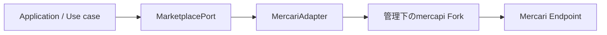

# Phase 0-F — Mercari Adapter実装仕様

## 文書ステータス

- 決定日: **2026-08-30**
- 最終更新日: **2026-08-31**（Auction追加検証の結果と、0-F-4実装で判明した2件を反映）
- ステータス: **実装基準として採用**
- 対象: Phase 0-Fの`mercapi` Fork、Mercari Adapter、取得Policy、Contract Test
- 前提: [Phase 0-Eの選定結果](phase-0-e-selection.md)
- Product側の挙動: [MVP実装仕様](../product/mvp-spec.md)
- Repository運用: [mercapi Fork運用手順](../development/mercapi-fork-operations.md)
- Test実施方法: [Test運用規約](../development/test-policy.md)
- 追加検証: [Auction情報の追加検証計画](phase-0-f-auction-validation.md) / [実測結果](../../poc/mercapi/auction-result.md)

この文書はPhase 0-Fの正本とする。実装中に判断が分かれた場合は、コードだけで挙動を決めず、
この文書とTODOを先に更新する。

## 1. 目的

Applicationと`mercapi`の間に安定した境界を作り、Mercari側やForkの型・Parameter変更を
Adapterの内側へ閉じ込める。



Phase 0-Fでは画面を作らない。PythonのDomain型、Interface、Adapter、収集Policy、Mock、Testを
完成させ、Phase 1から利用できる状態を作る。

## 2. 決定事項

| 項目 | 決定 |
|---|---|
| Adapter実装言語 | Python 3.11以上。採用ライブラリ`mercapi`と同じProcessで利用する |
| 採用方式 | 管理下の`kynacio/mercapi` Forkだけを本番取得経路にする |
| 依存固定 | Branch名やVersion範囲ではなく、検証済みcommit SHAへ固定する |
| Application境界 | `MarketplacePort`だけを参照し、`mercapi`の型を参照しない |
| Seller一覧 | `on_sale`と`sold_out`を別Request・別Cursorで取得する |
| `trading` | Domain上は独立状態として保持する。MVPでは専用収集を行わない |
| 販売形式 | `fixed_price` / `auction` / `unknown`をDomainで保持し、未知形状を通常出品へ寄せない |
| Auction | 追加検証に**合格**。検索・Seller一覧の両方で有効化する |
| Auction価格 | `highest_bid`（取得時点の現在価格）を`price_yen`にする。`initial_price`は使わない |
| 日時 | `mercapi`はnaive `datetime`を返すため、AdapterでLocal Timezoneとして解釈しUTCへ変換する |
| 古い順 | Server側の順序を信用せず、取得範囲内だけをApplication側でSortする |
| 商品詳細 | Adapterに用意するが、MVP検索一覧では自動取得しない |
| Playwright | 自動Fallbackに使わず、仕様調査・障害診断用PoCに限定する |
| 永続化 | Phase 0-Fでは行わない。実行時にCookie、Token、生Response、画像本体を保存しない |
| Test Fixture | 生Responseではなく、匿名化・最小化した構造標本をGit管理する |
| テスト可能性 | 時計、待機、Fork ClientをAdapter / Use caseの内部で生成せず注入する |

Raw Fieldから`SaleFormat`と`price_yen`へのMappingは
[Auction追加検証の実測結果](../../poc/mercapi/auction-result.md)を根拠とし、§6.1に確定値を記載する。
実測していない形（終了済みAuction、未知形状）は`unknown`として扱い、推測で実装しない。

## 3. 責務の境界

### 3.1 `mercapi` Forkの責務

Forkには、Mercariを利用する一般的なPython Clientとして成立する機能だけを追加する。

- Seller商品一覧で状態を指定できる
- Seller商品一覧で`with_auction`を指定できる
- Seller商品の`auction_info`をResponseモデルへ保持する
- `max_pager_id`をRequestへ渡せる
- 各Seller商品の`pager_id`をResponseモデルへ保持する
- `meta.has_next`をResponseモデルへ保持する
- 次ページ用Cursorを公開型から取得できる
- 既存の`items(profile_id)`との後方互換を維持する
- 固定Response FixtureによるUnit Testを持つ

Card Digger固有の次の処理はForkへ入れない。

- 最大ページ数、最大件数、最大実行時間
- 365日以上前を探す停止条件
- ページ間の重複排除
- Client側の古い順・価格順Sort
- Seller Knowledgeの分類とScore
- Card DiggerのError表示文言
- Application用Cacheや永続化

### 3.2 Mercari Adapterの責務

- `mercapi`モデルをDomain型へ変換する
- URL、日時、価格、販売状態、販売形式を正規化する
- Auctionの価格を取得時点のSnapshotとして扱い、確定落札額へ変換しない
- 販売形式の未知形状を`SaleFormat.UNKNOWN`として保持する
- 必須Field欠落を成功扱いにしない
- `mercapi`例外・HTTP Errorを共通Errorへ分類する
- `MarketplacePort`を実装する
- ForkのPublic APIだけを利用する

### 3.3 Application / Use caseの責務

- 複数ページの収集と停止条件
- 商品IDによる重複排除
- Phase 1へ渡す取得範囲・最古・最新日時・取得時刻・打ち切り理由のMetadata
- Seller Knowledgeの計算
- Loadingと手動再実行

## 4. 管理下Forkの作成・更新手順

作成、Remote設定、upstream取込、依存SHA更新、切戻しの実作業は
[mercapi Fork運用手順](../development/mercapi-fork-operations.md)を正本とする。
実装開始前にGitHub上で`kynacio/mercapi`をForkし、Card Diggerとは別Repositoryとして管理する。

```text
kynacio/mercapi
    ↓ Fork
mgmaru/mercapi
    ↓ 特定commitを依存指定
card-digger
```

Fork元の変更は自動で取り込まず、Card DiggerもForkのBranchではなくTest済みcommit SHAへ固定する。
upstreamからForkへの取込と、ForkからCard Diggerへの依存更新を別々にレビュー・検証する。

## 5. Forkへ追加するPublic API

名称は上流のCoding Styleに合わせて調整できるが、次の情報と挙動は変更しない。

実装済みのPublic APIは次のとおり（Fork `b3bdec9`時点）。

```python
@dataclass
class SellerItemsPage:
    items: list[SellerItem]
    has_next: bool
    next_max_pager_id: int | None = None

@dataclass
class SellerItemAuctionInfo:
    id_: str | None = None
    bid_deadline: str | None = None
    total_bid: int | None = None
    initial_price: int | None = None
    highest_bid: int | None = None

async def items_page(
    profile_id: str,
    statuses: Sequence[str],
    *,
    limit: int = 30,
    max_pager_id: int | None = None,
    with_auction: bool = False,
) -> SellerItemsPage | None:
    ...
```

`pager_id`は実測で**10桁の整数**だったため、Cursorは`int`で扱う。Domainの
`PageInfo.next_cursor`は`str | None`のままとし、**Adapterが文字列へ変換する**。
Sellerが存在しない場合（HTTP 404）は`None`を返す。

### Parameter規則

- `profile_id`: 空文字を拒否する
- `statuses`: `on_sale`、`trading`、`sold_out`だけを許可し、1件以上を必須にする
- `limit`: `1..30`。MVPでは30固定で使う
- `max_pager_id`: 1ページ目は`None`、2ページ目以降は直前Responseの値を使う。型は`int`
- `with_auction`: `true`のときだけResponseに`auction_info`が付く。件数・順序・Cursor・状態Filterは変わらない
- `SellerItem`は`auction_info`を保持する。省略時と非Auction商品ではキーごと欠落する

### Response規則

- `items`はResponse順を保持する
- `has_next=false`なら`next_max_pager_id=None`にする
- `has_next=true`なら、末尾商品の`pager_id`を`next_max_pager_id`にする
- `has_next=true`なのに商品が空、または末尾`pager_id`がない場合はParse Errorにする
- Cursorを推測・生成しない
- Unknown Fieldは無視できるが、必須Field欠落はErrorにする
- `meta.has_next`が欠落している場合もParse Errorにする
- `exclude_archived_item`は送らない。PoCのBrowser観測では送られていたが、Public APIの
  Parameterには含めない。件数差が問題になればライブ受入検証で検出する

### 5.1 0-F-4で追加したFork側の修正

Adapterを実装する過程で、**この仕様をForkのPublic APIだけでは満たせない箇所**が2つ見つかった。
どちらもCard Digger側では回避できないため、Forkを修正してから依存SHAを固定した。

| # | 症状 | 修正 |
|---|---|---|
| 1 | 商品詳細の未知形状Auctionが通常出品として通過する | `AuctionInfo`の全Fieldをoptionalにした |
| 2 | HTTP 401 / 403 / 429 / 5xxがParse Errorとして届く | 404以外のError StatusでRaiseするようにした |

#### 1. 未知形状のAuctionが通常出品になる

`Item.auction_info`はoptionalとして定義されているため、`AuctionInfo`の必須Field
（`state`など）が欠けると`map_to_class`はParse Errorを投げず、Logだけ出して
`auction_info = None`にする。これは`auction_info`が最初から無い通常出品と**区別できない**。

§6.1の「Objectだが既知キーを1つも含まない → UNKNOWN」を、Card Digger側では実装できない。
そこで0-F-3で`SellerItemAuctionInfo`へ既に採用していた「全Fieldをoptionalにし、未知形状を
全None instanceとして保存する」方式へ`AuctionInfo`も揃えた。

#### 2. Error StatusがParse Errorになる

Forkは404だけを判定した後、Response Bodyをそのままmapperへ渡していた。401 / 403 / 429 / 5xxは
想定外のBodyとしてParse Errorになり、**Statusも理由も失われる**。

§9のError分類はRate Limitを他と区別することが前提であり、
`unauthorized_401` / `forbidden_403` / `rate_limited_429`が実通信から到達不能では
3回連続の安全停止が機能しない。404以外のError StatusでRaiseするよう修正した。
404の意味は変えない（商品・Sellerなしは`None`のまま）。

PoCはこの2点を`api._client`へのEvent Hook追加で回避していたが、
§3.2「ForkのPublic APIだけを利用する」に反するためAdapterでは採用しない。

## 6. Domain型

Pythonの`dataclass(frozen=True)`または同等の不変Modelとして定義する。日時はTimezone付き
`datetime`、金額は日本円の整数、Collectionは呼出側で変更できない型を使う。

```python
class ListingStatus(str, Enum):
    ON_SALE = "on_sale"
    TRADING = "trading"
    SOLD_OUT = "sold_out"
    UNKNOWN = "unknown"

class SaleFormat(str, Enum):
    FIXED_PRICE = "fixed_price"
    AUCTION = "auction"
    UNKNOWN = "unknown"

@dataclass(frozen=True)
class ItemCondition:
    id: str | None
    name: str | None

@dataclass(frozen=True)
class MarketplaceItem:
    id: str
    title: str
    price_yen: int
    url: str
    image_urls: tuple[str, ...]
    created_at: datetime
    listing_status: ListingStatus
    sale_format: SaleFormat
    seller_id: str
    item_condition: ItemCondition | None = None
    like_count: int | None = None

@dataclass(frozen=True)
class Seller:
    id: str
    name: str
    rating: float | None
    rating_count: int | None
    listed_item_count: int | None   # 出品件数。販売件数ではない
    url: str

@dataclass(frozen=True)
class PageInfo:
    has_next: bool
    next_cursor: str | None

@dataclass(frozen=True)
class SearchPage:
    items: tuple[MarketplaceItem, ...]
    page_info: PageInfo

@dataclass(frozen=True)
class SellerItemsPage:
    items: tuple[MarketplaceItem, ...]
    requested_status: ListingStatus
    page_info: PageInfo
```

### 必須Field

| 型 | 必須Field |
|---|---|
| `MarketplaceItem` | ID、Title、1円以上の価格、HTTPS URL、1件以上の画像URL、出品日時、状態、販売形式、Seller ID |
| `Seller` | ID、名前、HTTPS Seller URL |
| Page | `has_next`と整合するCursor |

必須Fieldが欠けたRecordは黙って除外しない。Field名と操作を含むParse Errorとして、その取得操作を
失敗させる。`SaleFormat.UNKNOWN`は未知形状を表す有効値であり、`FIXED_PRICE`へ変換しない。
`item_condition`、`like_count`、評価、評価件数、販売件数だけはNullableとする。

`price_yen`は、通常出品では販売価格、Auctionでは取得時点の現在価格とする。
Auctionの開始価格や確定落札額で代用しない。

### 6.1 Auction Fieldの正規化

[実測結果](../../poc/mercapi/auction-result.md)で確定した内容とする。**3経路でField名も型も異なる。**

| 経路 | Field名 | キー | 値の型 |
|---|---|---|---|
| 検索 | `auction` | `id` / `bidDeadline` / `totalBid` / `highestBid` / `initialPrice` | **すべて文字列** |
| 商品詳細 | `auction_info` | `id` / `start_time` / `total_bids` / `initial_price` / `highest_bid` / `state` / `auction_type` / `expected_end_time` | 数値・文字列 |
| Seller商品一覧 | `auction_info` | `id` / `bid_deadline` / `total_bid` / `initial_price` / `highest_bid` | 数値・文字列 |

#### `SaleFormat`の判定

```text
1. Fieldが 欠落 / null / 空Object     → FIXED_PRICE
2. Objectで既知キーを1つ以上含む      → AUCTION
3. Objectだが既知キーを1つも含まない  → UNKNOWN
4. Object以外の型                     → UNKNOWN
```

- **検索の`auction.id`は空文字のため、判定に使わない**
- `mercapi`の`Item.auction_info`が`None`かどうかを判定根拠にしない。
  必須Fieldが欠けると例外ではなく`None`になり、Auctionが通常出品として通過する
- 通常出品は検索で`auction: null`、詳細とSeller一覧ではキーごと欠落する

#### 価格

```text
price_yen = 検索 price = auction.highestBid = auction_info.highest_bid
```

- `initial_price`（開始価格）は`price_yen`へ使わない。入札済み商品で現在価格と乖離する
- 検索の`auction.*`は文字列のため整数へ変換する

#### 日時

- `expected_end_time`、`start_time`はepoch秒。`bidDeadline` / `bid_deadline`はISO 8601文字列
- `mercapi`は`datetime.fromtimestamp()`でnaive `datetime`を返す。詳細は§6.2
- 未入札（`state=STATE_NO_BID`、`total_bids=0`）の終了予定時刻は確定値ではない。確定値として扱わない
- 欠落時に架空の終了時刻を生成せず、延長を推測しない

### 6.2 naive `datetime`の解釈

`mercapi`の`Extractors.get_datetime`は`datetime.fromtimestamp(float(x))`を使う。

```python
# 返り値はTimezone情報を持たない
datetime.fromtimestamp(1756600000)
```

**この値はUTCではなく、実行環境のLocal Timezoneで表した時刻である。**
UTCとして解釈し直すとLocal Offset分ずれる。開発機（`Asia/Tokyo`）では9時間ずれ、
出品日時の表示と365日基準の判定が両方とも誤る。

したがってAdapterは、Pythonにおけるnaive値の意味どおり**Local Timezoneとして解釈**し、
UTCへ変換する。

```python
value.astimezone(timezone.utc)
```

`astimezone()`はnaive値を実行環境のLocal Timezoneとみなすため、TZ設定にかかわらず
元の瞬間を復元できる。`TZ=UTC`の環境では「UTCとして解釈し直す」と同じ結果になる。

> 2026-08-31以前のこの文書は「UTCとして解釈し直す」と記載していた。0-F-4の実装時に
> `TZ=UTC`以外の環境で成立しないことが判明したため訂正した。Phase 0-BのPoC
> （[`normalize_search_item`](../../poc/mercapi/result.md)）は当初からLocal解釈で実装されており、
> 実測結果はこの訂正の影響を受けない。

### 6.3 Field対応表 — どこから来て、意味に根拠があるか

`num_sell_items`を`total_sales_count`（累計販売件数）と誤って名付けた原因は、
**改名に2種類あることを区別していなかった**ことにある。

| 種類 | 例 | 根拠 |
|---|---|---|
| **転記** | `num_ratings` → `rating_count` | **不要。** 意味は変わらず、命名規則の違いだけ |
| **主張** | `num_sell_items` → `total_sales_count` | **必要。** `sell`（出品）→ `sales`（販売）で意味が変わっている |

主張には、[Fixture規約](../development/test-policy.md#5-fixture規約)と同じ語彙で根拠区分を付ける。

| 区分 | 意味 |
|---|---|
| `observed` | 外部の正（商品ページなど）と**値を突き合わせた** |
| `derived` | 他の観測から論理的に導ける |
| `assumed` | **未検証。** 合格の根拠にしない |

#### `MarketplaceItem`

| Domain Field | 出所 | 種別 | 根拠区分 | 根拠 |
|---|---|---|---|---|
| `id` | `id_` | 転記 | — | — |
| `title` | `name` | 主張 | `derived` | 商品ページに`data-testid="name"`がある。**値は突き合わせていない** |
| `price_yen` | `real_price` / `price` / `auction.highest_bid` | **主張** | **`observed`** | 商品ページの価格要素と10 / 10一致（[L4 §12.8](phase-0-f-live-acceptance-result.md#128-auction価格と商品ページの照合step-2)） |
| `url` | `id`から生成 | 生成 | `observed` | 20 / 20でHTTP 200 |
| `image_urls` | `photos` / `thumbnails` | 転記 | `observed` | 画像本体の取得・デコードに成功（Phase 0-B） |
| **`created_at`** | **`created`** | **主張** | **`assumed`** | **未検証。** 下記 |
| `listing_status` | `status` | 転記 | `observed` | `on_sale` / `trading` / `sold_out`の3値を実際に観測した |
| `sale_format` | `auction` / `auction_info`の有無 | **主張** | **`observed`** | 商品ページを正として20 / 20一致 |
| `seller_id` | `seller_id` / `seller.id_` | 転記 | `observed` | この値でProfileを取得できる |
| `item_condition` | `item_condition` / `item_condition_id` | 転記 | `derived` | 商品ページに`data-testid="商品の状態"`がある。**値は突き合わせていない** |
| `like_count` | `num_likes` | 転記 | `derived` | 商品ページに`data-testid="icon-heart-button"`がある。**値は突き合わせていない** |

#### `Seller`

| Domain Field | 出所 | 種別 | 根拠区分 | 根拠 |
|---|---|---|---|---|
| `id` | `id_` | 転記 | — | — |
| `name` | `name` | 転記 | — | — |
| `rating` | `star_rating_score` | 主張 | **`assumed`** | **スケール未確認。** 5段階か100点かを観測していない |
| `rating_count` | `num_ratings` | 転記 | — | — |
| `listed_item_count` | `num_sell_items` | **主張** | **`observed`** | §6.4 |
| `url` | `id`から生成 | 生成 | `observed` | Sellerページを開ける |

#### 規則

- **`assumed`の主張を画面へ出さない。** 出す必要が生じたら、先に観測して`observed`へ上げる
- 主張を新設・改名するときは、根拠を1行で書く。**書けないなら元の名前に近い名前を使う**
  （`num_sell_items` → `sell_item_count`なら何も主張していない）
- 値を突き合わせていないものを`observed`と書かない。**要素の存在は値の一致ではない**

#### 現在`assumed`の2件

| Field | 何が未確認か | いつ潰すか |
|---|---|---|
| **`created_at`** | `created`が**出品日時**か。編集や再出品で更新されるかも不明 | **Phase 1の並び替え・Filter実装前。** [MVP仕様 §5](../product/mvp-spec.md)の`oldest`並び、掲載日Filter、経過日数表示がすべてこの値に依存する |
| `rating` | 星評価のスケール（5段階か否か） | Seller画面へ評価を出す前 |

`created_at`は**Productの中心価値に直結する。** 「古い出品を探す」という目的が、この値の意味に
乗っている。編集や再出品で`created`が更新されるなら「632日前」という表示も並び替えも成立しない。

確かめるべきことは3つに分かれ、それぞれ手段が違う。手順と実験は
[TODO](../planning/todo.md#created_atcreated-最優先)を正本とする。

| # | 問い | 手段 |
|---|---|---|
| a | `created`は出品日時か | 商品ページとの照合（即時） |
| b | 編集で`created`は動くか | 縦断観測（1〜2日） |
| c | 再出品でリセットされるか | 公式ガイドの確認 |

**手元のデータでは答えられない。** 構造サンプルは匿名化済みで型しか持たず、L4のartifactsは
商品ごとの`created`を保持していない。`created`と`updated`を並べて観測したこともない。

### 6.4 `listed_item_count`は販売件数ではない

Profileの`num_sell_items`を`Seller.listed_item_count`へ写す。**出品件数であって、
累計販売件数ではない。**

2026-09-01の[追加観測](../../poc/mercapi/open-questions-result.md)で次を確認した。

| 根拠 | 内容 |
|---|---|
| 件数の一致 | 全状態が1ページで終端したSellerで、`on_sale` 1 + `trading` 3 + `sold_out` 25 = **29**が`num_sell_items`と完全一致した。他の解釈はいずれも不一致 |
| 評価件数との矛盾 | **評価247件に対し`num_sell_items`が29**のSellerがいた。累計販売が29なら247の評価は成立しない |
| 代替Fieldの不在 | Profileの`num_`系Fieldは`num_ratings` / `num_sell_items` / `num_ticket`の3つだけ。**`num_sold_items`は存在しない** |

> **2026-09-01の訂正。** この型は当初`total_sales_count`という名前で、
> [MVP実装仕様](../product/mvp-spec.md)も「累計販売件数」として表示する想定だった。
> 実測と食い違うため改名した。旧名のままなら、評価247件のSellerに
> 「累計販売件数 29」と表示していた。

**Profileから累計販売件数は取得できない。** 販売実績を示す必要が出た場合は、
取得できた`sold_out`の件数を「取得範囲内の売却済み件数」として示す。Profileの累計値を
販売件数として読み替えない。

判定できたSellerは1人であり、「全状態の合計と一致する」ことの標本は足りない。
**「販売件数ではない」ことは確定、「出品件数である」ことは有力**という状態で記録する。

## 7. Marketplace Interface

```python
class MarketplacePort(Protocol):
    async def search_items_page(
        self,
        keyword: str,
        cursor: str | None = None,
    ) -> SearchPage:
        ...

    async def get_item(self, item_id: str) -> MarketplaceItem:
        ...

    async def get_seller(self, seller_id: str) -> Seller:
        ...

    async def get_seller_items_page(
        self,
        seller_id: str,
        status: ListingStatus,
        cursor: str | None = None,
    ) -> SellerItemsPage:
        ...
```

### Interface規則

- `search_items_page`はMVPでは`on_sale`、カテゴリ・価格指定なし、
  `SORT_CREATED_TIME / ORDER_ASC`固定で要求する
- 検索は`withAuction=true`で通常出品とAuctionをまとめて取得し、
  販売形式Filterのための追加Requestは行わない
- `SORT_CREATED_TIME / ORDER_ASC`は検証条件を維持するため送るだけで、順序保証には使わない
- AdapterはServer側の古い順を保証しない
- `get_item`は画面から明示的に必要になった場合だけ呼ぶ
- Seller商品は`on_sale`と`sold_out`を一つずつ指定する
- Seller商品は`with_auction=true`で取得する。省略すると`auction_info`が返らず判定できない
- `UNKNOWN`はRequest Parameterとして使用できない
- Applicationへ`mercapi` Object、生Response、DPoP、Header、Cookieを返さない

## 8. 収集Policy

複数ページを集める処理はAdapterではなくUse case層へ置く。すべて同時実行数1、外部Requestの
開始間隔2秒以上とする。

### 8.1 商品検索

| 項目 | MVP値 |
|---|---:|
| 販売状態 | `on_sale`固定 |
| 古い商品の暫定基準 | 365日以上 |
| 最低目標 | 100ユニーク商品、かつ365日以上の商品1件 |
| 最大ページ | 10ページ |
| 最大ユニーク商品 | 1,000件 |
| 最大経過時間 | 30秒 |
| ページ間重複 | 商品IDで除外し、件数を記録 |

次のいずれかで停止する。

1. 最低目標を満たした
2. 次ページがない
3. 10ページへ到達した
4. 1,000ユニーク商品へ到達した
5. 30秒へ到達した
6. 安全停止または取得Errorが発生した

検索結果には必ず、取得ページ数、取得ユニーク件数、重複件数、最古・最新日時、取得時刻、
365日以上の商品数、停止理由、Server側の完全な古い順ではないことを付与する。
掲載日と販売形式のFilterは取得後にFrontendが適用し、この収集Policyの停止条件には使用しない。

最大件数に達するPageが上限を超える場合は、Response順の先頭から上限までを採用し、残りを
破棄した件数もMetadataへ記録する。Seller商品でも同じ規則を使う。

### 8.2 Seller商品

`on_sale`と`sold_out`を別々に収集する。

| 項目 | 1状態あたりのMVP値 |
|---|---:|
| Page size | 30件 |
| 最大ページ | 5ページ |
| 最大ユニーク商品 | 100件 |
| 最大経過時間 | 30秒 |
| ページ間重複 | 商品IDで除外し、件数を記録 |

次のいずれかで停止する。

1. `has_next=false`
2. 5ページへ到達した
3. 100ユニーク商品へ到達した
4. 30秒へ到達した
5. 安全停止または取得Errorが発生した

「Sellerの全商品」「全出品に占める比率」とは表現せず、状態ごとの取得数と打ち切り有無を返す。

#### `trading`の扱い（2026-09-01決定）

出品状態は`on_sale` / `trading`（取引中）/ `sold_out`の3つある。**要求するかどうかと、
返ってきた値をどう扱うかは別の決定**であり、次のとおり分けて決める。

| 決定 | 内容 | 理由 |
|---|---|---|
| **要求** | **`trading`を要求しない** | [MVP実装仕様](../product/mvp-spec.md)が販売中と売却済みの2画面と定めており、表示先が無い。1 Sellerあたり最大5ページ増える |
| **正規化** | **`trading`を`trading`のまま保持する。`sold_out`や`unknown`へ寄せない** | 下記 |

要求しているのは**Application層の`analyze_seller`**である。AdapterもForkも3状態すべてを
要求でき、`ListingStatus.TRADING`は`_REQUESTABLE_STATUSES`に含まれる。
**能力の制約ではなく、収集Policyの選択である。**

##### 要求していないのに、正規化で潰さない理由

要求していない状態でも、**商品詳細（`get_item`）には状態Filterが存在しない。**

| 経路 | 状態Filter | `trading`が返る可能性 |
|---|---|---|
| 検索 | `status=on_sale`を送る | 低い（未確認） |
| Seller商品一覧 | 要求した状態だけが返る（[0-F-1 §6.1](../../poc/mercapi/auction-result.md)で確認） | 低い |
| **商品詳細** | **無し。IDで引くだけ** | **ある** |

検索で見つけた商品を数分後に詳細取得する間に、その商品が購入されれば`trading`になる。
**`trading`はCard Diggerへ実際に到達しうる。**

そのとき`sold_out`へ丸めると、次の2つを取り違える。

```text
sold_out   取引完了。基本的に元へ戻らない
trading    取引中。キャンセルや支払い期限切れで on_sale へ戻りうる（未確定の状態）
```

Seller Knowledgeを「売れた率」で測る場合、未確定の`trading`を売却済みへ数えると
**過大評価**になる。また[Test運用規約 §2.3](../development/test-policy.md#23-静かな失敗の例)は
「`trading`を`unknown`や`sold_out`へ変換する」を**静かな失敗の例**として挙げている。

丸めても**Requestは1件も減らない。** 検知能力だけを失う選択になるため、行わない。

##### 後から要求する場合に必要な作業

**要求しないという決定は、いつでも覆せる。** Fork・Adapter・Domainは`trading`を扱える状態に
あり、必要な変更は**Application層に閉じる。** Fork変更も依存SHA更新も不要である。

| | 対象 | 状況 |
|---|---|---|
| ✅ | `ListingStatus.TRADING` | 定義済み |
| ✅ | `_REQUESTABLE_STATUSES` | `TRADING`を含む。Adapterは要求を受け付ける |
| ✅ | `listing_status()`の正規化 | `trading` / `ITEM_STATUS_TRADING`の両表記に対応済み。L2 Testで固定 |
| ✅ | Forkの`items_page(statuses=...)` | `SELLER_ITEM_STATUSES`に`"trading"`を含む |
| ⬜ | `Operation.SELLER_TRADING` | **未定義。** 下記 |
| ⬜ | `_seller_operation()`の分岐 | `SOLD_OUT`以外を`SELLER_ON_SALE`にしている |
| ⬜ | `SellerAnalysis.trading` | Fieldの追加 |
| ⬜ | `analyze_seller`の収集呼び出し | 3状態目の追加と、失敗時の`_not_collected` |
| ⬜ | Test | 収集とContractの追加 |
| ⬜ | [MVP実装仕様](../product/mvp-spec.md) | 表示要件の変更 |
| ⬜ | Request予算 | 1 Sellerあたり最大5ページ増える |

**唯一の注意点は`Operation`である。** `SELLER_TRADING`が無いため、いま`trading`を要求すると
**その失敗が`seller_on_sale`として記録される。** 要求側を実装する際は、Error Codeの
記録先を先に足す。要求していない現在は発生しない。

##### この決定を見直す契機

- 画面へ「取引中」を表示する要件が出たとき（**そのとき初めて要求側を実装する**）
- Seller Knowledgeの特徴量で「売れた」の定義に`trading`を含めると決めたとき（Phase 1-4）
- 終了済みAuctionの調査で`trading`を観測する必要が出たとき（単発Probe。収集Policyは変えない）

なお**`trading`の実データはまだ1件も観測していない。** `trading`を扱うFixtureは
`derived`であり、観測から起こしたものではない。

### 8.3 停止理由

```python
class CollectionStopReason(str, Enum):
    TARGET_REACHED = "target_reached"
    END_OF_RESULTS = "end_of_results"
    MAX_PAGES = "max_pages"
    MAX_ITEMS = "max_items"
    MAX_DURATION = "max_duration"
    ERROR = "error"
    SAFETY_STOP = "safety_stop"
```

取得結果が途中まで存在しても、`ERROR`または`SAFETY_STOP`を成功完了として隠さない。UIが
部分結果であることを表示できるMetadataを返す。

## 9. Errorと再試行

共通Error Codeは次に固定する。

| Code | 例 | 自動再試行 |
|---|---|---|
| `invalid_input` | 空Keyword、不正Status | しない |
| `unauthorized_401` | HTTP 401 | しない |
| `forbidden_403` | HTTP 403 | しない |
| `rate_limited_429` | HTTP 429 | しない |
| `not_found_404` | 商品・Sellerなし | しない |
| `timeout` | 規定時間超過 | 1回まで |
| `network_error` | 一時的な通信失敗 | 1回まで |
| `upstream_5xx` | Mercari側5xx | 1回まで |
| `parse_error` | 必須Field、Cursor不整合 | しない |
| `challenge` | CAPTCHA / Challenge | しない |
| `unsupported` | 未対応操作 | しない |
| `unknown` | 分類不能 | しない |

再試行は同じ操作を2秒以上空けて1回だけ行い、回数を結果へ残す。再試行と待機時間も最大経過時間へ
含める。401 / 403 / 429 / Challengeが
主要操作で合計3回連続した場合は、その実行の以後の外部アクセスを停止する。認証回避、CAPTCHA回避、
Proxy切替、複数Accountによる回避は行わない。

## 10. Test方針

この節は**何をテストするか**を定義する。Framework、配置、Fixtureの作り方、実行時期、完了判定は
[Test運用規約](../development/test-policy.md)を正本とする。

| 層 | 節 | 外部通信 | 実行 |
|---|---|:---:|---|
| L1 ForkのUnit Test | 10.1 | なし | 変更ごと |
| L2 AdapterのUnit Test | 10.2 | なし | 変更ごと |
| L3 Contract Test | 10.2 | なし | 変更ごと |
| L4 ライブ受入検証 | 10.3 | あり | 手動・低頻度。自動Test Suiteへ入れない |

### 10.1 ForkのUnit Test

- `status=on_sale`、`status=sold_out`を個別送信する
- 複数状態をカンマ区切りへ変換する
- 2ページ目で前ページ末尾`pager_id`を送信する
- `meta.has_next=false`でCursorを返さない
- 空Response + `has_next=false`を正常終端にする
- 空Response + `has_next=true`をParse Errorにする
- 末尾`pager_id`欠落をParse Errorにする
- 既存`items(profile_id)`の互換性を維持する

### 10.2 AdapterのUnit / Contract Test

- `mercapi`型がDomain型へ正規化される
- `trading`を`unknown`や`sold_out`へ変換しない
- 通常出品、Auction、未知形状をそれぞれ`SaleFormat`へ変換する
- 検索の`auction.id`が空文字でもAUCTIONと判定する
- 検索・商品詳細・Seller商品一覧の3形状を同じ`SaleFormat`へ正規化する
- 文字列の`highestBid`を整数の`price_yen`へ変換する
- naive `datetime`から元の瞬間を復元し、Timezone付きで返す（Process Timezoneに依存しない）
- Auctionの取得時点価格を正規化し、開始価格や確定価格へ読み替えない
- 検索とSeller商品で同じ販売形式Mappingを使用する
- 必須Field欠落でParse Errorになる
- ForkのPrivate Memberを使わない
- 最大ページ・件数・時間・重複の各停止理由を判定できる
- Error分類と1回だけの再試行を確認する
- 3回連続の安全Errorで停止する
- Mock Adapterが同じ`MarketplacePort` Contractを満たす

### 10.3 ライブ受入検証

共通検証プロトコルと同じ低頻度条件で実施する。

- 検索5回の成功率80%以上。100%を優先する
- 必須商品Field各100%
- Auction追加検証が合格し、販売形式の判定が標本各100%一致する
- Auction価格Fieldが商品ページの取得時点価格と95%以上一致する
- 商品詳細20件のコンディション・いいね各95%以上
- Seller Profile 10人の名前90%以上
- 最大10 Sellerの`on_sale` / `sold_out`で、状態ごとに2ページ目取得または1ページ終端
- ページ間Cursor一致、重複数、終端理由を記録する
- 401 / 403 / 429 / Challengeを回避せず記録する

Seller数が10人に満たない場合は、取得できた全Sellerを母数とし、その事実を結果へ記載する。

実施結果は[ライブ受入検証結果](phase-0-f-live-acceptance-result.md)を正本とする。
2026-09-01に**2回実施**し、いずれも10項目すべて合格した。**判定は第2回を採用する。**

第1回の後に測定側の弱点（標本の偏り、内訳の未記録、価格照合が包含判定）が見つかったため、
標本を販売形式ごとの枠へ変更し、内訳の記録と価格要素との厳密比較を加えて再実行した。
**合格基準・実施条件・標本サイズは変更していない。** 差分は
[結果 §12.1](phase-0-f-live-acceptance-result.md#121-何を変えどの弱点が解消したか)。

## 11. Phase 0-F完了条件

- [x] 管理下のForkが作成され、ライセンスと著作権表示が維持されている
- [x] ForkのSellerページングPublic APIとUnit Testが完成している
- [x] Card DiggerがForkのTest済みcommit SHAへ固定されている
- [x] Auction追加検証の結果文書が完成し、合否とMappingが仕様へ反映されている
- [x] Domain型と`MarketplacePort`が定義されている
- [x] Mercari AdapterとMock Adapterが実装されている
- [x] 収集Policy、重複排除、停止理由、安全停止が実装されている
- [x] ForkとAdapterの全自動Test（L1〜L3）が成功している
- [x] Fixtureが[Test運用規約 §5](../development/test-policy.md#5-fixture規約)の匿名化規則を満たしている
- [x] 時計、待機、Fork Clientが注入可能になっている
- [x] ライブ受入検証（L4）が合格し、結果文書が追加されている
- [x] Application / Domain層に`mercapi`型とPrivate Memberが漏れていない
- [x] [MVP実装仕様](../product/mvp-spec.md)から利用できる状態になっている

## 12. Phase 0-Fで実装しないもの

- Web UIとHTTP API
- Databaseと永続Cache
- 定期実行・Background Job
- Auctionの入札・購入・自動更新・Countdown・終了通知
- Playwright Fallback
- Seller Knowledge計算
- 画像本体の保存・Proxy
- Mercari以外のMarketplace
