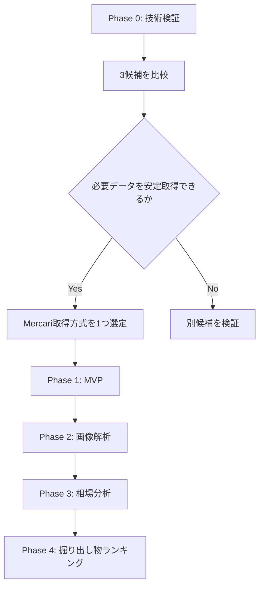
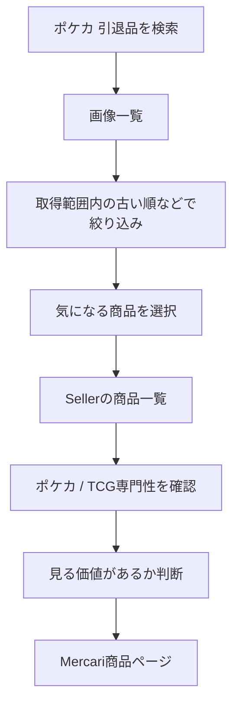

# Card Digger — TODO

> 掘り出し物を効率よく探索するためのMercari検索・出品者分析アプリ。
>
> 最初の目標だったMercari取得方式の選定はPhase 0-Eで完了した。選定した`kynacio/mercapi`方式の
> Auction情報を追加検証し、Mercari Adapterとして分離するPhase 0-Fも、2026-09-01の
> [ライブ受入検証（L4）](../phase-0/phase-0-f-live-acceptance-result.md)合格をもって完了した。
> 現在は**Phase 1のSearch MVP**が次の目標。[1-0](#1-0-application基盤)から
> [1-5](#phase-1-5--e2e受入flowとlayout確認)までの実装は**2026-09-03に完了した。**
> [MVP完了条件](../product/mvp-spec.md#mvp完了条件)は**E2E受入Flowが自動で通っている。**
> [使ってみて分かった2件](#使ってみて分かった2件2026-09-04)（商品の状態表示・更新日Filter）は
> **2026-09-04に完了した。**
> [`is_inactive`](#出品者が生きているかを直接知る2026-09-05に実装)は2026-09-04に実測し、
> **2026-09-05に「非アクティブ」としてSeller画面へ出した**（意味は`unverifiable`のまま、
> 転記として出し、限界を画面に書いた）。
> 次は[1-0の残り2件](#残っているもの--未決)（安全停止の回復条件）を閉じ、
> [MVP後 — 探索補助](#mvp後--探索補助)のA（売却済み商品の価格分布）へ進む。
>
> **1-0には安全停止の回復条件が未決で2件残っている。2026-09-04で3回目の後回しになった。**
> `stop_reason = safety_stop`はEndpoint経由では今も発生しない。

---

## 方針

開発は次の順番で進める。



---

# Phase 0 — Mercari取得方式の技術検証

## 0-1. 開発環境

- [x] GitHubリポジトリを作成する
- [x] READMEを作成する
- [x] `docs/` を作成する
- [x] `docs/product/concept.md`を配置する
- [x] `docs/planning/todo.md`を配置する
- [x] PoC用ディレクトリを作成する
- [x] `.gitignore` を設定する
- [x] 必須環境変数がないことを確認する（必要になった時点で `.env.example` を作成する）

### PoC構成案

```text
card-digger/
├── README.md
├── docs/
│   ├── concept.md
│   └── todo.md
│
├── poc/
│   ├── common/
│   ├── mercari/
│   ├── mercapi/
│   └── playwright/
│
└── src/
```

---

## 0-2. 共通の検証条件を決める

3方式を同じ条件で比較できるよう、[共通検証プロトコル](../phase-0/poc-validation.md)と
機械可読な[`poc/common/conditions.json`](../../poc/common/conditions.json)に固定した。

> この節のチェックは「検証条件の定義が完了した」ことを表す。実測の完了はPhase 0-A〜0-Cで記録する。

### 検索条件

```text
keyword: ポケカ 引退品
status: 販売中
sort: 出品日時の古い順（非対応の場合はその事実を記録）
category: 指定なし
price: 指定なし
```

- [x] 検索条件を固定する
- [x] 100件以上を最低取得目標にする
- [x] 出品から365日以上を「十分古い」の暫定基準にする
- [x] 5回の独立試行で安定性を測定する
- [x] 同時実行数1、リクエスト間隔2秒以上にする

### 各方式で取得したいデータ

- [x] 商品ID
- [x] 商品タイトル
- [x] 価格
- [x] 商品URL
- [x] 商品画像URL
- [x] 商品画像本体
- [x] 出品日時
- [x] 販売状態
- [x] 商品コンディション
- [x] いいね数
- [x] Seller ID
- [x] 出品者名
- [x] Sellerの商品一覧（販売中 / 売却済み）

### 検証する性能・安定性

- [x] 検索成功率
- [x] 取得件数・重複件数
- [x] ページング
- [x] 古い出品まで遡れるか
- [x] 各データ項目の取得率
- [x] 画像本体のHTTP取得・デコード成功率
- [x] Sellerの商品一覧取得率とページング
- [x] 401 / 403 / 429の有無
- [x] Rate Limit（負荷試験ではなく通常取得中の観測）
- [x] 実行速度
- [x] 実装の複雑さ
- [x] Mercari仕様変更への耐性
- [x] 共通の結果記録テンプレートを作成する

---

# Phase 0-A — `marvinody/mercari`

GitHub:

<https://github.com/marvinody/mercari>

## 目的

`created_time + ASC` が現在も利用できるかを最短で検証する。

## TODO

- [x] Python環境を作成する
- [x] `mercari` をインストールする
- [x] キーワード検索を実行する
- [x] 販売中商品のみ取得できるか確認する
- [x] 商品タイトルを取得する
- [x] 価格を取得する
- [x] 商品URLを取得する
- [x] 画像URLを取得する
- [x] 画像URLから画像本体をHTTP取得・デコードする
- [x] `created` を取得する
- [x] 商品コンディションを取得する（公開詳細モデルの解析失敗により取得率0%）
- [x] いいね数を取得する（公開詳細モデルの解析失敗により取得率0%）
- [x] `SORT_CREATED_TIME` を指定する
- [x] `ORDER_ASC` を指定する
- [x] 本当に古い順になるか確認する（古い順にならない）
- [x] 2ページ目以降を取得できるか確認する
- [x] 十分古い販売中商品まで遡れるか確認する
- [x] Seller IDを取得可能か確認する（検索結果になく、公開詳細モデルも解析失敗）
- [x] Seller Profileを取得できるか確認する（非対応）
- [x] Sellerの販売中商品一覧を取得できるか確認する（非対応）
- [x] Sellerの売却済み商品一覧を取得できるか確認する（非対応）
- [x] 401 Unauthorizedが発生するか確認する（0件）
- [x] [検証結果をMarkdownに記録する](../../poc/mercari/result.md)

## 判定

### 採用候補になる条件

- [x] 現在も安定して検索できる
- [x] 古い商品までページングできる
- [ ] 必要な商品情報を取得できる
- [ ] Seller分析に必要な情報へ辿れる

**判定: 早期撤退。** `created_time ASC`が機能せず、商品詳細モデルが現行レスポンスを
解析できない。Seller Profile・Seller商品一覧も未実装のため、Phase 0-Bを優先する。

### 早期撤退条件

以下の場合は深追いしない。

- 401 / 403が継続的に発生する
- 古い商品まで取得できない
- Seller情報を取得できない
- 現行Mercari仕様への追従が困難

---

# Phase 0-B — `kynacio/mercapi`

GitHub:

<https://github.com/kynacio/mercapi>

## 目的

本採用の第一候補として、

- 商品検索
- 商品詳細
- Seller Profile
- Sellerの商品一覧

をまとめて扱えるか確認する。

## TODO

### 商品検索

- [x] Python環境を作成する
- [x] `mercapi` をインストールする（`0.4.2` / commit `20ba68f`に固定）
- [x] キーワード検索を実行する
- [x] 商品IDを取得する
- [x] 商品タイトルを取得する
- [x] 価格を取得する
- [x] 商品URLを生成または取得する
- [x] 商品画像URLを取得する
- [x] 画像URLから画像本体をHTTP取得・デコードする
- [x] 出品日時を取得できるか確認する
- [x] 販売状態を取得する
- [x] 商品コンディションを取得する
- [x] いいね数を取得する
- [x] ページング方法を確認する
- [x] 100件以上取得できるか確認する（825ユニーク件）
- [x] 古い販売中商品まで遡れるか確認する（7ページ目で365日超。ただし古い順ではない）

### Seller

- [x] 商品からSeller IDを取得する
- [x] Seller Profileを取得する
- [x] 出品者名を取得する
- [x] 評価を取得する
- [x] 評価件数を取得する
- [x] Sellerの商品一覧を取得する（10 / 10成功、公開メソッドは全状態合計30件）
- [x] 販売中商品の一覧を取得する（206件。20件到達は7 / 10人）
- [x] 売却済み商品の一覧を取得できるか確認する（43件。20件到達は0 / 10人）
- [x] Sellerの商品画像URLを取得する
- [x] Sellerの商品URLを取得する
- [x] Seller商品の出品日時を取得できるか確認する

### Seller商品一覧の30件上限・ページング追加検証

- [x] 31件以上の商品が存在するSellerを検証対象として選定する
- [x] Sellerページの初回表示時に発生する商品一覧API通信を記録する
- [x] スクロールまたは追加読み込み時に発生するAPI通信を記録する（画面は「もっと見る」方式）
- [x] 商品一覧APIのEndpoint、HTTP Method、`limit`、販売状態指定を確認する
- [x] `cursor`、`offset`、`pageToken`など、続きを取得するRequest Parameterを確認する（`max_pager_id`）
- [x] Responseに含まれる次ページ情報と終端判定情報を確認する（`meta.has_next`）
- [x] Playwrightで31件目以降の商品を取得し、商品IDの重複と販売状態を確認する（5ページ、150ユニーク件、重複0件）
- [x] 販売中商品と売却済み商品をそれぞれページングできるか確認する（各2ページ、60ユニーク件）
- [x] `mercapi`の30件上限がMercari API自体の制限か、ライブラリの実装不足かを判定する（公開メソッドの実装不足）
- [x] 確認したRequest / Responseの概要、取得件数、失敗内容、未確定事項を検証結果に記録する

### 安定性

- [x] 401 / 403の有無を確認する（各0件）
- [x] Rate Limitを確認する（通常取得中の429は0件）
- [x] 連続取得時の挙動を確認する（正式測定72リクエストすべてHTTP 200）
- [x] APIレスポンス変更時の影響範囲を確認する
- [x] [検証結果をMarkdownに記録する](../../poc/mercapi/result.md)

**判定: 条件付き。** 必要フィールド、詳細、画像、Seller Profile・商品一覧の取得は安定して
成功した。一方、`created_time ASC`は古い順にならない。Seller商品一覧はEndpointレベルでは
`max_pager_id`でページングでき、状態別にも各60件を取得できたが、固定版`mercapi`の公開メソッドには
未実装である。Wrapper拡張が必要なため、Phase 0-Cと比較するまで本採用は決定しない。

---

# Phase 0-C — Playwright方式

参考実装:

<https://github.com/neotruong/emthao-jp-search>

## 目的

非公式API Wrapperが安定しない場合の代替方式を検証する。

> **Phase 0-Bからの意思決定引き継ぎ:** 固定版`mercapi`の公開メソッドはSeller商品を最初の30件しか
> 取得できず、そのままではSeller Knowledgeの要件を満たさない。Endpoint拡張は可能だが保守コストを
> 伴うため、Playwright方式のSellerページング・安定性・実装量を測定するまで採用方式を決定しない。

```text
Playwright
    ↓
Mercari Web
    ↓
Browserが検索APIを呼ぶ
    ↓
JSON Responseを取得
```

## TODO

- [x] TypeScriptプロジェクトを作成する
- [x] Playwrightを導入する（`1.55.1`に固定、`npm audit` 0件）
- [x] Mercari検索ページを開く
- [x] 検索通信を確認する
- [x] `/v2/entities:search` の通信を確認する
- [x] JSONレスポンスを取得する
- [x] 商品IDを取得する
- [x] 商品タイトルを取得する
- [x] 価格を取得する
- [x] 画像URLを取得する
- [x] 画像URLから画像本体をHTTP取得・デコードする（20 / 20成功）
- [x] 商品URLを取得する
- [x] 出品日時を取得できるか確認する
- [x] 販売状態を取得する
- [x] 商品コンディションを取得する（20 / 20成功）
- [x] いいね数を取得する（20 / 20成功）
- [x] Seller IDを取得する
- [x] ページングを再現する（`page_token`→POST `pageToken`を確認）
- [x] 古い商品まで遡れるか確認する（最初の100件に365日超2件。ただし古い順ではない）
- [x] Sellerページを取得する
- [x] Sellerの商品一覧を取得する（10 / 10成功）
- [x] 売却済み商品取得の可否を確認する（10 / 10の一括Responseから分類）
- [x] Seller商品を31件以上取得し、ページごとの件数・重複・Cursorを記録する（9 / 10人。残り1人は11件で終端）
- [x] 販売中・売却済みを分け、各状態の停止条件までページングする（Response後に分類。販売中1 / 10人は一括Filter制約で独立停止条件未達）
- [x] Seller商品一覧の終端を判定できるか確認する（3人で`meta.has_next=false`、全員で2ページ目取得または終端）
- [x] Phase 0-Bで確認した`max_pager_id` / `meta.has_next`とBrowser通信を比較する（20 / 20 Cursor一致）
- [x] `mercapi`拡張案とPlaywright方式の実装量・保守範囲・安定性を比較する
- [x] Browser起動コストを測定する（中央値64.37ms）
- [x] Headlessで動作するか確認する（5 / 5成功）
- [x] エラー時の再試行方法を確認する（正式0回、補足CLIとUnit Testを実装）
- [x] [検証結果をMarkdownに記録する](../../poc/playwright/result.md)

---

# Phase 0-D — 3方式を比較する

技術検証完了後、以下の表を埋める。

| 評価項目 | `mercari` | `mercapi` | Playwright |
|---|---:|---:|---:|
| 商品検索 | 5 / 5成功 | 5 / 5成功 | 5 / 5成功 |
| 出品日時 | 100 / 100 | 100 / 100 | 100 / 100 |
| 販売状態 | 100 / 100 | 100 / 100 | 100 / 100 |
| 古い商品へのページング | 5ページ・589件で365日超へ到達。ただし古い順は失敗 | 7ページ・825件で365日超へ到達。ただし古い順は失敗 | 1ページ目・120件で365日超へ到達、補足2ページ合計238件。ただし古い順は失敗 |
| 画像URL | 100 / 100 | 100 / 100 | 100 / 100 |
| 画像本体のHTTP取得・デコード | 20 / 20 | 20 / 20 | 20 / 20 |
| 商品コンディション | 0 / 20（詳細解析失敗） | 20 / 20 | 20 / 20 |
| いいね数 | 0 / 20（詳細解析失敗） | 20 / 20 | 20 / 20 |
| Seller ID | 0 / 100 | 100 / 100 | 100 / 100 |
| Seller Profile | 非対応 | 10 / 10 | 10 / 10 |
| Sellerの販売中商品一覧 | 非対応 | 公開応答10 / 10。追加検証で状態別2ページ・60件。Wrapper拡張が必要 | 一括応答10 / 10、334件。1人は状態別独立停止条件未達 |
| Sellerの売却済み商品一覧 | 非対応 | 公開応答10 / 10。追加検証で状態別2ページ・60件。Wrapper拡張が必要 | 一括応答10 / 10、455件。全員で停止条件到達 |
| 実装難易度 | 高 | 中 | 高 |
| 実行速度 | 検索中央値197.07ms、全体101.6秒 | 検索中央値260.85ms、全体144.4秒 | 検索中央値2,279.17ms、全体164.7秒 |
| 安定性 | 検索100%、詳細0% | 検索・詳細・Profile・一覧・画像100% | 主要取得100%。背景Endpointで403 / 400 / 404あり |
| 保守性 | 低め | 中。Wrapperへ影響を閉じ込められるが非公開API依存 | 低〜中。Browser / DOM / 通信Intercept / 非公開API依存 |
| 総合評価 | 早期撤退 | 条件付き。本採用の第一候補 | 条件付き。Fallback / 診断用 |

---

# Phase 0-E — Mercari取得方式を1つ選定する

**完了: 2026-08-30。** 詳細は[選定結果](../phase-0/phase-0-e-selection.md)に記録した。

## 原則

MVPでは3方式を併用しない。

```text
3候補を技術検証
      ↓
1方式を選定
      ↓
Mercari Adapterとして実装
```

## 選定基準

優先順位は以下。

1. 必要データを取得できる
2. 古い販売中商品まで遡れる
3. Sellerの商品一覧を取得できる
4. 画像URLを取得できる
5. 安定して動作する
6. 実装・保守が簡単
7. 性能が実用範囲内

## 選定結果

- [x] 本採用を、検証済みコミットを基準にした管理下の`kynacio/mercapi` Forkへ決定する
- [x] Seller商品の状態別Filterと`max_pager_id`ページングをForkの公開APIへ追加する
- [x] Playwrightは仕様調査・障害診断用PoCに限定し、MVPの実行経路には含めない
- [x] `marvinody/mercari`は不採用とする
- [x] 全方式で未達だったServer側の古い順を、採用方式の制約として記録する
- [x] Phase 0-F、Phase 1、公開前に必要な追加検証を定義する

**選定: `kynacio/mercapi`方式。** 検索、商品詳細、画像、Seller Profileを安定して取得でき、
Seller商品一覧もEndpointレベルでは状態別にページングできた。固定版の公開`items()`はそのまま
使わず、管理下のForkで`status`、`max_pager_id`、`pager_id`、`meta.has_next`を公開する。

Playwrightは必要データを取得できるが、Web画面の3状態一括取得、Browser / DOM / 通信Interceptの
保守範囲、検索速度を理由に本採用しない。Applicationが障害時に自動でPlaywrightへ切り替わる構成も
採らず、安全停止後の診断にだけ利用する。

なお3方式ともServer側の古い順にはならない。MVPの古い順は、取得上限と打ち切り理由を保持したうえで
「取得した範囲内で古い順」として提供し、Mercari全体の最古順とは扱わない。

---

# Phase 0-F — Mercari Adapterを定義する

採用方式が決まった後、アプリ側から直接ライブラリを呼ばない。

実装の正本は[Mercari Adapter実装仕様](../phase-0/phase-0-f-adapter-spec.md)、Product側の正本は
[MVP実装仕様](../product/mvp-spec.md)とする。


## 0-F-0. 仕様確定

- [x] Python Adapter + 管理下の`mercapi` Forkという境界を決定する
- [x] Fork、Adapter、Applicationの責務を分離する
- [x] [Forkの作成・更新・依存固定・切戻し手順を文書化する](../development/mercapi-fork-operations.md)
- [x] Domain型と`MarketplacePort`のContractを決定する
- [x] 検索を最大10ページ・1,000件・30秒に制限する
- [x] Seller商品を状態ごとに最大5ページ・100件・30秒に制限する
- [x] `trading`を独立状態として保持し、MVPでは専用収集しないと決定する
- [x] 掲載開始日・終了日を取得範囲内のFrontend FilterとしてMVPへ追加する
- [x] 販売形式を`fixed_price` / `auction` / `unknown`で保持する方針を決定する
- [x] Auction対応を追加PoCの合格後に有効化するGateを定義する
- [x] Error分類、1回だけの限定再試行、3回連続時の安全停止を決定する
- [x] Phase 1のMVP範囲、Seller Knowledge、完了条件を決定する
- [x] [Test運用規約とFixtureの匿名化規則を確定する](../development/test-policy.md)
- [x] 時計・待機・Fork Clientを注入可能にする設計制約を確定する

## 0-F-1. Auction情報を追加検証する

検証条件と合格基準は
[Auction情報の追加検証計画](../phase-0/phase-0-f-auction-validation.md)を正本とする。

> **この実行で取る構造サンプルが、後続のFixtureを作る唯一の根拠になる。**
> Phase 0-A〜0-Cの`artifacts/`は残っておらず、`result.md`にField名はあるが型・`null`・欠落・
> Object全体の形は残っていない。ここで取り損ねると、0-F-3以降で追加のライブ実行が必要になる。
> Fixtureを観測なしで作らない（[Test運用規約 §5.1](../development/test-policy.md#51-定義)）。

- [x] 通常出品とAuctionを各10件以上取得する
- [x] 検索結果、商品詳細、商品ページの販売形式を照合する
- [x] `price`、開始価格、最高入札額、現在価格の対応を確認する
- [x] 入札件数、終了予定時刻、Timezone、欠落条件を確認する
- [x] 検索とSeller商品一覧で同じ販売形式判定を適用できるか確認する
- [x] `with_auction`がSeller商品の件数・状態・Cursorへ与える影響を確認する
- [x] 未知形状を`fixed_price`へ誤変換せず`unknown`にできるか確認する
- [x] `poc/mercapi/auction-result.md`へ実測結果を記録する
- [x] 検索結果の構造サンプルを出力する（通常出品103件・Auction 16件。未知形状は0件で未観測）
- [x] 商品詳細の構造サンプルを出力する（通常出品・Auction）
- [x] Seller商品一覧の構造サンプルを出力する（`data[]`・`pager_id`・`meta.has_next`）
- [x] Seller Profileの構造サンプルを出力する
- [x] 構造サンプルがマスク済みで、生Responseを含まないことを確認する
- [x] 合否と採用MappingをMVP仕様・Adapter仕様へ反映する

**判定: 合格。** 販売形式の判定は商品ページを正として20 / 20一致し、Auction価格
（`highest_bid`）も商品ページの現在価格と10 / 10一致した。API Request 30件はすべてHTTP 200で、
401 / 403 / 429は0件だった。詳細は[検証結果](../../poc/mercapi/auction-result.md)。

制約として次の2点が判明したため、Forkの追加範囲へ反映した。

- Seller商品一覧は`with_auction=true`を送らないと`auction_info`を返さない
- 検索・商品詳細・Seller商品一覧でAuction Fieldの形が3種類異なる

## 0-F-2. 管理下Forkを準備する

手順の正本は[mercapi Fork運用手順 §3](../development/mercapi-fork-operations.md#3-初回forkの作成)とする。
**`gh` CLIで実施する。**

> `gh auth login`だけは実行者自身が行う。認証以外はCommandで進められる。
> Clone先はCard Diggerと同じ親Directoryとし、Card Digger配下へ置かない。

- [x] `gh auth status`で認証とScopeを確認する
- [x] `kynacio/mercapi`のライセンスとFork・再配布条件を確認する
- [x] `gh repo fork kynacio/mercapi`で`mgmaru/mercapi`を作成する
- [x] Card Diggerと同じ親Directoryへ`gh repo clone`する
- [x] Fork元を`upstream` Remoteとして登録する
- [x] `feat/seller-items-pagination` Branchを作成する
- [x] 検証済みcommit `20ba68fd42677997c4c91b4e4eb17c1e7e387efa`を変更基点にする
- [x] `git log -1`が変更基点SHAと一致することを確認する
- [x] LICENSEと著作権表示が維持されていることを確認する

**完了: 2026-08-31。** `mgmaru/mercapi`を作成し、`/Users/hiroaki/Developer/mercapi`へCloneした。

| 項目 | 実測 |
|---|---|
| upstream License | **MIT**（Copyright (c) 2022 Take-kun）。Fork・改変・再配布・商用利用が可能 |
| Fork | `mgmaru/mercapi`（public、`parent=kynacio/mercapi`、LICENSE維持） |
| Remote | `origin`=Fork、`upstream`=本家。upstreamのpush URLは無効化済み |
| Branch | `feat/seller-items-pagination` |
| 基点SHA | `20ba68fd42677997c4c91b4e4eb17c1e7e387efa`（upstream `main`の先頭と一致） |

`gh repo clone`がForkに対して`upstream`を自動登録するため、`git remote add`は不要だった。

## 0-F-2b. upstream既存Testの失敗を修正する

Fork直後の基準線が **22 passed / 5 failed** だった。壊れたまま依存し続けないため、
Sellerページングへ着手する前に修正する。

> **`feat/seller-items-pagination`へ混ぜない。** `fix/item-cassette-include-auction`を
> `main`から分けて作業し、修正だけを独立してレビュー・切戻しできる状態にする。

### 原因

| 項目 | 内容 |
|---|---|
| 失敗Test | `test_item` / `test_item_with_comments` / `test_item_not_found` / `test_items_fetch_full_item_from_seller_item` / `test_search_fetch_full_item_from_result` |
| 共通点 | すべて`Mercapi.item()`を経由する |
| 原因 | 固定commit`20ba68f`が`items/get`へ`include_auction=true`を追加したが、cassetteのURIは`?id=...`のまま。VCRのquery matcherが不一致になる |

### 採用する修正方法

**cassetteのRequest URIだけを更新する。Response Bodyは触らない。**

| 案 | 判断 |
|---|---|
| **URIへ`include_auction=true`を追加** | **採用** |
| VCRのmatcherを緩める | 不採用。全Testの検証力が落ちる |
| 実通信で再録画 | 不採用。`dpop`と実IDが公開Repositoryへ入る |
| 修正しない | 不採用。`get_item`はAdapterが使う経路であり、赤の常態化を招く |

Response Bodyを変えずに妥当と判断できる根拠は次のとおり。

| 根拠 | 実測 |
|---|---|
| [0-F-1の実測](../../poc/mercapi/auction-result.md) | 通常出品の商品詳細は`auction_info`がキーごと欠落（10 / 10） |
| 対象5 cassette | `auction_info`の出現が**0件**。すべて通常出品 |

したがって`include_auction=true`で取得しても、記録済みBodyはそのまま妥当な応答である。

### TODO

- [x] `main`から`fix/item-cassette-include-auction`を作成する
- [x] 5 cassetteの`uri`へ`include_auction=true`を追加する
- [x] Response Bodyを変更していないことをdiffで確認する
- [x] 全Testが成功することを確認する
- [x] Forkへcommitし、`main`へ反映する
- [x] 修正後の基準線と commit SHA を記録する
- [x] upstreamへの報告（Issue / PR）の要否を判断する（**報告しないと決定**。理由は後述）

### 実施結果（2026-08-31）

| 項目 | 内容 |
|---|---|
| Branch | `fix/item-cassette-include-auction`（`main`から作成） |
| 変更 | 5ファイル各1行。`uri:`へ`include_auction=true`を追加 |
| Response Body | **無変更**（`git diff --numstat`で各1挿入1削除、uri行以外の変更0行） |
| Test | **22 passed / 5 failed → 27 passed / 0 failed** |
| fix commit | `7fd4c50f0c006438c9b4919276561f3fa5aa8fc0` |
| `main`反映 | `717d25b8b235ca297e0c40f8f36636ef5508b620`（`--no-ff` merge） |
| Push | `origin`の`fix/item-cassette-include-auction`と`main`へ反映済み |

`main`で再実行しても27 passedを確認した。**0-F-3の新しい基準線は「27 passed / 0 failed」**とする。

### upstreamへ報告しない判断（2026-08-31）

**`kynacio/mercapi`へIssue・Pull Requestを出さない。**

| 根拠 | 実測・内容 |
|---|---|
| Issueが使えない | upstreamは**Issueを無効化**している。外部からの報告窓口が閉じられており、意図的な意思表示と読める |
| upstreamが停滞 | 最終push `2026-02-10`（判断時点で約6.5ヶ月前）。Star 0の個人プロジェクト |
| ライセンス上の義務は充足 | MITの義務は著作権表示とLICENSE本文の維持だけで、貢献の還元は義務ではない。Forkでは両方を維持している |
| 実害がない | `mgmaru/mercapi`は修正済みで、Card Diggerはそこを参照する |
| 衝突リスクが軽微 | 将来upstreamが同じ箇所を別方法で直した場合でも、衝突は**5行**にとどまる |

Forkして自分用に修正すること自体はOSSの慣習上まったく問題なく、還元は礼儀であって義務ではない。
慣習的に問題視されるのは、改変版をオリジナルとして再配布する場合や帰属表示を削る場合であり、
本Forkはどちらにも該当しない。

#### 再検討する契機

- upstreamが再び活発に更新されはじめたとき
- 同じ箇所でupstream取込時に衝突が発生したとき
- Sellerページングなど、本体に還元する価値の高い変更を出す判断をしたとき

Sellerページングを還元する場合も、関心事が異なるためcassette修正とは**別のPull Request**にする。

Card Diggerの依存SHAはまだ変更しない。Forkの更新とCard Diggerへの採用は
[別の判断](../development/mercapi-fork-operations.md#22-forkからcard-digger)として扱う。

## 0-F-3. ForkへSellerページングを実装する

> Fixtureは[0-F-1で観測した構造サンプル](../development/mercapi-fork-operations.md#35-fixtureの起点を引き継ぐ)
> から起こす。ForkのためにMercariへ改めてアクセスしない。構造サンプルはGit管理外のため、
> ForkのFixtureを作り終えるまで`poc/mercapi/artifacts/`を削除しない。
>
> **upstreamのTestは`vcrpy`で実通信をcassetteへ記録する方式で、`dpop` JWT・実商品ID・実Titleを
> そのまま含む。**[Test運用規約 §5](../development/test-policy.md#5-fixture規約)と衝突するため、
> 新しいcassetteを実通信から記録せず、通信の差し替えは**`httpx.MockTransport`**を使う。
> 既存cassetteは削除も改変もしない。詳細は
> [Test運用規約 §4.4](../development/test-policy.md#44-forkのtestに関する例外)。

- [x] Forkの開発環境を構築し、既存Testの基準線を記録する
- [x] 追加Testが基準線を悪化させないことを確認する
- [x] `SellerItemsPage`に`items`、`has_next`、`next_max_pager_id`を定義する
- [x] Public APIで`status`、`limit`、`max_pager_id`、`with_auction`を指定可能にする
- [x] Seller商品Modelへ`pager_id`を追加する
- [x] Seller商品Modelへ`auction_info`を追加する
- [x] Responseの`meta.has_next`を保持する
- [x] `has_next=true`時だけ末尾`pager_id`を次Cursorとして返す
- [x] 空Response、Cursor欠落、未知Statusを検証する
- [x] 既存`items(profile_id)`の後方互換を維持する
- [x] 構造サンプルからJSON Fixtureを起こす（`observed` / `derived`の区分を記録する）
- [x] `httpx.MockTransport`でForkのUnit Testを追加する
- [x] 既存Testの結果が基準線から悪化しないことを確認する
- [x] ForkのTest済みcommit SHAへCard Diggerの依存を固定する（`b3bdec9`。0-F-4で実施）

### 実施結果（2026-08-31）

| 項目 | 内容 |
|---|---|
| Branch | `feat/seller-items-pagination`（`main`=`717d25b`から作成） |
| feature commit | `74df1d3` |
| `main`反映 | `d9dced921989d29e939451fc044b45e756251b06`（`--no-ff` merge） |
| 現在のFork `main` | **[0-F-4](#0-f-4-domainとadapterを実装する)以降さらに進んでいる。固定したSHAはそちらを参照** |
| Test | **27 passed → 51 passed / 0 failed**（追加24件） |
| 差分 | 14ファイル、663挿入 / 6削除。削除はimport行の置換のみ |
| Fixture | `tests/fixtures/seller_items/` に7件。`observed` 2 / `derived` 5 / `assumed` **0** |
| cassette | 新規記録・既存改変ともに**なし** |

#### 追加したPublic API

```python
async def items_page(profile_id, statuses, *, limit=30, max_pager_id=None, with_auction=False)
    -> SellerItemsPage | None
```

`SellerItemsPage(items, has_next, next_max_pager_id)`、`SellerItem.pager_id`、
`SellerItem.auction_info`（`SellerItemAuctionInfo`）を追加した。`items()`は無変更。

#### 仕様から変更した点

| 項目 | 仕様の記載 | 実装 | 理由 |
|---|---|---|---|
| Cursorの型 | `str \| None` | **`int \| None`** | 実測で`pager_id`は10桁の整数。Domainの`str`変換はAdapterが行う |
| 戻り値 | `SellerItemsPage` | `SellerItemsPage \| None` | HTTP 404のSellerでは`None`を返す既存`items()`の流儀へ合わせた |
| `exclude_archived_item` | 記載なし | **送らない** | Public APIのParameterに含めない。件数差はライブ受入検証で検出する |

いずれも[Adapter仕様 §5](../phase-0/phase-0-f-adapter-spec.md#5-forkへ追加するpublic-api)へ反映済み。

#### 判断が必要な残件（0-F-4で扱う）

`auction_info`が「空Object」と「未知キーだけのObject」は、どちらもモデル上は全Field `None`の
インスタンスになる。Adapterは**この状態を`FIXED_PRICE`ではなく`UNKNOWN`へ寄せる**こと。
実測では空Objectを0件しか観測しておらず、安全側に倒す。

> **0-F-4で対応済み。** 3経路とも「Fieldが`None` → `FIXED_PRICE`」「既知キーを1つ以上持つ →
> `AUCTION`」「全Fieldが`None`のインスタンス → `UNKNOWN`」で判定する。
> 商品詳細だけは同じ判定ができなかったため、Fork側も修正した（[0-F-4](#0-f-4-domainとadapterを実装する)）。

#### black

追加・変更したファイルは`black 22.6.0`準拠。`mercapi/mapping/definitions.py`は
**変更前から未整形**のため整形しない（差分が428行に膨らみ、レビュー不能になるため）。

### 既存Testの基準線（2026-08-31）

```bash
uv venv --python 3.11 .venv
uv pip install --python .venv/bin/python -e . \
  "vcrpy>=4.2,<5" "pytest>=7.1.2,<8" "pytest-asyncio>=0.19,<0.20" "pytest-recording>=0.12.1,<0.13"
.venv/bin/python -m pytest tests --record-mode=none -q
```

| 時点 | commit | 結果 |
|---|---|---|
| Fork直後 | `20ba68f` | 22 passed / 5 failed |
| [0-F-2b](#0-f-2b-upstream既存testの失敗を修正する)適用後 | `717d25b` | 27 passed / 0 failed |
| Sellerページング追加後 | `d9dced9` | 51 passed / 0 failed |
| **CI対応後（整形・record-mode明示）** | **`beab279`** | **51 passed / 0 failed** |

基準線27件は維持したまま24件を追加した。**悪化なし。**

`--record-mode=none`を必ず付ける。付け忘れるとcassetteが無いRequestで実通信が発生し得る。

## 0-F-3b. CIを導入する

本格的な実装に入る前に、Testが自動で走る状態を作る。方針は
[CIとMerge基準](../development/ci-policy.md)を正本とする。

> **CIからL4（ライブ受入検証）を実行しない。** PoCのRunnerをどのJobからも呼ばない。

- [x] `card-digger`へ`.github/workflows/ci.yml`を追加する（`docs` / `poc`の2 Job）
- [x] 文書Link検査を`tools/check_docs_links.py`としてScript化する
- [x] ForkのActionsを有効化する
- [x] Forkの`black --check`が通るよう整形する
- [x] Forkの`pytest`へ`--record-mode=none`を明示する
- [x] Forkの未使用workflow（PyPI公開・Docs公開）を無効化する
- [x] CIとMerge基準を文書化する
- [x] `backend` JobをCIへ追加する（0-F-4で実施）
- [x] `card-digger`の`main`へBranch保護を設定する（0-F-4で実施）

### 実施結果（2026-08-31）

| 対象 | 内容 |
|---|---|
| `card-digger` CI | `docs`（Link検査27ファイル）と`poc`（Unit Test 35件）の2 Job |
| Fork CI | upstream由来の`check.yaml`を利用。**新規作成せず** |
| Fork CI結果 | **全6 Job成功**（Lint + Python 3.9 / 3.10 / 3.11 / 3.12 / 3.13） |
| Fork整形 | `chore/format-with-black`。**AST一致を確認**した整形のみの変更 |
| Fork `main` | **`beab279af0395ea8b7e649b1e4bee2bb57000b59`** |

#### 判明した事実

| 項目 | 内容 |
|---|---|
| ForkのCI | upstream由来で4本存在したが、**実行履歴は0件**だった |
| 原因 | GitHubはForkのActionsを既定で無効にする。API経由で有効化した |
| upstreamのlint | `definitions.py`と`models/shop/data.py`が`black 22.6.0`未準拠で、**upstream自身のCIも赤だった** |
| 共通する背景 | 0-F-2bの5件失敗と同様、CIが監視されていなかった |
| 公開workflow | `Publish to PyPI`等は手動トリガのみで誤爆リスクは低いが、使わないため無効化した |

#### 運用の決定

| 項目 | 決定 |
|---|---|
| PR経由にする対象 | `src/` `poc/` `tools/` `.github/` |
| 直接pushを許容する対象 | `docs/` `README.md` |
| 承認者数 | **要求しない**。1人開発では自己承認ができず全変更が止まる |
| Branch保護 | 0-F-4で設定した |

## 0-F-4. DomainとAdapterを実装する

> 依存管理Toolは**`uv`**で確定（2026-08-31）。`pyproject.toml`と`uv.lock`の両方をコミットする。
>
> 固定するForkのcommit SHAは **`beab279af0395ea8b7e649b1e4bee2bb57000b59`**（2026-08-31時点の`main`）。
> Forkはこの後も更新されうるため、固定前に必ず現在の先頭を確認する。
>
> ```bash
> git -C <mercapiのClone先> fetch origin && git -C <mercapiのClone先> rev-parse origin/main
> ```
>
> 着手前に[Test運用規約 §7](../development/test-policy.md#7-テスト可能性のための設計制約)の
> 設計制約（時計・待機・Fork Clientの注入）を満たす構成にする。
> あわせて[CIとMerge基準 §3.1](../development/ci-policy.md#31-card-digger)の`backend` Jobと
> [§6](../development/ci-policy.md#6-branch保護)のBranch保護を設定する。

- [x] `uv`でPython 3.11以上のApplication Packageを`src/backend`へ作成する
- [x] Forkの完全なcommit SHAを`pyproject.toml`へ記載し`uv.lock`を生成する
- [x] `ListingStatus`、`SaleFormat`、`ItemCondition`、`MarketplaceItem`、`Seller`を定義する
- [x] `PageInfo`、`SearchPage`、`SellerItemsPage`を定義する
- [x] `MarketplacePort`を定義する
- [x] Mercari Adapterの検索・詳細・Profile・Seller商品Pageを実装する
- [x] URL、価格、日時、状態、販売形式を正規化する
- [x] Auctionの価格を`highest_bid`（取得時点の現在価格）へ正規化する
- [x] 検索・商品詳細・Seller商品一覧の3形状を同じ`SaleFormat`へ正規化する
- [x] naive `datetime`から元の瞬間を復元する（**仕様の記述を訂正した。後述**）
- [x] 未知の販売形式を`SaleFormat.UNKNOWN`として保持する
- [x] 必須Field欠落とCursor不整合をParse Errorにする
- [x] 共通Error Codeと限定再試行を実装する
- [x] 検索・Seller商品の収集Policy、重複排除、停止理由を実装する
- [x] Mock Adapterを用意する
- [x] 時計・待機・Fork Clientを注入で受け取る
- [x] Domain / Application層へFork固有型を漏らさない
- [x] ForkのPrivate Memberを参照しない

### 実施結果（2026-08-31）

| 項目 | 内容 |
|---|---|
| Branch | `feat/domain-and-adapter` |
| Package | `src/backend`（`uv` / Python 3.11 / `pyproject.toml` + `uv.lock`） |
| 固定したFork SHA | **`b3bdec98d7ed56d0e3f1270f9852a2a170c5896c`** |
| Test | **186 passed / 0 failed**（L2 Unit 156 / L3 Contract 30） |
| Fixture | 20件。`observed` 6 / `derived` 14 / `assumed` **0** |
| CI | `backend` Jobを追加（`docs` / `poc` / `backend`の3 Job） |
| Branch保護 | `card-digger`の`main`へ設定 |

#### 構成

```text
card_digger/
├── domain/       models.py / ports.py / errors.py
├── application/  collection.py / collect_search.py / analyze_seller.py
└── adapters/     mercari.py / mock.py / error_mapping.py / clock.py
```

`domain`と`application`が`mercapi`をimportしないこと、Adapterがforkの
Private Memberを触らないことは`tests/unit/test_layering.py`が**静的に検査**する。

#### 仕様から変更した点

| 項目 | 仕様の記載 | 実装 | 理由 |
|---|---|---|---|
| naive日時 | UTCとして解釈し直す | **Local Timezoneとして解釈しUTCへ変換** | 後述。仕様側を訂正した |
| 収集Policyの置き場 | 記載なし | `application/collection.py`を追加 | 検索とSeller収集が同じ間隔・再試行・安全停止を使う |
| Adapterの再試行 | 記載なし | **Adapterは持たない** | 待機と時計は収集Policy側にあり、`RequestGate`が一元管理する |
| Request Timeout | 「規定時間超過」 | `httpx`の既定値 | Forkに設定用のPublic APIが無く、根拠のない値を新設しない |

いずれも[Adapter仕様](../phase-0/phase-0-f-adapter-spec.md)と
[MVP仕様 §2.1](../product/mvp-spec.md#21-repository構成)へ反映済み。

### 実装中に判明した2件

**どちらも「仕様どおりに実装すると壊れる」箇所で、着手前に判断を仰いでから対応した。**

#### 1. naive `datetime`をUTCとして解釈すると9時間ずれる

`mercapi`の`datetime.fromtimestamp()`が返すnaive値は**実行環境のLocal Timezone**の時刻であり、
UTCとして解釈し直すとLocal Offset分ずれる。開発機（`Asia/Tokyo`）では出品日時の表示と
365日基準の判定が両方とも9時間ずれる。

`astimezone(timezone.utc)`でLocal解釈からUTCへ変換する方式へ変更し、
[Adapter仕様 §6.2](../phase-0/phase-0-f-adapter-spec.md#62-naive-datetimeの解釈)を訂正した。
Phase 0-BのPoCは当初からLocal解釈で実装されており、**実測結果は影響を受けない。**
`TZ`を切り替えて同じ瞬間になることをTestで固定した。

#### 2. ForkのPublic APIだけでは仕様を満たせない箇所が2つ

| # | 症状 | Fork側の修正 | PR |
|---|---|---|---|
| 1 | 商品詳細の未知形状Auctionが通常出品として通過する | `AuctionInfo`の全Fieldをoptional化 | [#1](https://github.com/mgmaru/mercapi/pull/1) |
| 2 | HTTP 401 / 403 / 429 / 5xxがParse Errorとして届く | 404以外のError StatusでRaise | [#2](https://github.com/mgmaru/mercapi/pull/2) |

2はRate Limitを他のErrorと区別できず、**3回連続の安全停止が実通信から到達不能**になるため
放置できない。PoCは`api._client`へのEvent Hookで回避していたが、Private Memberの参照にあたる。

詳細は[Adapter仕様 §5.1](../phase-0/phase-0-f-adapter-spec.md#51-0-f-4で追加したfork側の修正)。

#### Forkの基準線

| 時点 | commit | 結果 |
|---|---|---|
| [0-F-3b](#0-f-3b-ciを導入する)まで | `beab279` | 51 passed / 0 failed |
| `AuctionInfo`のoptional化 | `5db3ae5` | 57 passed / 0 failed |
| **Error StatusでRaise（固定対象）** | **`b3bdec9`** | **94 passed / 0 failed** |

基準線51件を維持したまま43件を追加した。**悪化なし。**

#### 残る既知の制約

- **未観測の形状は`assumed` Fixtureにしていない。** 終了済みAuction（`finish_time`あり）と、
  実際に現れた未知形状は標本が無いため、未観測のまま残す
- **`challenge`は分類先として定義しているが、実通信からの検出手段が無い。**
  CAPTCHA / Challengeの応答形を観測できていないため、推測で判定しない。
  安全停止の対象Codeには含めており、観測できた時点で分類を追加する

## 0-F-5. Test・ライブ受入検証

実施方法・Fixture規約・実行時期は[Test運用規約](../development/test-policy.md)を正本とする。
L1〜L3は自動Test Suite、L4は手動・低頻度で実行する。

> Contract Testはこの節で初めて書くのではなく、
> [0-F-4](#0-f-4-domainとadapterを実装する)で`MarketplacePort`を定義した直後に書き始める
> （[Test運用規約 §8](../development/test-policy.md#8-contract-testの適用方法)）。

### L1〜L3（自動Test Suite）

**0-F-3と0-F-4で完了済み。**

- [x] 0-F-1の構造サンプルからFixtureを起こす（観測なしで作らない）
- [x] 実サービスで再現できない異常系Fixtureを、正常Fixtureから派生させて用意する
- [x] Forkの正常系・終端・空Response・Cursor欠落Fixture Testを通す（L1）
- [x] Adapterの正規化、Error、再試行、安全停止、収集上限をUnit Testする
- [x] `MarketplacePort`のContract TestをMercari / Mock Adapterの両方へ適用する
- [x] 通常出品・Auction・未知形状の販売形式と価格LabelをFixture Testする
- [x] Fixtureが[匿名化規則](../development/test-policy.md#5-fixture規約)を満たすことを確認する
- [x] `tests/fixtures/README.md`へFixtureの出所と検証観点を記録する

### L4（ライブ受入検証）

条件・手順・合格基準は[ライブ受入検証実施計画](../phase-0/phase-0-f-live-acceptance.md)を正本とする。

- [x] L4 Runner（人が手で起動する実行Script）と手順書を用意する
- [x] `RequestGate`へ自動再試行を止める設定を追加する（L4は`max_retries=0`）
- [x] Runnerが`--confirm`なしで通信しないことをTestで固定する
- [x] 検索を5回実行し、成功率と必須Field取得率を確認する
- [x] 商品詳細20件のコンディション・いいねの取得率を確認する
- [x] Seller Profile 最大10人の名前取得率を確認する
- [x] 最大10 Sellerの`on_sale` / `sold_out`で、2ページ目取得または1ページ終端を確認する
- [x] 販売形式の判定が検索・商品詳細・Seller一覧で一致することを確認する
- [x] Auction価格が商品ページの取得時点価格と一致することを確認する（**PoC側で実施**）
- [x] 401 / 403 / 429 / Challengeを回避せず記録する
- [x] ライブ受入検証（L4）結果を`docs/phase-0/phase-0-f-live-acceptance-result.md`へ記録する
- [x] [Adapter仕様のPhase 0-F完了条件](../phase-0/phase-0-f-adapter-spec.md#11-phase-0-f完了条件)をすべて満たす

### 実施完了（2026-09-01）

**判定は合格。** 実測は[ライブ受入検証結果](../phase-0/phase-0-f-live-acceptance-result.md)を正本とする。

| 項目 | 内容 |
|---|---|
| Runner | `src/backend/scripts/live_acceptance.py` / `poc/mercapi/auction_probe.py` |
| 実行日時 | `2026-09-01T05:09:45Z` 〜 `05:16:29Z`（Step 1が3分04秒、Step 2が2分11秒） |
| Fork commit | `b3bdec98d7ed56d0e3f1270f9852a2a170c5896c` |
| Card Digger commit | `c49ba1b48bc2db7385612212468f51dfbe1ebbaa` |
| Request数 | API 123件（予算は最大180件）。すべてHTTP 200 |
| 実施条件 | 同時実行数1、間隔2秒以上、**自動再試行0回**、安全停止は未発動 |
| 事前Test | Fork 94 passed（L1）/ Backend 214 passed（L2・L3） |
| 出力 | 結果文書（Git管理）と`artifacts/`の実測値（**Git管理外**） |

第1回の実施後、測定側に3つの弱点が見つかったためRunnerとProbeを直し、**第2回を実行した**
（2026-09-01 07:53Z 〜 07:58Z、API 118 Request、Card Digger commit `61cb8ed`）。
**判定は合格のまま変わらない。**

| 第2回で変わったこと | 内容 |
|---|---|
| 商品詳細の標本 | `auction` 20 / `fixed` 0 → **`auction` 10 / `fixed` 10**。内訳も記録 |
| Seller商品の内訳 | 記録せず破棄 → `on_sale` 351件 / `sold_out` 507件を記録 |
| 終了済みAuction | 探していない → **`sold_out` 507件を判定して候補0件**（未観測のまま） |
| 価格照合 | 包含判定（検出力4 / 10） → **厳密比較**（比較不能0件、10 / 10一致） |

経緯と教訓は[検証の落とし穴](../retrospectives/2026-09-01-verification-pitfalls.md)にまとめた。

その後、`MarketplaceItem`へ必須Field`updated_at`を追加したため、**第3回**を実行して
実サービスで壊れないことを確認した（2026-09-01 15:30Z、Request 110件）。
**必須Field 3505 / 3505、Parse Error 0件。判定には使わない動作確認**である。
実測は[結果 §13](../phase-0/phase-0-f-live-acceptance-result.md#13-updated_at追加後のstep-1)。

| 基準 | 実測 |
|---|---|
| 検索5回の成功率80%以上 | 5 / 5（100%） |
| 必須商品Field各100% | 1185 / 1185（100%） |
| 商品詳細のコンディション・いいね各95%以上 | 各20 / 20（100%） |
| Seller Profileの名前90%以上 | 10 / 10（100%） |
| `on_sale` / `sold_out`の2ページ目取得または終端 | 各10 / 10（100%） |
| 販売形式の判定が各100%一致 | 検索 vs 詳細 20 / 20、検索 vs Seller一覧 24 / 24 |
| Auction価格が商品ページと95%以上一致 | 10 / 10（100%） |
| 401 / 403 / 429 / Challenge | **0件** |

**Runnerは`--confirm`が無い限り1件も通信しない。** CIは`tests/`だけを実行するため、
`scripts/`はどのJobからも呼ばれない。

#### 2つのStepに分ける

| Step | 対象 | 場所 | 理由 |
|---|---|---|---|
| 1 | 検索・商品詳細・Seller Profile・Seller商品一覧 | `src/backend` | Adapterと収集Policyの実測 |
| 2 | Auction価格 vs **商品ページ**の現在価格 | `poc/mercapi` | Browserが要るため。`src/backend`にPlaywrightを持ち込まない |

#### 実施後に残った課題

不合格項目はない。次の3点を[結果 §9](../phase-0/phase-0-f-live-acceptance-result.md#9-次に見直す点)へ
改善余地として記録した。合否には影響しないため、Phase 1と並行して扱う。

- [x] Runnerへ商品詳細標本の販売形式内訳を記録させる
- [x] 通常出品の「検索 vs 商品詳細」一致をStep 1でも測れるようにする（形式別の枠へ変更）
- [x] Seller商品（`on_sale` / `sold_out`）の販売形式内訳を記録させる
- [x] 売却済みAuctionの商品詳細を最大5件引き、終了済みAuctionを探す手順を追加する
- [x] 上記を反映したRunnerでL4を再実行し、結果文書を更新する（第2回、2026-09-01 07:53Z）

未知形状は本実行でも標本0件だった。実サービスで再現できないため**未観測のまま残し**、
L2のFixture Testで担保する現状を継続する（これは決定であり、Taskではない）。

終了済みAuctionは**探索を打ち切り、保留にする**（2026-09-01決定）。理由と経緯は
[オプション O-4](#オプション--判断済みで保留しているもの)へ集約した。

- [x] 実験1: Sellerの`trading`を`with_auction=true`で取得し、`auction_info`の有無を確認する（2026-09-01実施。**23件中0件**）
- [x] 終了済みAuctionの探索を打ち切り、保留とする判断を記録する

実験1で**(d)は否定された。** 3状態すべてを観測して`auction_info`が付いたのは`on_sale`だけで
（`on_sale` 451件中30件、`trading` 23件中0件、`sold_out` 642件中0件）、
**進行中のAuctionにしかAuction情報が付かない**という新しい仮説が立った。
実測は[追加観測結果](../../poc/mercapi/open-questions-result.md)。

> `trading`は**Fieldではなく`status`の値**であり、**Auction固有でもない**（通常出品にもある）。
> Card Diggerは`trading`を一度も要求しておらず、**実データを1件も観測していない**。
> また、**入札なしで終了したAuction**（`STATE_NO_BID`。第2回は4 / 10）の行き先は
> 実験1では分からず、実験2が要る。
>
> `trading`の要求と正規化の扱いは
> [Adapter仕様 §8.2](../phase-0/phase-0-f-adapter-spec.md#tradingの扱い2026-09-01決定)で決定済み。
> **要求しない／正規化では潰さない。** 表示要件が出た時点で要求側を実装する。
>
> **この決定はいつでも覆せる。** Fork・Adapter・Domainは`trading`を扱える状態にあり、
> 変更はApplication層に閉じる（Fork変更・依存SHA更新は不要）。
> ただし`Operation.SELLER_TRADING`だけ未定義で、要求側を足す前に先に定義する。
> 作業一覧は同§8.2の表にある。

いずれもPhase 0-Fの完了条件ではない。**未観測のまま`assumed` Fixtureを作らない**という
方針は維持したうえで、標本を得る手立てとして残す。

終了済みAuctionは扱いを変えた。検索は`status=on_sale`固定のため構造上現れないが、
**Sellerの`sold_out`には現れうる**。前回はそこを642件取得しながら販売形式を記録して
いなかったため、見落としていた可能性がある。追加Requestは最大5件に収まる。

---

# Phase 1 — Search MVP

## 目的

商品画像とSeller情報を一つの画面で確認し、人間の探索時間を減らす。

機能、画面挙動、API、Seller Knowledge、対象外、完了条件は
[MVP実装仕様](../product/mvp-spec.md)を正本とする。

## 2026-09-03 — 使ってみて見つけた1件。停止条件が目的と違う時計で測っていた

**1-3まで作って実際に動かしたところ、停止理由がほぼ毎回`365日以上前の商品へ到達`になり、
集まるのは更新日が新しい商品ばかりだった。** 探しているのは放置された出品なので、
この状態では製品の機能が果たされない。

| | 見ていた軸 |
|---|---|
| 旧・最低目標（`collect_search.py`） | **`created`**（掲載日） |
| [MVP仕様 §5.5](../product/mvp-spec.md#55-sortとfilter)が言う目的 | **`updated`**（未更新期間） |

検索結果は**更新の新しい順に傾いて返る**（降順の破れが`updated`21%、`created`40%。
[観測結果](../../poc/mercapi/timestamp-result.md)）。**放置出品ほど1ページ目から遠い。**
そこへ「掲載が365日以上前の商品が1件」を掛けると、
**「掲載は1年前だが昨日も触られている」出品1件で条件が成立する。**
出品者が今も手入れしている商品であり、探しているものの正反対である。

- [x] **最低目標を外した** — 予算（10ページ・1,000件・30秒）だけで止める。
  **新しい数字は入れず、条件を1つ削った。**
  正本は[MVP仕様 §5.3](../product/mvp-spec.md#最低目標を外した2026-09-03)
- [x] **予算を使い切れば放置出品に届くか、実測した** — **届かなかった。**
  最低目標を外して300件前後まで増えても、更新日が1日未満の商品ばかりだった

### 2026-09-03 — 更新日順では取得できない。価格帯で母集団を削る

**「更新日の古い順で取れないか」を調べ、取れないことが確定した。**

`mercapi`の`SortBy`は`SORT_SCORE` / `SORT_CREATED_TIME` / `SORT_PRICE` / `SORT_NUM_LIKES`の
4つだけで、Mercariの絞り込みUIと一致する。**更新日順という選択肢が存在しない。**
さらに`_allowed_sorting`が示すとおり、**`ASC`が使えるのは価格だけ**である。

そして`SORT_CREATED_TIME`という名前に反し、**返る並びは`updated`の降順**に傾いている。
**Mercariは我々が欲しいのと同じ軸で、逆向きに並べていて、逆順にできない。**

- [x] **`ORDER_ASC`を送るのをやめた** — `_allowed_sorting`に無く、Mercariは無視していた。
  **要求している並びと実際に得ている並びが食い違っていた**
- [x] **価格帯をMercariへ送るようにした** — `priceMin` / `priceMax`は
  **並べ替えとページングの前に**適用されるので、帯を狭めると同じ予算がより小さな母集団の
  上に落ちる。正本は
  [MVP仕様 §5.3](../product/mvp-spec.md#価格帯だけが到達範囲を変える2026-09-03)
- [x] **価格入力を検索フォームへ移した** — Mercariへ送るものなので、
  **押したら収集が走るButtonの隣に置く。** 結果の下に残すと「ただ」に見える
- [x] **`reachedEnd`のときは取得範囲の警告を出さないようにした** —
  **朱は「見えていない範囲がある」印**であり、全件見えているときに出すと印の意味が消える
- [x] **狭い帯で`最後まで取得`が出るか、そのとき古い出品が現れるかを実測した（2026-09-03）**

  **出た。そして価格帯の限界も見えた。**

  | 検索（いずれも¥3,000〜5,000） | 停止理由 | 遡れた深さ |
  |---|---|---|
  | ポケモンカード **大量** | ページ数の上限に到達 | **7日** |
  | ポケモンカード **押入れ** | **最後まで取得** | **5年** |

  **効いているのはキーワードそのものではなく、母集団の大きさである。**
  「大量」は誰もが使う語なので帯を切っても数千〜数万件あり、予算1,000件が最新7日で
  埋まる。「押入れ」は同じ状況を指すのに使う人が少なく、撃ち尽くせた。

  **価格帯だけでは「大量」を救えない。** 7日を5年（約260週）にするには母集団を260分の1に
  する必要があり、¥2,000幅を260分割すると幅¥8になる。現実的ではない。

  > **この製品の効き目は語彙で決まる。** 価格帯は仕上げの調整であって主役ではなかった。
  > これは実際に2回検索して初めて分かったことで、机上では出てこなかった。

### 2026-09-03 — どこまで遡れたかを画面に出す

- [x] **「最も更新されていない出品」を取得範囲へ足した** — 取得済み全件の最大未更新期間。
  **この検索が当たりだったかを言う1行**で、キーワードを変える判断がすぐ下せる。
  正本は[MVP仕様 §5.4](../product/mvp-spec.md#最も更新されていない出品を出す2026-09-03決定)
- [x] **「触られていない」という言い方をやめた** — **出品者が触っていないのか、
  いいね等の他者の操作なのかが読み取れない。** Cardが既に`更新日時`と書いているので
  「更新」で統一した。目盛の右端も`365日以上 更新されていない`へ変えた
- [x] **検索例を母集団の小さい語へ差し替えた** — 旧「引退 / まとめ売り / 大量」は
  **どれも効かないと実測で分かった語**だった。
  `押入れ / 物置 / 実家 / 断捨離 / 遺品`へ変え、狙いも1行添えた

#### なぜFrontendの絞り込みでは駄目なのか

**取得済みの1,000件から取り除けるだけで、取ってこなかったものは足せない。**
同じ「価格で絞る」でも、送り先がMercariかFrontendかで結果が変わる。

| 帯の該当件数 | 取れるもの | 最も更新が古い出品 |
|---:|---|---|
| 30,000件 | 最新1,000件 | **届かない** |
| 3,000件 | 最新1,000件 | 届かないが、より奥まで遡れる |
| 800件 | **全部** | **必ず含まれる** |

### なぜTestで捕まらなかったか

**Testは「目標を満たしたら止まる」ことを正しく確認していた。** 実装は仕様どおりで、
仕様のほうが目的と食い違っていた。**動かしてみるまで誰も気づけない形をしている。**

**気づけたのは[1-2](#1-2-商品画像一覧)の棒のおかげである。** 棒が全部スタブになるので、
「更新日が新しいものばかり」が一目で分かった。数字だけなら見逃していた。

## 2026-09-03 — 受入用の種Dataで見つけた1件。終端と上限は同時に起こる

**E2Eの種Dataを「販売中104件のSeller」にしたところ、画面が
`販売中: 100件取得 / 最大100件（終端まで取得）`と出した。4件を捨てているのに、である。**

30件Pageの4Page目が14件を返して「次は無い」と言う。収集は100件目で打ち切り、
`discardedByLimitCount`は4になる。それでも`reachedEnd`が真だった。

- [x] **`reachedEnd`の意味を「取りこぼしが無い」に揃えた** — 終端に達していても
  上限で捨てたなら偽にし、停止理由を`件数の上限に到達`にする。
  正本は[MVP仕様 §9](../product/mvp-spec.md#終端と上限は同時に起こる2026-09-03)

> **Testが緑だったのは、この形の標本が1つも無かったからである。** 上限で捨てるTestも、
> 終端に達するTestもあったが、**同じPageで両方が起きるTest**が無かった。
> 出品104件という中途半端な数を種Dataに置いて初めて出た。
> **画面を人に見せる形でデータを用意すると、机上で作ったTestが踏まない場所を踏む。**

## 1-0. Application基盤

### 着手前に決めること — **2026-09-02にすべて決着した**

**コードを書く前に決着させる**として置いた4件は、以下のとおり全部片付いた。実装へ進んでよい。

| # | 決めること | 結果 |
|---|---|---|
| 1 | `GET /api/sellers/{sellerId}/analysis`とSeller Knowledgeの順序 | **計算を先。** [下記](#2026-09-02に決着した--seller-knowledgeの順序) |
| 2 | Package Versionの固定 | **固定した。** [下記](#2026-09-02に決着した--package-versionとtest-framework) |
| 3 | FrontendのTest Framework | **`vitest` + Testing Library + `jsdom`。** 同上 |
| 4 | CIへ`frontend` Jobを追加する | **追加した。** [下記](#2026-09-02に決着した--frontend-ci-job) |

あわせて、仕様が未記載だった「戻ったときの再取得」とCacheの扱いも決めた（[下記](#2026-09-02に決着した--再取得とcache)）。

### 2026-09-02に決着した — 再取得とCache

**きっかけは「同じ期間で並べ替え直したら全部取り直すのではないか」という問いだった。**
調べたところSortとFilterは[MVP仕様 §5.1](../product/mvp-spec.md#51-入力)が既に再Requestしないと
定めており、**穴は別の場所に1つだけ空いていた。**

- [x] **画面を戻ったときに再検索するかを決めた** — **しない。** 仕様は「Sellerを分析」で遷移することしか
  書いておらず、戻ったときの挙動が未記載だった。検索結果とSort / Filter状態をRouterより上の
  Application Stateへ置く（[MVP仕様 §5.2](../product/mvp-spec.md#52-検索開始)）
- [x] **Data取得Libraryを入れるかを決めた** — **入れない。** 標準の`fetch`とReactのStateで足りる
  （[MVP仕様 §2](../product/mvp-spec.md#2-mvpの技術構成)）。理由は[O-5](#オプション--判断済みで保留しているもの)
- [x] **Cacheを入れるかを決めた** — **入れない。** 理由・後から入れるときの継ぎ目・再開の契機は
  [O-5](#オプション--判断済みで保留しているもの)

**Package Versionを固定する対象は増えていない。** 決めたことの2つが「増やさない」であるためである。

### 2026-09-02に決着した — Seller Knowledgeの順序

- [x] **`GET /api/sellers/{sellerId}/analysis`とSeller Knowledgeの順序を決めた** — **計算を先にやる。**
  [Phase 1-4](#phase-1-4--seller-knowledge-indicator)を**計算**と**表示**に分け、
  `application/seller_knowledge.py`を1-0で実装する。Endpointは
  [MVP仕様 §8](../product/mvp-spec.md#8-backend-api)どおりの形で**一度だけ**書く。UIへの表示は1-4に残す

理由は**依存の向きが一方通行**であることに尽きる。

| | 依存先 |
|---|---|
| Seller Knowledgeの計算 | **無い。** 純粋関数で、FastAPI・通信・Clock・`MarketplacePort`のどれにも依存しない |
| `GET /api/sellers/{sellerId}/analysis` | Seller Knowledge（§8が返すと規定している） |

入力は`analyze_seller()`が返す`on_sale.items`と`sold_out.items`の`title`だけで、**0-Fの実装で
すでに揃っている。** Domain型の追加もMercariへの追加Requestも要らない。

- **仕様を書き換えずに済む。** §8は既に「Seller Knowledgeを返す」と規定している。Knowledgeなしで
  先に作ると、§8を一度書き換えて1-4で戻すことになる
- **Endpointの形が一度で決まる。** Response Schemaを2回書かず、Frontendの型も作り直さない
- **見える成果は遅れない。** 検索（[1-1](#1-1-検索ui)・[1-2](#1-2-商品画像一覧)）はKnowledgeを使わず、
  Seller画面（[1-3](#1-3-seller画面)）はどちらにせよ後ろにある
- **未決項目に一つもBlockされない。** Package Version・Test Framework・CIのどれが決まっていなくても
  書ける。Phase 1の実装作業でこれに当てはまるのは`seller_knowledge.py`だけである

#### 早くやってもKeyword一覧の検証にはならない

L4のartifactsは**商品Titleを1件も保存していない**（[MVP仕様 §10](../product/mvp-spec.md#10-data取扱い)の
Data取扱いどおりであり、欠陥ではない）。実データでKeyword一覧や閾値を確かめる手段は現時点で無く、
Unit Testが照合するのは[§7](../product/mvp-spec.md#7-seller-knowledge-indicator)の定義だけである。

**実装したことは検証したことではない。** 閾値とKeywordはMVPの仮説のままであり、§7.6の
「精度が実証された値とは表示しない」をそのまま画面にも守る。

### 2026-09-02に決着した — Package VersionとTest Framework

- [x] **Package Versionを固定した** — 一覧と決め手は
  [MVP仕様 §2.2](../product/mvp-spec.md#22-固定したpackage-version2026-09-02)
- [x] **FrontendのTest Frameworkを決めた** — `vitest` + `@testing-library/react` + `jsdom`。
  E2E受入FlowはPlaywright。[Test運用規約 §4.1](../development/test-policy.md#41-framework)を更新済み

#### Version表を読むのではなく、実際に組んで確かめた

使い捨てProjectへ同じVersionでinstallし、次を実行した。

| 確認したこと | 結果 |
|---|---|
| `npm install`（React 19 / Vite 8 / TypeScript 7 / Vitest 4） | 115 package。競合なし |
| `tsc --noEmit` | 通る |
| `vitest run`（Testing Library + jsdom + user-event） | 1 passed |
| `vite build` | 通る |
| `mercapi` Fork + FastAPI + uvicornの依存解決 | 競合なし |
| FastAPI `TestClient`（httpx 0.27.2） | HTTP 200 |
| 既存Backend Test（pytest 9.1.1 + pytest-asyncio 1.4.0） | **240 passed** |

**この過程で2つ見つかった。** どちらもVersion表を眺めているだけでは出てこない。

- **`defineConfig`は`vitest/config`から取る。** `vite`から取ると`test`キーが型に無く、
  `tsc --noEmit`だけが落ちる。**Testもbuildも通るため気付きにくい**
- **`httpx`はこちらでは選べない。** `mercapi`が`>=0.27.2,<0.28.0`で上限を決めている。
  starlette 1.6は`httpx2`を勧める警告を出すが、`TestClient`は0.27.2で動く（実測）

#### 脆弱性の確認

| 対象 | 手段 | 結果 |
|---|---|---|
| Frontend 115 package | `npm audit` | **0件** |
| Backend 34 package（installed全件） | OSV API（`api.osv.dev`） | **2件**。いずれも今回固定した対象ではなく**既存の依存** |

**1件は直した。** `pytest` 8.4.2の`GHSA-6w46-j5rx-g56g`（MODERATE。`/tmp/pytest-of-{user}`という
予測可能なPathに依存する）。9.0.3で修正済みのため`pytest>=9.1,<10`・`pytest-asyncio>=1.4,<2`へ上げ、
240件が通ることを確認した。

**1件は直せない。** `ecdsa` 0.19.2の`GHSA-wj6h-64fc-37mp`（HIGH。**修正予定なし**）で、
[O-6](#オプション--判断済みで保留しているもの)へ記録した。

### 2026-09-02に決着した — Frontend CI Job

- [x] **CIへ`frontend` Jobを追加した** — `npm ci` → `typecheck` → `test` → `build`。
  [CIとMerge基準 §3.1](../development/ci-policy.md#31-card-digger)の表と
  [§6](../development/ci-policy.md#6-branch保護)の必須Status（3つ → **4つ**）を更新済み

#### `src/frontend`がまだ無いことをどう扱ったか

**ここが唯一の判断だった。** Jobをそのまま足すと、Frontendができるまで**CIが赤のまま**になる。
[CI規約 §1](../development/ci-policy.md#1-目的)が「赤の常態化に気付かない」を
CIで解決する課題として挙げているので、それを自分で作ることになる。

| 案 | 問題 |
|---|---|
| そのまま足す | Frontendができるまで赤。**赤が常態化する** |
| できてから足す | 忘れる。Frontendが**Gateなしで入りうる** |
| **Guardを付けて足す** | **緑だが何も検査していない期間ができる** ← 採用 |

3案目を採り、その弱点を**隠さずに見せる**ことで扱った。

- `src/frontend/package.json`が無い間は`::warning::`をWorkflow logへ出し、
  **何も検査しなかったことをPRのCheck画面に残す**
- `ci.yml`のCommentに「**Frontendを作る同じCommitでGuardを消す**」と書く
- Guardの分岐は、`package.json`がある場合と無い場合の両方を手元で実行して確認した

**緑であることと、検査したことは別である。** これは
[検証の落とし穴 §3](../retrospectives/2026-09-01-verification-pitfalls.md)の
「構造上100%にしかならない指標」と同じ形で、**消さずに読み方を固定する**という同じ対応を取った。

> E2E受入Flow（Playwright）のJobはまだ無い。FrontendとSeller分析Endpointが揃ってから、
> Versionの固定とあわせて追加する。

### 実装

依存関係の順に並べる。Domain / Adapterは0-Fで完成している。足すのは`api/`と`frontend/`、
そしてUse caseに**1つだけ**`seller_knowledge.py`である。

- [x] BackendをPython + FastAPIで作成する
- [x] Mercariへ接続しない`GET /api/health`を実装する
- [x] `POST /api/search`を実装する
- [x] `application/seller_knowledge.py`を実装する（**Endpointより前**。[1-4](#phase-1-4--seller-knowledge-indicator)の計算部分）
- [x] `GET /api/sellers/{sellerId}/analysis`を実装する（Seller Knowledgeを含む§8どおりの形で）
- [x] FrontendをTypeScript + React + Viteで作成する（`typecheck` / `test` / `build`のScriptを定義する）
- [x] **`ci.yml`の`frontend` JobからGuardを消す**（Frontendを作る同じCommitで行った）
- [x] FrontendがForkやMercari Endpointを直接参照しない構成にする
- [x] Backend APIへのRequestを`frontend/src/api/`の1モジュールへ閉じる（**後からCacheを足す継ぎ目**）
- [x] 検索結果とSort / Filter状態をRouterより上のApplication Stateへ置く（`src/searchState.tsx`）
- [x] DatabaseとUser認証を導入しない（Backendは依存を1つも増やしていない）

[HTTP Status規則](../product/mvp-spec.md#http-status規則)は7パターンが確定済みで、
`CollectionMeta`の`partial` / `errors` / `stop_reason`がそのまま対応する。
**0-Fで実装した停止理由がAPIの形を決めている。**

### Test

[MVP仕様 §11](../product/mvp-spec.md#11-testと完了条件)のBackend / Domainは全件済み。

- [x] KeywordのValidation Test
- [x] `SaleFormat`とAuction価格LabelのDomain / Schema Test
- [x] 検索・Seller収集の全停止理由のUnit Test（7種類すべて）
- [x] Seller Knowledgeの正規化、Keyword、境界、Score、信頼度のUnit Test
- [x] 0件、29件、30件、99件、100件の境界Test
- [x] Mock Adapterを使うAPI Test
- [x] 外部Error・部分成功のAPI Test
- [x] 安全停止のStatus規則のTest（**Endpoint経由では再現できない**。[下記](#実装中に見つかった1件--2秒間隔と安全停止がrequestをまたがない)）

Frontend側でこの節が書いたもの。

- [x] `POST /api/search`・`GET /api/sellers/{id}/analysis`のStatus規則をUIの分類へ写すTest
- [x] Seller画面へ遷移して戻ったとき、再検索せず**Sort**が保持されるTest（**Filterの保持は[1-1](#1-1-検索ui)**）

### 2026-09-02に決着した — Stylingとデザイン用SKILLの置き場所

Frontendの骨組みを作る前に、デザインをどう決めるかを議論して2件を決めた。

- [x] **Styling方式を決めた** — **CSS Modules。** 追加依存0個で、
  [MVP仕様 §2.2](../product/mvp-spec.md#frontend-styling2026-09-02決定)のPackage表は無変更。
  理由は「Data取得Libraryを入れない」「Cacheを入れない」と同じで、利用者1人のLocal実行に
  依存を増やす見返りが無い
- [x] **`frontend-design` SKILLをRepositoryへ置いた** — `.claude/skills/frontend-design/`。
  取り込みの記録・License・Card Diggerでの使用境界は
  [同ディレクトリのREADME](../../.claude/skills/frontend-design/README.md)

#### なぜUser領域ではなくRepositoryへ置いたか

`claude plugin install`（user scope）だと、**このRepositoryをCloneした環境にSKILLが付いてこない。**
見た目の判断基準がRepositoryの外にあると、
[アーキテクチャ §1](../development/architecture.md#1-この文書がある理由)が問題にしている
「決定の在り処が1か所に無い」状態をDesign側で作り直すことになる。

**このSKILLは視覚の方針だけに使い、画面の文言には使わない。** MVP仕様は §5.4 / §5.6 / §6.3 / §7.7 で
画面の日本語文言そのものを確定させており、SKILLの作文指針をそこへ当てると衝突する。境界の表は
上記READMEにある。

#### 見つかった1件 — `docs` Jobが`node_modules`を検査していた

`src/frontend`を作った時点で`tools/check_docs_links.py`が依存のREADMEまで読み、
**156件のNGを出した。** 自分たちのLinkは1件も壊れていない。

`SEARCH_PATHS`が`src`を丸ごとrglobしていたためで、`node_modules` / `.venv` / `dist` /
`build` / `.pytest_cache`を除外した。**CIは常にClean checkoutなのでこれらは存在せず、
CIでは顕在化しない。** 手元の実行だけが落ちる形だったので、手元とCIの結果を一致させた。

### 2026-09-02に決着した — Routing

- [x] **Routing Libraryを決めた** — **`react-router` 8.3.1。** 選定理由は
  [MVP仕様 §2.2](../product/mvp-spec.md#routing--react-router2026-09-02決定)

Routeは`/`と`/sellers/:sellerId`の2つだけだが、[MVP仕様 §6.1](../product/mvp-spec.md#61-取得開始)が
「Browser Refresh時は再取得する」と定めている以上**Seller画面はURLを持つ**。`popstate`・
戻る / 進む・URLからの復元を自前で書くと、この1行のためにTestの要るコードが増える。

追加packageは2つ（本体と`cookie-es`）で、`npm audit`は0件のままである。

#### Testに歯があることを確かめた

「戻っても再検索しない」は、**Backendへ出る唯一のModuleの呼び出し回数**で検査している。
画面に商品が残っていることだけを見るTestは、裏で同じ結果を取り直していても緑になる。

意図的に壊して落ちることを確認した。

| 壊し方 | 結果 |
|---|---|
| Stateを**Route Componentの中**へ移す（§5.2が禁じている置き方） | **2件が落ちる** |
| ProviderをBrowserRouterの内側へ移す | **落ちない**（`<Routes>`より上である点は変わらないため。振る舞いが同じなので検査対象ではない） |

### 実装中に見つかった1件 — 2秒間隔と安全停止がRequestをまたがない

`RequestGate`は収集ごとに作られるため、[MVP仕様 §5.3](../product/mvp-spec.md#53-収集範囲)の
「**すべてのMercari Request**は同時実行数1、開始間隔2秒以上」が、**1回のRequestの内側でしか
成立していなかった。**

検索を2本同時に投げ、Mercariへの到達時刻を記録した実測。

| | 修正前 | 修正後 |
|---|---|---|
| 同時にMercariを叩いた | **あり**（0.00秒差） | なし |
| Request間の最小間隔 | **0.06秒** | **2.00秒** |
| 同じ検索を2本同時（連打・Reload） | Mercariへ**4回** | Mercariへ**2回** |
| 同じ検索を3本同時 | Mercariへ6回 | Mercariへ**2回** |

#### 直したもの（2026-09-02）

**寿命の違う状態を分けた。** 何をどこへ置いたか、なぜそう決まるかは
[アーキテクチャ §2.2](../development/architecture.md#22-状態の寿命--置き場所は何についての事実かで決まる)を正本とする。

- [x] 間隔を`RequestPacer`へ分離し、アプリに1つだけ持たせる
- [x] 収集の同時実行を1件に制限する
- [x] 同一Keyword・同一Sellerの重複した収集を1本へ合流させる（Single-flight）

**Single-flightはCacheではない。** 保存も有効期限も持たず、合流した側が受け取るのは
**今まさに行われている収集**の結果なので`collectedAt`は正しい。
[O-5](#オプション--判断済みで保留しているもの)の判断とは衝突しない。

#### 残っているもの — **未決**

**安全停止（Circuit Breaker）だけがRequest単位のまま。** そのため`stop_reason = safety_stop`は
Endpoint経由では今も発生しない（1 Requestで数えられる拒否は最大2、必要なのは3）。

これだけ**決めることがある**ためである。`stopped`は一度立つと戻らないので、共有すると
Processを再起動するまで一切取得できなくなる。
[MVP仕様 §9](../product/mvp-spec.md#9-ui状態とerror表示)は「時間を置くよう表示」としており、
時間で回復する前提に読める。これは
[アーキテクチャ §5.2](../development/architecture.md#52-requestgateは3つのpatternを1つにしたもの)の
とおり、Circuit Breakerの**half-open**が無いということである。

- [ ] 安全停止からの回復条件を決める（時間経過で解除 / 明示操作で解除 / 解除しない）
- [ ] 決めたうえで、Circuit Breaker部分もProcessで共有する

#### 残る限界

**`uvicorn --workers 2`のように複数Processで起動すると、保証はまた壊れる。** MVPは1 Processで
動かす前提とし、`src/backend/README.md`へ明記した。

**Frontendの二重Submit抑止（[MVP仕様 §5.2](../product/mvp-spec.md#52-検索開始)）に頼らない。**
外部Serviceへのアクセス頻度は、こちらのUIの都合で守られる約束ではない。

---

## 1-V. 視覚方針

**1-1の前に置く。1-2と1-3も同じ色と書体を使うため、画面ごとに決め直さない。**

決めることの一覧と、決めるときの制約は[視覚方針](../product/design-tokens.md)を正本とする。

### 着手前に決めること — **2026-09-02にすべて決着した**

決めた値と理由は[視覚方針 §3](../product/design-tokens.md#3-決めた値)が正本。

- [x] **基本の6色を決めた** — 地`#DCE0DF`（寒色の灰緑）、面`#F2F4F3`、墨`#191F1E`、
  補足`#4F5A58`、朱`#A13617`、罫`#B2BAB8`。
  **地を寒色にしたのは、商品画像がほぼ例外なく暖色に寄っているため**
  （[§3.1](../product/design-tokens.md#31-出発点--主役は商品画像であって画面ではない)）
- [x] **`partial=true`の警告色を決めた** — 朱`#A13617`。
  **朱は訂正と押印の色**で、この製品が出し続ける「Card Diggerが自分の限界を書き足した注記」に
  対応する。**朱の用途をこの1つに固定し、他へ使わない**
  （[§3.3](../product/design-tokens.md#33-朱は1つの意味しか持たない--partialtrueの警告色)）
- [x] **書体とType scaleを決めた** — 明朝を「記録の声」、ゴシックを「道具の声」に分けた。
  **和文では明朝とゴシックの差が意味として読まれる。** Web Fontは足していない
  （[§3.4](../product/design-tokens.md#34-書体--明朝とゴシックを役割で分ける)）
- [x] **余白の段階とGrid列数を決めた** — 余白は4〜48pxの7段。
  **Grid列数は列数ではなく画像の最小幅（200px、狭い画面で150px）で決めた**
  （[§3.6](../product/design-tokens.md#36-type-scaleと余白) /
  [§3.7](../product/design-tokens.md#37-grid列数と角丸)）
- [x] **販売形式Badge3種の見え方を決めた** — **色相・塗り・地紋の3つすべてを変えた。**
  1つの手掛かりだけで分けると、それが落ちたときに区別が消える
  （[§3.5](../product/design-tokens.md#35-販売形式badge--形式不明を通常出品に見せない)）

### 実装

- [x] 値をCSS変数として1か所へ置いた — `src/frontend/src/tokens.css`。
  土台のstyleは`src/frontend/src/base.css`
- [x] Keyboard focusを見えるようにした — **墨の環と面の環の二重。**
  墨だけだと、塗り潰した`オークション`Badgeの上で環が溶ける
- [x] `prefers-reduced-motion`を尊重した — `base.css`。**現時点で動きは足していない**が、
  後から足したときに必ずここを通る
- [x] Contrast比を確認した — 本文12.6:1、補足5.4:1、朱5.2:1、反転15.1:1。**文字は全て4.5:1以上**

#### 実装中に見つかった2件 — 測って初めて分かった

どちらも**見た目では気づけず、比を計算して初めて落ちていることが分かった。**

- **`形式不明`Badgeの地紋が、その上の朱の文字を4.5:1未満へ落としていた。**
  地紋の濃さ0.13で4.27:1。**0.08まで薄くして4.58:1**にした。
  地紋は「確認できなかった」印であり、そのために文字が読めなくなっては本末転倒である
- **`通常出品`Badgeの枠を罫の色で描いていて、1.26:1しか無かった。**
  この枠は**他の2種との区別を運んでいる**ので、消えてはならない。
  補足の色（5.4:1）へ変えた。罫の色は節を分ける線に限り、情報を載せない

### Test

**Mobile / Desktopの主要Flow確認は[1-5](#phase-1-5--e2e受入flowとlayout確認)へ移した。**
1-1〜1-4が揃うまで着手できず、E2Eと同じ道具で確かめるものなので、
**進捗を2か所に置かない。** tokenの見え方は390 / 768 / 1280 / 1440pxで確認済みで、
**画面そのものの確認はまだである。**

> **文言は決め直さない。** 画面に出す日本語はMVP仕様が確定させている。
> `.claude/skills/frontend-design`を使う境界も
> [そのREADME](../../.claude/skills/frontend-design/README.md)にある。

---

## 1-1. 検索UI

### 着手前に決めること

**[1-V](#1-v-視覚方針)以外に無い。** 入力規則・Sortの値と表示名・表示する文言は
[MVP仕様 §5](../product/mvp-spec.md#5-検索画面)が確定させている。

### 実装 — **2026-09-02に完了**

Keywordは`SearchForm`、絞り込みは`FilterControls`、取得範囲は`CollectionRecord`。
純粋な処理は`jst.ts`（Asia/Tokyo）、`searchQuery.ts`（Sort・Filter）、
`validation.ts`（入力規則）へ分けた。**商品一覧は足場のまま**で、Cardは1-2が作る。

- [x] キーワード入力
- [x] 検索ボタン
- [x] Loading表示
- [x] エラー表示
- [x] 検索結果件数
- [x] 販売中固定であることを表示し、状態切替Controlを設けない
- [x] 最低価格
- [x] 最高価格
- [x] 掲載開始日
- [x] 掲載終了日
- [x] 掲載開始日だけ・終了日だけ・期間指定のFilter
- [x] `すべて`・`通常出品`・`オークション`の販売形式Filter
- [x] 掲載が古い順（`created_asc`。取得範囲内）
- [x] 掲載が新しい順（`created_desc`）
- [x] **更新が古い順（`updated_asc`）** — 長く触られていない出品。目的に最も近い
- [x] 更新が新しい順（`updated_desc`）
- [x] 価格の安い順
- [x] 価格の高い順
- [x] 取得ページ数・件数・最古・最新日時・取得時刻・打ち切り理由の表示
- [x] 掲載日FilterがMercari全体を網羅しないことの表示
- [x] **掲載日・経過日数の限界表示**（`created`が出品日時かは[検証手段が無い](#phase-1の前に潰すもの)。文面は[MVP仕様](../product/mvp-spec.md#掲載日と経過日数の限界を画面へ書く)にある）
- [x] 明示操作の再取得Button。時間経過・Focus復帰では再取得しない
- [x] 表示中の結果が`collectedAt`時点のSnapshotであることの表示

**「戻っても再検索しない」はここに無い。** [1-0](#1-0-application基盤)で実装しTestも書いた。
同じ項目を2か所で追わない。

#### 実装中に見つかった2件

- **絞り込みの入力欄をRoute内のStateに置いていた。** Sellerから戻ると`filters`は
  残っているのに**入力欄だけが空になる。**画面が、実際に適用している絞り込みと
  違うことを言う状態だった。
  [アーキテクチャ §2.2](../development/architecture.md#22-状態の寿命--置き場所は何についての事実かで決まる)の
  とおり置き場所は「何についての事実か」で決まる ―― これは**見ている結果についての
  事実**なのでRouterより上へ移した。**Testが先に見つけた**
- **Filterの生テキストと解釈済みの値を二重に持っていた。** 片方だけ更新される余地が
  あったので、**生テキストだけを保持し、解釈は毎回導出する**形にした

**Sortを既定値のまま往復するTestは、状態が捨てられていても通る。**
`updated_asc`へ変えてから往復するよう直した。

### Test

[MVP仕様 §11](../product/mvp-spec.md#11-testと完了条件)から、この画面の分を引く。

> **§11とこの一覧の関係。** §11は**何をTestするか**の定義と[MVP完了条件](../product/mvp-spec.md#mvp完了条件)を
> 引き受け、こちらは**どの節でやるか**を引き受ける。§11の項目はすべて
> 1-V / 1-1 / 1-2 / 1-3 / 1-4 のどれかに現れる。
>
> **§11はcheckboxを持たない。** 進捗を追うのはこちらだけである
> （[配置ルール](../README.md#checkboxは3種類ある)）。**消すのは1か所でよい。**

- [x] 価格・掲載日期間のValidation Test
- [x] 入力・Loading・0件・成功・部分成功・Error表示のComponent Test
- [x] 価格・掲載日・販売形式Filterと6種類のSortのTest
- [x] Asia/Tokyoの日付境界と、開始日だけ・終了日だけのTest
- [x] 戻ったときに**Filter状態**が保持されるTest（**Sortの保持は1-0で実装済み**）

Frontendは76件（1-0の16件を含む）。日付のTestは`TZ`を変えても同じ結果になることを
`UTC` / `America/New_York` / `Pacific/Kiritimati`で確認した。**CIのRunnerの
Timezoneに依存しない。**

---

## 1-2. 商品画像一覧

一覧はテキストではなく、画像中心のGrid UIにする。

```text
┌───────────────┐
│               │
│   商品画像    │
│               │
├───────────────┤
│ ポケカ引退品  │
│ ¥12,000       │
│ 632日前       │
│               │
│ [商品を見る]  │
│ [Seller]      │
└───────────────┘
```

### 着手前に決めること

Cardに載せる項目と添える文言は
[MVP仕様 §5.6](../product/mvp-spec.md#56-商品card)が確定させている。
Badgeの見え方とGrid列数は[1-V](#1-v-視覚方針)で決まった。

- [x] **未更新期間を図として描くかを決めた（2026-09-02）** — **描く。**

  正本は[MVP仕様 §5.6](../product/mvp-spec.md#未更新期間の棒2026-09-02決定)、
  見え方は[視覚方針 §3.8](../product/design-tokens.md#38-未更新期間の棒)。

  **最後に更新されてから経った期間だけを、棒1本の長さで表す。** 軸は365日固定。
  [§5.5](../product/mvp-spec.md#55-sortとfilter)が`updated_asc`をProductの目的に
  最も近いSortとしているが、**Sortは順序を与えるだけで、どれだけ放置されているかの量は
  見えない。**掲載日が同じ2件でも、一方は手入れが続いており他方は放置されている。

#### 試作を2回作り直した — 形が意味を殺していた

- **1回目は掲載日を丸い点、未更新期間を線で描いた。** 情報は正しかったが
  **Sliderに見えて「操作できるもの」と誤解された。** 丸い摘みと横棒は、
  Web上ではまず操作部品として読まれる
- **2回目で点を外し、棒1本にした。** 掲載日はもともと文字で出ているので、
  図に二重に持たせる必要が無かった。**掴めるものを描かなければ操作には見えない**
- 軸も変えた。取得範囲を軸にすると**検索のたびに縮尺が変わり、別の検索結果と
  較べられない。**365日は[§5.3](../product/mvp-spec.md#53-収集範囲)の収集目標が
  既に使っている数字で、出所がある

**入れる／消すのコストは対称ではない。** 後から足すコストは今足すコストと同じだが、
「今入れて後で消す」だけが仕様の往復ぶんだけ高くつく。迷ったら入れないのが安い、
という前提で判断した。

### 実装 — **2026-09-03に完了**

Cardは`ItemCard`、Gridと目盛は`ItemGrid`。棒と経過時間の計算は`elapsed.ts`へ分けた。

- [x] 商品画像表示
- [x] タイトル表示
- [x] 販売形式Badge表示
- [x] 通常価格・Auction現在価格（取得時点）・形式不明のLabel表示
- [x] 出品日時表示（**商品ページには表示されない値**である旨を添える）
- [x] 経過日数表示
- [x] 更新からの経過時間表示（**商品ページと同じ値**である旨を添える）
- [x] 元Mercariページへのリンク
- [x] Seller分析画面へのリンク
- [x] 画像取得失敗時のPlaceholder
- [x] Responsive Grid
- [x] 未更新期間の棒。**365日で頭打ちにし、そのとき右端を直角にする**
- [x] 棒の目盛をGrid上部に1つ置く（左端`更新されたばかり`、右端`365日以上 触られていない`）

#### 実装中に見つかった1件 — 棒が揃っていなかった

**`.bar`の`margin-top`をautoではなく固定値で書いていた。** コメントには
「autoにする」と書いてあったのに、コードは`var(--space-4)`だった。

Desktopでは各Cardの文の行数がたまたま揃っていて**気づけなかった。**
Mobileの2列では価格やTitleの折り返し方がCardごとに違い、棒の位置がばらついた。
**行を見わたして長さを較べられなければ、この棒は何の役にも立たない。**

Screenshotを撮って初めて分かった。jsdomのTestでは高さが出ないので捕まらない。

### Test

- [x] 通常出品・Auction・形式不明のBadgeと価格LabelのTest
- [x] 画像PlaceholderのTest（画像なし・読み込み失敗の両方）
- [x] 棒の長さ・365日での頭打ち・`aria-hidden`のTest
- [x] 経過日数と経過時間を`collectedAt`から数えるTest

Frontendは103件。**棒の位置ずれはTestでは捕まらなかった**（上記）。

---

## 1-3. Seller画面

### 着手前に決めること

- [ ] **`rating`のスケールを確かめる（5段階か否か）** — [下記](#phase-1の前に潰すもの)。
  **未解決のまま。塞がずに進んだ**（[次項](#評価は件数の内訳で出す2026-09-03決定)）。
  **画面が`rating`を出さない限り、塞ぐ必要は無い。**

#### 評価は件数の内訳で出す（2026-09-03決定）

**正本は[MVP仕様 §6.2](../product/mvp-spec.md#評価は件数の内訳で出す2026-09-03決定)。**
ここには決めた理由と、実装で分かったことだけを残す。

**`rating`はMercariが付けている出品者の評価であり、Card Diggerが計算するものではない。**
取引ごとに買い手が付ける評価の集計である。**商品ごとの評価ではなく、人に対する評価。**

> **[Seller Knowledge](#phase-1-4--seller-knowledge-indicator)と混同しない。**
> あちらは私たちが出品タイトルから計算するスコアで、ロジックは確定している。
> `rating`は他人が付けた値をそのまま出すか出さないかの問題である。

**`star_rating_score`は出さず、件数の内訳を出す。** `mercapi`の`Profile`は
`ratings`（`good` / `normal` / `bad`）と`polarized_ratings`（`good` / `bad`）を
**別に持っている。件数には尺度の曖昧さが無い。**

```text
評価  良い 245件 / 普通 2件 / 悪い 0件
```

**これは尺度を確かめる手段にもなる。** 内訳と`star_rating_score`を同時に観測すれば、
ほぼ満点の内訳に対してスコアが`5`なら5段階、`98`なら100点満点だと分かる。
**1件の観測で決着する。**

##### 実装中に見つかった手掛かり（2026-09-03。決着ではない）

**構造標本の`star_rating_score`は3標本とも1桁である**
（[構造サンプル](../../poc/mercapi/auction-result.md#9-出力した構造サンプル)の
`profile/profile.json`。**`artifacts/`はGit管理外**で、値は伏せて桁数だけが記録されている）。同じ標本の`ratings.good`は3桁、`bad`は1桁で、
**評価が数百件あってほぼ良いSellerが1桁のスコアを持っている。**
100点満点なら2桁になるはずで、5段階を示唆する。

**それでも`observed`へ上げない。** これは桁数からの推測であって、
**外部の正と値を突き合わせていない**（[Adapter仕様 §6.3](../phase-0/phase-0-f-adapter-spec.md#63-field対応表--どこから来て意味に根拠があるか)の
`observed`の定義）。`num_sell_items`を「販売件数」と読んだのと同じ形の推測である。
**塞ぐならSellerページの星表示と突き合わせる。**

##### 触った場所（2026-09-03に実施済み）

**Domainまで通す変更だった。** 表示だけでは終わらない。

| File | すること |
|---|---|
| `src/backend/card_digger/domain/models.py` | `Seller`へ`good` / `normal` / `bad`件数を足す |
| `src/backend/card_digger/adapters/mercari.py` | `seller_from_profile()`（328行付近）で`raw.ratings`を読む |
| `src/backend/card_digger/adapters/mock.py` | Mockの`Seller`を揃える |
| `src/backend/tests/fixtures/seller/profile.json` | `ratings`を持つFixtureにする |
| `src/backend/card_digger/api/schemas.py` | `SellerResponse`へ足す |
| `src/frontend/src/types/api.ts` | `Seller`型へ足す |
| `src/frontend/src/components/SellerProfile.tsx` | 表示する |

Testは`tests/unit/test_normalization.py`、`tests/contract/test_marketplace_port.py`、
`tests/api/test_api.py`が`Seller`の形を見ている。**3つとも直る。**

これ以外は[1-V](#1-v-視覚方針)だけである。表示項目と取得上限の表記は
[MVP仕様 §6](../product/mvp-spec.md#6-seller画面)が確定させている。

#### 分かったこと（2026-09-03、コードを読んだだけ。観測ではない）

- `mercapi`の`Profile.star_rating_score`は**`int`**である（`float`ではない）
- Profileには`ratings`（`good` / `normal` / `bad`）と`polarized_ratings`（`good` / `bad`）も
  あり、**件数の内訳は別に持っている**
- 観測済みの値は**`5`の1件だけ**。取りうる範囲は依然として不明

**`int`で内訳を別に持つ形は5段階らしく見えるが、それは名前からの推測である。**
`num_sell_items`を「販売件数」と読んだのと同じ形なので、根拠にしない
（[検証の落とし穴](../retrospectives/2026-09-01-verification-pitfalls.md)）。

**塞ぐには実Mercariへの観測（L4）が要る。** 複数Sellerの`star_rating_score`を集めて
範囲を見る。評価の良し悪しがばらついたSellerを含めないと、全部`5`で終わって何も分からない。

### 実装 — **2026-09-03に完了**

Profileは`SellerProfile`、Tabと取得範囲は`SellerItems`、取得は`useSellerAnalysis`。
`ItemCard`に`variant`を足し、Seller画面では**状態を出し、Sellerへのリンクと
未更新期間の棒を出さない**（§6.2が求めていない）。

取得はRoute内に置いた。§6.1が「遷移したときとReload時に取得する」としており、これは
**この訪問についての事実**であって、見ている結果についての事実ではない
（[アーキテクチャ §2.2](../development/architecture.md#22-状態の寿命--置き場所は何についての事実かで決まる)）。
Routerより上へ上げると、頼まれていないCacheになる。

- [x] Seller名表示
- [x] **評価表示** — **件数の内訳（良い / 普通 / 悪い）で出した**（[上記](#評価は件数の内訳で出す2026-09-03決定)）。
  `RatingBreakdown`をDomain・Adapter・Schema・Frontend型へ通した。**3つ揃うか丸ごと無いかの
  2状態だけを持たせ**、無いときは`0件`ではなく`-`にする
- [x] **出品者が今も動いているかを出した** — 取得した商品の`updatedAt`の**最大値**を
  `最も新しい更新`として出す（[下記](#出品者がアクティブかを出す2026-09-03決定)）。
  正本は[MVP仕様 §6.2](../product/mvp-spec.md#最も新しい更新を出す2026-09-03決定)

#### 出品者がアクティブかを出す（2026-09-03決定）

**正本は[MVP仕様 §6.2](../product/mvp-spec.md#最も新しい更新を出す2026-09-03決定)。**
ここには決めた理由と、実装で変えた2点だけを残す。

**5年放置の出品を見つけても、出品者がMercariを辞めていたら買えない。**
実際に使ってみて出てきた指摘で、今の画面はここに何も答えていなかった。
**答えるDataは既に取れている**ので、新しいFieldも追加のRequestも要らなかった。

##### 実装で変えた2点（2026-09-03）

**どちらも、この節を書いた時点の案のままでは間違いになる。**

| 当初の案 | 実装 | 理由 |
|---|---|---|
| **販売中の100件**から取る | **販売中＋売却済みの全件**から取る | 出品を編集しない出品者でも、昨日何かが売れていれば`sold_out`の`updatedAt`は昨日になる。**販売中だけを見ると「5年不在」と誤って報告する** |
| 画面の語は**「最終活動」** | 画面の語は**「最も新しい更新」** | `updatedAt`はMercariがラベルを付けていない値で、**出品者本人が動かしたのかは確認していない。**「触られていない」をやめたときと同じ理由（[上記](#2026-09-03--どこまで遡れたかを画面に出す)） |

##### 触った場所（2026-09-03に実施済み）

**Frontendだけで閉じた。** `elapsed.ts`へ`latestMoment()`を足し、`SellerPage`が
2状態の商品を合わせて最大値を求め、`SellerProfile`が`elapsedLabel()`で表示する。
**Backendの変更もRequestの追加も無い。**
- [x] 評価件数表示
- [x] Profileの出品件数表示（**`num_sell_items`は累計販売件数ではない**。[追加観測結果](../../poc/mercapi/open-questions-result.md)）
- [x] SellerのMercariページへのリンク
- [x] 販売中商品を最大100件表示
- [x] 売却済み商品を最大100件表示
- [x] 状態ごとの取得件数・ページ数・打ち切り理由を表示
- [x] Seller分析のLoading・0件・部分成功・Errorを表示
- [x] 商品画像表示
- [x] 商品タイトル表示
- [x] 商品価格表示
- [x] 商品ページリンク

#### 2つのTabのどちらを開いても、両方の取得範囲を出す

§6.3の「販売中: 100件取得」を**開いているTabの分だけ**出すと、
**「42件」がこのSellerの全売却実績に見える。** 上限はこちらの都合であって
Sellerの実績ではないので、両方を常に出す。

### 使ってみて見つけた1件 — 画面が`取得中`から戻らない（2026-09-03）

**Sellerを分析した画面が、永久に「Sellerの商品を取得中」のままだった。**
`npm run dev`（StrictMode）でだけ起きる。**Testは全部緑だった。**

StrictModeは開発時に効果をmount → cleanup → mountし直す。`useSellerAnalysis`の
二重取得防止は「もう頼んだ」という事実だけを覚えていたため、2回目のmountが**早期returnし**、
答えは1回目のmountが既に破棄したclosureへ届いていた。**Requestは1本出て、受け取る者がいない。**

- [x] **事実ではなくRequestそのものを持つようにした** — 2回目のmountは、
  1回目のRequestを**聞きに行く**。飛ばしも、やり直しもしない
- [x] **StrictModeで包んだRegression Testを足した** — 既存のTestは`render()`が
  StrictModeを使わないため、**この壊れ方を1つも踏めなかった**

> **Component Testが「本番と同じ木」で描いていなかった。** `main.tsx`はStrictModeで包むのに、
> Testは包んでいない。**同じ理由の失敗は、他の効果を足したときにまた起きうる。**

### Test

- [x] Sellerの状態別Tabと取得範囲表示のTest
- [x] StrictModeで二重mountしても画面が埋まるTest
- [x] Profileの出品件数を「累計販売件数」と書かないTest
- [x] 評価スコアを出していないTest
- [x] 評価を件数の内訳で出すTest
- [x] 内訳が無いとき`0件`ではなく`-`にするTest
- [x] 「最も新しい更新」が販売中と売却済みの両方から求まるTest
- [x] 取得0件のとき「最も新しい更新」を`-`にするTest
- [x] 取得不能項目の`-`表示のTest
- [x] Loading・空・Error・安全停止のTest
- [x] Tab切替が再取得しないTest

Frontendは146件、Backendは435件。

---

# Phase 1-4 — Seller Knowledge Indicator

## 目的

出品者がポケカ相場を理解している可能性を、人間が判断しやすくする。

## MVPで使う簡易特徴量

**8つとも計算し（1-0）、画面へ出した（1-4）。**

- [x] 分析対象商品数
- [x] ポケカ関連商品数
- [x] TCG関連商品数
- [x] ポケカ出品率
- [x] TCG出品率
- [x] 専門用語を含む商品数・比率
- [x] 異なる専門用語数
- [x] 標本信頼度

### 専門用語候補

```text
SAR
SR
UR
AR
PSA
PSA10
旧裏
プロモ
初版
未開封
BOX
シュリンク
鑑定
```

### 表示例

```text
Seller Knowledge
-------------------------

分析対象             142
ポケカ関連            63
TCG関連               91

ポケカ比率          44.4%
TCG比率             64.1%

専門用語あり         35
異なる専門用語        7種類

専門性               高
標本信頼度           高
```

### TODO

定義は完了済み。残りは**計算**と**表示**に分かれ、**計算は[Phase 1-0](#1-0-application基盤)で実装する**
（2026-09-02決定）。

#### 定義（完了）

- [x] ポケカ判定キーワードを定義する
- [x] TCG判定キーワードを定義する
- [x] 専門用語一覧を定義する
- [x] Titleの正規化方法を定義する
- [x] `低 / 中 / 高`のScoreと標本信頼度を定義する

#### 計算 — `application/seller_knowledge.py`（**Phase 1-0で実装済み**）

- [x] Seller商品を分類する
- [x] ポケカ比率を計算する
- [x] TCG比率を計算する
- [x] 専門用語出現数を計算する
- [x] `低 / 中 / 高` の簡易判定を実装する
- [x] `判定不能 / 低 / 中 / 高`の標本信頼度を実装する

#### 表示 — Seller画面（**2026-09-03に完了**）

- [x] 取得範囲と打ち切り有無を表示する
- [x] UIに表示する

`SellerKnowledgePanel`をProfileと商品Gridの**間**へ置いた。答えるのは
「このSellerを見る価値があるか」であり、**100枚のCardを繰る前に読む問い**である。

##### 実装で決めた3点（2026-09-03）

**どれも[MVP仕様 §7.7](../product/mvp-spec.md#77-表示内容)へ書いた。**

| 決めたこと | 理由 |
|---|---|
| **Scoreの数値を出さない** | §7.6の加点をそのまま足した値で、画面に出すと測定値に見える。帯（`低 / 中 / 高`）だけ出す |
| **終端まで取得できたら打ち切り行を出さない** | 朱の縦罫は「見えていない範囲がある」印。無いときに出すと印の意味が消える |
| **対象0件のとき比率を出さない** | 比率は`0.0`で返るが、`float`が「未定義」を表せないためであって0%という観測ではない。`ポケカ関連 0件 / 0.0%`は「ポケカを出品していない出品者」と読める |

Testは[MVP仕様 §11](../product/mvp-spec.md#11-testと完了条件)から引く。

- [x] Seller KnowledgeのScoreと注意書き表示のTest
- [x] 専門性と標本信頼度を別々に読むTest
- [x] 打ち切った状態だけを名指しするTest
- [x] 対象0件のとき比率を出さないTest

> Seller Knowledgeは購入判断ではなく、あくまで探索時の補助指標とする。

---

# Phase 1-5 — E2E受入FlowとLayout確認

## 目的

**画面を1枚ずつ確かめるのをやめ、探索そのものが通ることを1本で確かめる。**
1-1〜1-4は部品ごとに緑だが、**部品をつないだ経路は一度も自動で通っていない。**

## なぜこの節が今まで無かったのか（2026-09-03に判明）

**2026-09-02の`84f3bab`が、todoの完了チェックから2件のcheckboxを消したときに落ちた。**

```text
- [ ] MobileとKeyboardで主要Flowを操作できる
- [ ] Mock Adapterを使うE2E受入Flowが成功する
```

**消したこと自体は正しい。** どちらも[MVP仕様](../product/mvp-spec.md#mvp完了条件)が
持つべき**受入条件**であり、[配置ルール](../README.md#checkboxは3種類ある)のとおり
仕様側が正本である。

**落ちたのは、その受入条件を満たすための作業のほうである。**
「E2E受入Flowが成功する」は完了の定義だが、「Playwrightを入れて10手順を書く」は進捗であり、
**todoが持たなければならない。** 移すときに後者を作り直さなかった。

> **受入条件を仕様へ寄せるときは、それを満たす作業がtodoに残るかを確かめる。**
> 二重管理を消す操作は、作業そのものも一緒に消しうる。

なお**Mobile / Desktop確認は消えていない。** [1-V](#1-v-視覚方針)のTestに残っていたが、
1-1〜1-4が揃うまで着手できなかったため、**この節へ集めて1か所にする。**

## 着手前に決めること — **2026-09-03にすべて決着した**

**コードを書く前に決着させる**として置いた3件は、以下のとおり全部片付いた。実装へ進んでよい。

| # | 決めること | 結果 |
|---|---|---|
| 1 | Layout確認を自動化するか、目視にするか | **自動で2幅＋目視1回。** [下記](#2026-09-03に決着した--layout確認は自動と目視で役割を分ける) |
| 2 | どのBrowserで走らせるか | **Chromiumのみ。** [下記](#2026-09-03に決着した--chromiumだけにする) |
| 3 | E2Eで2秒間隔を効かせるか | **効かせない。** [下記](#2026-09-03に決着した--e2eでは待ちを0にする) |

### 2026-09-03に決着した — Layout確認は自動と目視で役割を分ける

**10手順を390pxと1280pxの両方で流す。** そのうえで、見え方が壊れていないかを人間が1回目視する。

**自動化で守れるのは「押せる・読める・辿り着ける」までである。**
「組版が破れていない」「写真が地に沈んでいない」は目で見るしかない。
[視覚方針](../product/design-tokens.md)が決めた値は**判断の記録**であって、
それが画面で成立しているかは別の問いである。

| 幅 | 根拠 |
|---:|---|
| **390px** | [§3.7](../product/design-tokens.md#37-grid列数と角丸)の`--grid-min: 150px`へ落ちる側。**2列を下限**とした境界の内側 |
| **1280px** | 同じくtokenの確認で使った幅のうち、常用するDesktop幅 |

**768pxと1440pxは自動では流さない。** tokenの見え方は確認済みで、
**変わるのは4つの変数だけ**（`--text-record` `--text-head` `--text-sub` `--grid-min`）。
境界は600pxなので、**その両側を1つずつ踏めば分岐は尽きる。**

### 2026-09-03に決着した — Chromiumだけにする

**単一利用者のLocal実行**であり、CIのinstall時間もいちばん短い。

**WebKit（Safari相当）を入れない理由は「不要だから」ではない。**
普段Safariでこのアプリを見るなら、Safari固有の崩れは**一切捕まえられない。**
そうなったときに足せばよく、その判断は`playwright.config`の1行で戻せる。

### 2026-09-03に決着した — E2Eでは待ちを0にする

`create_app`へ待ち時間0の`Sleeper`を渡す。**1 runが数秒で終わる。**

**2秒間隔そのものはUnit Testが実測で守っている**（`RequestPacer` / Semaphore /
Single-flight。[アーキテクチャ §2.2](../development/architecture.md#22-状態の寿命--置き場所は何についての事実かで決まる)）。
E2Eが確かめたいのは**画面の経路**であって、間隔ではない。

**効かせると1 runが20〜60秒になる。** 検索1回とSeller分析1回で10 Request前後になり、
CIでも毎回その時間を払う。**同じことを2か所で測って、遅いほうを常用する理由が無い。**

> **待ちを0にしてよいのは、Mock Adapterが相手だからである。** 実Mercariへ向けるときは
> [MVP仕様 §5.3](../product/mvp-spec.md#53-収集範囲)の条件が無条件で効く。
> 受入用の入口が**実Mercariへ出られないこと**をTestで担保するのは、この決定とセットである。

## やること

### A. Backendへ受入用の起動口を作る

**Mock Adapterはあるが、それでApplicationを起動する手段が無い。** `create_app()`は
`marketplace`をParameterに取る設計になっているので（実Mercariを既定にするのは
`_mercari_marketplace()`）、**渡すだけの薄い入口を足せばよい。**

- [x] Mock Adapterと**間隔0**を渡す受入用のentry pointを作った — `scripts/acceptance_app.py`。
  **待たないSleeperではなく`min_interval_seconds=0.0`**にした。
  「待つが待たない」より「守る相手がいない」のほうが正しい
- [x] 10手順が必要とする種Dataを1か所へ置いた — 販売中104件・売却済み12件のSellerで
  **2つの状態が違う理由で止まる**。3種の販売形式と、4年分の掲載日の幅を持たせた
- [x] **時計を止めた** — 決めていなかったが要った。実時計だと`2年前`が来春`3年前`になり、
  **誰も触っていないのにE2Eが落ちる**
- [x] **この入口から実Mercariへ絶対に出ない**ことをTestで担保した — Mock Adapterであること、
  **Sourceが`MercariAdapter`も`Mercapi(`も含まないこと**の2つを検査する
- [x] 種Dataが満たすべき前提をTestで固定した — **Playwright側からは見えない前提**なので、
  崩れたときに遠くで落ちる
- [x] `CLAUDE.md`と`src/backend/README.md`へ起動コマンドを追記した

> **`MockデータでMercari停止時も開発できるようにする`はこの作業と同じものである。**
> 非機能TODOに残っていた1行を、ここへ統合した。

### B. Playwrightを入れてVersionを固定する

[Test運用規約 §4.1](../development/test-policy.md#41-framework)が
「**Versionは着手時に固定する**」としたまま空欄になっている。

- [x] Playwrightを`src/frontend`へ入れ、`e2e/`へ置いた —
  `vitest`は`tests/**`だけを見るので**探索範囲が最初から重ならない**
- [x] `playwright.config.ts`をChromiumだけにした
- [x] Package表へ`@playwright/test` **1.62.1**を追記した
- [x] Test運用規約 §4.1のVersion欄を埋め、§4.2へ2つのRunnerの配置を足した
- [x] **`@types/node`を入れずに済ませた** — 設定が読むNodeのglobalは環境変数`CI`の1つだけ。
  `e2e/node-env.d.ts`で**読んでいる1つだけを宣言する**

### C. 10手順を実装する

[MVP仕様のE2E受入Flow](../product/mvp-spec.md#e2e受入flow)を正本とする。**ここに複製しない。**

- [x] 10手順を1本のFlowとして書いた（**順序に意味がある**ので手順ごとに分けない）
- [x] 手順9の観測方法を決めた — **Browser側で`POST /api/search`を数える。**
  仕様の文も直した（[MVP仕様 §11](../product/mvp-spec.md#e2e受入flow)）

> **手順9はBrowser側で数えることにし、仕様の文を直した。**
> 「Mock Adapterへの検索Requestが増えていない」より**強い条件**である。Frontendが要求して
> Backendが黙って断った場合、Mock Adapterには届かないので元の文は通ってしまう。
> [MVP仕様 §5.2](../product/mvp-spec.md#52-検索開始)が求めているのは
> **Frontendが要求しないこと**である。

### D. Mobile / Desktopの主要Flowを確認する

**[1-V](#1-v-視覚方針)から移した。** tokenの見え方は390 / 768 / 1280 / 1440pxで確認済みだが、
**画面そのものは未確認である。**

- [x] 10手順を390pxと1280pxの両方で流した（`projects`を2つに分けた）
- [x] Keyboardだけで検索してSeller画面まで行けることを確認するTestを足した
  （[MVP仕様 §3.3](../product/mvp-spec.md#33-共通ui)）
- [x] **Gridが1列に落ちないことを検査した** — 視覚方針が2列を下限と決めている。
  **Layoutについて自動で言えるのはここまで**である
- [x] **人間が1回目視した（2026-09-03）。** 1280pxと390pxの両方で、指摘は0件。
  手順は[Test運用規約 §12](../development/test-policy.md#layoutを目視で確認するとき)。
  自動で守れるのは「押せる・読める」までで、
  **組版が破れていないか・写真が地に沈んでいないか**は目でしか見えない

> **手順そのものが、この確認をするまで存在しなかった。** 「Mobile / Desktopの主要Flow確認」は
> MVP仕様・視覚方針・todoに1行ずつあるだけで、**何をどう見るかを引き受ける文書が無かった。**
> 見る側が「どこを見ればいいのか分からない」と言って初めて分かった。
> **1行のTaskは、やり方が決まっていることを意味しない。**

> **既知の罠。** headless Chromeは幅を500px未満へ狭められない。Playwrightは
> `viewport`で390pxを指定できるが、**素のheadless Chromeへ落ちる経路を使うと
> 切れた画像をBugと読み違える。**

### E. CIへJobを足す

[CIとMerge基準 §3.1](../development/ci-policy.md#31-card-digger)が
「**E2E受入Flow（Playwright）のJobはまだ足していない**」と書いたまま残っている。

- [x] `ci.yml`へ`e2e` Jobを足した（Chromiumのinstallと、失敗時のtrace回収を含む）
- [x] ci-policy §3.1のJob表を更新し、「まだ足していない」を消した
- [x] **文書の必須Statusを5つにした**
- [x] **GitHubの設定を5つへ揃えた（2026-09-03）。** 文書を直しただけでは変わらない（[下記](#必須statusは文書を直しただけでは変わらない)）

#### 必須Statusは文書を直しただけでは変わらない

2026-09-02に`Frontend`を表へ書いた時点では、GitHubの必須Statusは3つのままだった。
**Frontendが赤でもMergeできる状態が残っていた。**同じことを繰り返さないよう、
`e2e`もPRがMergeされた後に実際の値を確認する。

```bash
gh api repos/mgmaru/card-digger/branches/main/protection \
  --jq '.required_status_checks.contexts'
```

**2026-09-03に確認して揃えた。** `required_status_checks`だけを触るendpointを使い、
Linear history・force push禁止・deletions禁止が動いていないことを前後で確認した。

```text
["Docs links","PoC unit tests","Backend unit and contract tests",
 "Frontend unit and component tests","E2E acceptance flow"]
```

> **文書を直しただけでは、GitHubの設定は変わらない。** 2026-09-02に`Frontend`を
> 表へ書いた時点では必須Statusが3つのままで、**Frontendが赤でもMergeできる状態が残っていた**
> （[ci-policy §6](../development/ci-policy.md#6-branch保護)）。`gh api`で実際の値を確認する。

## この節が満たす受入条件

**正本は[MVP仕様のMVP完了条件](../product/mvp-spec.md#mvp完了条件)。** ここでは追わない。

| 受入条件 | この節のどれが満たすか |
|---|---|
| E2E受入Flowがすべて成功する | A・B・C |
| 主要操作がKeyboardとMobile Layoutで利用できる | D |

---

# MVP後 — 探索補助

次はMVPへ含めない。MVPの利用結果から優先度を決める。

## 使ってみて分かった最大の不便 — 相場が分からない（2026-09-03）

**「まとめ売りの写真を見ても、その値段が高いのか安いのか分からない」。**
自分でwebを調べれば分かるが、複数枚が写った商品では手間が大きい。

**2つの違う質問が混ざっているので、分けて記録する。**

| | 問い | 実現手段 | 重さ |
|---|---|---|---|
| **A** | **このまとめ売り、5,000円は高いのか安いのか** | 同じKeywordの**売却済み商品の価格分布**。`STATUS_SOLD_OUT`はAdapterで既に使える | **小。Fork変更なし。**検索1回分（20〜30秒）増える |
| **B** | この写真に写っているカードの合計価値はいくらか | [Phase 2](#phase-2--画像解析) + [Phase 3](#phase-3--相場分析) | **大。**相場データ源が未調査 |

**Aを先にやる価値が高い。** 「自分でwebで調べる手間」の大半はAで消える。
Bは「見逃さない」ための機能、Aは「明らかな地雷を踏まない」ための機能で、
**探索の手数を減らすのはAである。**

- [ ] A 売却済み商品の価格分布を出す（[使ってみて分かった2件](#使ってみて分かった2件2026-09-04)の後）

- [ ] お気に入り
- [ ] 確認済みフラグ
- [ ] 商品メモ
- [ ] Sellerメモ
- [ ] 検索条件保存
- [ ] 除外キーワード
- [ ] Seller Knowledgeによるフィルター
- [ ] TCG専門性が低いSellerを優先表示

## 使ってみて分かった2件（2026-09-04）

**アプリを一通り触って出た2件。** 決め手はどちらも**Mercariへの追加Requestが0**であることで、
[同時実行1・間隔2秒](../development/architecture.md#41-外部アクセスの条件と2秒間隔の出所)にも、
検索1回の20〜30秒（[MVP仕様 §5.3](../product/mvp-spec.md#53-収集範囲)）にも触らない。

| | 困っていること | やること | 追加Request |
|---|---|---|---|
| **1** | **状態の悪い商品かどうかが画面で分からない。** 仕入れるかを決める軸が1つ欠けている | 商品の状態を検索Cardへ出す | **0。** 検索Responseに最初から入っている |
| **2** | **放置されている商品を、順序と棒でしか見られない。** 件数を減らせない | 更新日で取得後Filterする | **0。** Frontendだけで閉じる |

**採らなかった案は[O-8](#o-8--sellerの活動で検索結果を絞るのを打ち切った理由2026-09-04)と
[O-9](#o-9--状態をmercariへ送るのを今やらない理由2026-09-04)へ置いた。**

### 1. 商品の状態を検索Cardへ出す

**取りに行く作業ではなく、通す作業である。** 状態を表す番号は検索Responseに最初から入っており
（構造標本は通常出品・Auctionとも標本20件すべてに存在。欠落もnullも無い。出力元は
`poc/mercapi/auction_probe.py`で、[構造サンプル](../../poc/mercapi/auction-result.md#9-出力した構造サンプル)の
`artifacts/`はGit管理外）、Adapterは既にDomainまで運んでいる。止まっているのは`ItemResponse`だけである。

**足りないのは状態の表示名である。** 「やや傷や汚れあり」のような文字は、今どこにも無い。

| 商品の出どころ | 状態の番号 | **状態の表示名** |
|---|---|---|
| 検索 | ある | **無い** |
| 商品詳細API | ある | ある（Mercariが返す） |
| Seller商品一覧 | 無い | 無い |

**MVPは検索結果に対して詳細APIを呼ばない**（1件ずつ2秒間隔になるため。
[MVP仕様 §4](../product/mvp-spec.md#4-mvpに含めない機能)）。したがって画面へ出したい商品には
**番号しか来ない**。番号から表示名を引く表を、こちら側が持つことになる。

**表の出所はMercari自身が持っている**（2026-09-04に判明）。`itemConditions`という公開の
master Endpointがあり、依存しているForkの`docs/facets/conditions.json`に6件すべての
snapshotが入っている（commit `b3bdec98`。`utils/fetch_facets.py`が取得元）。
**自分で名前を考える必要も、標本から言い当てる必要も無い。** 実際に出にくい`6`も表には有る。

| 番号 | 表示名 |
|---:|---|
| 1 | 新品、未使用 |
| 2 | 未使用に近い |
| 3 | 目立った傷や汚れなし |
| 4 | やや傷や汚れあり |
| 5 | 傷や汚れあり |
| 6 | 全体的に状態が悪い |

**残っていた未検証1点は、2026-09-04の実測で決着した**
（[観測結果](../../poc/mercapi/condition-result.md)）。商品ページの`[data-testid="商品の状態"]`の
1行目と**20 / 20で厳密一致**し、master Endpointの答えはForkのsnapshotと同一だった。
検索Responseは**239件すべてが番号を持ち、欠落は0**である。
[Adapter仕様の根拠区分](../phase-0/phase-0-f-adapter-spec.md#63-field対応表--どこから来て意味に根拠があるか)を
`derived`から`observed`へ改めた。

**番号`6`（全体的に状態が悪い）だけが未観測。** 母集団239件に1件も現れていない。
未観測は合格ではないので、**未知の番号と欠落は`状態不明`**として扱い、既知の値へ寄せない。

- [x] 検索の番号が商品ページの表示と一致することを実測した（2026-09-04。20 / 20一致）
- [x] 検索Cardへ商品の状態を表示した（[MVP仕様 §5.6](../product/mvp-spec.md#商品の状態2026-09-04決定)）

**Seller画面には出さない。** Seller商品一覧Responseに状態が無く、出すなら1件ずつ詳細Requestが要る。

### 2. 更新日で取得後Filterする

**軸は商品の`updatedAt`であって、Sellerの活動ではない。** 画面でも「更新日Filter」と呼び、
Sellerとは呼ばない。**この2つを混ぜないことが、この項目でいちばん壊れやすい約束である。**

| | 何についての事実か | 手元にあるか |
|---|---|---|
| 商品の`updatedAt` | **その商品**が最後に触られた時刻 | **ある。** 画面にも既に出ている（更新日時・未更新期間の棒・`updated_asc`） |
| Sellerの活動 | **その人**が最後に動いた時刻 | **検索結果には無い。** Seller画面では取得できた範囲について[既に出している](../product/mvp-spec.md#最も新しい更新を出す2026-09-03決定)（[O-8](#o-8--sellerの活動で検索結果を絞るのを打ち切った理由2026-09-04)） |

形は**日数入力で、下限と上限の両方**を置く（2026-09-04に片方から両端へ改めた）。掲載日Filterが
絶対日付なのは`createdAt`が動かない値だからで、`updatedAt`は`collectedAt`からの経過で読む値である
（[MVP仕様 §5.6](../product/mvp-spec.md#56-商品card)の未更新期間の棒と同じ軸）。
**選択肢は並べない。** 出所のある日数は棒の頭打ちと同じ365日だけで、30 / 90 / 180には根拠が無い。

**両端は逆の問いに答える。** `◯日以上`は**放置されている出品**（この製品が探しているもの）、
`◯日以下`は**最近動いた出品**（買えるうちに買う）。片方はもう一方の既定ではない。
`◯日以下`で残るのも「最近触られた出品」であって「アクティブな出品者」ではない
（[MVP仕様 §5.5](../product/mvp-spec.md#更新日filter2026-09-04決定)）。

**これで奥へ遡れるようにはならない。** 取得済みから取り除くだけで、取ってこなかった商品は
増えない（[MVP仕様 §5.3](../product/mvp-spec.md#53-収集範囲)）。到達範囲を変えるのは価格帯だけである。

- [x] 更新日Filterを実装した（Frontendのみ。下限・上限の両端。[MVP仕様 §5.5](../product/mvp-spec.md#更新日filter2026-09-04決定)）

## 出品者が生きているかを直接知る（2026-09-05に実装）

**Mercariの`is_inactive`を「非アクティブ」としてSeller画面へ出した。**
[実測](../../poc/mercapi/inactive-result.md)は2026-09-04（L4を3回、標本139件）、
表示の判断は2026-09-05。

| 質問 | 結果 |
|---|---|
| Fieldはあるか | **ある。** 139 / 139。厳密に真偽値で、非真偽値0件 |
| Trueの標本は集まるか | **集まる。** 価格帯を割って裾まで取れば17件 |
| 出品者に紐づくか | **紐づく。12 / 12。** どの商品から取ってもよい |
| **何を意味するか** | **不明。** 「休眠」「退会」「規模の小さい口座」のどれとも決められない |
| **買い手に見える対応物はあるか** | **無い。** `unverifiable` |

- [x] `is_inactive`が何を表すかを実測した（2026-09-04。API 273 Request・ページ60枚）
- [x] Seller画面へ出した（2026-09-05。[MVP仕様 §6.2](../product/mvp-spec.md#非アクティブを出す2026-09-05決定)）

### 出せる理由 — 転記であって主張ではない

**一度は「出さない」と書いた。判断を誤っていた。**
[Adapter仕様 §6.3](../phase-0/phase-0-f-adapter-spec.md#63-field対応表--どこから来て意味に根拠があるか)の
区分に照らすと、`is_inactive` →「非アクティブ」は**転記**であり、根拠を要さない。

| 種類 | 例 | 意味の変化 |
|---|---|---|
| **転記** | `num_ratings` → 評価件数、**`is_inactive` → 非アクティブ** | **無い** |
| **主張** | `num_sell_items` → 累計販売件数 | `sell`→`sales`で**変わっている** |

**「休眠中」「退会済み」は主張**であり、実測に支持されない。とくに「退会済み」は
**反証**されている（True群のSellerページは全件HTTP 200で開けた）。
`num_sell_items`の失敗は**意味を選んだ**ことにあり、選ばなければ起きない。

`unverifiable`は「出すな」ではない。**塞げないので限界を画面へ書く**——`created_at`と同じ扱いである
（[§6.3の規則](../phase-0/phase-0-f-adapter-spec.md#63-field対応表--どこから来て意味に根拠があるか)）。

### 実測で外していた見立て2件

**どちらもこちらの書きすぎで、値そのものの問題ではない。**

| 当初書いたこと | 訂正 |
|---|---|
| 「放置されているほどTrue」は偶然だった | **強すぎた。** `updated`は**商品**の性質で**人**の活動ではない。5年放置の在庫を持つ大量出品者が毎日ログインしていることはありうるので、単調に対応しないこと自体は何も否定しない |
| 出品16件・評価22件の**現役**出品者をTrueと表示しうる | **「現役」を測っていない。** 出品数も評価数も累計値で、今ログインするかを何も言わない |

**0〜89日でTrueが1件も出なかったこと**（合計55件、3回とも例外なし）は方向として整合する。
ただし55件の未観測であり、**必要条件のように見えることを根拠にしない。**

### 払ったコスト

| | 内容 |
|---|---|
| Fork | `Seller.is_inactive`を`Optional[bool]`で追加（[PR #3](https://github.com/mgmaru/mercapi/pull/3)。baseline 94 → 99 passed） |
| 依存SHA | `b3bdec98` → **`9c3a87aa`**（[Fork運用手順 §7](../development/mercapi-fork-operations.md#7-fork更新をcard-diggerへ反映する)） |
| 追加Request | **+1。** 商品1件の詳細。販売中の1件目、無ければ売却済みの1件目 |

**検索結果には出さない。** 1商品につき1 Requestで、1,000件なら33分になる
（[O-8](#o-8--sellerの活動で検索結果を絞るのを打ち切った理由2026-09-04)）。

### 残っていること

- **意味は不明のまま。** Mercariの画面に対応する表示が現れたら`inactive_probe.py`を再実行する
- **`region_code`は読んでいない。** Forkが落としているもう1つのFieldで、今の問いに関係が無い
- **退会済みSellerの標本が無い。** True群のSellerページは全件開けた

---
# オプション — 判断済みで保留しているもの

**やってもやらなくてもよい。** いずれも検討して「今はやらない」と決めた項目で、
Phase 0-FにもMVPにも必須ではない。**着手しないことがそのまま正解でありうる。**

上の「MVP後 — 探索補助」が*まだ決めていない*機能候補であるのに対し、ここは
**理由まで決着している**項目を置く。やる契機が来たときに、判断からやり直さなくて済むようにする。

| # | 項目 | 今やらない理由 | やる契機 | コスト |
|---|---|---|---|---|
| O-1 | Seller商品で`trading`を要求する | MVPが販売中・売却済みの2画面で、表示先が無い | 「取引中」を表示する要件／Seller Knowledgeで「売れた」に含めると決めたとき | **小。** Application層に閉じる。Fork変更・SHA更新なし |
| O-2 | 入札件数`total_bids`をDomainへ追加する | MVPの表示要件に無い | Auctionの盛り上がりを画面に出したくなったとき | **小。** 3経路すべてで取得済み。Fork変更なし |
| O-3 | 開始価格`initial_price`をDomainへ追加する | 検索モデルに無くFork変更が要る。**商品ページにも表示されず、正しさを検証できない** | 「開始価格300円 → 現在900円」のような推移を表示する要件 | **大。** Fork変更＋依存SHA更新が必要 |
| O-6 | DPoP署名を`ecdsa`から`cryptography` backendへ切り替える | `ecdsa`の`GHSA-wj6h-64fc-37mp`（HIGH、**修正予定なし**）を`mercapi`が直接踏んでいる。ただしDPoP鍵は自分のRequestを証明するだけで、MVPは未認証・単一利用者である | 認証を伴う操作を足すとき／upstreamが対応したとき（**upstreamは2026-09-04時点で参照できない**。[Fork運用手順 §1.1](../development/mercapi-fork-operations.md#11-upstreamは現在参照できない2026-09-04)） | **中。** Fork変更＋依存SHA更新が必要 |
| O-7 | **語彙で母集団を絞る**（`excludeKeyword` / `categoryId`） | **削った先に何があったか永久に分からない。** 「まとめ」を除外すると本命の「まとめ売り」が消える。母集団を削る操作はこの製品がいちばん嫌う性質を持つ | 価格帯と語彙の工夫で足りなくなったとき | **中。** APIにあり、Fork変更は不要。**設計のほうが重い** |
| O-5 | 検索結果・Seller情報をCacheする | **TTLを決める根拠が無い。** Auctionの`highest_bid`は入札のたびに動くが、入札間隔を測っていない。MVPが必要とする「戻っても再検索しない」はCacheなしで足りる | 同じ取得を繰り返す画面が増えたとき／入札間隔を実測してTTLの根拠ができたとき | **小。** `MarketplacePort`を実装するDecoratorで包む。`application/`と`domain/`は変更なし |
| **O-8** | **Sellerの活動で検索結果を絞る** | **活動を取得していない。** Profileに最終ログインも最終活動も無く（`created`は登録日）、検索Responseは`sellerId`しか持たない。安く作れる代理指標は**肯定にしか使えない** | 一括で返すEndpointが見つかったとき／1ページの上限が上がるか、`updated`で絞れるようになったとき | **大。** 1 Sellerあたり1回以上の収集が要り、検索1回（20〜30秒）に対し分単位が乗る |
| O-9 | 状態（`itemConditionId`）をMercariへ送って母集団を絞る | **削る操作**であり、O-7と同じ「削った先が見えない」性質を持つ。**先に画面へ出して、何がどれだけ混ざっているかを見る** | 状態を表示して使い、価格帯だけでは足りなくなったとき | **小。** `mercapi`が既に送れる。Fork変更なし |

- [ ] O-1 `trading`の要求を実装する（[Adapter仕様 §8.2](../phase-0/phase-0-f-adapter-spec.md#tradingの扱い2026-09-01決定)に作業一覧）
- [ ] O-2 入札件数をDomain型とUIへ追加する
- [ ] O-3 開始価格をDomain型とUIへ追加する（**Fork変更を伴う。着手前に再検討する**）
- [ ] O-4 終了済みAuctionの標本を得る（**保留。下記のとおり探索を打ち切った**）
- [ ] O-5 検索結果Cacheを実装する（**TTLの根拠を先に測る。下記のとおり判断済み**）
- [ ] O-6 DPoP署名のbackendを切り替える（**Fork変更を伴う。下記のとおり判断済み**）
- [ ] O-7 語彙で母集団を絞る（**実装より先に設計を書く。下記のとおり判断済み**）
- [ ] O-8 Sellerの活動で検索結果を絞る（**保留。下記のとおり探索を打ち切った**）
- [ ] O-9 状態をMercariへ送って母集団を絞る（**表示を先に入れる。下記のとおり判断済み**）

### O-8 — Sellerの活動で検索結果を絞るのを打ち切った理由（2026-09-04）

**「活動していないSellerの商品は買えないので外したい」は正しい。** 外す手段が無い。

#### そもそも活動を取得していない

| 探した場所 | 結果 |
|---|---|
| Profile Response | **最終ログインも最終活動も無い。** `created`は登録日である |
| 検索Response | **`sellerId`だけ。** 出品者についてはほかに何も来ない |
| Mercariの検索条件 | 出品者で絞れるのは`sellerId`（特定の人へ限定する用途）のみ |

活動を測れる唯一の代理指標は**その人の商品の`updated`の最大値**で、1 Sellerあたり最低1回の
収集が要る。検索1回の結果に100人いれば、同時実行1・間隔2秒では**分単位**になる。
検索本体の20〜30秒（[MVP仕様 §5.3](../product/mvp-spec.md#53-収集範囲)）と桁が違う。

#### 安い代理指標は、肯定にしか使えない

追加Requestなしで作れるのは「**同じ検索結果の中にある、同一Sellerの最新`updated`**」だけである。

```text
結果の中にこの人の商品があり、2日前に更新されている → その時点で動いていた（言える）
結果の中にこの人の商品が1件しかない                 → 活動しているかは分からない（言えない）
```

**否定側へ使うと「取得していない」が「無い」に変わる。**
[MVP完了条件](../product/mvp-spec.md#mvp完了条件)の「Mercari全体だと誤認させる表示がない」に
正面から触れる。O-7と同じ形の危険である。

#### 目的の半分は既に満たされている

**Seller画面には「最も新しい更新」が既に出ている**（2026-09-03決定。
[MVP仕様 §6.2](../product/mvp-spec.md#最も新しい更新を出す2026-09-03決定)）。取得できた商品の中で
最も新しい`updatedAt`で、**追加Requestは0**、分析したSeller 1人についてだけ言う。
**「結果全体を絞る」ではなく「開いた1人を確かめる」**であり、O-8が引き受けるのは前者だけである。

#### 実測して、4つの道が全部塞がっていることを確かめた（2026-09-04）

**「絞ってから取りに行く」案は、利用者が拒否した。** 絞り込みの結果として何Request飛ぶのかを
画面から想像できず、使い方も複雑になるためである。そこで**別の安い経路を探し、無いことを
確かめた。** 実測は使い捨てProbe（再現するものは残していない）。

| 探した経路 | 結果 |
|---|---|
| 検索Responseに出品者の情報 | **`sellerId`だけ。** 更新日も`is_inactive`も無い |
| Profile Responseに`is_inactive` | **無い**（全37項目を確認） |
| Seller商品一覧に`is_inactive` | **無い** |
| **検索APIの`sellerId`配列で一括** | **効くが、届かない**（下記） |

`sellerId`は配列で送れる。Keywordが空でもHTTP 200を返し、指定外の出品者は1件も混ざらない。
さらに**`sort=SORT_CREATED_TIME`を付けると`updated`の完全降順**（119/119）で返る
（`order`はASCでもDESCでも同じで、[既存の観測](../../poc/mercapi/timestamp-result.md)と整合する）。

**それでも使えないのは1ページの上限による。** 120件（`pageSize`を上げても132件）を、
毎日全出品を触る大量出品者が食い尽くす。

| 一度に問い合わせた出品者 | 1ページで届いた人数 | ページ末尾の更新 |
|---:|---:|---:|
| 20人 | **8人** | 2日前 |
| 40人 | 14人 | 1日前 |
| 100人 | 21人 | 0日前 |

届かなかった人について言えるのは「1〜2日以内には動いていない」だけで、
**「30日以内に動いたか」には答えられない。**

#### 費用の実測

1回の検索（`ポケカ 引退品`、3,000〜5,000円、1,000件）で**ユニーク出品者は629人**だった。
1人あたり平均1.59件で、**2件以上出している人は109人しかいない。**

| 取り方 | 1人あたり | 629人ぶん |
|---|---:|---:|
| 商品一覧1ページ | 1 Request | **約21分** |
| Seller画面と同じ精度 | 最大9 Request | **約3時間** |
| `is_inactive`（商品詳細） | 1 Request | 約21分 |

#### 再開する契機

- 出品者の活動を**一括で返すEndpoint**を見つけたとき
- 1ページの上限が上がるか、`updated`での絞り込みが検索条件に入ったとき

**開いた1人について確かめる道は、Seller画面の「最も新しい更新」だけになった。**
`is_inactive`は[Seller画面へ出した](#出品者が生きているかを直接知る2026-09-05に実装)が、
**それも「開いた1人」についてであって、結果全体を絞る手段ではない。**
上の表の「1 Request・約21分」は、検索結果629人へ広げたときの費用であり、今も払わない。

### O-9 — 状態をMercariへ送るのを今やらない理由（2026-09-04）

`itemConditionId`は`mercapi`が既に持っている検索条件で、Fork変更も要らない。価格帯と同じく
**並べ替えとページングの前に効く**ため、送れば到達範囲が変わる
（[MVP仕様 §5.3](../product/mvp-spec.md#53-収集範囲)）。**それでも表示を先に入れる。**

状態で絞ることは母集団を削る操作であり、[O-7](#o-7--語彙で絞るのを今やらない理由2026-09-03)が
保留した「削った先が永久に見えない」性質をそのまま持つ。
**まず画面に出し、どの状態がどれだけ混ざっているかを見てから決める。**

### O-7 — 語彙で絞るのを今やらない理由（2026-09-03）

**母集団を削れば奥へ届く**ことは実測で確かめた
（[2026-09-03の実測](#2026-09-03--更新日順では取得できない価格帯で母集団を削る)）。
`excludeKeyword`と`categoryId`はAPIにあり、Fork変更も要らない。**それでも保留する。**

#### 削る操作は、削った先を見えなくする

価格帯とは性質が違う。**価格帯は窓を動かせば全域を舐められる**が、
**除外語は「除外した集合」を二度と見せない。**

```text
excludeKeyword に「まとめ」を入れる
  → 本命の「ポケモンカード まとめ売り 引退品」が消える
  → 消えたことに気づく手段が画面に無い
```

[MVP完了条件](../product/mvp-spec.md#mvp完了条件)の「Mercari全体だと誤認させる表示がない」に
正面から触れる。**取得範囲を隠さないことがこの製品の設計の中心**であり、
除外はその逆を向いている。

#### 設計で決めるべきこと

実装前に、少なくとも次を決める。

- 除外した結果、**何件が視界から消えたのかを画面に出せるか**（出せないなら入れない）
- 除外語を利用者が入れるのか、こちらが用意するのか
- `categoryId`での限定は「削る」ではなく「絞る」に近いが、
  **カテゴリの付け間違いがある出品を落とす**という同じ危険を持つ。その扱い

#### やる契機

**価格帯と語彙の工夫で足りなくなったとき。** 2026-09-03時点では、
`押入れ`のような語を選ぶだけで5年遡れており、**まだ困っていない。**

### O-4 — 終了済みAuctionの探索を打ち切った理由（2026-09-01）

**Phase 0-Fの完了条件ではなく、MVPも扱わない。** これ以上探すことがPhase 1着手を
遅らせるため、打ち切って保留にする。

| 探した場所 | 件数 | `auction_info`あり |
|---|---:|---:|
| 検索（`status=on_sale`固定） | — | **構造上現れない** |
| `trading`（取引中） | 23 | **0** |
| `sold_out`（第2回 + 第3回 + 第1回相当） | **1,200以上** | **0** |

3回のL4と1回の追加観測で、**`auction_info`が付いたのは`on_sale`だけ**だった。
仮説は「**`auction_info`は進行中のAuctionにしか付かない**」であり、正しければ
Seller商品一覧から終了済みAuctionを識別することは**構造的にできない**。

#### 打ち切っても安全な理由

- Adapterは**未知形状を`fixed_price`へ寄せない**（`unknown`にする）。仮に想定外の形が来ても
  通常出品として静かに通ることはない
- [Adapter仕様 §12](../phase-0/phase-0-f-adapter-spec.md#12-phase-0-fで実装しないもの)が
  「Auctionの入札・購入・自動更新・Countdown・終了通知」をPhase 0-Fの対象外としている
- MVPは終了済みAuctionを表示しない

#### 受け入れるリスク

終了時に`auction_info`が落ちるなら、**売却済み一覧でAuctionだった商品が通常出品として表示される。**
購入判断に使う画面ではないため、影響を受け入れる。

#### 再開する契機

- 売却済みのAuctionを画面で区別する要件が出たとき
- `sold_out`または`trading`で`auction_info`を持つ商品を偶然観測したとき
- 残っている手段は**実験2**（`bid_deadline`経過後の同一商品を追跡する。数Request、1〜2日の待ち）

### O-5 — Cacheを今やらない理由（2026-09-02）

**MVPが必要としているのは「戻っても再検索しない」だけで、これはCacheではない。**
取得済みの結果をRouterより上のStateへ置くだけで済み、TTLも無効化も再検証も要らない
（[MVP仕様 §5.2](../product/mvp-spec.md#52-検索開始)）。

#### TTLを決める根拠が無い

Cacheの本体は保存ではなく、**「何秒間まで新しいものとして扱ってよいか」を決めること**である。
そしてそれは対象データについての主張なので、測っていなければ書けない。1回の検索結果には
性質の違う値が混ざっている。

| 値 | 期限を決められるか | 根拠 |
|---|---|---|
| `createdAt` | **決められる**（動かない） | 編集・再出品でも動かないと実測（[観測結果](../../poc/mercapi/timestamp-result.md)） |
| `updatedAt` | 決められない | 触られれば動く。商品ページの経過時間と同じ値 |
| Auctionの`highest_bid` | **決められない** | 入札のたびに動く。**入札間隔を測っていない** |
| 到達範囲そのもの | 決められない | 実行ごとに237 → 357 → 約700件（[§13.4](../phase-0/phase-0-f-live-acceptance-result.md#134-検索の到達範囲は実行のたびに変わる)） |

測っていない値に期限を付けるのは、`num_sell_items`を「販売件数」と読んだのと同じ形である
（[検証の落とし穴](../retrospectives/2026-09-01-verification-pitfalls.md)）。

#### 順序として、後から入れるほうが安全である

| 順序 | 影響範囲 |
|---|---|
| Cache **なし → あり** | `MarketplacePort`を実装するDecoratorで包む。`application/`と`domain/`は変更なし |
| Cache **あり → なし** | `collectedAt` / `partial` / `stop_reason`の意味が全画面で変わり、表示文言とTestを書き直す |

Cacheを入れると「画面の取得時刻は収集した時刻か、表示した時刻か」という問いが全画面に発生する。
**入れるより剥がすほうが高い**ため、後回しは妥協ではなく安全な順序である。

#### Data取得Libraryを入れない理由

TanStack Query / SWRは`refetchOnWindowFocus`相当が**既定で有効**で、押していないのにMercariへ
Requestが飛ぶ。[MVP仕様 §5.2](../product/mvp-spec.md#52-検索開始)の「検索Button押下時だけ開始」と
正面から衝突し、3回連続拒否で安全停止に入る確率を上げる（`application/collection.py`）。
既定をすべて切ると残る機能がほとんど無く、**それが「今は要らない」という合図である。**
導入する契機が来たときは、自動再取得を切ることを前提に選ぶ。既定はVersionで変わるため、
採用時点で必ず確認する。

### O-6 — `ecdsa`の脆弱性を今直さない理由（2026-09-02）

**HIGHの脆弱性を「受け入れる」と書くので、根拠を残す。**

`ecdsa` 0.19.2は`GHSA-wj6h-64fc-37mp`（P-256へのMinervaタイミング攻撃）の影響を受ける。
**upstreamはSide Channelを対象外としており、修正版は存在しない。**

#### 踏んでいるのは確かである

最初は「`python-jose`は既定で`cryptography` backendを選ぶので当たらない」と考えた。**違った。**

```text
jose.backends.ECKey            → CryptographyECKey   ← 既定はこちら
mercapi/util/jwt.py            → from jose.backends.ecdsa_backend import ECDSAECKey
                                 ec_key = ECDSAECKey(key, ALGORITHMS.ES256)
```

**`mercapi`は既定を迂回して`ECDSAECKey`を名指しでimportしている。** 呼び出し元まで読まずに
「当たらない」と書くところだった（[検証の落とし穴 §5](../retrospectives/2026-09-01-verification-pitfalls.md)と同じ形）。

#### それでも今は直さない

| 問い | 答え |
|---|---|
| 攻撃者が得るもの | DPoPの秘密鍵 |
| その鍵で何ができるか | **自分のRequestの所持証明だけ。** MVPは未認証で、背後にAccountも秘密も無い |
| 攻撃に必要な位置 | 署名処理の時間を多数回observeできること |
| 直す手段 | `ECDSAECKey`を`CryptographyECKey`へ替える。**Fork変更＋依存SHA更新が要る** |

**再開する契機は、DPoP鍵が守るものが増えたときである。** Loginや認証つき操作をMVPへ足すと、
この鍵の価値が変わり、判断もやり直しになる。

## Phase 1の前に潰すもの

[Field対応表](../phase-0/phase-0-f-adapter-spec.md#63-field対応表--どこから来て意味に根拠があるか)で
`assumed`（意味が未検証）と分類したField。**`assumed`のまま画面へ出さない。**

### `created_at`（`created`）— 最優先

**Productの中心価値に直結する。**「古い出品を探す」という目的がこの値の意味に乗っている。

依存している機能（[MVP仕様](../product/mvp-spec.md)）:

```text
§295-296   created_asc / created_desc / updated_asc / updated_desc の並び替え
§301-302   掲載開始日・終了日のFilter
§324       「検索実行時点からの経過日数」表示（例: 632日前）
§308       createdAt は必須Field。欠落Itemを成功扱いにしない
```

**現状の根拠はゼロである。** 「`created`だから作成日時だろう」以上のものが無い。
`num_sell_items`を「販売件数」と読んだのと同じ形をしている。

#### 2026-09-01に決着した（[観測結果](../../poc/mercapi/timestamp-result.md)）

- [x] 編集・再出品で`created`が動くかを確かめる — **動かない。** 検索347件のうち**254件が`updated > created`**（最大182日差、矛盾例0件）
- [x] 商品ページに`created`が表示されているかを確かめる — **されていない。** ページの経過時間は**`updated`と3 / 3で一致**

`created`は**動かない安定した「始まりの時刻」**であることまでは実測で言える。
`updated`は商品ページが表示している値として`observed`になった。

当初は「1〜2日待って再取得する縦断観測」を想定していたが、**同時刻に`created`と`updated`を
並べれば足りた。** 両者が離れた商品が存在すること自体が証拠になる。

#### 残るのは1つだけで、これは塞げない

**`created`が「出品日時」かは検証手段が存在しない。** 商品ページに照合相手が無いためで、
待っても現れない。[Adapter仕様 §6.3](../phase-0/phase-0-f-adapter-spec.md#63-field対応表--どこから来て意味に根拠があるか)で
**`unverifiable`**（`assumed`とは別区分）へ分類した。

**Taskとして置かない。** 永久に閉じないため、**限界として画面に明示する**方針へ切り替えた。
実装は[1-1](#1-1-検索ui)が持つ。

### `rating`（`star_rating_score`）

L4では`5.0`が返っていたが、**取りうる範囲を観測していない。** 100点満点なら「5.0」は
極端に低い評価を意味することになる。**Seller画面へ評価を出す前に確かめる。**
作業は[1-3](#1-3-seller画面)が持つ。

**2026-09-03時点で未解決。** 1-3は評価スコアを画面へ出さず、
**件数の内訳（良い / 普通 / 悪い）を出すことで先に進めた**
（[MVP仕様 §6.2](../product/mvp-spec.md#評価は件数の内訳で出す2026-09-03決定)）。
画面には「星のスコアは、尺度を確認できていないため表示していません。」と書いてある。
**塞ぐには実Mercariへの観測が要る**（[1-3](#1-3-seller画面)に分かっていることを記録した）。
**画面が`rating`を出さない限り、塞がなくてよい。**

> **この節は作業を持たない。** `assumed`と分類したFieldが何で、なぜ問題かを説明する場所であり、
> 進捗は各Phaseの節にある（[配置ルール](../README.md#checkboxは3種類ある)）。

## 補足

**O-1の注意点。** `Operation.SELLER_TRADING`が未定義のため、先にError Codeの記録先を足す。
足さずに要求すると、`trading`の失敗が`seller_on_sale`として記録される。

**O-3を勧めない理由。** 開始価格はAPIから取得できる（商品詳細とSeller一覧）が、
**商品ページに表示されていない**ため、L4で正しさを照合する手段が無い。
Mercari自身が画面に出していない数字を、出典を確認できないまま人間の判断材料として
表示することになる。`price_yen = highest_bid`のままを推奨する。

**O-2を代替として推す理由。** 「開始価格 → 現在価格」で伝えたいのが入札の盛り上がりなら、
`total_bids`のほうが直接的で、しかも3経路すべてで既に取得できている。
`state`（`STATE_NO_BID` / `STATE_ONGOING`）と併せれば「まだ誰も入札していない」も区別できる。

> 未知形状はここに置かない。実サービスで再現できず、**探し方も無い**ためである。
> L2のFixtureで担保する現状を継続する（[0-F-5](#l4ライブ受入検証)）。

---

# Phase 1 — MVP完了条件

以下のフローが成立すればMVP完成。



### 完了チェック

**[MVP仕様のMVP完了条件](../product/mvp-spec.md#mvp完了条件)が正本である。** ここには複製しない。

以前は18件をここに並べていたが、そのうち7件はMVP仕様と**ほぼ同じ文**で、
残りの11件は同仕様の[E2E受入Flow](../product/mvp-spec.md#e2e受入flow)10手順が
そのまま確認する内容だった。**同じ条件を2か所で追うと、片方だけが未達に見える。**
唯一どちらにも無かった「人間が見る商品を効率的に絞れる」は仕様側へ移した。

---

# Phase 2 — 画像解析

MVP完成後に着手する。

- [ ] 商品画像を取得する
- [ ] 画像内のカード領域を検出する
- [ ] 複数カードを分割する
- [ ] OCRを検証する
- [ ] カード名候補を推定する
- [ ] カード型番候補を推定する
- [ ] 推定結果のConfidenceを表示する
- [ ] 人間が修正できるUIを作る

---

# Phase 3 — 相場分析

- [ ] カード相場データ取得方法を調査する
- [ ] 相場データProvider Interfaceを作る
- [ ] カードごとの相場を取得する
- [ ] 推定総額を計算する
- [ ] 販売手数料を考慮する
- [ ] 送料を考慮する
- [ ] PSA鑑定コストを考慮する
- [ ] 想定利益を計算する

---

# Phase 4 — Opportunity Score

## 候補特徴量

- [ ] 出品価格
- [ ] 推定カード総額
- [ ] 推定利益額
- [ ] 推定利益率
- [ ] 出品からの日数
- [ ] Seller Knowledge
- [ ] SellerのTCG出品率
- [ ] 高額カード候補数
- [ ] 画像枚数
- [ ] カード枚数
- [ ] 商品説明の具体性
- [ ] 商品タイトルの具体性

## TODO

- [ ] 初期スコアリング式を設計する
- [ ] 0〜100で表示する
- [ ] スコア内訳を表示する
- [ ] スコア順に並べる
- [ ] スコアによる除外を可能にする

---

# Phase 5 — Marketplace拡張

Mercari Adapterと同じInterfaceで追加する。

```text
Marketplace
├── Mercari
├── Yahoo Auctions
├── PayPay Flea Market
└── ...
```

- [ ] Marketplace共通Interfaceを見直す
- [ ] Yahoo Auctions調査
- [ ] PayPay Flea Market調査
- [ ] Marketplace横断検索
- [ ] 重複商品の扱いを検討する

---

# 非機能TODO

## テスト

実施方法は[Test運用規約](../development/test-policy.md)を正本とする。

- [x] DomainロジックのUnit Test（0-Fで実装済み。`tests/unit/`）
- [x] Seller KnowledgeのUnit Test（1-0で実装済み。`tests/unit/test_seller_knowledge.py`）
- [x] AdapterのIntegration Test（0-Fで実装済み。`tests/contract/`）

**E2E TestとMockでの開発は[1-5](#phase-1-5--e2e受入flowとlayout確認)が持つ。**
ここには「検索画面のE2E Test」と「MockデータでMercari停止時も開発できるようにする」の
2行があったが、**どちらも1-5のA・Cと同じ作業**である。1-5へ統合した。

## エラー処理

- [ ] 401
- [ ] 403
- [ ] 429
- [ ] Timeout
- [ ] 商品削除
- [ ] Seller削除
- [ ] 画像取得失敗
- [ ] APIレスポンス変更

## パフォーマンス

- [ ] 画像Lazy Load
- [ ] Seller情報Cache（判断と再開の契機は[O-5](#オプション--判断済みで保留しているもの)）
- [ ] 検索結果Cache（判断と再開の契機は[O-5](#オプション--判断済みで保留しているもの)）
- [ ] ページング
- [ ] 無駄な再取得を防止する（**戻ったときの再検索はPhase [1-1](#1-1-検索ui)で潰す**）

---

# 利用規約・運用上の確認

技術的に取得可能でも、公開サービス化・商用化・大量アクセスが許容されるとは限らない。

- [ ] Mercari利用規約を確認する
- [ ] 公開前に利用方法を再確認する
- [ ] 商用利用前に再確認する
- [ ] アクセス頻度を制御する
- [ ] 大規模クロールを前提にしない
- [ ] 必要以上のデータを保存しない
- [ ] Seller分析は公開情報のみを対象とする

参考:

<https://help.jp.mercari.com/guide/articles/900/>

---

# 最優先TODO

現時点では以下だけに集中する。

```text
[1] GitHub Repository作成（完了）
        ↓
[2] marvinody/mercariで古い順PoC（完了）
        ↓
[3] mercapiで商品 + Seller取得PoC（完了）
        ↓
[4] Playwright PoC（完了）
        ↓
[5] 比較表を完成（完了）
        ↓
[6] Mercari取得方式を1つ選定（完了: mercapi）
        ↓
[7] Mercari Adapter作成（完了: L4合格でPhase 0-F完了）
        ↓
[8] Search MVP開始（現在）
```

## 今やらないこと

**Phase 0は完了した**（0-F-5のL4合格）。以下はMVPが完成するまで着手しない。

- AI画像認識
- 相場自動取得
- Opportunity Score
- 複数Marketplace
- 自動購入
- 通知・監視機能

Phase 0で証明したのは、

> **必要なMercariデータを安定して取得できるか**

であり、これは合格した。次に確かめるのは、

> **画像とSeller情報を1画面にまとめると、探索時間が実際に減るか**

である。
