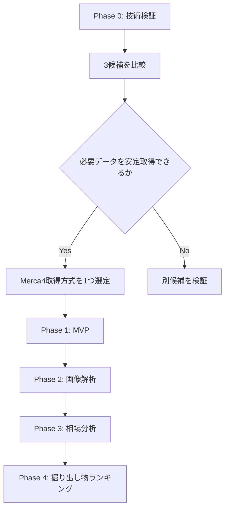
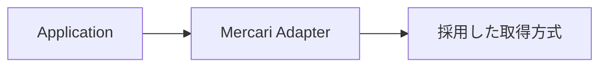
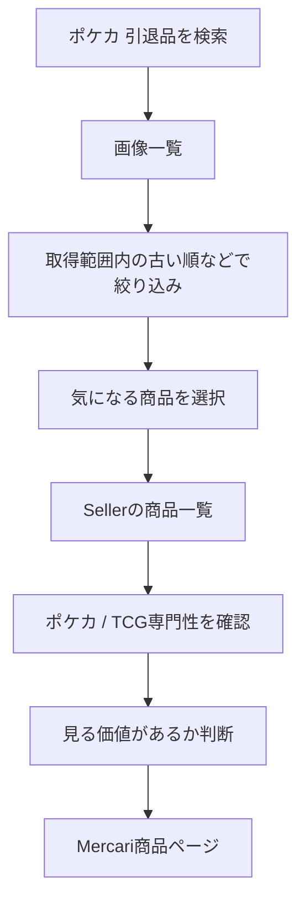

# Card Digger — TODO

> 掘り出し物を効率よく探索するためのMercari検索・出品者分析アプリ。
>
> 最初の目標だったMercari取得方式の選定はPhase 0-Eで完了した。現在は、選定した
> **`kynacio/mercapi`方式のAuction情報を追加検証し、Mercari Adapterとして安全に分離すること**が
> 次の目標。

---

## 方針

開発は次の順番で進める。



---

# Phase 0 — Mercari取得方式の技術検証

## 0-1. 開発環境

- [x] GitHubリポジトリを作成する
- [x] READMEを作成する
- [x] `docs/` を作成する
- [x] `docs/product/concept.md`を配置する
- [x] `docs/planning/todo.md`を配置する
- [x] PoC用ディレクトリを作成する
- [x] `.gitignore` を設定する
- [x] 必須環境変数がないことを確認する（必要になった時点で `.env.example` を作成する）

### PoC構成案

```text
card-digger/
├── README.md
├── docs/
│   ├── concept.md
│   └── todo.md
│
├── poc/
│   ├── common/
│   ├── mercari/
│   ├── mercapi/
│   └── playwright/
│
└── src/
```

---

## 0-2. 共通の検証条件を決める

3方式を同じ条件で比較できるよう、[共通検証プロトコル](../phase-0/poc-validation.md)と
機械可読な[`poc/common/conditions.json`](../../poc/common/conditions.json)に固定した。

> この節のチェックは「検証条件の定義が完了した」ことを表す。実測の完了はPhase 0-A〜0-Cで記録する。

### 検索条件

```text
keyword: ポケカ 引退品
status: 販売中
sort: 出品日時の古い順（非対応の場合はその事実を記録）
category: 指定なし
price: 指定なし
```

- [x] 検索条件を固定する
- [x] 100件以上を最低取得目標にする
- [x] 出品から365日以上を「十分古い」の暫定基準にする
- [x] 5回の独立試行で安定性を測定する
- [x] 同時実行数1、リクエスト間隔2秒以上にする

### 各方式で取得したいデータ

- [x] 商品ID
- [x] 商品タイトル
- [x] 価格
- [x] 商品URL
- [x] 商品画像URL
- [x] 商品画像本体
- [x] 出品日時
- [x] 販売状態
- [x] 商品コンディション
- [x] いいね数
- [x] Seller ID
- [x] 出品者名
- [x] Sellerの商品一覧（販売中 / 売却済み）

### 検証する性能・安定性

- [x] 検索成功率
- [x] 取得件数・重複件数
- [x] ページング
- [x] 古い出品まで遡れるか
- [x] 各データ項目の取得率
- [x] 画像本体のHTTP取得・デコード成功率
- [x] Sellerの商品一覧取得率とページング
- [x] 401 / 403 / 429の有無
- [x] Rate Limit（負荷試験ではなく通常取得中の観測）
- [x] 実行速度
- [x] 実装の複雑さ
- [x] Mercari仕様変更への耐性
- [x] 共通の結果記録テンプレートを作成する

---

# Phase 0-A — `marvinody/mercari`

GitHub:

<https://github.com/marvinody/mercari>

## 目的

`created_time + ASC` が現在も利用できるかを最短で検証する。

## TODO

- [x] Python環境を作成する
- [x] `mercari` をインストールする
- [x] キーワード検索を実行する
- [x] 販売中商品のみ取得できるか確認する
- [x] 商品タイトルを取得する
- [x] 価格を取得する
- [x] 商品URLを取得する
- [x] 画像URLを取得する
- [x] 画像URLから画像本体をHTTP取得・デコードする
- [x] `created` を取得する
- [x] 商品コンディションを取得する（公開詳細モデルの解析失敗により取得率0%）
- [x] いいね数を取得する（公開詳細モデルの解析失敗により取得率0%）
- [x] `SORT_CREATED_TIME` を指定する
- [x] `ORDER_ASC` を指定する
- [x] 本当に古い順になるか確認する（古い順にならない）
- [x] 2ページ目以降を取得できるか確認する
- [x] 十分古い販売中商品まで遡れるか確認する
- [x] Seller IDを取得可能か確認する（検索結果になく、公開詳細モデルも解析失敗）
- [x] Seller Profileを取得できるか確認する（非対応）
- [x] Sellerの販売中商品一覧を取得できるか確認する（非対応）
- [x] Sellerの売却済み商品一覧を取得できるか確認する（非対応）
- [x] 401 Unauthorizedが発生するか確認する（0件）
- [x] [検証結果をMarkdownに記録する](../../poc/mercari/result.md)

## 判定

### 採用候補になる条件

- [x] 現在も安定して検索できる
- [x] 古い商品までページングできる
- [ ] 必要な商品情報を取得できる
- [ ] Seller分析に必要な情報へ辿れる

**判定: 早期撤退。** `created_time ASC`が機能せず、商品詳細モデルが現行レスポンスを
解析できない。Seller Profile・Seller商品一覧も未実装のため、Phase 0-Bを優先する。

### 早期撤退条件

以下の場合は深追いしない。

- 401 / 403が継続的に発生する
- 古い商品まで取得できない
- Seller情報を取得できない
- 現行Mercari仕様への追従が困難

---

# Phase 0-B — `kynacio/mercapi`

GitHub:

<https://github.com/kynacio/mercapi>

## 目的

本採用の第一候補として、

- 商品検索
- 商品詳細
- Seller Profile
- Sellerの商品一覧

をまとめて扱えるか確認する。

## TODO

### 商品検索

- [x] Python環境を作成する
- [x] `mercapi` をインストールする（`0.4.2` / commit `20ba68f`に固定）
- [x] キーワード検索を実行する
- [x] 商品IDを取得する
- [x] 商品タイトルを取得する
- [x] 価格を取得する
- [x] 商品URLを生成または取得する
- [x] 商品画像URLを取得する
- [x] 画像URLから画像本体をHTTP取得・デコードする
- [x] 出品日時を取得できるか確認する
- [x] 販売状態を取得する
- [x] 商品コンディションを取得する
- [x] いいね数を取得する
- [x] ページング方法を確認する
- [x] 100件以上取得できるか確認する（825ユニーク件）
- [x] 古い販売中商品まで遡れるか確認する（7ページ目で365日超。ただし古い順ではない）

### Seller

- [x] 商品からSeller IDを取得する
- [x] Seller Profileを取得する
- [x] 出品者名を取得する
- [x] 評価を取得する
- [x] 評価件数を取得する
- [x] Sellerの商品一覧を取得する（10 / 10成功、公開メソッドは全状態合計30件）
- [x] 販売中商品の一覧を取得する（206件。20件到達は7 / 10人）
- [x] 売却済み商品の一覧を取得できるか確認する（43件。20件到達は0 / 10人）
- [x] Sellerの商品画像URLを取得する
- [x] Sellerの商品URLを取得する
- [x] Seller商品の出品日時を取得できるか確認する

### Seller商品一覧の30件上限・ページング追加検証

- [x] 31件以上の商品が存在するSellerを検証対象として選定する
- [x] Sellerページの初回表示時に発生する商品一覧API通信を記録する
- [x] スクロールまたは追加読み込み時に発生するAPI通信を記録する（画面は「もっと見る」方式）
- [x] 商品一覧APIのEndpoint、HTTP Method、`limit`、販売状態指定を確認する
- [x] `cursor`、`offset`、`pageToken`など、続きを取得するRequest Parameterを確認する（`max_pager_id`）
- [x] Responseに含まれる次ページ情報と終端判定情報を確認する（`meta.has_next`）
- [x] Playwrightで31件目以降の商品を取得し、商品IDの重複と販売状態を確認する（5ページ、150ユニーク件、重複0件）
- [x] 販売中商品と売却済み商品をそれぞれページングできるか確認する（各2ページ、60ユニーク件）
- [x] `mercapi`の30件上限がMercari API自体の制限か、ライブラリの実装不足かを判定する（公開メソッドの実装不足）
- [x] 確認したRequest / Responseの概要、取得件数、失敗内容、未確定事項を検証結果に記録する

### 安定性

- [x] 401 / 403の有無を確認する（各0件）
- [x] Rate Limitを確認する（通常取得中の429は0件）
- [x] 連続取得時の挙動を確認する（正式測定72リクエストすべてHTTP 200）
- [x] APIレスポンス変更時の影響範囲を確認する
- [x] [検証結果をMarkdownに記録する](../../poc/mercapi/result.md)

**判定: 条件付き。** 必要フィールド、詳細、画像、Seller Profile・商品一覧の取得は安定して
成功した。一方、`created_time ASC`は古い順にならない。Seller商品一覧はEndpointレベルでは
`max_pager_id`でページングでき、状態別にも各60件を取得できたが、固定版`mercapi`の公開メソッドには
未実装である。Wrapper拡張が必要なため、Phase 0-Cと比較するまで本採用は決定しない。

---

# Phase 0-C — Playwright方式

参考実装:

<https://github.com/neotruong/emthao-jp-search>

## 目的

非公式API Wrapperが安定しない場合の代替方式を検証する。

> **Phase 0-Bからの意思決定引き継ぎ:** 固定版`mercapi`の公開メソッドはSeller商品を最初の30件しか
> 取得できず、そのままではSeller Knowledgeの要件を満たさない。Endpoint拡張は可能だが保守コストを
> 伴うため、Playwright方式のSellerページング・安定性・実装量を測定するまで採用方式を決定しない。

```text
Playwright
    ↓
Mercari Web
    ↓
Browserが検索APIを呼ぶ
    ↓
JSON Responseを取得
```

## TODO

- [x] TypeScriptプロジェクトを作成する
- [x] Playwrightを導入する（`1.55.1`に固定、`npm audit` 0件）
- [x] Mercari検索ページを開く
- [x] 検索通信を確認する
- [x] `/v2/entities:search` の通信を確認する
- [x] JSONレスポンスを取得する
- [x] 商品IDを取得する
- [x] 商品タイトルを取得する
- [x] 価格を取得する
- [x] 画像URLを取得する
- [x] 画像URLから画像本体をHTTP取得・デコードする（20 / 20成功）
- [x] 商品URLを取得する
- [x] 出品日時を取得できるか確認する
- [x] 販売状態を取得する
- [x] 商品コンディションを取得する（20 / 20成功）
- [x] いいね数を取得する（20 / 20成功）
- [x] Seller IDを取得する
- [x] ページングを再現する（`page_token`→POST `pageToken`を確認）
- [x] 古い商品まで遡れるか確認する（最初の100件に365日超2件。ただし古い順ではない）
- [x] Sellerページを取得する
- [x] Sellerの商品一覧を取得する（10 / 10成功）
- [x] 売却済み商品取得の可否を確認する（10 / 10の一括Responseから分類）
- [x] Seller商品を31件以上取得し、ページごとの件数・重複・Cursorを記録する（9 / 10人。残り1人は11件で終端）
- [x] 販売中・売却済みを分け、各状態の停止条件までページングする（Response後に分類。販売中1 / 10人は一括Filter制約で独立停止条件未達）
- [x] Seller商品一覧の終端を判定できるか確認する（3人で`meta.has_next=false`、全員で2ページ目取得または終端）
- [x] Phase 0-Bで確認した`max_pager_id` / `meta.has_next`とBrowser通信を比較する（20 / 20 Cursor一致）
- [x] `mercapi`拡張案とPlaywright方式の実装量・保守範囲・安定性を比較する
- [x] Browser起動コストを測定する（中央値64.37ms）
- [x] Headlessで動作するか確認する（5 / 5成功）
- [x] エラー時の再試行方法を確認する（正式0回、補足CLIとUnit Testを実装）
- [x] [検証結果をMarkdownに記録する](../../poc/playwright/result.md)

---

# Phase 0-D — 3方式を比較する

技術検証完了後、以下の表を埋める。

| 評価項目 | `mercari` | `mercapi` | Playwright |
|---|---:|---:|---:|
| 商品検索 | 5 / 5成功 | 5 / 5成功 | 5 / 5成功 |
| 出品日時 | 100 / 100 | 100 / 100 | 100 / 100 |
| 販売状態 | 100 / 100 | 100 / 100 | 100 / 100 |
| 古い商品へのページング | 5ページ・589件で365日超へ到達。ただし古い順は失敗 | 7ページ・825件で365日超へ到達。ただし古い順は失敗 | 1ページ目・120件で365日超へ到達、補足2ページ合計238件。ただし古い順は失敗 |
| 画像URL | 100 / 100 | 100 / 100 | 100 / 100 |
| 画像本体のHTTP取得・デコード | 20 / 20 | 20 / 20 | 20 / 20 |
| 商品コンディション | 0 / 20（詳細解析失敗） | 20 / 20 | 20 / 20 |
| いいね数 | 0 / 20（詳細解析失敗） | 20 / 20 | 20 / 20 |
| Seller ID | 0 / 100 | 100 / 100 | 100 / 100 |
| Seller Profile | 非対応 | 10 / 10 | 10 / 10 |
| Sellerの販売中商品一覧 | 非対応 | 公開応答10 / 10。追加検証で状態別2ページ・60件。Wrapper拡張が必要 | 一括応答10 / 10、334件。1人は状態別独立停止条件未達 |
| Sellerの売却済み商品一覧 | 非対応 | 公開応答10 / 10。追加検証で状態別2ページ・60件。Wrapper拡張が必要 | 一括応答10 / 10、455件。全員で停止条件到達 |
| 実装難易度 | 高 | 中 | 高 |
| 実行速度 | 検索中央値197.07ms、全体101.6秒 | 検索中央値260.85ms、全体144.4秒 | 検索中央値2,279.17ms、全体164.7秒 |
| 安定性 | 検索100%、詳細0% | 検索・詳細・Profile・一覧・画像100% | 主要取得100%。背景Endpointで403 / 400 / 404あり |
| 保守性 | 低め | 中。Wrapperへ影響を閉じ込められるが非公開API依存 | 低〜中。Browser / DOM / 通信Intercept / 非公開API依存 |
| 総合評価 | 早期撤退 | 条件付き。本採用の第一候補 | 条件付き。Fallback / 診断用 |

---

# Phase 0-E — Mercari取得方式を1つ選定する

**完了: 2026-08-30。** 詳細は[選定結果](../phase-0/phase-0-e-selection.md)に記録した。

## 原則

MVPでは3方式を併用しない。

```text
3候補を技術検証
      ↓
1方式を選定
      ↓
Mercari Adapterとして実装
```

## 選定基準

優先順位は以下。

1. 必要データを取得できる
2. 古い販売中商品まで遡れる
3. Sellerの商品一覧を取得できる
4. 画像URLを取得できる
5. 安定して動作する
6. 実装・保守が簡単
7. 性能が実用範囲内

## 選定結果

- [x] 本採用を、検証済みコミットを基準にした管理下の`kynacio/mercapi` Forkへ決定する
- [x] Seller商品の状態別Filterと`max_pager_id`ページングをForkの公開APIへ追加する
- [x] Playwrightは仕様調査・障害診断用PoCに限定し、MVPの実行経路には含めない
- [x] `marvinody/mercari`は不採用とする
- [x] 全方式で未達だったServer側の古い順を、採用方式の制約として記録する
- [x] Phase 0-F、Phase 1、公開前に必要な追加検証を定義する

**選定: `kynacio/mercapi`方式。** 検索、商品詳細、画像、Seller Profileを安定して取得でき、
Seller商品一覧もEndpointレベルでは状態別にページングできた。固定版の公開`items()`はそのまま
使わず、管理下のForkで`status`、`max_pager_id`、`pager_id`、`meta.has_next`を公開する。

Playwrightは必要データを取得できるが、Web画面の3状態一括取得、Browser / DOM / 通信Interceptの
保守範囲、検索速度を理由に本採用しない。Applicationが障害時に自動でPlaywrightへ切り替わる構成も
採らず、安全停止後の診断にだけ利用する。

なお3方式ともServer側の古い順にはならない。MVPの古い順は、取得上限と打ち切り理由を保持したうえで
「取得した範囲内で古い順」として提供し、Mercari全体の最古順とは扱わない。

---

# Phase 0-F — Mercari Adapterを定義する

採用方式が決まった後、アプリ側から直接ライブラリを呼ばない。

実装の正本は[Mercari Adapter実装仕様](../phase-0/phase-0-f-adapter-spec.md)、Product側の正本は
[MVP実装仕様](../product/mvp-spec.md)とする。



## 0-F-0. 仕様確定

- [x] Python Adapter + 管理下の`mercapi` Forkという境界を決定する
- [x] Fork、Adapter、Applicationの責務を分離する
- [x] [Forkの作成・更新・依存固定・切戻し手順を文書化する](../development/mercapi-fork-operations.md)
- [x] Domain型と`MarketplacePort`のContractを決定する
- [x] 検索を最大10ページ・1,000件・30秒に制限する
- [x] Seller商品を状態ごとに最大5ページ・100件・30秒に制限する
- [x] `trading`を独立状態として保持し、MVPでは専用収集しないと決定する
- [x] 掲載開始日・終了日を取得範囲内のFrontend FilterとしてMVPへ追加する
- [x] 販売形式を`fixed_price` / `auction` / `unknown`で保持する方針を決定する
- [x] Auction対応を追加PoCの合格後に有効化するGateを定義する
- [x] Error分類、1回だけの限定再試行、3回連続時の安全停止を決定する
- [x] Phase 1のMVP範囲、Seller Knowledge、完了条件を決定する
- [x] [Test運用規約とFixtureの匿名化規則を確定する](../development/test-policy.md)
- [x] 時計・待機・Fork Clientを注入可能にする設計制約を確定する

## 0-F-1. Auction情報を追加検証する

検証条件と合格基準は
[Auction情報の追加検証計画](../phase-0/phase-0-f-auction-validation.md)を正本とする。

> **この実行で取る構造サンプルが、後続のFixtureを作る唯一の根拠になる。**
> Phase 0-A〜0-Cの`artifacts/`は残っておらず、`result.md`にField名はあるが型・`null`・欠落・
> Object全体の形は残っていない。ここで取り損ねると、0-F-3以降で追加のライブ実行が必要になる。
> Fixtureを観測なしで作らない（[Test運用規約 §5.1](../development/test-policy.md#51-定義)）。

- [x] 通常出品とAuctionを各10件以上取得する
- [x] 検索結果、商品詳細、商品ページの販売形式を照合する
- [x] `price`、開始価格、最高入札額、現在価格の対応を確認する
- [x] 入札件数、終了予定時刻、Timezone、欠落条件を確認する
- [x] 検索とSeller商品一覧で同じ販売形式判定を適用できるか確認する
- [x] `with_auction`がSeller商品の件数・状態・Cursorへ与える影響を確認する
- [x] 未知形状を`fixed_price`へ誤変換せず`unknown`にできるか確認する
- [x] `poc/mercapi/auction-result.md`へ実測結果を記録する
- [x] 検索結果の構造サンプルを出力する（通常出品103件・Auction 16件。未知形状は0件で未観測）
- [x] 商品詳細の構造サンプルを出力する（通常出品・Auction）
- [x] Seller商品一覧の構造サンプルを出力する（`data[]`・`pager_id`・`meta.has_next`）
- [x] Seller Profileの構造サンプルを出力する
- [x] 構造サンプルがマスク済みで、生Responseを含まないことを確認する
- [x] 合否と採用MappingをMVP仕様・Adapter仕様へ反映する

**判定: 合格。** 販売形式の判定は商品ページを正として20 / 20一致し、Auction価格
（`highest_bid`）も商品ページの現在価格と10 / 10一致した。API Request 30件はすべてHTTP 200で、
401 / 403 / 429は0件だった。詳細は[検証結果](../../poc/mercapi/auction-result.md)。

制約として次の2点が判明したため、Forkの追加範囲へ反映した。

- Seller商品一覧は`with_auction=true`を送らないと`auction_info`を返さない
- 検索・商品詳細・Seller商品一覧でAuction Fieldの形が3種類異なる

## 0-F-2. 管理下Forkを準備する

手順の正本は[mercapi Fork運用手順 §3](../development/mercapi-fork-operations.md#3-初回forkの作成)とする。
**`gh` CLIで実施する。**

> `gh auth login`だけは実行者自身が行う。認証以外はCommandで進められる。
> Clone先はCard Diggerと同じ親Directoryとし、Card Digger配下へ置かない。

- [x] `gh auth status`で認証とScopeを確認する
- [x] `kynacio/mercapi`のライセンスとFork・再配布条件を確認する
- [x] `gh repo fork kynacio/mercapi`で`mgmaru/mercapi`を作成する
- [x] Card Diggerと同じ親Directoryへ`gh repo clone`する
- [x] Fork元を`upstream` Remoteとして登録する
- [x] `feat/seller-items-pagination` Branchを作成する
- [x] 検証済みcommit `20ba68fd42677997c4c91b4e4eb17c1e7e387efa`を変更基点にする
- [x] `git log -1`が変更基点SHAと一致することを確認する
- [x] LICENSEと著作権表示が維持されていることを確認する

**完了: 2026-08-31。** `mgmaru/mercapi`を作成し、`/Users/hiroaki/Developer/mercapi`へCloneした。

| 項目 | 実測 |
|---|---|
| upstream License | **MIT**（Copyright (c) 2022 Take-kun）。Fork・改変・再配布・商用利用が可能 |
| Fork | `mgmaru/mercapi`（public、`parent=kynacio/mercapi`、LICENSE維持） |
| Remote | `origin`=Fork、`upstream`=本家。upstreamのpush URLは無効化済み |
| Branch | `feat/seller-items-pagination` |
| 基点SHA | `20ba68fd42677997c4c91b4e4eb17c1e7e387efa`（upstream `main`の先頭と一致） |

`gh repo clone`がForkに対して`upstream`を自動登録するため、`git remote add`は不要だった。

## 0-F-2b. upstream既存Testの失敗を修正する

Fork直後の基準線が **22 passed / 5 failed** だった。壊れたまま依存し続けないため、
Sellerページングへ着手する前に修正する。

> **`feat/seller-items-pagination`へ混ぜない。** `fix/item-cassette-include-auction`を
> `main`から分けて作業し、修正だけを独立してレビュー・切戻しできる状態にする。

### 原因

| 項目 | 内容 |
|---|---|
| 失敗Test | `test_item` / `test_item_with_comments` / `test_item_not_found` / `test_items_fetch_full_item_from_seller_item` / `test_search_fetch_full_item_from_result` |
| 共通点 | すべて`Mercapi.item()`を経由する |
| 原因 | 固定commit`20ba68f`が`items/get`へ`include_auction=true`を追加したが、cassetteのURIは`?id=...`のまま。VCRのquery matcherが不一致になる |

### 採用する修正方法

**cassetteのRequest URIだけを更新する。Response Bodyは触らない。**

| 案 | 判断 |
|---|---|
| **URIへ`include_auction=true`を追加** | **採用** |
| VCRのmatcherを緩める | 不採用。全Testの検証力が落ちる |
| 実通信で再録画 | 不採用。`dpop`と実IDが公開Repositoryへ入る |
| 修正しない | 不採用。`get_item`はAdapterが使う経路であり、赤の常態化を招く |

Response Bodyを変えずに妥当と判断できる根拠は次のとおり。

| 根拠 | 実測 |
|---|---|
| [0-F-1の実測](../../poc/mercapi/auction-result.md) | 通常出品の商品詳細は`auction_info`がキーごと欠落（10 / 10） |
| 対象5 cassette | `auction_info`の出現が**0件**。すべて通常出品 |

したがって`include_auction=true`で取得しても、記録済みBodyはそのまま妥当な応答である。

### TODO

- [x] `main`から`fix/item-cassette-include-auction`を作成する
- [x] 5 cassetteの`uri`へ`include_auction=true`を追加する
- [x] Response Bodyを変更していないことをdiffで確認する
- [x] 全Testが成功することを確認する
- [x] Forkへcommitし、`main`へ反映する
- [x] 修正後の基準線と commit SHA を記録する
- [x] upstreamへの報告（Issue / PR）の要否を判断する（**報告しないと決定**。理由は後述）

### 実施結果（2026-08-31）

| 項目 | 内容 |
|---|---|
| Branch | `fix/item-cassette-include-auction`（`main`から作成） |
| 変更 | 5ファイル各1行。`uri:`へ`include_auction=true`を追加 |
| Response Body | **無変更**（`git diff --numstat`で各1挿入1削除、uri行以外の変更0行） |
| Test | **22 passed / 5 failed → 27 passed / 0 failed** |
| fix commit | `7fd4c50f0c006438c9b4919276561f3fa5aa8fc0` |
| `main`反映 | `717d25b8b235ca297e0c40f8f36636ef5508b620`（`--no-ff` merge） |
| Push | `origin`の`fix/item-cassette-include-auction`と`main`へ反映済み |

`main`で再実行しても27 passedを確認した。**0-F-3の新しい基準線は「27 passed / 0 failed」**とする。

### upstreamへ報告しない判断（2026-08-31）

**`kynacio/mercapi`へIssue・Pull Requestを出さない。**

| 根拠 | 実測・内容 |
|---|---|
| Issueが使えない | upstreamは**Issueを無効化**している。外部からの報告窓口が閉じられており、意図的な意思表示と読める |
| upstreamが停滞 | 最終push `2026-02-10`（判断時点で約6.5ヶ月前）。Star 0の個人プロジェクト |
| ライセンス上の義務は充足 | MITの義務は著作権表示とLICENSE本文の維持だけで、貢献の還元は義務ではない。Forkでは両方を維持している |
| 実害がない | `mgmaru/mercapi`は修正済みで、Card Diggerはそこを参照する |
| 衝突リスクが軽微 | 将来upstreamが同じ箇所を別方法で直した場合でも、衝突は**5行**にとどまる |

Forkして自分用に修正すること自体はOSSの慣習上まったく問題なく、還元は礼儀であって義務ではない。
慣習的に問題視されるのは、改変版をオリジナルとして再配布する場合や帰属表示を削る場合であり、
本Forkはどちらにも該当しない。

#### 再検討する契機

- upstreamが再び活発に更新されはじめたとき
- 同じ箇所でupstream取込時に衝突が発生したとき
- Sellerページングなど、本体に還元する価値の高い変更を出す判断をしたとき

Sellerページングを還元する場合も、関心事が異なるためcassette修正とは**別のPull Request**にする。

Card Diggerの依存SHAはまだ変更しない。Forkの更新とCard Diggerへの採用は
[別の判断](../development/mercapi-fork-operations.md#22-forkからcard-digger)として扱う。

## 0-F-3. ForkへSellerページングを実装する

> Fixtureは[0-F-1で観測した構造サンプル](../development/mercapi-fork-operations.md#35-fixtureの起点を引き継ぐ)
> から起こす。ForkのためにMercariへ改めてアクセスしない。構造サンプルはGit管理外のため、
> ForkのFixtureを作り終えるまで`poc/mercapi/artifacts/`を削除しない。
>
> **upstreamのTestは`vcrpy`で実通信をcassetteへ記録する方式で、`dpop` JWT・実商品ID・実Titleを
> そのまま含む。**[Test運用規約 §5](../development/test-policy.md#5-fixture規約)と衝突するため、
> 新しいcassetteを実通信から記録せず、通信の差し替えは**`httpx.MockTransport`**を使う。
> 既存cassetteは削除も改変もしない。詳細は
> [Test運用規約 §4.4](../development/test-policy.md#44-forkのtestに関する例外)。

- [x] Forkの開発環境を構築し、既存Testの基準線を記録する
- [ ] 追加Testが基準線を悪化させないことを確認する
- [x] `SellerItemsPage`に`items`、`has_next`、`next_max_pager_id`を定義する
- [x] Public APIで`status`、`limit`、`max_pager_id`、`with_auction`を指定可能にする
- [x] Seller商品Modelへ`pager_id`を追加する
- [x] Seller商品Modelへ`auction_info`を追加する
- [x] Responseの`meta.has_next`を保持する
- [x] `has_next=true`時だけ末尾`pager_id`を次Cursorとして返す
- [x] 空Response、Cursor欠落、未知Statusを検証する
- [x] 既存`items(profile_id)`の後方互換を維持する
- [x] 構造サンプルからJSON Fixtureを起こす（`observed` / `derived`の区分を記録する）
- [x] `httpx.MockTransport`でForkのUnit Testを追加する
- [x] 既存Testの結果が基準線から悪化しないことを確認する
- [ ] ForkのTest済みcommit SHAへCard Diggerの依存を固定する（**0-F-4でApplication Package作成時に実施**）

### 実施結果（2026-08-31）

| 項目 | 内容 |
|---|---|
| Branch | `feat/seller-items-pagination`（`main`=`717d25b`から作成） |
| feature commit | `74df1d3` |
| `main`反映 | **`d9dced921989d29e939451fc044b45e756251b06`**（`--no-ff` merge） |
| Test | **27 passed → 51 passed / 0 failed**（追加24件） |
| 差分 | 14ファイル、663挿入 / 6削除。削除はimport行の置換のみ |
| Fixture | `tests/fixtures/seller_items/` に7件。`observed` 2 / `derived` 5 / `assumed` **0** |
| cassette | 新規記録・既存改変ともに**なし** |

#### 追加したPublic API

```python
async def items_page(profile_id, statuses, *, limit=30, max_pager_id=None, with_auction=False)
    -> SellerItemsPage | None
```

`SellerItemsPage(items, has_next, next_max_pager_id)`、`SellerItem.pager_id`、
`SellerItem.auction_info`（`SellerItemAuctionInfo`）を追加した。`items()`は無変更。

#### 仕様から変更した点

| 項目 | 仕様の記載 | 実装 | 理由 |
|---|---|---|---|
| Cursorの型 | `str \| None` | **`int \| None`** | 実測で`pager_id`は10桁の整数。Domainの`str`変換はAdapterが行う |
| 戻り値 | `SellerItemsPage` | `SellerItemsPage \| None` | HTTP 404のSellerでは`None`を返す既存`items()`の流儀へ合わせた |
| `exclude_archived_item` | 記載なし | **送らない** | Public APIのParameterに含めない。件数差はライブ受入検証で検出する |

いずれも[Adapter仕様 §5](../phase-0/phase-0-f-adapter-spec.md#5-forkへ追加するpublic-api)へ反映済み。

#### 判断が必要な残件（0-F-4で扱う）

`auction_info`が「空Object」と「未知キーだけのObject」は、どちらもモデル上は全Field `None`の
インスタンスになる。Adapterは**この状態を`FIXED_PRICE`ではなく`UNKNOWN`へ寄せる**こと。
実測では空Objectを0件しか観測しておらず、安全側に倒す。

#### black

追加・変更したファイルは`black 22.6.0`準拠。`mercapi/mapping/definitions.py`は
**変更前から未整形**のため整形しない（差分が428行に膨らみ、レビュー不能になるため）。

### 既存Testの基準線（2026-08-31）

```bash
uv venv --python 3.11 .venv
uv pip install --python .venv/bin/python -e . \
  "vcrpy>=4.2,<5" "pytest>=7.1.2,<8" "pytest-asyncio>=0.19,<0.20" "pytest-recording>=0.12.1,<0.13"
.venv/bin/python -m pytest tests --record-mode=none -q
```

| 時点 | commit | 結果 |
|---|---|---|
| Fork直後 | `20ba68f` | 22 passed / 5 failed |
| [0-F-2b](#0-f-2b-upstream既存testの失敗を修正する)適用後 | `717d25b` | 27 passed / 0 failed |
| **Sellerページング追加後** | **`d9dced9`** | **51 passed / 0 failed** |

基準線27件は維持したまま24件を追加した。**悪化なし。**

`--record-mode=none`を必ず付ける。付け忘れるとcassetteが無いRequestで実通信が発生し得る。

## 0-F-4. DomainとAdapterを実装する

> 依存管理Toolは**`uv`**で確定（2026-08-31）。`pyproject.toml`と`uv.lock`の両方をコミットし、
> Forkは完全な40文字commit SHA **`d9dced921989d29e939451fc044b45e756251b06`** で固定する。
> 着手前に[Test運用規約 §7](../development/test-policy.md#7-テスト可能性のための設計制約)の
> 設計制約（時計・待機・Fork Clientの注入）を満たす構成にする。

- [ ] `uv`でPython 3.11以上のApplication Packageを`src/backend`へ作成する
- [ ] Forkの完全なcommit SHAを`pyproject.toml`へ記載し`uv.lock`を生成する
- [ ] `ListingStatus`、`SaleFormat`、`ItemCondition`、`MarketplaceItem`、`Seller`を定義する
- [ ] `PageInfo`、`SearchPage`、`SellerItemsPage`を定義する
- [ ] `MarketplacePort`を定義する
- [ ] Mercari Adapterの検索・詳細・Profile・Seller商品Pageを実装する
- [ ] URL、価格、日時、状態、販売形式を正規化する
- [ ] Auctionの価格を`highest_bid`（取得時点の現在価格）へ正規化する
- [ ] 検索・商品詳細・Seller商品一覧の3形状を同じ`SaleFormat`へ正規化する
- [ ] naive `datetime`をUTCとして解釈し直す
- [ ] 未知の販売形式を`SaleFormat.UNKNOWN`として保持する
- [ ] 必須Field欠落とCursor不整合をParse Errorにする
- [ ] 共通Error Codeと限定再試行を実装する
- [ ] 検索・Seller商品の収集Policy、重複排除、停止理由を実装する
- [ ] Mock Adapterを用意する
- [ ] 時計・待機・Fork Clientを注入で受け取る
- [ ] Domain / Application層へFork固有型を漏らさない
- [ ] ForkのPrivate Memberを参照しない

## 0-F-5. Test・ライブ受入検証

実施方法・Fixture規約・実行時期は[Test運用規約](../development/test-policy.md)を正本とする。
L1〜L3は自動Test Suite、L4は手動・低頻度で実行する。

> Contract Testはこの節で初めて書くのではなく、
> [0-F-4](#0-f-4-domainとadapterを実装する)で`MarketplacePort`を定義した直後に書き始める
> （[Test運用規約 §8](../development/test-policy.md#8-contract-testの適用方法)）。

- [ ] 0-F-1の構造サンプルからFixtureを起こす（観測なしで作らない）
- [ ] 実サービスで再現できない異常系Fixtureを、正常Fixtureから派生させて用意する
- [ ] Forkの正常系・終端・空Response・Cursor欠落Fixture Testを通す（L1）
- [ ] Adapterの正規化、Error、再試行、安全停止、収集上限をUnit Testする
- [ ] `MarketplacePort`のContract TestをMercari / Mock Adapterの両方へ適用する
- [ ] 検索を5回実行し、成功率と必須Field取得率を確認する
- [ ] 通常出品・Auction・未知形状の販売形式と価格LabelをFixture Testする
- [ ] 最大10 Sellerの`on_sale` / `sold_out`で、2ページ目取得または1ページ終端を確認する
- [ ] Fixtureが[匿名化規則](../development/test-policy.md#5-fixture規約)を満たすことを確認する
- [ ] `tests/fixtures/README.md`へFixtureの出所と検証観点を記録する
- [ ] ライブ受入検証（L4）結果をMarkdownへ記録する
- [ ] [Adapter仕様のPhase 0-F完了条件](../phase-0/phase-0-f-adapter-spec.md#11-phase-0-f完了条件)をすべて満たす

---

# Phase 1 — Search MVP

## 目的

商品画像とSeller情報を一つの画面で確認し、人間の探索時間を減らす。

機能、画面挙動、API、Seller Knowledge、対象外、完了条件は
[MVP実装仕様](../product/mvp-spec.md)を正本とする。

## 1-0. Application基盤

- [ ] BackendをPython + FastAPIで作成する
- [ ] FrontendをTypeScript + React + Viteで作成する
- [ ] FrontendがForkやMercari Endpointを直接参照しない構成にする
- [ ] `POST /api/search`を実装する
- [ ] `GET /api/sellers/{sellerId}/analysis`を実装する
- [ ] Mercariへ接続しない`GET /api/health`を実装する
- [ ] DatabaseとUser認証を導入しない

---

## 1-1. 検索UI

- [ ] キーワード入力
- [ ] 検索ボタン
- [ ] Loading表示
- [ ] エラー表示
- [ ] 検索結果件数
- [ ] 販売中固定であることを表示し、状態切替Controlを設けない
- [ ] 最低価格
- [ ] 最高価格
- [ ] 掲載開始日
- [ ] 掲載終了日
- [ ] 掲載開始日だけ・終了日だけ・期間指定のFilter
- [ ] `すべて`・`通常出品`・`オークション`の販売形式Filter
- [ ] 取得範囲内の古い順
- [ ] 新しい順
- [ ] 価格の安い順
- [ ] 価格の高い順
- [ ] 取得ページ数・件数・最古・最新日時・取得時刻・打ち切り理由の表示
- [ ] 掲載日FilterがMercari全体を網羅しないことの表示

---

## 1-2. 商品画像一覧

一覧はテキストではなく、画像中心のGrid UIにする。

```text
┌───────────────┐
│               │
│   商品画像    │
│               │
├───────────────┤
│ ポケカ引退品  │
│ ¥12,000       │
│ 632日前       │
│               │
│ [商品を見る]  │
│ [Seller]      │
└───────────────┘
```

### TODO

- [ ] 商品画像表示
- [ ] タイトル表示
- [ ] 販売形式Badge表示
- [ ] 通常価格・Auction現在価格（取得時点）・形式不明のLabel表示
- [ ] 出品日時表示
- [ ] 経過日数表示
- [ ] 元Mercariページへのリンク
- [ ] Seller分析画面へのリンク
- [ ] 画像取得失敗時のPlaceholder
- [ ] Responsive Grid

---

## 1-3. Seller画面

### TODO

- [ ] Seller名表示
- [ ] 評価表示
- [ ] 評価件数表示
- [ ] Profileの累計販売件数表示
- [ ] SellerのMercariページへのリンク
- [ ] 販売中商品を最大100件表示
- [ ] 売却済み商品を最大100件表示
- [ ] 状態ごとの取得件数・ページ数・打ち切り理由を表示
- [ ] Seller分析のLoading・0件・部分成功・Errorを表示
- [ ] 商品画像表示
- [ ] 商品タイトル表示
- [ ] 商品価格表示
- [ ] 商品ページリンク

---

# Phase 1-4 — Seller Knowledge Indicator

## 目的

出品者がポケカ相場を理解している可能性を、人間が判断しやすくする。

## MVPで使う簡易特徴量

- [ ] 分析対象商品数
- [ ] ポケカ関連商品数
- [ ] TCG関連商品数
- [ ] ポケカ出品率
- [ ] TCG出品率
- [ ] 専門用語を含む商品数・比率
- [ ] 異なる専門用語数
- [ ] 標本信頼度

### 専門用語候補

```text
SAR
SR
UR
AR
PSA
PSA10
旧裏
プロモ
初版
未開封
BOX
シュリンク
鑑定
```

### 表示例

```text
Seller Knowledge
-------------------------

分析対象             142
ポケカ関連            63
TCG関連               91

ポケカ比率          44.4%
TCG比率             64.1%

専門用語あり         35
異なる専門用語        7種類

専門性               高
標本信頼度           高
```

### TODO

- [x] ポケカ判定キーワードを定義する
- [x] TCG判定キーワードを定義する
- [x] 専門用語一覧を定義する
- [x] Titleの正規化方法を定義する
- [x] `低 / 中 / 高`のScoreと標本信頼度を定義する
- [ ] Seller商品を分類する
- [ ] ポケカ比率を計算する
- [ ] TCG比率を計算する
- [ ] 専門用語出現数を計算する
- [ ] `低 / 中 / 高` の簡易判定を実装する
- [ ] `判定不能 / 低 / 中 / 高`の標本信頼度を実装する
- [ ] 取得範囲と打ち切り有無を表示する
- [ ] UIに表示する

> Seller Knowledgeは購入判断ではなく、あくまで探索時の補助指標とする。

---

# MVP後 — 探索補助

次はMVPへ含めない。MVPの利用結果から優先度を決める。

- [ ] お気に入り
- [ ] 確認済みフラグ
- [ ] 商品メモ
- [ ] Sellerメモ
- [ ] 検索条件保存
- [ ] 除外キーワード
- [ ] Seller Knowledgeによるフィルター
- [ ] TCG専門性が低いSellerを優先表示

---

# Phase 1 — MVP完了条件

以下のフローが成立すればMVP完成。



### 完了チェック

- [ ] 商品を検索できる
- [ ] 商品画像を一覧表示できる
- [ ] 取得範囲内で古い順に表示できる
- [ ] 取得範囲内で掲載開始日・終了日・期間を指定できる
- [ ] 通常出品・Auctionを判別して絞り込める
- [ ] Auction価格が取得時点の値であり、確定落札額ではないと確認できる
- [ ] 元商品ページへ移動できる
- [ ] Seller情報を確認できる
- [ ] Sellerの商品一覧を確認できる
- [ ] Seller Knowledgeを確認できる
- [ ] 検索・Seller分析の取得範囲と停止理由を確認できる
- [ ] Mercari全体の最古順・指定期間の全件・Seller全商品だと誤認させる表示がない
- [ ] Auctionを通常出品または確定価格だと誤認させる表示がない
- [ ] 外部取得Errorを0件や成功として隠さない
- [ ] MobileとKeyboardで主要Flowを操作できる
- [ ] Mock Adapterを使うE2E受入Flowが成功する
- [ ] 人間が見る商品を効率的に絞れる

---

# Phase 2 — 画像解析

MVP完成後に着手する。

- [ ] 商品画像を取得する
- [ ] 画像内のカード領域を検出する
- [ ] 複数カードを分割する
- [ ] OCRを検証する
- [ ] カード名候補を推定する
- [ ] カード型番候補を推定する
- [ ] 推定結果のConfidenceを表示する
- [ ] 人間が修正できるUIを作る

---

# Phase 3 — 相場分析

- [ ] カード相場データ取得方法を調査する
- [ ] 相場データProvider Interfaceを作る
- [ ] カードごとの相場を取得する
- [ ] 推定総額を計算する
- [ ] 販売手数料を考慮する
- [ ] 送料を考慮する
- [ ] PSA鑑定コストを考慮する
- [ ] 想定利益を計算する

---

# Phase 4 — Opportunity Score

## 候補特徴量

- [ ] 出品価格
- [ ] 推定カード総額
- [ ] 推定利益額
- [ ] 推定利益率
- [ ] 出品からの日数
- [ ] Seller Knowledge
- [ ] SellerのTCG出品率
- [ ] 高額カード候補数
- [ ] 画像枚数
- [ ] カード枚数
- [ ] 商品説明の具体性
- [ ] 商品タイトルの具体性

## TODO

- [ ] 初期スコアリング式を設計する
- [ ] 0〜100で表示する
- [ ] スコア内訳を表示する
- [ ] スコア順に並べる
- [ ] スコアによる除外を可能にする

---

# Phase 5 — Marketplace拡張

Mercari Adapterと同じInterfaceで追加する。

```text
Marketplace
├── Mercari
├── Yahoo Auctions
├── PayPay Flea Market
└── ...
```

- [ ] Marketplace共通Interfaceを見直す
- [ ] Yahoo Auctions調査
- [ ] PayPay Flea Market調査
- [ ] Marketplace横断検索
- [ ] 重複商品の扱いを検討する

---

# 非機能TODO

## テスト

実施方法は[Test運用規約](../development/test-policy.md)を正本とする。

- [ ] DomainロジックのUnit Test
- [ ] Seller KnowledgeのUnit Test
- [ ] AdapterのIntegration Test
- [ ] 検索画面のE2E Test
- [ ] MockデータでMercari停止時も開発できるようにする

## エラー処理

- [ ] 401
- [ ] 403
- [ ] 429
- [ ] Timeout
- [ ] 商品削除
- [ ] Seller削除
- [ ] 画像取得失敗
- [ ] APIレスポンス変更

## パフォーマンス

- [ ] 画像Lazy Load
- [ ] Seller情報Cache
- [ ] 検索結果Cache
- [ ] ページング
- [ ] 無駄な再取得を防止する

---

# 利用規約・運用上の確認

技術的に取得可能でも、公開サービス化・商用化・大量アクセスが許容されるとは限らない。

- [ ] Mercari利用規約を確認する
- [ ] 公開前に利用方法を再確認する
- [ ] 商用利用前に再確認する
- [ ] アクセス頻度を制御する
- [ ] 大規模クロールを前提にしない
- [ ] 必要以上のデータを保存しない
- [ ] Seller分析は公開情報のみを対象とする

参考:

<https://help.jp.mercari.com/guide/articles/900/>

---

# 最優先TODO

現時点では以下だけに集中する。

```text
[1] GitHub Repository作成（完了）
        ↓
[2] marvinody/mercariで古い順PoC（完了）
        ↓
[3] mercapiで商品 + Seller取得PoC（完了）
        ↓
[4] Playwright PoC（完了）
        ↓
[5] 比較表を完成（完了）
        ↓
[6] Mercari取得方式を1つ選定（完了: mercapi）
        ↓
[7] Mercari Adapter作成（現在）
        ↓
[8] Search MVP開始
```

## 今やらないこと

Phase 0が完了するまでは以下に着手しない。

- AI画像認識
- 相場自動取得
- Opportunity Score
- 複数Marketplace
- 自動購入
- 通知・監視機能

まずは、

> **必要なMercariデータを安定して取得できるか**

を証明する。
