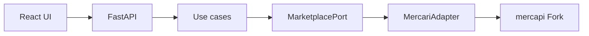

# Card Digger — MVP実装仕様

## 文書ステータス

- 決定日: **2026-08-30**
- ステータス: **Phase 1の実装基準として採用**
- 前提: [Mercari Adapter実装仕様](../phase-0/phase-0-f-adapter-spec.md)
- 対象: Search MVP、Seller画面、Seller Knowledge Indicator

この文書はMVPに含める機能、含めない機能、画面挙動、計算方法、完了条件の正本とする。
実装中に新しい案が出ても、MVPへ自動的に追加しない。追加する場合はこの文書とTODOを先に変更する。

## 1. MVPの目的

ユーザーがMercariの大量出品・引退品候補を検索し、画像で一次選別し、気になる商品のSellerが
TCGに詳しそうかを、取得できた公開商品情報から短時間で確認できるようにする。

```text
キーワード検索
    ↓
取得した範囲を画像一覧で確認
    ↓
取得範囲内でSort / Filter
    ↓
気になるSellerを選択
    ↓
販売中・売却済み商品を状態別に取得
    ↓
Seller Knowledgeを補助情報として確認
    ↓
Mercariの商品ページで人間が最終判断
```

AIが購入可否を決めること、Mercari全体を完全に巡回すること、自動購入することは目的にしない。

## 2. MVPの技術構成

Phase 1の基準構成は次とする。Package Versionは実装開始時に互換性と脆弱性を確認して固定する。

| 層 | 技術・方針 |
|---|---|
| Frontend | TypeScript + React + Vite |
| Backend API | Python 3.11以上 + FastAPI |
| Domain / Use case | Python。Web Frameworkに依存させない |
| Mercari取得 | `MarketplacePort`を実装するPython Mercari Adapter |
| 外部Client | 管理下の`mercapi` Forkをcommit SHA固定 |
| Database | MVPでは使用しない |
| Authentication | MVPでは実装しない。単一利用者のLocal実行を前提とする |
| Network公開 | Backend / Frontendとも既定ではLoopback InterfaceだけへBindする |



Frontendは`mercapi`、Mercari Endpoint、DPoPを認識しない。Backend APIのJSONだけを利用する。

### 2.1 Repository構成

実装先は次に固定する。PoCコードを`src/`へCopyせず、必要な挙動をTestとDomain型から実装し直す。

```text
src/
├── backend/
│   ├── card_digger/
│   │   ├── domain/
│   │   │   ├── models.py
│   │   │   ├── ports.py
│   │   │   └── errors.py
│   │   ├── application/
│   │   │   ├── collect_search.py
│   │   │   ├── analyze_seller.py
│   │   │   └── seller_knowledge.py
│   │   ├── adapters/
│   │   │   └── mercari.py
│   │   └── api/
│   │       ├── main.py
│   │       └── schemas.py
│   ├── tests/
│   └── pyproject.toml
└── frontend/
    ├── src/
    │   ├── api/
    │   ├── components/
    │   ├── pages/
    │   └── types/
    ├── tests/
    ├── package.json
    └── package-lock.json
```

Python依存は`pyproject.toml`、Frontend依存は`package-lock.json`で固定する。Mercari Adapterの
 import方向は`adapters → domain`だけとし、`domain`から`adapters`やFastAPIを参照しない。

## 3. MVPに含める機能

### 3.1 商品検索

- キーワード入力
- 販売中商品の取得
- 検索中のLoading表示
- 商品IDによる重複排除
- 最低価格・最高価格Filter
- 取得範囲内の古い順・新しい順
- 価格の安い順・高い順
- 画像中心のResponsive Grid
- 元Mercari商品ページへのLink
- Seller画面へのLink
- 取得範囲と打ち切り理由の表示

### 3.2 Seller分析

- Seller Profile
- Seller名、評価、評価件数、累計販売件数
- 元Mercari SellerページへのLink
- 販売中商品を最大100件取得
- 売却済み商品を最大100件取得
- 状態ごとの取得件数、ページ数、終端・打ち切り理由
- Seller商品画像、Title、価格、出品日時、状態、元商品Link
- Seller Knowledge Indicator

### 3.3 共通UI

- 初期、Loading、成功、0件、部分成功、Errorの各状態
- 画像取得失敗時のPlaceholder
- Keyboardで主要操作へ到達できること
- MobileとDesktopで利用可能なLayout
- 外部Linkであることが分かる表示

## 4. MVPに含めない機能

- User Account、Login、権限管理
- お気に入り、確認済みFlag、商品・Seller Memo
- 検索条件保存、除外Keyword
- 定期検索、通知、Background Crawl
- Seller Knowledgeによる検索結果全体のFilter / Ranking
- Search Card上へのSeller Knowledge表示
- Card Digger内の商品詳細画面
- 検索結果全件の商品詳細・いいね・コンディション取得
- 画像本体のBackend Proxy、保存、AI画像解析
- 相場取得、利益計算、Opportunity Score
- 自動購入、自動交渉
- Playwrightへの自動Fallback
- 複数Marketplace
- 公開・商用Service化

これらはMVP完成後に、価値と運用条件を再評価して追加する。

## 5. 検索画面

### 5.1 入力

| 項目 | 規則 |
|---|---|
| Keyword | 前後空白を除去後1〜100文字。必須 |
| 最低価格 | 未指定、または0以上の整数。単位は円 |
| 最高価格 | 未指定、または0以上の整数。単位は円 |
| 価格範囲 | 両方指定時は最低価格 `<=` 最高価格 |
| 販売状態 | UIでは`on_sale`固定。変更Controlは設けない |
| Sort | `oldest`、`newest`、`price_asc`、`price_desc` |

価格FilterとSortはFrontendが取得済み範囲へ適用し、BackendやMercariへ再Requestしない。
初期Sortは`oldest`とする。

### 5.2 検索開始

- 検索Button押下時だけ開始し、入力中の自動検索はしない
- 同じ画面で同時に実行できる検索は1件だけ
- 検索中は二重Submitを無効化する
- 新しい検索を開始したら前の結果と混ぜない
- MVPでは検索中止ButtonとJob管理を実装しない
- Frontendの検索Timeoutは40秒とし、Timeout後は結果を成功扱いしない

### 5.3 収集範囲

[Adapter仕様の検索Policy](../phase-0/phase-0-f-adapter-spec.md#81-商品検索)を使用する。

- 100ユニーク件、かつ365日以上前の商品1件を最低目標にする
- 最大10ページ、1,000ユニーク件、30秒
- すべてのMercari Requestは同時実行数1、開始間隔2秒以上
- 取得順は古い順とみなさない
- 上限を超えたPage内の商品はResponse順で上限件数まで採用する

### 5.4 検索結果Metadata

必ず次を返して表示する。

```ts
type CollectionError = {
  code: string;
  operation: "search" | "seller_profile" | "seller_on_sale" | "seller_sold_out";
};

type CollectionMeta = {
  pageCount: number;
  uniqueItemCount: number;
  duplicateCount: number;
  discardedByLimitCount: number;
  oldestCreatedAt: string | null;
  oldListingCount: number;
  stopReason:
    | "target_reached"
    | "end_of_results"
    | "max_pages"
    | "max_items"
    | "max_duration"
    | "error"
    | "safety_stop";
  reachedEnd: boolean;
  truncated: boolean;
  partial: boolean;
  retryCount: number;
  errors: CollectionError[];
};
```

- `reachedEnd`: `has_next=false`まで到達した場合だけ`true`
- `truncated`: 目標到達、ページ・件数・時間上限で、続きが存在する可能性がある場合に`true`
- `partial`: Errorまたは安全停止で予定した取得を完了できなかった場合に`true`
- `errors`: 個人情報や生Responseを含めず、分類Codeと操作だけを返す

画面には最低限、次の文言を出す。

```text
Mercariから 825件 / 7ページを取得
取得した範囲内で古い順に表示しています
Mercari全体の最古順ではありません
停止理由: 365日以上前の商品へ到達
```

件数は実測値へ置き換える。`partial=true`の場合は警告色を使用し、「一部の結果だけを表示中」と
明記する。

### 5.5 SortとFilter

- `oldest`: `createdAt`昇順
- `newest`: `createdAt`降順
- `price_asc`: `priceYen`昇順。同額は`createdAt`昇順
- `price_desc`: `priceYen`降順。同額は`createdAt`昇順
- 最低価格: 以上を残す
- 最高価格: 以下を残す
- Filter後件数と取得総数を分けて表示する

`createdAt`は必須Fieldであり、欠落Itemを末尾へ回して成功扱いにはしない。

### 5.6 商品Card

各Cardに次を表示する。

- 先頭画像1枚。画像取得失敗時はPlaceholder
- Title。2〜3行で省略し、完全なTitleはAccessible NameまたはTooltipで確認可能にする
- 価格（日本円）
- 出品日時（Asia/Tokyo）
- 検索実行時点からの経過日数
- 「Mercariで商品を見る」外部Link
- 「Sellerを分析」Link

MVPでは検索CardごとにSeller分析を自動実行しない。Seller TCG率はSeller画面を開いた後だけ表示する。

## 6. Seller画面

### 6.1 取得開始

- 検索Cardの「Sellerを分析」から遷移したときだけ取得する
- Seller IDは検索結果から渡す
- Profileを取得後、`on_sale`、`sold_out`の順に直列取得する
- 同一Sellerの二重取得を同時実行しない
- Browser Refresh時は再取得する。MVPでは永続Cacheを持たない
- FrontendのSeller分析Timeoutは70秒とし、Timeout後は結果を成功扱いしない

### 6.2 表示

- Seller名
- 評価、評価件数、累計販売件数。取得不能項目は`-`表示
- 元Mercari Sellerページ
- 販売中Tab
- 売却済みTab
- 状態ごとの取得件数 / 最大100件
- 状態ごとのPage数、終端または打ち切り理由
- Seller Knowledge

Seller商品Cardには画像、Title、価格、出品日時、状態、元商品Linkを表示する。

### 6.3 取得上限の表記

次のように、取得範囲を必ず表示する。

```text
販売中: 100件取得（上限到達・続きが存在する可能性があります）
売却済み: 42件取得（終端まで取得）
Seller Knowledgeは取得した142件を対象に計算しています
```

`num_sell_items`などProfileの累計値を、現在取得できる全商品数とみなさない。

## 7. Seller Knowledge Indicator

### 7.1 対象データ

取得した`on_sale`と`sold_out`の商品を商品IDで重複排除して合算する。`trading`を意図的に
取得する追加Requestは行わない。対象0件の場合はScoreを計算せず`unknown`とする。

分析対象はTitleだけとし、説明文、画像、価格、Seller名は使用しない。

### 7.2 Titleの正規化

1. Unicode NFKC正規化
2. 英字を`casefold()`で小文字化
3. 連続空白を1文字へ統一
4. 前後空白を除去

商品Title自体は書き換えず、判定用文字列だけを正規化する。

### 7.3 ポケカ判定Keyword

次のいずれかを部分一致で含む商品をポケカ関連とする。

```text
ポケカ
ポケモンカード
pokemon card
pokémon card
```

### 7.4 TCG判定Keyword

ポケカ関連商品は必ずTCG関連にも数える。加えて、次のいずれかを部分一致で含む商品をTCG関連とする。

```text
トレカ
tcg
trading card
トレーディングカード
カードゲーム
遊戯王
ワンピースカード
デュエルマスターズ
デュエマ
ヴァイスシュヴァルツ
mtg
マジックザギャザリング
ガンダムカード
```

Keyword一覧はCode上の定数として一か所に置き、Unit Testから参照する。

### 7.5 専門用語

```text
SAR
SR
UR
AR
PSA
PSA10
旧裏
プロモ
初版
未開封
BOX
シュリンク
鑑定
```

ASCII略語は英数字Tokenの境界で判定し、別の英単語の一部を一致させない。`PSA10`は`PSA 10`も
同一用語として扱い、`PSA10`に対して`PSA`を重ねて数えない。日本語は部分一致とする。

同じTitleに同じ用語が複数回あっても1回と数える。次の2値を保持する。

- `specializedItemCount`: 専門用語を1件以上含む商品数
- `distinctSpecializedTermCount`: 全対象で確認できた異なる専門用語数

### 7.6 比率とScore

```text
pokemonRatio = pokemonItemCount / analyzedItemCount
tcgRatio = tcgItemCount / analyzedItemCount
specializedItemRatio = specializedItemCount / analyzedItemCount
```

Scoreは次の加点だけで計算する。閾値はMVPの仮説であり、精度が実証された値とは表示しない。

| 条件 | 点数 |
|---|---:|
| ポケカ比率50%以上 | 2 |
| ポケカ比率20%以上50%未満 | 1 |
| TCG比率50%以上 | 2 |
| TCG比率20%以上50%未満 | 1 |
| 専門用語商品比率30%以上 | 2 |
| 専門用語商品比率10%以上30%未満 | 1 |
| 異なる専門用語が5種類以上 | 1 |

ポケカ関連商品をTCG関連にも数えるため、ポケカ比率とTCG比率の加点は意図的に重なる。

| Score | 表示 |
|---:|---|
| 対象0件 | `判定不能` |
| 0〜2 | `低` |
| 3〜4 | `中` |
| 5〜7 | `高` |

標本数による信頼度も別に表示する。

| 分析商品数 | 信頼度表示 |
|---:|---|
| 0 | `判定不能` |
| 1〜29 | `低` |
| 30〜99 | `中` |
| 100以上 | `高` |

専門性と信頼度を混同しない。たとえば`専門性: 高 / 標本信頼度: 低`は有効な結果とする。

### 7.7 表示内容

```text
Seller Knowledge（取得範囲内）
--------------------------------
分析対象              142件
ポケカ関連             63件 / 44.4%
TCG関連                91件 / 64.1%
専門用語あり           35件 / 24.6%
異なる専門用語          7種類

専門性                  高
標本信頼度              高

販売中は上限100件で打ち切っています。
購入判断ではなく、確認順を決める補助情報です。
```

## 8. Backend API

MVPでFrontendが使用するEndpointは次に限定する。

### `POST /api/search`

Request:

```json
{
  "keyword": "ポケカ 引退品"
}
```

Responseは取得した全`items`と`CollectionMeta`を返す。価格Filter、Sort、Filter後件数は
Frontendが計算する。外部取得が
部分失敗した場合はHTTP 200で取得済み結果を返すが、`partial=true`と`errors`を必須にする。

### `GET /api/sellers/{sellerId}/analysis`

Seller Profile、販売中商品、売却済み商品、各状態の`CollectionMeta`、Seller Knowledgeを返す。

### `GET /api/health`

Processの稼働確認だけを返す。Mercariへ外部Requestを送らない。

商品詳細EndpointはPhase 0-FのAdapter Contractには存在するが、MVP Frontendからは使用しない。

### HTTP Status規則

| 状況 | Status |
|---|---:|
| 正常、0件、取得上限による打ち切り | 200 |
| 1件以上取得後の外部Error・安全停止 | 200 + `partial=true` |
| 入力Validation Error | 422 |
| Sellerが存在しない | 404 |
| 取得0件でMercari側のRate Limit・安全停止 | 503 |
| 取得0件でMercari側Timeout | 504 |
| 取得0件でその他のMercari通信・Parse Error | 502 |

## 9. UI状態とError表示

| 状態 | UI |
|---|---|
| 初期 | 入力Formと検索例を表示 |
| Loading | Spinnerと「最大取得範囲を確認中」の文言。途中件数は表示しない |
| 成功 | Metadata、Filter、Gridを表示 |
| 0件 | 条件変更を促し、空Gridを表示 |
| 部分成功 | 取得済み結果と警告、停止理由、再実行Button |
| 入力Error | 対象Fieldの近くに修正方法を表示 |
| 外部Error | Error分類に応じた説明と手動再実行Button |
| 安全停止 | 自動再試行せず、時間を置くよう表示 |

401 / 403 / 429 / Challengeで、Login情報入力やProxy変更を促す表示は行わない。

## 10. Data取扱い

- Cookie、DPoP、秘密Token、Request Header、生ResponseをFrontendへ返さない
- Backendは既定で`127.0.0.1`へBindし、認証なしの状態でLAN・Internetへ公開しない
- CORSは実際に使用するLocal Frontend Originだけを許可する
- 商品・Seller情報をDatabaseへ保存しない
- 画像はMercariのHTTPS URLをBrowserで表示し、Backendに保存しない
- 検索・分析結果は画面を閉じた後の復元を保証しない
- Application LogへSeller名、商品Title、生URLを標準では出さない
- Error Logには操作種別、Error Code、HTTP Status、Field名を残し、個人情報を避ける

## 11. Testと完了条件

### Backend / Domain

- [ ] KeywordのValidation Test
- [ ] 検索・Seller収集の全停止理由のUnit Test
- [ ] Seller Knowledgeの正規化、Keyword、境界、Score、信頼度のUnit Test
- [ ] 0件、29件、30件、99件、100件の境界Test
- [ ] Mock Adapterを使うAPI Test
- [ ] 外部Error・部分成功・安全停止のAPI Test

### Frontend

- [ ] 価格範囲のValidation Test
- [ ] 入力、Loading、0件、成功、部分成功、Error表示のComponent Test
- [ ] 価格Filterと4種類のSortのTest
- [ ] 画像PlaceholderのTest
- [ ] Sellerの状態別Tabと取得範囲表示のTest
- [ ] Seller KnowledgeのScoreと注意書き表示のTest
- [ ] Mobile / Desktopの主要Flow確認

### E2E受入Flow

固定Fixture / Mock Adapterで次を自動化する。

1. `ポケカ 引退品`を検索する
2. 取得範囲と古い順の注意書きを確認する
3. 価格FilterとSortを変更する
4. 商品CardからSeller画面を開く
5. 販売中・売却済みの件数と打ち切り理由を確認する
6. Seller Knowledgeと標本信頼度を確認する
7. 元Mercari商品Linkが正しいHTTPS URLであることを確認する

### MVP完了条件

- [ ] E2E受入Flowがすべて成功する
- [ ] 商品検索とSeller分析で取得範囲・停止理由を常に確認できる
- [ ] Mercari全体の古い順・Seller全商品であると誤認させる表示がない
- [ ] Seller Knowledgeがこの文書の同じ入力から決定的に同じ値を返す
- [ ] 外部取得失敗を成功または0件として隠さない
- [ ] 主要操作がKeyboardとMobile Layoutで利用できる
- [ ] Playwright Fallback、Database、定期Crawlが実装へ混入していない
- [ ] 利用規約確認が必要な公開・商用・継続取得へ進んでいない
