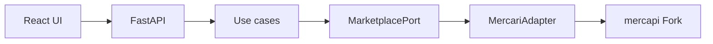

# Card Digger — MVP実装仕様

## 文書ステータス

- 決定日: **2026-08-30**
- 最終更新日: **2026-09-02**
- ステータス: **Phase 1の実装基準として採用**
- 前提: [Mercari Adapter実装仕様](../phase-0/phase-0-f-adapter-spec.md)
- Auction対応Gate: [Auction情報の追加検証計画](../phase-0/phase-0-f-auction-validation.md)。**[実測結果](../../poc/mercapi/auction-result.md)で合格**
- Test実施方法: [Test運用規約](../development/test-policy.md)
- 対象: Search MVP、Seller画面、Seller Knowledge Indicator

この文書はMVPに含める機能、含めない機能、画面挙動、計算方法、完了条件の正本とする。
実装中に新しい案が出ても、MVPへ自動的に追加しない。追加する場合はこの文書とTODOを先に変更する。

## 1. MVPの目的

ユーザーがMercariの大量出品・引退品候補を検索し、画像で一次選別し、気になる商品のSellerが
TCGに詳しそうかを、取得できた公開商品情報から短時間で確認できるようにする。

```text
キーワード検索
    ↓
取得した範囲を画像一覧で確認
    ↓
取得範囲内でSort / Filter
    ↓
気になるSellerを選択
    ↓
販売中・売却済み商品を状態別に取得
    ↓
Seller Knowledgeを補助情報として確認
    ↓
Mercariの商品ページで人間が最終判断
```

AIが購入可否を決めること、Mercari全体を完全に巡回すること、自動購入することは目的にしない。

## 2. MVPの技術構成

Phase 1の基準構成は次とする。Package Versionは[§2.2](#22-固定したpackage-version2026-09-02)で固定した。

| 層 | 技術・方針 |
|---|---|
| Frontend | TypeScript + React + Vite |
| Frontend Data取得 | 標準の`fetch`とReactのState。Data取得Library（TanStack Query / SWR等）を導入しない |
| Backend API | Python 3.11以上 + FastAPI |
| Domain / Use case | Python。Web Frameworkに依存させない |
| Mercari取得 | `MarketplacePort`を実装するPython Mercari Adapter |
| 外部Client | 管理下の`mercapi` Forkをcommit SHA固定 |
| Python依存管理 | **`uv`**。`pyproject.toml`と`uv.lock`の両方をコミットする |
| Database | MVPでは使用しない |
| Authentication | MVPでは実装しない。単一利用者のLocal実行を前提とする |
| Network公開 | Backend / Frontendとも既定ではLoopback InterfaceだけへBindする |



Frontendは`mercapi`、Mercari Endpoint、DPoPを認識しない。Backend APIのJSONだけを利用する。

### 2.1 Repository構成

実装先は次に固定する。PoCコードを`src/`へCopyせず、必要な挙動をTestとDomain型から実装し直す。

```text
src/
├── backend/
│   ├── card_digger/
│   │   ├── domain/
│   │   │   ├── models.py
│   │   │   ├── ports.py
│   │   │   └── errors.py
│   │   ├── application/
│   │   │   ├── collection.py          # 収集Policyの共通部分
│   │   │   ├── access.py              # Process全体で共有する外部アクセス制御
│   │   │   ├── collect_search.py
│   │   │   ├── analyze_seller.py
│   │   │   └── seller_knowledge.py    # Phase 1
│   │   ├── adapters/
│   │   │   ├── mercari.py
│   │   │   ├── mock.py
│   │   │   ├── error_mapping.py
│   │   │   └── clock.py
│   │   └── api/                       # Phase 1
│   │       ├── main.py
│   │       └── schemas.py
│   ├── tests/
│   └── pyproject.toml
└── frontend/
    ├── src/
    │   ├── api/                       # Backend APIへのRequestはここだけ
    │   ├── components/
    │   ├── pages/
    │   └── types/
    ├── tests/
    ├── package.json
    └── package-lock.json
```

`src/backend`直下には`pyproject.toml`、`uv.lock`、`.python-version`を置く。

`application/collection.py`はRequest間隔・1回だけの再試行・安全停止・Page収集の共通部分で、
`collect_search.py`と`analyze_seller.py`の両方が使う。`adapters/`の`mock.py`、
`error_mapping.py`、`clock.py`は
[Test運用規約 §7](../development/test-policy.md#7-テスト可能性のための設計制約)の設計制約
（Fork Client・時計・待機の注入、例外変換の純粋関数化）を満たすために0-F-4で追加した。

`frontend/src/api/`はBackend APIへのRequestを置く唯一の場所とし、ComponentやPageから`fetch`を
直接呼ばない。**出口が1箇所なら、後からCache・再試行・計測を足すときに触るのもそこだけになる。**
Backend側で同じ役割を果たしているのが`MarketplacePort`であり、Cacheを足す場合はそれを実装する
Decoratorで包む（[TODO O-5](../planning/todo.md#オプション--判断済みで保留しているもの)）。

Python依存は`uv`が生成する`uv.lock`、Frontend依存は`package-lock.json`で固定する。Mercari Adapterの
 import方向は`adapters → domain`だけとし、`domain`から`adapters`やFastAPIを参照しない。

Forkは移動しうるBranchやTagではなく、完全な40文字のcommit SHAで指定する。

```toml
[project]
requires-python = ">=3.11"
dependencies = [
  "mercapi @ git+https://github.com/mgmaru/mercapi.git@FULL_40_CHARACTER_COMMIT_SHA",
]
```

指定形式はPEP 508の直接参照とし、`[tool.uv.sources]`のようなTool固有の書式へ依存させない。
手順は[mercapi Fork運用手順 §5](../development/mercapi-fork-operations.md#5-card-diggerからforkを利用する)を正本とする。

### 2.2 固定したPackage Version（2026-09-02）

**Version表を読んで決めたのではなく、実際に組んで確かめてから固定した。** 使い捨てProjectへ同じ
Versionでinstallし、`tsc --noEmit`・`vitest run`・`vite build`・既存Backend Test 240件が
すべて通ることを確認している。検証の記録と脆弱性の結果は
[TODO](../planning/todo.md#2026-09-02に決着した--package-versionとtest-framework)にある。

#### Frontend

| Package | Version | 決め手 |
|---|---|---|
| Node.js | 26 | `vite`が`^20.19.0 \|\| >=22.12.0`、`@testing-library/jest-dom`が`>=22`を要求する |
| `react` / `react-dom` | 19.2.8 | |
| `vite` | 8.2.2 | |
| `typescript` | 7.0.2 | `latest`が7系。6系（6.0.3）も併存しており、7系で問題が出たら退避先になる |
| `@vitejs/plugin-react` | 6.1.1 | peerが`vite ^8.0.0` |
| `@types/react` | 19.2.18 | |
| `@types/react-dom` | 19.2.5 | |
| `react-router` | 8.3.1 | peerが`react >=19.2.7`。実依存は`cookie-es`1つだけ。`react-router-dom`は7系で本体へ統合されたため**使わない** |

#### Frontend Test

Frameworkの選定理由は[Test運用規約 §4.1](../development/test-policy.md#41-framework)を正本とする。

| Package | Version | 決め手 |
|---|---|---|
| `vitest` | 4.1.11 | peerが`vite ^6.0.0 \|\| ^7.0.0 \|\| ^8.0.0` |
| `jsdom` | 30.0.1 | |
| `@testing-library/react` | 16.3.3 | peerが`react ^18.0.0 \|\| ^19.0.0` |
| `@testing-library/jest-dom` | 7.0.1 | peerが`vitest >= 0.32` |
| `@testing-library/user-event` | 14.6.7 | |

設定の落とし穴を1つ実測した。**`defineConfig`は`vitest/config`から取る。** `vite`から取ると
`test`キーが型に無く、`tsc --noEmit`だけが落ちる（Testとbuildは通るため気付きにくい）。

#### Frontend Styling（2026-09-02決定）

**CSS Modulesを使い、上のPackage表へ何も足さない。** ViteはCSS Modulesを追加のPluginも依存も
無しで扱い、`*.module.css`という命名だけが条件である
（[Vite Features](https://vite.dev/guide/features.html#css-modules)）。

| 案 | 追加依存 | この表への影響 |
|---|---:|---|
| **CSS Modules** | **0個** | **無変更** ← 採用 |
| Tailwind CSS | 2個以上 | Version固定と選定理由の追記が要る |
| 素のCSS 1枚 + CSS変数 | 0個 | 無変更。ただしComponentが増えると命名衝突を人が管理する |

**採用理由は「Data取得Libraryを入れない」「Cacheを入れない」「Databaseを使わない」と同じである。**
利用者1人のLocal実行で、依存を1つ増やす見返りが無い。素のCSS 1枚と違うのは、CSS Modulesは
scopeがComponent単位で閉じるため、命名衝突を人が管理しなくてよい点である。

設定は2点だけ要る。**どちらも組んで確かめたのではなく、公式文書で確認した段階である。**

- **`tsconfig.json`へ`"types": ["vite/client"]`を入れる。** 入れないと`*.module.css`のimportに
  型が付かない（同上）
- **Vitestは既定でCSSを処理しない。** CSS Modulesはproxyとして渡るため`styles.card`は解決され、
  [§11](#11-testと完了条件)のComponent Testは追加設定なしで書ける。実際のclass名を検証したい
  場合だけ`css.include`で明示的に有効化する（[Vitest CSS](https://vitest.dev/config/css.html)）

**class名をTestの検証対象にしない。** Testing Libraryのrole / textで問い合わせる。class名へ
依存させると、見た目を変えただけでTestが落ちる。

#### Routing — `react-router`（2026-09-02決定）

**Route は2つだけである。** 検索画面（`/`）とSeller画面（`/sellers/:sellerId`）。
それでもLibraryを入れたのは、[§6.1](#61-取得開始)が「**Browser Refresh時は再取得する**」と
定めているためである。Reloadできるということは**Seller画面がURLを持つ**ということで、
`popstate`・戻る / 進む・URLからの復元を自前で持つと、この1行を支えるためだけに
Testの要るコードが増える。

| | `react-router` 8.3.1 | History APIで自前 |
|---|---|---|
| 追加package | **2**（本体 + `cookie-es`） | 0 |
| `popstate`・戻る / 進む | Libraryが持つ | 自分で書いてTestする |
| URLからの復元 | 同上 | 同上 |

**「Data取得Libraryを入れない」と矛盾しない。** あちらで断ったのはCache・再検証・
Window Focus再取得という**振る舞い**であり（[§5.2](#52-検索開始)がそれらを禁じている）、
Routingはその振る舞いを持たない。

`react-router-dom`は使わない。7系で本体へ統合されており、8系では`react-router`が
DOM向けのexportを持つ。

#### Backend

| Package | 指定 | 決め手 |
|---|---|---|
| `fastapi` | `>=0.141.1,<0.142` | |
| `uvicorn` | `>=0.52.4,<0.53` | **`[standard]`を付けない。** MVPはLoopback・単一利用者で、websocketsもuvloopも使わない |
| `httpx` | 0.27.2 | **こちらでは選べない。** `mercapi`が`>=0.27.2,<0.28.0`で上限を決めている |
| `pytest` | `>=9.1,<10` | 8系に脆弱性がある |
| `pytest-asyncio` | `>=1.4,<2` | pytest 9系へ対応している系列 |
| `watchfiles` | `>=1.2,<2` | devのみ。`uvicorn --reload`に要る |

**実際のVersionは`uv.lock`と`package-lock.json`が正本**であり、上表は選定理由の記録である。

## 3. MVPに含める機能

### 3.1 商品検索

- キーワード入力
- 販売中商品の取得
- 検索中のLoading表示
- 商品IDによる重複排除
- 最低価格・最高価格の指定（**Mercariへ送る検索条件。取得範囲が変わる**）
- 掲載開始日・終了日Filter（Asia/Tokyoの日単位）
- 販売形式（通常出品・オークション・不明）の保持とBadge表示
- 販売形式Filter（Auction追加検証に合格したため有効）
- 取得範囲内の古い順・新しい順
- 価格の安い順・高い順
- 画像中心のResponsive Grid
- 元Mercari商品ページへのLink
- Seller画面へのLink
- 取得範囲と打ち切り理由の表示

### 3.2 Seller分析

- Seller Profile
- Seller名、評価、評価件数、出品件数（**累計販売件数ではない**）
- 元Mercari SellerページへのLink
- 販売中商品を最大100件取得
- 売却済み商品を最大100件取得
- 状態ごとの取得件数、ページ数、終端・打ち切り理由
- Seller商品画像、Title、価格、出品日時、状態、元商品Link
- Seller Knowledge Indicator

### 3.3 共通UI

- 初期、Loading、成功、0件、部分成功、Errorの各状態
- 画像取得失敗時のPlaceholder
- Keyboardで主要操作へ到達できること
- MobileとDesktopで利用可能なLayout
- 外部Linkであることが分かる表示

## 4. MVPに含めない機能

- User Account、Login、権限管理
- お気に入り、確認済みFlag、商品・Seller Memo
- 検索条件保存、除外Keyword
- 定期検索、通知、Background Crawl
- 検索結果・Seller分析結果のCache（TTL、Backend Cache、Browser永続Storage）
- Seller Knowledgeによる検索結果全体のFilter / Ranking
- Search Card上へのSeller Knowledge表示
- Card Digger内の商品詳細画面
- 検索結果全件の商品詳細・いいね・コンディション取得
- 画像本体のBackend Proxy、保存、AI画像解析
- 相場取得、利益計算、Opportunity Score
- 自動購入、自動交渉
- Card DiggerからのAuction入札・落札・購入
- Auction価格・終了時刻の自動更新、Countdown、終了通知
- 時・分・秒を指定する出品日時Filter
- Playwrightへの自動Fallback
- 複数Marketplace
- 公開・商用Service化

これらはMVP完成後に、価値と運用条件を再評価して追加する。

## 5. 検索画面

### 5.1 入力

| 項目 | 規則 |
|---|---|
| Keyword | 前後空白を除去後1〜100文字。必須 |
| 最低価格 | 未指定、または0以上の整数。単位は円 |
| 最高価格 | 未指定、または0以上の整数。単位は円 |
| 価格範囲 | 両方指定時は最低価格 `<=` 最高価格 |
| 掲載開始日 | 未指定、または`YYYY-MM-DD`。Asia/Tokyoの当日00:00:00以降を残す |
| 掲載終了日 | 未指定、または`YYYY-MM-DD`。Asia/Tokyoの翌日00:00:00未満を残す |
| 掲載日期間 | 両方指定時は掲載開始日 `<=` 掲載終了日 |
| 販売状態 | UIでは`on_sale`固定。変更Controlは設けない |
| 販売形式 | `all`、`fixed_price`、`auction`。初期値は`all` |
| Sort | `created_asc`、`created_desc`、`updated_asc`、`updated_desc`、`price_asc`、`price_desc` |

**価格はMercariへ送る検索条件である**（[§5.3](#価格帯だけが到達範囲を変える2026-09-03)）。
掲載日・販売形式のFilterとSortだけがFrontendの計算で、取得済み範囲へ適用し再Requestしない。
初期Sortは`created_asc`とする。

掲載開始日だけなら指定日以降、掲載終了日だけなら指定日以前、両方なら指定期間内を表す。
時刻指定はMVPへ含めず、日付境界を必ずAsia/Tokyoで計算する。

販売形式Filterは[Auction追加検証](../../poc/mercapi/auction-result.md)に合格したため有効とする。
未知形式は`unknown`のまま保持し、通常出品として扱わない。

### 5.2 検索開始

- 検索Button押下時だけ開始し、入力中の自動検索はしない
- 同じ画面で同時に実行できる検索は1件だけ
- 検索中は二重Submitを無効化する
- 新しい検索を開始したら前の結果と混ぜない
- **Seller画面から戻ったとき、直前の検索結果とSort / Filter状態を保持し、再検索しない**
- 検索結果はRouterより上のApplication Stateへ置く。Route Component内のStateへ置かない
- Mercariへの再取得は**検索Button押下とBrowser Reloadだけ**で起きる。Route遷移、Window Focus、
  再接続、時間経過では起きない
- MVPでは検索中止ButtonとJob管理を実装しない
- Frontendの検索Timeoutは40秒とし、Timeout後は結果を成功扱いしない

**これはCacheではない。** 取得済みの結果を画面が持ち続けるだけで、TTLも無効化も再検証も持たない。
Cacheを持たない理由と、後から入れるときの継ぎ目は
[TODO O-5](../planning/todo.md#オプション--判断済みで保留しているもの)にある。

「戻っても再検索しない」を明記するのは、[MVP完了条件](#mvp完了条件)のFlowが
**検索 → Seller → 戻る → 次のSeller**を繰り返すためである。1回の検索は実測で2〜6ページを要し
（[ライブ受入検証 §13.4](../phase-0/phase-0-f-live-acceptance-result.md#134-検索の到達範囲は実行のたびに変わる)）、
Request間隔2秒以上と合わせると往復のたびに数秒から十数秒を払う。無意味な再取得は429や
Challengeを引く確率も上げ、3回連続で拒否されると安全停止に入る。

### 5.3 収集範囲

[Adapter仕様の検索Policy](../phase-0/phase-0-f-adapter-spec.md#81-商品検索)を使用する。

- **最低目標を置かない。** 予算を使い切るまで集める（[下記](#最低目標を外した2026-09-03)）
- 最大10ページ、1,000ユニーク件、30秒
- すべてのMercari Requestは同時実行数1、開始間隔2秒以上（**出所と根拠**は[アーキテクチャ §4.1](../development/architecture.md#41-外部アクセスの条件と2秒間隔の出所)）
- この2つは**HTTP Requestをまたいで**成立させる。同時に走る収集は常に1件で、間隔は前の収集の最後のRequestから数える
- **同じ収集を二重に走らせない。** 同一Keywordの検索、同一Sellerの分析が実行中なら、後から来たRequestは新しく取得せず**実行中の収集へ合流する**
- 取得順は古い順とみなさない
- 上限を超えたPage内の商品はResponse順で上限件数まで採用する
- **価格帯（`minPriceYen` / `maxPriceYen`）はMercariへ送り、取得範囲を変える**（[下記](#価格帯だけが到達範囲を変える2026-09-03)）
- 掲載日と販売形式の指定によって、Backendの取得範囲や停止条件を変更しない

#### 価格帯だけが到達範囲を変える（2026-09-03）

**Mercariは`updated`の降順でしか返さず、逆順にできない**（[§5.5](#55-sortとfilter)）。
そのため**触られていない出品は、母集団の長さぶんだけ後ろにいる。** 予算は1,000件なので、
母集団がそれを超える限り、後ろには永久に届かない。

**`priceMin` / `priceMax`はMercariが並べ替えとページングの前に適用する。**
だから帯を狭めると、同じ予算がより小さな母集団の上に落ち、そのぶん奥まで届く。
**帯が十分に狭ければ結果を撃ち尽くし、`end_of_results`になる。**

| 帯の該当件数 | 取れるもの | 最も更新が古い出品 |
|---:|---|---|
| 30,000件 | 最新1,000件 | **届かない** |
| 3,000件 | 最新1,000件 | 届かないが、より奥まで遡れる |
| 800件 | **全部** | **必ず含まれる** |

**`reachedEnd`だけが「取りこぼしが無い」を意味する。** 7つの停止理由のうち他の6つは、
すべて「まだ続きがありうる」である。画面はこの区別を出す（[§9](#9-ui状態とerror表示)）。

**Frontendで価格を絞っても、この効果は得られない。** 取得済みの1,000件から取り除ける
だけで、**取ってこなかったものを足すことはできない。** 同じ「価格で絞る」でも、
送り先がMercariかFrontendかで結果が変わる。

掲載日と販売形式を同じようにMercariへ送らないのは、**送る先が無い**ためである。
検索条件に日付のFieldは存在せず、販売形式もAuctionを名指しで絞る手段が無い。

#### 最低目標を外した（2026-09-03）

**以前は「100ユニーク件、かつ365日以上前の商品1件」を満たした時点で停止していた。
これを外した。** 停止条件が、この製品の目的と**違う時計で測っていた**ためである。

| | 見ていた軸 |
|---|---|
| 旧・最低目標 | **`created`**（掲載日） |
| [§5.5](#55-sortとfilter)が言うProductの目的 | **`updated`**（未更新期間） |

**検索結果は更新の新しい順に傾いて返ってくる。** 隣接ペアで降順が破れる割合は
`updated`が21%、`created`が40%であり、`updated`側にだけ傾きがある
（[観測結果](../../poc/mercapi/timestamp-result.md)）。
**つまり探している放置出品ほど、1ページ目から遠い。**

そこへ「掲載が365日以上前の商品が1件」を掛けると、
**「掲載は1年前だが昨日も触られている」出品1件で条件が成立する。**
出品者が今も値下げしている商品であり、探しているものの正反対である。

結果として**ほぼ毎回2〜3ページで`target_reached`になり、最近触られた商品ばかりが
100件集まって終わっていた。** 目標は達成され、製品の仕事はされていなかった。

**新しい数字は入れていない。条件を1つ外しただけである。** 予算（10ページ・1,000件・30秒）は
既にあり、出所もある。1回の検索は20〜30秒かかるようになるが、
[§5.2](#52-検索開始)が結果を画面に残すため、その往復は1回で済む。

**`target_reached`はAPIの型に残す。** 収集の仕組み自体は目標を受け取れるままにしてあり、
**`updated`を軸にした目標**を後から渡す余地を消さないため。ただし検索は現在これを返さない。

掲載日Filterは取得済み商品の絞り込みであり、Mercari全体の指定期間を網羅する検索ではない。
指定期間に一致する商品が0件でも、Mercari上に0件だとは表示しない。

**合流はCacheではない。** 保存も有効期限も持たず、合流した側が受け取るのは**今まさに行われている収集**の
結果である。したがって`collectedAt`は正しい。Cacheを持たない理由は
[TODO O-5](../planning/todo.md#オプション--判断済みで保留しているもの)のままである。

### 5.4 検索結果Metadata

必ず次を返して表示する。

```ts
type CollectionError = {
  code: string;
  operation: "search" | "seller_profile" | "seller_on_sale" | "seller_sold_out";
};

type CollectionMeta = {
  pageCount: number;
  uniqueItemCount: number;
  duplicateCount: number;
  discardedByLimitCount: number;
  oldestCreatedAt: string | null;
  newestCreatedAt: string | null;
  collectedAt: string;
  oldListingCount: number | null;
  stopReason:
    | "target_reached"
    | "end_of_results"
    | "max_pages"
    | "max_items"
    | "max_duration"
    | "error"
    | "safety_stop";
  reachedEnd: boolean;
  truncated: boolean;
  partial: boolean;
  retryCount: number;
  errors: CollectionError[];
};
```

- `reachedEnd`: `has_next=false`まで到達した場合だけ`true`
- `truncated`: 目標到達、ページ・件数・時間上限で、続きが存在する可能性がある場合に`true`
- `partial`: Errorまたは安全停止で予定した取得を完了できなかった場合に`true`
- `errors`: 個人情報や生Responseを含めず、分類Codeと操作だけを返す
- `oldestCreatedAt` / `newestCreatedAt`: 取得済み商品の最小・最大日時。Mercari全体の範囲ではない
- `collectedAt`: Backendが収集を完了した時刻。RFC 3339のTimezone付き日時
- `oldListingCount`: 検索だけが埋める。Seller商品では**`null`**とする。出品の古さに
  同じ意味の基準が無いため、0と書くと「古い出品が無かった」という別の主張になる

画面には最低限、次の文言を出す。

```text
Mercariから 825件 / 7ページを取得
指定した価格帯: ¥3,000〜¥5,000
取得した商品の掲載日時: 2025-08-20〜2026-08-31
最も更新されていない出品: 5年2か月
指定した掲載日に一致: 42件 / 825件
取得時刻: 2026-09-02 14:03（この時刻に取得した情報を表示しています）　[再取得]
取得した範囲内で古い順に表示しています
Mercari全体の最古順・指定期間の全件ではありません
停止理由: 365日以上前の商品へ到達
```

件数は実測値へ置き換える。`partial=true`の場合は警告色を使用し、「一部の結果だけを表示中」と
明記する。

#### 「最も更新されていない出品」を出す（2026-09-03決定）

**この検索が当たりだったかを言う1行である。** 取得済み全件の`updatedAt`から`collectedAt`
までの最大値を、期間として表示する。

母集団が予算を超えるキーワードは今週触られた出品ばかりを返し、狭いキーワードは何年も
遡る（[§5.3](#価格帯だけが到達範囲を変える2026-09-03)）。**その差が一目で分かるので、
利用者はキーワードを変える判断をすぐに下せる。**

| 決めたこと | 理由 |
|---|---|
| 対象は**取得済み全件**。Filter後ではない | この行は**収集**を説明している。掲載日時の範囲と同じ性質 |
| 語は**「更新」**で統一する | **「触られていない」を使わない。**出品者の操作なのか、いいね等の他者の操作なのか読み取れない。Cardが既に`更新日時`と書いている |
| 期間として書く（`5年2か月`）。`前`を付けない | 時点ではなく長さを訊いている。検索どうしを較べる数字である |
| 0件のときは出さない | 書ける事実が無い |

取得時刻には`collectedAt`をAsia/Tokyoで表示し、隣へ再取得Buttonを置く。**Auction価格を含む
すべての値がこの時刻のSnapshotである**ため、表示中の結果がいつのものかを常に見えるようにする。
再取得は明示操作だけで行い、時間経過やFocus復帰で自動的に走らせない。

### 5.5 SortとFilter

**SortとFilterはすべてApplication側で行う。** Mercariへ送る`sort`は結果の順序を
当てにしていない。理由と実測は
[Adapter仕様 §8.1](../phase-0/phase-0-f-adapter-spec.md#並び替えはapplication側で行う2026-09-01明記)。

- **Mercariに「古い順」という選択肢が存在しない**（おすすめ順・新しい順・価格順・いいね順のみ）
- `order`パラメータを変えても**返る順序が変わらない**ことを実測した
- したがって並び替えは**取得し終えた集合に対して**行う

**`created_asc`は「Mercari全体で最も古い商品」ではない。** 取得できた範囲の中で古い順である。
この限界は§5.4の取得範囲表示とあわせて画面に出す。`updated_asc`も同様。

#### 2つの日時を並び替えの軸にする

`createdAt`と`updatedAt`は違う問いに答える。**どちらが「古い」かは目的によって変わる。**

| 軸 | 意味 | 目的との関係 |
|---|---|---|
| `createdAt` | いつ出品されたか | 長く存在している出品 |
| **`updatedAt`** | **いつ最後に触られたか** | **長く放置されている出品** |

**`updated_asc`が[Productの目的](concept.md)に最も近い。** 「引退して放置されている出品」を
探すなら、出品からの経過よりも「触られていない期間」のほうが直接的である。

さらに、検索は**更新の新しい順に傾いて返ってくる**（隣接ペアの79%が降順。
[観測結果](../../poc/mercapi/timestamp-result.md)）。**目的の商品ほど後ろに埋もれる**ため、
`updated_asc`はそれを取得範囲内で引き上げる手段になる。

`updated_desc`はMercariの既定の並びとほぼ同じで、追加の情報量は小さい。対称性のために置く。

#### `updatedAt`の表示ラベル

`updatedAt`は**商品ページに表示されている値**であり、`createdAt`は表示されていない。
利用者がMercariと見比べられるよう、次のように書く。

```text
更新日時: 2日前（Mercariの商品ページに表示される経過時間と同じ）
掲載日:   2025年1月4日（Mercariの商品ページには表示されません）
```

「最終更新日」と断定しない。**商品ページの経過時間にラベル文字が無く、Mercariがその値を
何と呼んでいるかは確認していない**ためである
（[Adapter仕様 §6.3](../phase-0/phase-0-f-adapter-spec.md#63-field対応表--どこから来て意味に根拠があるか)）。

Sortの値は`<軸>_<方向>`で揃える。**軸を省略しない。**
日時の軸が2つあるため、`oldest`のように軸を書かない名前は「何の古い順か」を言えない。
人間向けの言葉はUIラベルが持つ。

| 値 | 並び | UI表示 |
|---|---|---|
| `created_asc` | `createdAt`昇順 | 掲載が古い順 |
| `created_desc` | `createdAt`降順 | 掲載が新しい順 |
| **`updated_asc`** | `updatedAt`昇順 | **更新が古い順** |
| `updated_desc` | `updatedAt`降順 | 更新が新しい順 |
| `price_asc` | `priceYen`昇順。同額は`createdAt`昇順 | 価格の安い順 |
| `price_desc` | `priceYen`降順。同額は`createdAt`昇順 | 価格の高い順 |
- 掲載開始日: `createdAt >= 開始日の00:00:00 Asia/Tokyo`を残す
- 掲載終了日: `createdAt < 終了日の翌日00:00:00 Asia/Tokyo`を残す
- `all`: `SaleFormat.UNKNOWN`を含む全形式を残す
- `fixed_price`: `SaleFormat.FIXED_PRICE`だけを残す
- `auction`: `SaleFormat.AUCTION`だけを残す
- Filter後件数と取得総数を分けて表示する

**価格はここに無い。** Mercariが並べ替えの前に適用しているため、
取得済みの集合はすでに帯の中にある（[§5.3](#価格帯だけが到達範囲を変える2026-09-03)）。

`createdAt`は必須Fieldであり、欠落Itemを末尾へ回して成功扱いにはしない。
販売形式の判定に必要なFieldが未知形状なら`SaleFormat.UNKNOWN`とし、通常出品へ含めない。

通常出品とAuctionを混在させて価格順にした場合、通常出品は販売価格、Auctionは取得時点の
現在価格で比較する。形式と価格の意味をCard上で区別し、確定落札額とは表示しない。

### 5.6 商品Card

各Cardに次を表示する。

- 先頭画像1枚。画像取得失敗時はPlaceholder
- Title。2〜3行で省略し、完全なTitleはAccessible NameまたはTooltipで確認可能にする
- 販売形式Badge（`通常出品`、`オークション`、`形式不明`）
- 通常出品は「価格」、Auctionは「現在価格（取得時点）」、不明は「価格（取得時点）」
- Auctionの価格は`highest_bid`（取得時点の現在価格）。開始価格や確定落札額ではない
- 出品日時（Asia/Tokyo）。**Mercariの商品ページには表示されない値**である旨を添える
- 検索実行時点からの経過日数
- 更新日時からの経過時間。**Mercariの商品ページに表示される値と同じ**である旨を添える
- **未更新期間の棒**（下記）
- 「Mercariで商品を見る」外部Link
- 「Sellerを分析」Link

#### 未更新期間の棒（2026-09-02決定）

**最後に更新されてから経った期間を、長さで表す棒を1本置く。**

| 項目 | 決めたこと |
|---|---|
| 表すもの | `updatedAt`から`collectedAt`までの日数**だけ** |
| 長さ | 日数 ÷ **365日**。1.0を超えたら1.0で頭打ちにする |
| 頭打ちの表示 | 365日以上のとき、棒の右端を角丸にせず直角にする |
| 数字 | **棒へ添えない。**「更新日時からの経過時間」が同じ事実を既に文字で持つ |
| 目盛 | Grid上部に1つだけ置く。左端`更新されたばかり`、右端`365日以上 更新されていない` |
| 支援技術 | `aria-hidden`とする。**同じ事実が上の行に文字である**ため、読み上げが二重になる |

**なぜ`createdAt`ではなく`updatedAt`なのか。** [§5.5](#55-sortとfilter)が
`updated_asc`をProductの目的に最も近いSortだとしている理由と同じである。
**掲載日が同じ2件でも、一方は出品者が手入れを続けており、他方は放置されている。**
その違いは`updatedAt`にしか出ない。

**なぜ365日なのか。** [§5.3](#53-収集範囲)の収集目標が
「365日以上前の商品1件」を下限に使っており、**この製品が既に「古い」と呼んでいる長さ**である。
軸を取得範囲の幅にすると検索のたびに縮尺が変わり、**別の検索結果と長さを較べられなくなる。**

**この棒は文字を置き換えない。** 掲載日・経過日数・更新日時からの経過時間はそのまま表示する。
棒が足すのは**量**だけで、Sortが与える順序では見えない「どれだけ放置されているか」を補う。

見え方（高さ、色、角丸）は[視覚方針 §3.8](design-tokens.md#38-未更新期間の棒)が持つ。

MVPでは検索CardごとにSeller分析を自動実行しない。Seller TCG率はSeller画面を開いた後だけ表示する。
Auctionの残り時間Countdownと自動更新は行わず、最新情報はMercariで確認するよう表示する。

## 6. Seller画面

### 6.1 取得開始

- 検索Cardの「Sellerを分析」から遷移したときだけ取得する
- Seller IDは検索結果から渡す
- Profileを取得後、`on_sale`、`sold_out`の順に直列取得する
- 同一Sellerの二重取得を同時実行しない
- Browser Refresh時は再取得する。MVPでは永続Cacheを持たない
- FrontendのSeller分析Timeoutは70秒とし、Timeout後は結果を成功扱いしない

### 6.2 表示

- Seller名
- **最も新しい更新**（下記）。取得できた商品が0件なら`-`表示
- 評価（**良い / 普通 / 悪いの件数**）、評価件数、出品件数。取得不能項目は`-`表示
- 元Mercari Sellerページ
- 販売中Tab
- 売却済みTab
- 状態ごとの取得件数 / 最大100件
- 状態ごとのPage数、終端または打ち切り理由
- Seller Knowledge

Seller商品Cardには画像、Title、販売形式Badge、形式に応じた価格Label、出品日時、状態、
元商品Linkを表示する。

#### 「最も新しい更新」を出す（2026-09-03決定）

**5年放置の出品を見つけても、出品者がMercariを辞めていたら買えない。**
[§5.6](#56-商品card)の棒は商品が放置されていることを言うが、
**出品者が今も居るか**には何も答えていない。

**答えるDataは既に取れている。** Seller画面は販売中と売却済みを最大100件ずつ取るので、
その中の`updatedAt`の**最大値**が「この出品者を最後に見た時刻」になる。
**新しいFieldも追加のRequestも要らない。**

```text
最も新しい更新  2日前
```

| 商品 | 出品者 | 意味 |
|---|---|---|
| 放置 | **動いている** | **狙い目。** 忘れられた出品で、しかも連絡がつく |
| 放置 | 動いていない | 買えないかもしれない |
| 新しい | 動いている | 普通の市場 |

**販売中と売却済みの両方から取る。** 出品を編集しない出品者でも、昨日何かが売れていれば
`sold_out`の`updatedAt`は昨日になる。**販売中だけを見ると、その人を「5年不在」と誤って報告する。**

**「最終活動」と書かない。** `updatedAt`はMercariがラベルを付けていない値であり、
出品者本人が動かしたのかどうかは確認していない（[§5.5](#updatedatの表示ラベル)）。
画面の語は`更新`で統一する。

**取得範囲の限界を添える。** 出すのは取得できた商品の中での最も新しい更新であって、
その人の全出品ではない。[§6.3](#63-取得上限の表記)と同じ性質の限界なので、同じように画面へ書く。

**検索Cardには出せない。** 結果に並ぶ全出品者の分析が要り、1人あたり最大70秒かかる
（[§5.6](#56-商品card)が自動分析を置かない理由と同じ）。

#### 評価は件数の内訳で出す（2026-09-03決定）

**`rating`（`star_rating_score`）を画面へ出さない。** L4で観測できた値は`5`の1件だけで、
5段階なのか100点満点なのかを確かめていない。100点満点なら「5」は極端に低い評価であり、
**満点の出品者を最低評価として見せることになる。**
[Adapter仕様 §6.3](../phase-0/phase-0-f-adapter-spec.md#63-field対応表--どこから来て意味に根拠があるか)が
`assumed`を画面へ出すことを禁じている。

**代わりに件数の内訳を出す。** Profileは`ratings`として`good` / `normal` / `bad`を別に持っており、
**件数には尺度の曖昧さが無い。**

```text
評価  良い 245件 / 普通 2件 / 悪い 0件
```

**3つ揃っているか、1つも無いかのどちらかとして扱う。** Mercariは3つをまとめて返し、
`ratings`自体が無い応答では内訳を出さず`-`にする。**無いものを`0件`と書かない。**
「悪い 0件」は誰もしていない保証になる。

> **[Seller Knowledge](#7-seller-knowledge-indicator)と混同しない。**
> あちらはCard Diggerが出品Titleから計算する指標で、`rating`は他人が付けた値である。

### 6.3 取得上限の表記

次のように、取得範囲を必ず表示する。

```text
販売中: 100件取得（上限到達・続きが存在する可能性があります）
売却済み: 42件取得（終端まで取得）
Seller Knowledgeは取得した142件を対象に計算しています
```

最後の1行は**Seller Knowledgeの節に置く**（[§7.7](#77-表示内容)）。件数の出所は
その節が計算した値であり、状態別の取得範囲とは別の事実である。

`num_sell_items`などProfileの累計値を、現在取得できる全商品数とみなさない。

### 掲載日と経過日数の限界を画面へ書く

掲載日と経過日数は`created`に基づく。**この値はMercariの商品ページに表示されていない。**
商品ページが表示している経過時間は`updated`（最終更新）であり、両者は食い違う
（観測例: 同じ商品にMercariは「1時間前」、`created`基準では「10日前」）。

利用者が両方の画面を見たときに混乱しないよう、次を表示する。

```text
掲載日はMercariの出品データ（created）に基づきます。
商品ページに表示される「◯時間前」は最終更新日時であり、掲載日とは異なります。
```

`created`が出品日時であることは**照合する手段が無い**
（[Adapter仕様 §6.3](../phase-0/phase-0-f-adapter-spec.md#63-field対応表--どこから来て意味に根拠があるか)）。
編集や再出品で動かないことは347件で確認済みだが、「出品日時」という呼び方の最後の一歩は
確認できていない。**塞げない限界として、隠さず画面に書く。**

**`num_sell_items`は出品件数であり、累計販売件数ではない。**「累計販売件数」として
表示しない。根拠は[Adapter仕様 §6.4](../phase-0/phase-0-f-adapter-spec.md#64-listed_item_countは販売件数ではない)。
Profileから累計販売件数は取得できないため、販売実績を示す場合は取得できた`sold_out`の件数を
「取得範囲内の売却済み件数」として示す。

## 7. Seller Knowledge Indicator

### 7.1 対象データ

取得した`on_sale`と`sold_out`の商品を商品IDで重複排除して合算する。`trading`を意図的に
取得する追加Requestは行わない。対象0件の場合はScoreを計算せず`unknown`とする。

分析対象はTitleだけとし、説明文、画像、価格、Seller名は使用しない。

### 7.2 Titleの正規化

1. Unicode NFKC正規化
2. 英字を`casefold()`で小文字化
3. 連続空白を1文字へ統一
4. 前後空白を除去

商品Title自体は書き換えず、判定用文字列だけを正規化する。

### 7.3 ポケカ判定Keyword

次のいずれかを部分一致で含む商品をポケカ関連とする。

```text
ポケカ
ポケモンカード
pokemon card
pokémon card
```

### 7.4 TCG判定Keyword

ポケカ関連商品は必ずTCG関連にも数える。加えて、次のいずれかを部分一致で含む商品をTCG関連とする。

```text
トレカ
tcg
trading card
トレーディングカード
カードゲーム
遊戯王
ワンピースカード
デュエルマスターズ
デュエマ
ヴァイスシュヴァルツ
mtg
マジックザギャザリング
ガンダムカード
```

Keyword一覧はCode上の定数として一か所に置き、Unit Testから参照する。

### 7.5 専門用語

```text
SAR
SR
UR
AR
PSA
PSA10
旧裏
プロモ
初版
未開封
BOX
シュリンク
鑑定
```

ASCII略語は英数字Tokenの境界で判定し、別の英単語の一部を一致させない。`PSA10`は`PSA 10`も
同一用語として扱い、`PSA10`に対して`PSA`を重ねて数えない。日本語は部分一致とする。

同じTitleに同じ用語が複数回あっても1回と数える。次の2値を保持する。

- `specializedItemCount`: 専門用語を1件以上含む商品数
- `distinctSpecializedTermCount`: 全対象で確認できた異なる専門用語数

### 7.6 比率とScore

```text
pokemonRatio = pokemonItemCount / analyzedItemCount
tcgRatio = tcgItemCount / analyzedItemCount
specializedItemRatio = specializedItemCount / analyzedItemCount
```

Scoreは次の加点だけで計算する。閾値はMVPの仮説であり、精度が実証された値とは表示しない。

| 条件 | 点数 |
|---|---:|
| ポケカ比率50%以上 | 2 |
| ポケカ比率20%以上50%未満 | 1 |
| TCG比率50%以上 | 2 |
| TCG比率20%以上50%未満 | 1 |
| 専門用語商品比率30%以上 | 2 |
| 専門用語商品比率10%以上30%未満 | 1 |
| 異なる専門用語が5種類以上 | 1 |

ポケカ関連商品をTCG関連にも数えるため、ポケカ比率とTCG比率の加点は意図的に重なる。

| Score | 表示 |
|---:|---|
| 対象0件 | `判定不能` |
| 0〜2 | `低` |
| 3〜4 | `中` |
| 5〜7 | `高` |

標本数による信頼度も別に表示する。

| 分析商品数 | 信頼度表示 |
|---:|---|
| 0 | `判定不能` |
| 1〜29 | `低` |
| 30〜99 | `中` |
| 100以上 | `高` |

専門性と信頼度を混同しない。たとえば`専門性: 高 / 標本信頼度: 低`は有効な結果とする。

### 7.7 表示内容

```text
Seller Knowledge（取得範囲内）
--------------------------------
分析対象              142件
ポケカ関連             63件 / 44.4%
TCG関連                91件 / 64.1%
専門用語あり           35件 / 24.6%
異なる専門用語          7種類

専門性                  高
標本信頼度              高

Seller Knowledgeは取得した142件を対象に計算しています。
販売中は上限100件で打ち切っています。
閾値はMVPの仮説であり、精度を実証した値ではありません。
購入判断ではなく、確認順を決める補助情報です。
```

**Scoreの数値は出さない。** [§7.6](#76-比率とscore)の加点をそのまま足した値であり、
画面に出すと測定値に見える。出すのは`低 / 中 / 高`の帯だけとする。

**専門性と標本信頼度を1つにまとめない。**`専門性: 高 / 標本信頼度: 低`は有効な結果であり、
1語に畳むと**どちらを疑うべきか**が読めなくなる。

**打ち切っていない状態を打ち切りと書かない。** 上の「販売中は上限100件で…」は、
その状態が終端まで取得できていないときだけ出す。両方が終端に達したなら出さない。
朱の縦罫は「見えていない範囲がある」印であり、無いときに出すと印の意味が消える
（[§9](#9-ui状態とerror表示)の`reachedEnd`と同じ扱い）。

**対象0件のとき比率を出さない。** 比率は`0.0`として返るが、これは`float`が
「未定義」を表せないためであって、0%という観測ではない。`ポケカ関連 0件 / 0.0%`は
**「ポケカを出品していない出品者」と読める。**件数だけを出し、帯は`判定不能`とする。

## 8. Backend API

MVPでFrontendが使用するEndpointは次に限定する。

### `POST /api/search`

Request:

```json
{
  "keyword": "ポケカ 引退品",
  "minPriceYen": 3000,
  "maxPriceYen": 5000
}
```

`minPriceYen` / `maxPriceYen`は省略可。指定する場合は0以上の整数で、
`minPriceYen <= maxPriceYen`を満たさないとHTTP 422とする。
**この2つはMercariへ渡り、取得範囲を変える**（[§5.3](#価格帯だけが到達範囲を変える2026-09-03)）。
同じKeywordでも帯が違えば別の収集として扱い、合流させない。

Responseは取得した全`items`と`CollectionMeta`を返す。掲載日・販売形式Filter、Sort、
Filter後件数はFrontendが計算する。外部取得が
部分失敗した場合はHTTP 200で取得済み結果を返すが、`partial=true`と`errors`を必須にする。

### `GET /api/sellers/{sellerId}/analysis`

Seller Profile、販売中商品、売却済み商品、各状態の`CollectionMeta`、Seller Knowledgeを返す。
Seller Knowledgeは販売中と売却済みを商品IDで重複排除して合算した結果で、状態ごとには返さない。

**Profileを読めたなら200を返す。** 販売中・売却済みのどちらかが途中で失敗しても、画面に出す
Sellerは存在するためで、短く終わったことは各状態の`partial`と`stopReason`が申告する。
下のStatus規則が5xxを指すのは、**Profileを読めなかった場合だけ**である。

Profileを読めなかったときの本体は分類Codeと操作だけを返す。

```json
{ "detail": { "code": "not_found_404", "operation": "seller_profile" } }
```

### `GET /api/health`

Processの稼働確認だけを返す。Mercariへ外部Requestを送らない。

商品詳細EndpointはPhase 0-FのAdapter Contractには存在するが、MVP Frontendからは使用しない。

### HTTP Status規則

| 状況 | Status |
|---|---:|
| 正常、0件、取得上限による打ち切り | 200 |
| 1件以上取得後の外部Error・安全停止 | 200 + `partial=true` |
| 入力Validation Error | 422 |
| Sellerが存在しない | 404 |
| 取得0件でMercari側のRate Limit・安全停止 | 503 |
| 取得0件でMercari側Timeout | 504 |
| 取得0件でその他のMercari通信・Parse Error | 502 |

## 9. UI状態とError表示

| 状態 | UI |
|---|---|
| 初期 | 入力Formと検索例を表示 |
| Loading | Spinnerと「最大取得範囲を確認中」の文言。途中件数は表示しない |
| 成功 | Metadata（取得時刻を含む）、再取得Button、Filter、Gridを表示 |
| 0件 | 条件変更を促し、空Gridを表示 |
| Filter後0件 | 取得総数を残し、「取得範囲内では一致なし」と表示 |
| 取りこぼし無し（`reachedEnd`） | **取得範囲の警告を出さない。** その条件では全件を見ているため |
| 終端に達したが件数上限で捨てた | **`reachedEnd`にしない。**[下記](#終端と上限は同時に起こる2026-09-03)  |
| 部分成功 | 取得済み結果と警告、停止理由、再実行Button |
| 入力Error | 対象Fieldの近くに修正方法を表示 |
| 外部Error | Error分類に応じた説明と手動再実行Button |
| 安全停止 | 自動再試行せず、時間を置くよう表示 |

401 / 403 / 429 / Challengeで、Login情報入力やProxy変更を促す表示は行わない。

#### 終端と上限は同時に起こる（2026-09-03）

**最後のPageが終端であり、かつ件数上限を跨ぐことがある。** 出品104件のSellerは、
30件Pageなら4Page目に14件を返して「次は無い」と言う。こちらは100件目で打ち切り、
**4件を捨てている。**

このとき`reachedEnd`を真にしない。**画面がこの値を読んで言うのは「取りこぼしが無い」**であり、
捨てた4件は取りこぼしである。真にすると
`販売中: 100件取得 / 最大100件（終端まで取得）`となり、
**出品104件のSellerを「ちょうど100件の人」として見せる。**
[MVP完了条件](#mvp完了条件)の「Seller全商品であると誤認させる表示がない」に正面から触れる。

停止理由は`件数の上限に到達`とする。**Marketplaceが「次は無い」と言ったことは事実だが、
それは画面が答えたい問いではない。**

## 10. Data取扱い

- Cookie、DPoP、秘密Token、Request Header、生ResponseをFrontendへ返さない
- Backendは既定で`127.0.0.1`へBindし、認証なしの状態でLAN・Internetへ公開しない
- CORSは実際に使用するLocal Frontend Originだけを許可する
- 商品・Seller情報をDatabaseへ保存しない
- 画像はMercariのHTTPS URLをBrowserで表示し、Backendに保存しない
- 検索・分析結果は画面を閉じた後の復元を保証しない
- 検索・分析結果をBrowserの永続Storage（localStorage / sessionStorage / IndexedDB）へ保存しない
- Application LogへSeller名、商品Title、生URLを標準では出さない
- Error Logには操作種別、Error Code、HTTP Status、Field名を残し、個人情報を避ける

## 11. Testと完了条件

この節は**何をテストするか**を定義する。Framework、配置、Fixture、実行時期、完了判定は
[Test運用規約](../development/test-policy.md)を正本とする。Phase 1のTestはすべて
Mock Adapterと固定Fixtureだけを使い、実Mercariへ通信しない。

**進捗はここで追わない。** どのTestをどのPhaseでやるかと、済んだかどうかは
[TODO](../planning/todo.md)が持つ。この節は**何をTestするか**だけを定義する。

### Backend / Domain

- KeywordのValidation Test
- `SaleFormat`とAuction価格LabelのDomain / Schema Test
- 検索・Seller収集の全停止理由のUnit Test（7種類すべて。0-Fで実装済み）
- Seller Knowledgeの正規化、Keyword、境界、Score、信頼度のUnit Test
- 0件、29件、30件、99件、100件の境界Test
- Mock Adapterを使うAPI Test
- 外部Error・部分成功のAPI Test
- 安全停止のStatus規則のTest（**Endpoint経由では再現できない**。[TODO](../planning/todo.md#実装中に見つかった1件--2秒間隔と安全停止がrequestをまたがない)）

### Frontend

- キーワード・価格帯のValidation Test（**検索条件のほう**）
- 掲載日期間のValidation Test（**Filterのほう**）
- 入力、Loading、0件、成功、部分成功、Error表示のComponent Test
- **価格帯がMercariへ渡り、Frontendでは絞られないTest**
- 掲載日・販売形式Filterと6種類のSortのTest（`created_asc` / `created_desc` / `updated_asc` / `updated_desc` / `price_asc` / `price_desc`）
- Asia/Tokyoの日付境界と開始日・終了日の片側指定Test
- **`reachedEnd`のときだけ取得範囲の警告を出さないTest**
- **「最も更新されていない出品」が取得済み全件から計算されるTest**
- Seller画面へ遷移して戻ったとき、再検索せずSort / Filter状態が保持されるTest
- 通常出品・Auction・不明のBadgeと価格LabelのTest
- 画像PlaceholderのTest
- Sellerの状態別Tabと取得範囲表示のTest
- Seller KnowledgeのScoreと注意書き表示のTest
- Mobile / Desktopの主要Flow確認

### E2E受入Flow

固定Fixture / Mock Adapterで次を自動化する。

1. `ポケカ 引退品`を検索する
2. 取得範囲と古い順の注意書きを確認する
3. 掲載開始日だけ、終了日だけ、期間指定でFilterする
4. 通常出品・Auctionを切り替え、Badgeと価格Labelを確認する
5. Sortを変更する（**価格帯は検索条件なので、変えると再収集になる**）
6. 商品CardからSeller画面を開く
7. 販売中・売却済みの件数と打ち切り理由を確認する
8. Seller Knowledgeと標本信頼度を確認する
9. 検索画面へ戻り、**Mock Adapterへの検索Requestが増えていないこと**と、件数・Sort・Filterが
   手順5のままであることを確認する
10. 元Mercari商品Linkが正しいHTTPS URLであることを確認する

### MVP完了条件

- [ ] E2E受入Flowがすべて成功する
- [ ] 商品検索とSeller分析で取得範囲・停止理由を常に確認できる
- [ ] Mercari全体の古い順・指定期間の全件・Seller全商品であると誤認させる表示がない
- [ ] Auctionを通常出品または確定価格と誤認させる表示がない
- [ ] Seller Knowledgeがこの文書の同じ入力から決定的に同じ値を返す
- [ ] 外部取得失敗を成功または0件として隠さない
- [ ] 主要操作がKeyboardとMobile Layoutで利用できる
- [ ] Playwright Fallback、Database、定期Crawl、Cacheが実装へ混入していない
- [ ] 利用規約確認が必要な公開・商用・継続取得へ進んでいない
- [ ] **人間が見る商品を効率的に絞れる** — 上の機械的な条件を全部満たしても、
  これが成り立たなければMVPは目的を果たしていない

**上のE2E受入Flow 10手順が、探索そのものが通ることの確認にあたる。** 検索・一覧・Filter・
Sort・Seller遷移・戻りは、条件として書き直さずFlowの成否で見る。
