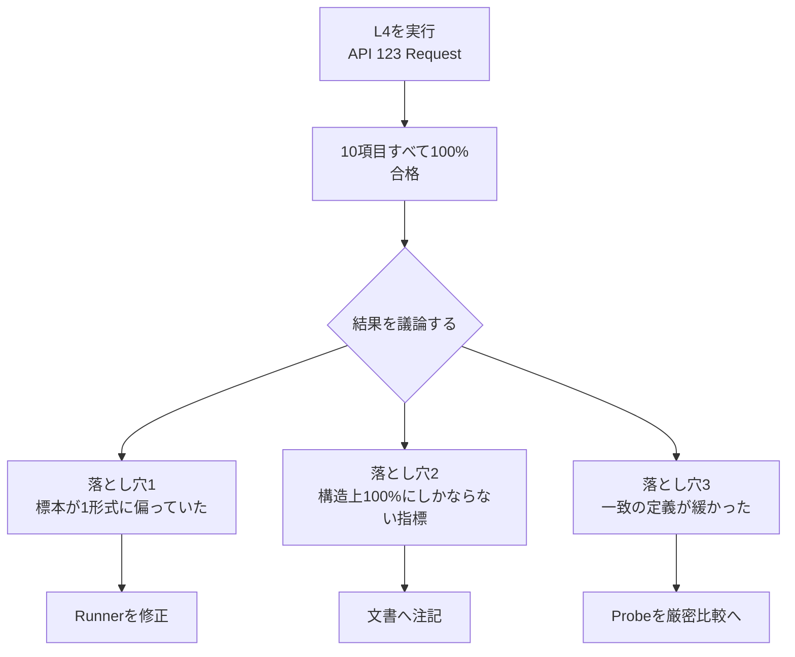
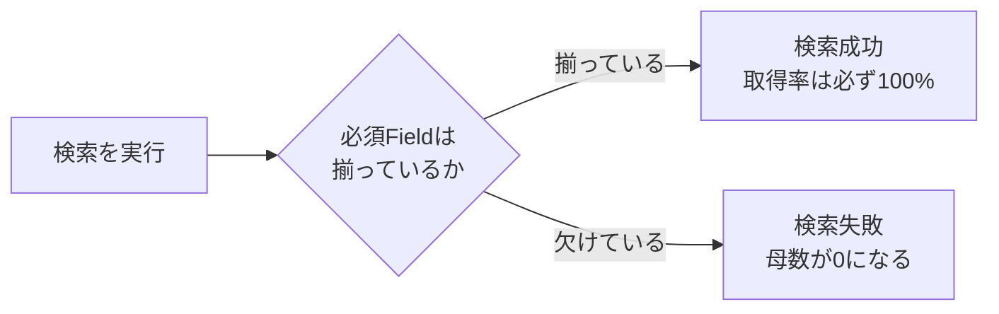
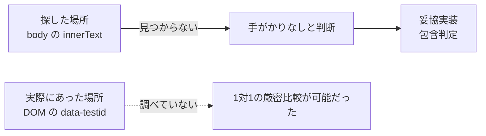
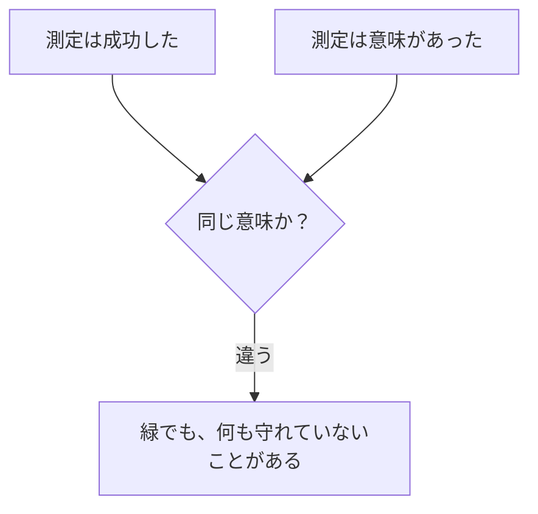

# 検証の落とし穴 — 2026-09-01 ライブ受入検証で起きたこと

## この文書について

**実装のための文書ではない。** 個人開発で同じ失敗を繰り返さないための記録である。

Card Digger固有の事情から出発しているが、教訓は他のProjectでも使える形に書く。
実装の正本は[ライブ受入検証結果](../phase-0/phase-0-f-live-acceptance-result.md)であり、
この文書はそこから**何を学んだか**だけを扱う。

| | |
|---|---|
| 対象日 | 2026-09-01 |
| 出来事 | Phase 0-F ライブ受入検証（L4）を実施。合格基準10項目すべて100%で合格 |
| ところが | 合格後の議論で、**測定の弱点が3つ**見つかった |
| 結論 | **合否は変わらなかった。** ただし「100%」の読み方が変わった |
| その後 | 同日中にRunnerとProbeを直して**第2回を実行**。3つの弱点はいずれも解消し、判定は合格のまま |

第2回の実測は[ライブ受入検証結果 §12](../phase-0/phase-0-f-live-acceptance-result.md#12-第2回の実測)にある。

---

## 1. 何が起きたか



**すべての数字が100%だったのに、そのうち3つは思っていたことを測っていなかった。**

重要なのは、これらが**実行中には一切見えなかった**ことである。エラーも警告も出ず、
すべて緑で、合格基準も満たしていた。見つかったのは、結果を人に説明しようとしたときだった。

---

## 2. 落とし穴1 — 100%は、母集団を見ないと意味が決まらない

### 症状

> 「販売形式の判定が一致（検索 vs 商品詳細）: **20 / 20（100%）**」

この20件が、**全部オークションだった。** 通常出品は1件も含まれていない。

### なぜそうなったか

標本を選ぶコードが、こうなっていた。

```python
# 未知形状 → オークション → 通常出品 の順に詰めて、先頭20件を取る
return (unknown + auctions + fixed)[:size]
```

意図は「オークションは珍しく、変換を間違えやすいので優先する」だった。
ところが検索結果に**オークションが23件**含まれていたため、20枠が埋まりきった。

```text
検索結果 237件
├─ 通常出品 214件  ← 1件も選ばれなかった
└─ オークション 23件 ← 先頭20件がここで埋まった

標本20件 = オークション20 / 通常出品0
一致率 20 / 20 = 100%   ← 「両方を検証した」ようにしか見えない
```

### 見逃した理由

**率だけを記録し、内訳を記録していなかった。**

`20 / 20 (100.0%)` という出力からは、その20件が何だったのか永久に分からない。
実際、後から確認しようとしたときも記録が無く、**選定規則から逆算するしかなかった。**

### 教訓

> **率は「分子 / 分母」ではなく「分子 / 分母 / 母集団の内訳」で記録する。**

| 悪い記録 | 良い記録 |
|---|---|
| `20 / 20 (100%)` | `20 / 20 (100%)` ＋ `内訳: {auction: 20, fixed_price: 0}` |

内訳が1行あれば、実行した瞬間に気づけた。

### 対策

標本を形式ごとの枠に変えた。片方が不足したら、もう片方へ枠を回す。

```text
変更前  未知 → オークション全部 → 残りを通常出品
変更後  未知 → オークションと通常出品を交互に配る（10 / 10）
```

**交互にしたのには理由がある。** 途中で安全停止しても、そこまでの標本が偏らないため。

---

## 3. 落とし穴2 — 構造上100%にしかならない指標は、何も測っていない

### 症状

> 「必須商品Field各100%: **1185 / 1185（100%）**」

### なぜ意味が薄いか

このシステムは、必須フィールドが1つでも欠けると**その商品を捨てるのではなく、検索操作ごと
失敗させる**設計になっている。



つまり **「97%」という値が構造上ありえない。** 出るのは100%か、測定不能かの2つだけである。

さらに、フィールドが欠けたという事実は**別の指標（検索成功率）に必ず現れる**。
情報が重複している。

### 教訓

> **その指標が取りうる値の範囲を、測る前に考える。**
> 2値しか出ないなら、それは率ではない。

自問すべきだったこと。

- この指標が **90%になる状況**を、具体的に説明できるか
- 説明できないなら、100%は何を意味しているのか
- その情報は、**他の指標に含まれていないか**

### 補足 — この指標を消すべきか

**消していない。** 「将来この設計が黙って変わったら100%を下回る」という回帰検知としての
価値は残るためである。ただし**それは自分のコードの検査**であって、外部サービスの検証ではない。
層を間違えている、というのが正確な評価になる。

---

## 4. 落とし穴3 — 「一致」の定義を、数字と一緒に書いていなかった

### 症状

> 「Auction価格が商品ページの取得時点価格と一致: **10 / 10（100%）**」

### 実際にやっていた判定

```text
1. ブラウザで商品ページを開く
2. ページ本文のテキストを丸ごと取り出す
3. 正規表現で ¥金額 を全部拾い、先頭10件を候補にする
4. API の値が候補のどれかに含まれていれば「一致」
```

**どの金額が現在価格なのかを特定していない。** 送料でも、関連商品の価格でも、候補に入る。

```text
候補: [600, 500, 333, 700, 888, 444, 900, 899, 300, 800]
API値: 600  → 含まれる → 「一致」
```

### どれだけ弱かったか

「もしプログラムが開始価格を現在価格と取り違えていたら、この検査で気づけたか」を
実データで数えた。

| 状況 | 件数 | 気づけるか |
|---|---:|---|
| 未入札（開始価格 = 現在価格） | 5 | **不可能**（同じ値なので区別できない） |
| ページに開始価格も載っていた | 1 | **不可能**（誤った値も候補に当たる） |
| 開始価格がページに無かった | 4 | 気づける |

**10件中4件でしか検出できない。** 「100%一致」という表示が持つ情報は、見た目よりずっと弱い。

### 教訓

> **「一致」「成功」「合格」という言葉は、必ず定義とセットで書く。**
> そして**検出力**を問う — この検査は、防ぎたい失敗を本当に捕まえられるのか。

チェックすべき問い。

- この検査が **通る条件**を、正確に言えるか
- 防ぎたいバグを故意に入れたら、**この検査は赤くなるか**
- 赤くならないなら、**何を守っているのか**

---

## 5. 落とし穴4 — 「無い」と結論する前に、探し方を変えたか

これが落とし穴3の**根本原因**だった。

### 何をしたか

「ページのどこが現在価格か」を特定するため、本文テキストから `現在の価格` という
ラベルを探した。**20ページ中0件。** 手がかりなしと判断し、全文から¥金額を拾う方式にした。

### 実際にあったもの

```html
<div data-testid="price">現在 ¥900</div>
```

- ラベルは `現在の価格` ではなく **`現在`**
- 価格要素には **`data-testid="price"` という安定した目印**が付いていた



**テキストしか見ておらず、DOMを一度も調べていなかった。**

### 教訓

> **「見つからない」は「存在しない」ではない。**
> 探索手段を1つしか試していないなら、結論を出さない。

今回の場合、試すべき手段は少なくとも3つあった。

| 手段 | 試したか |
|---|---|
| 本文テキストのラベル検索 | ✅ |
| DOM属性（`data-testid` 等）の確認 | ❌ |
| ラベルの表記ゆれ（`現在の価格` / `現在` / `現在価格`） | ❌ |

**調査に要したのは、ページを1枚開くことだけだった。** 妥協実装を書くより安かった。

### 一般化

「できない」と判断したときは、それを**記録に残す**。

```text
悪い:  （黙って妥協実装を書く）
良い:  「現在の価格 というラベルを本文から探したが0件。
        DOMは未調査。この方式は暫定である」
```

暫定であることが書いてあれば、次に読む人（未来の自分）が調べ直せる。

---

## 6. 落とし穴5 — 名前を信用した（そして、名前で意味を作った）

### 症状

`total_bid` というフィールドを **金額だと思っていた。**

### 実際

**入札の件数**である。実データを並べれば一目瞭然だった。

```text
開始価格  現在価格  total_bids
     300      2600           3   ← 3回入札されて300円が2600円になった
     300      1800           5
     600       600           0   ← 誰も入札していないので同額
```

値が `0, 1, 3, 5` と並ぶのだから、円ではありえない。

### なぜ誤解したか

| 要因 | 内容 |
|---|---|
| `total` という語 | 「合計金額」に読める。実際は「入札の総**数**」 |
| 経路で単複が違う | 検索は `total_bid`、商品詳細は `total_bids` |
| 実データを見ていなかった | フィールド名の一覧だけを見ていた |

### 教訓

> **フィールド名から意味を推測しない。実データを1回見る。**

外部APIのフィールドは、命名が一貫していないことのほうが多い。
`id` が空文字だったり（この案件でも実際にそうだった）、単複が経路でぶれたりする。

**値を3件並べるだけで解決する。** それをしていなかった。

### 同じ日に、もっと悪い形で再発していた

`total_bid` は**誤解しただけ**で済んだ。もう1件は**誤解が名前になって固定された。**

```text
Mercari API      num_sell_items       生のField名
   ↓
PoC 結果文書      「販売件数」           ← 1回目。日本語ラベルで意味が付いた
   ↓
Domain型          total_sales_count    ← 2回目。型名として固定された
   ↓
Product仕様       「累計販売件数」表示    ← 表示要件になった
```

実態は**出品件数**だった。評価247件のSellerに「累計販売件数 29」と表示する直前だった。

**3段階の伝言ゲームで、一度も元の値へ戻って確認していない。** しかも各段階では
「前の文書にそう書いてある」という正当な根拠があった。

### 名前を変える行為には2種類ある

| 種類 | 例 | 根拠 |
|---|---|---|
| **転記** | `num_ratings` → `rating_count` | 不要。命名規則の違いだけ |
| **主張** | `num_sell_items` → `total_sales_count` | **必要。** `sell`（出品）→ `sales`（販売）で意味が変わっている |

**この2つを同じ「リネーム」として扱っていた**ため、主張のほうに根拠を求めなかった。

> **教訓の追加。** 外部の名前を別の名前へ写すときは、**転記か主張かを先に決める。**
> 主張なら、なぜその意味だと言えるかを1行で書く。**書けないなら、元の名前に近い名前を使う。**
> `num_sell_items` → `sell_item_count` なら、何も主張していないので安全だった。

### なぜTestで捕まらなかったか

**値は正しく転記されており、Testはすべて緑だった。**

```python
assert seller.total_sales_count == 342   # 342 は確かに num_sell_items の値
```

Testが検査していたのは**転記が正しいか**であって、**名前が主張する意味が正しいか**ではない。
後者を検査する仕組みがそもそも無かった。

型名・変数名・画面ラベルは、**Testが触れないところに置かれた主張**である。

---

## 7. 落とし穴6 — 捨てているデータに気づかない

### 症状

実行中に **売却済み商品を642件**取得していた。しかも「オークション情報を含める」という
オプション付きで。にもかかわらず、**それが何だったのかを一切記録せず捨てていた。**

このProjectには「終了済みオークションを一度も観測できていない」という未解決課題がある。
**642件の中にあった可能性が高い。**

### なぜ気づかなかったか

そのデータは別の目的（ページングが機能するか）のために取得していた。
目的を果たしたら、中身を見ずに破棄していた。

```text
取得した   642件
使った     ページ数と終端の判定だけ
捨てた     何が売られていたかという情報すべて
```

### 教訓

> **取得したのに使っていないデータを、定期的に棚卸しする。**

外部サービスへのアクセスにコストや制約がある場合、これは特に重要になる。
**すでに払ったコストから、追加コストゼロで得られる情報**が残っていることがある。

チェックの問い。

- この実行で取得したデータのうち、**使っていないもの**は何か
- 未解決の問いのうち、**そのデータで答えられるもの**はないか

---

## 8. 共通する構造

6つの落とし穴には、同じ構造がある。



**「測定が成功したこと」と「測定に意味があったこと」は別の問題である。**

前者は実行時に分かる。後者は**分からない。** エラーも警告も出ない。
だから意識的に問わないかぎり、永久に気づかない。

### 一覧

| # | 症状 | 根本原因 | 気づいたきっかけ |
|---|---|---|---|
| 1 | 100%だが母集団が偏っていた | 内訳を記録していない | 人に説明しようとした |
| 2 | 構造上100%にしかならない | 値域を考えていない | 「これは何を意味するのか」と問われた |
| 3 | 「一致」の定義が緩い | 定義を書いていない | 判定コードを読み直した |
| 4 | 「手がかりなし」と誤判断 | 探索手段が1つだけ | 「本当にできないのか」と問われた |
| 5 | フィールド名を誤解 | 実データを見ていない | 会話が噛み合わなくなった |
| 6 | 取得済みデータを捨てた | 棚卸しをしていない | 別の課題を検討していて気づいた |

**6件中4件が「人に説明する / 質問される」ことで発覚している。** これは偶然ではない。

---

## 9. 対策と、その結果

同日中にRunnerとProbeを直し、**第2回を実行した**（2026-09-01 07:53Z 〜 07:58Z、API 118 Request）。
合格基準・実施条件・標本サイズは**変えていない**。変えたのは測定方針だけである。

| # | 落とし穴 | 打った手 | 第2回の結果 | 解消 |
|---|---|---|---|:---:|
| 1 | 標本がすべてオークション | 形式ごとの枠へ（10 / 10）。不足分は他方へ回す | `auction` 10 / `fixed_price` 10 | ✅ |
| 1 | 内訳を記録していない | 率と並べて内訳を出力する | 標準出力と`artifacts/`に記録 | ✅ |
| 2 | 構造上100%にしかならない指標 | 指標は残し、**文書に注記**して誤読を防ぐ | 「基準1と情報が重複する」と明記 | ⚠️ 注記のみ |
| 3 | 「一致」が包含判定だった | 価格要素との**1対1比較**へ。読めなければ率に含めない | 20 / 20で要素を読めた。厳密比較10 / 10、比較不能0件 | ✅ |
| 4 | DOMを調べていなかった | ページを1枚開いてDOMを確認した | `data-testid="price"`を発見。3の前提になった | ✅ |
| 5 | フィールド名を誤解 | 実データを3件並べて確認。フィールド一覧を文書化 | `total_bid`は件数と確定 | ✅ |
| 6 | 取得済みデータを捨てていた | Seller商品の販売形式を記録（追加Request 0件） | `on_sale` 351件 / `sold_out` 507件 | ✅ |

### 解消しきれなかったもの

**#2（構造上100%の指標）はコードを変えていない。** 回帰検知としての価値は残るため指標自体は
残し、「この100%はプログラムの設計を再確認しただけで、外部サービスについては何も言っていない」と
文書に書くにとどめた。**測定を消すのではなく、読み方を固定した**という対応である。

**終了済みオークションは第2回でも観測できていない。** ただし記録の質は変わった。

```text
第1回   642件を取得したが、何だったか記録せず捨てた   → 「調べていない」
第2回   507件すべてを判定した結果、0件               → 「調べたが無かった」
```

**「無い」と「見ていない」は違う。** 前者は根拠のある記録で、後者は空白である。
落とし穴6を直したことで、空白が根拠に変わった。

### さらに一歩 — 「未観測」で止めず、原因を切り分ける

第2回の記録を「未観測」で終わらせかけたが、**なぜ観測できないのかを問われて初めて、
原因を切り分けていないことに気づいた。**

```text
「未観測」だけでは、次に何をすればよいか分からない
  ↓ 原因の候補を並べる
(a) 標本に無かった   (b) APIで取れない   (c) Testで検証できない   (d) 探す場所が違う
  ↓ 根拠と突き合わせる
(c) は否定できる。(d) は有力 ← trading（取引中）を一度も要求していなかった
  ↓ 切り分ける実験を書く
実験1（待ち時間なし・数Request）で (d) の真偽が決まる
```

**落とし穴4（「無い」と結論する前に探し方を変えたか）が、形を変えてもう一度出ていた。**
価格ラベルのときはDOMを調べずに諦め、今度は`trading`を要求せずに「無い」と書きかけた。

> **教訓の追加。** 「未観測」と書くときは、**なぜ観測できていないのかの候補**と、
> **それを切り分ける実験**まで書く。そこまで書いて初めて、次に読む人が動ける。

### 効果の測り方

対策が効いたことを、**数字で確認できる形**にした点が重要である。

| 主張 | 確認方法 |
|---|---|
| 標本の偏りが解消した | 内訳 `{auction: 10, fixed_price: 10}` が出力に残る |
| 価格照合が厳密になった | `notComparable: 0` と、開始価格が乖離した6件すべてで一致 |
| 捨てていたデータを使えた | `sold_out` 507件の判定結果が記録に残る |

**「直した」と書くだけでは、次に読む人が確認できない。**
直したことが数字に現れる形にして、初めて対策が完了したと言える。

---

## 10. 何が良かったか

失敗だけではない。**問題が表に出る仕組みが働いていた。**

| 効いたもの | どう効いたか |
|---|---|
| 結果文書に**限界を書く**習慣 | 「標本が偏っている」と最初から書いていたため、議論の起点になった |
| 「未観測」と「合格」を**区別する**規約 | 終了済みオークションを「無かった」ではなく「見ていない」と記録していた |
| 判断理由を文書に残す習慣 | 「なぜAdapterを通さないか」が書いてあり、議論が設計に戻れた |
| 実測値をファイルに残していた | 後から検出力（4 / 10）を**再実行せずに**計算できた |

とくに最後は大きい。**生データを残していなければ、検出力の検証には再実行が必要だった。**

> **測定結果は、集計値だけでなく生データも残す。**
> 後から「別の問い」を立てたときに、再実行せずに答えられる。

---

## 11. チェックリスト

次に検証を設計・実施するときに使う。

### 測る前

- [ ] この指標が取りうる**値の範囲**を言えるか（2値しか出ないなら率ではない）
- [ ] この指標が **90%になる状況**を具体的に説明できるか
- [ ] 防ぎたい失敗を故意に入れたら、**この検査は赤くなるか**
- [ ] 標本の**選び方**は、母集団の偏りを生まないか
- [ ] 「できない」と判断した箇所は、**探索手段を2つ以上**試したか

### 測った後

- [ ] 率だけでなく**母集団の内訳**を記録したか
- [ ] 「一致」「成功」の**定義**を数字の隣に書いたか
- [ ] 取得したが**使っていないデータ**はないか
- [ ] 集計値だけでなく**生データ**を残したか
- [ ] **未観測**と**合格**を区別して書いたか

### 数字を文書に書くとき

- [ ] この100%を、**読者が誤読する余地**はないか
- [ ] 「これは何を意味するのか」と問われて、**1文で答えられるか**
- [ ] 答えられないなら、その数字は**まだ書くべきではない**

---

## 12. 一番大事なこと

> **全部100%で合格した検証でも、3つの弱点があった。**

数字が良いことは、検証が良いことを意味しない。
そして弱点は、実行しても、テストしても、CIを回しても**出てこない。**

出てくるのは、**誰かに説明しようとしたとき**である。

説明する相手がいない個人開発では、これを意識的に作る必要がある。

- 結果を**文書に書く**（書けないことは、分かっていないこと）
- **限界を先に書く**（限界を書く欄があれば、限界を探すようになる）
- 数字の隣に**定義を書く**（定義が書けないなら、その数字は怪しい）

この日に見つかった3つは、いずれも**文書に書こうとした瞬間**に見つかった。
