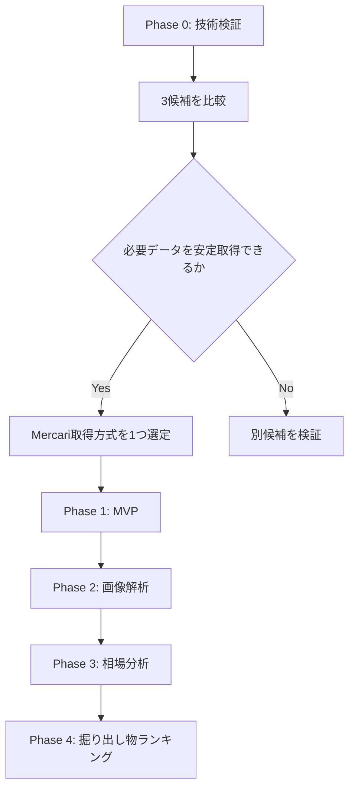
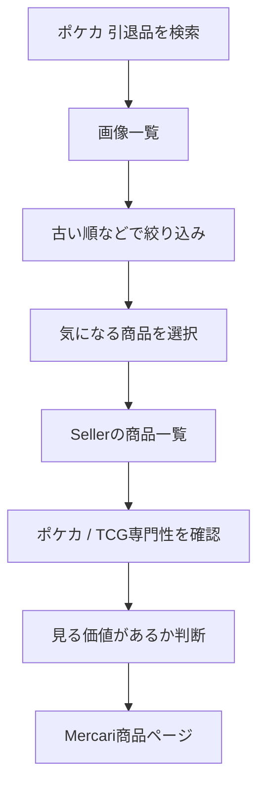

# Card Digger — TODO

> 掘り出し物を効率よく探索するためのMercari検索・出品者分析アプリ。
>
> 最初の目標はアプリを完成させることではなく、**Mercariから必要なデータを安定して取得できる方式を1つ選定すること**。

---

## 方針

開発は次の順番で進める。



---

# Phase 0 — Mercari取得方式の技術検証

## 0-1. 開発環境

- [x] GitHubリポジトリを作成する
- [x] READMEを作成する
- [x] `docs/` を作成する
- [x] `docs/concept.md` を配置する
- [x] `docs/todo.md` を配置する
- [x] PoC用ディレクトリを作成する
- [x] `.gitignore` を設定する
- [x] 必須環境変数がないことを確認する（必要になった時点で `.env.example` を作成する）

### PoC構成案

```text
card-digger/
├── README.md
├── docs/
│   ├── concept.md
│   └── todo.md
│
├── poc/
│   ├── common/
│   ├── mercari/
│   ├── mercapi/
│   └── playwright/
│
└── src/
```

---

## 0-2. 共通の検証条件を決める

3方式を同じ条件で比較できるよう、[共通検証プロトコル](poc-validation.md) と
機械可読な [`poc/common/conditions.json`](../poc/common/conditions.json) に固定した。

> この節のチェックは「検証条件の定義が完了した」ことを表す。実測の完了はPhase 0-A〜0-Cで記録する。

### 検索条件

```text
keyword: ポケカ 引退品
status: 販売中
sort: 出品日時の古い順（非対応の場合はその事実を記録）
category: 指定なし
price: 指定なし
```

- [x] 検索条件を固定する
- [x] 100件以上を最低取得目標にする
- [x] 出品から365日以上を「十分古い」の暫定基準にする
- [x] 5回の独立試行で安定性を測定する
- [x] 同時実行数1、リクエスト間隔2秒以上にする

### 各方式で取得したいデータ

- [x] 商品ID
- [x] 商品タイトル
- [x] 価格
- [x] 商品URL
- [x] 商品画像URL
- [x] 商品画像本体
- [x] 出品日時
- [x] 販売状態
- [x] 商品コンディション
- [x] いいね数
- [x] Seller ID
- [x] 出品者名
- [x] Sellerの商品一覧（販売中 / 売却済み）

### 検証する性能・安定性

- [x] 検索成功率
- [x] 取得件数・重複件数
- [x] ページング
- [x] 古い出品まで遡れるか
- [x] 各データ項目の取得率
- [x] 画像本体のHTTP取得・デコード成功率
- [x] Sellerの商品一覧取得率とページング
- [x] 401 / 403 / 429の有無
- [x] Rate Limit（負荷試験ではなく通常取得中の観測）
- [x] 実行速度
- [x] 実装の複雑さ
- [x] Mercari仕様変更への耐性
- [x] 共通の結果記録テンプレートを作成する

---

# Phase 0-A — `marvinody/mercari`

GitHub:

<https://github.com/marvinody/mercari>

## 目的

`created_time + ASC` が現在も利用できるかを最短で検証する。

## TODO

- [x] Python環境を作成する
- [x] `mercari` をインストールする
- [x] キーワード検索を実行する
- [x] 販売中商品のみ取得できるか確認する
- [x] 商品タイトルを取得する
- [x] 価格を取得する
- [x] 商品URLを取得する
- [x] 画像URLを取得する
- [x] 画像URLから画像本体をHTTP取得・デコードする
- [x] `created` を取得する
- [x] 商品コンディションを取得する（公開詳細モデルの解析失敗により取得率0%）
- [x] いいね数を取得する（公開詳細モデルの解析失敗により取得率0%）
- [x] `SORT_CREATED_TIME` を指定する
- [x] `ORDER_ASC` を指定する
- [x] 本当に古い順になるか確認する（古い順にならない）
- [x] 2ページ目以降を取得できるか確認する
- [x] 十分古い販売中商品まで遡れるか確認する
- [x] Seller IDを取得可能か確認する（検索結果になく、公開詳細モデルも解析失敗）
- [x] Seller Profileを取得できるか確認する（非対応）
- [x] Sellerの販売中商品一覧を取得できるか確認する（非対応）
- [x] Sellerの売却済み商品一覧を取得できるか確認する（非対応）
- [x] 401 Unauthorizedが発生するか確認する（0件）
- [x] [検証結果をMarkdownに記録する](../poc/mercari/result.md)

## 判定

### 採用候補になる条件

- [x] 現在も安定して検索できる
- [x] 古い商品までページングできる
- [ ] 必要な商品情報を取得できる
- [ ] Seller分析に必要な情報へ辿れる

**判定: 早期撤退。** `created_time ASC`が機能せず、商品詳細モデルが現行レスポンスを
解析できない。Seller Profile・Seller商品一覧も未実装のため、Phase 0-Bを優先する。

### 早期撤退条件

以下の場合は深追いしない。

- 401 / 403が継続的に発生する
- 古い商品まで取得できない
- Seller情報を取得できない
- 現行Mercari仕様への追従が困難

---

# Phase 0-B — `kynacio/mercapi`

GitHub:

<https://github.com/kynacio/mercapi>

## 目的

本採用の第一候補として、

- 商品検索
- 商品詳細
- Seller Profile
- Sellerの商品一覧

をまとめて扱えるか確認する。

## TODO

### 商品検索

- [x] Python環境を作成する
- [x] `mercapi` をインストールする（`0.4.2` / commit `20ba68f`に固定）
- [x] キーワード検索を実行する
- [x] 商品IDを取得する
- [x] 商品タイトルを取得する
- [x] 価格を取得する
- [x] 商品URLを生成または取得する
- [x] 商品画像URLを取得する
- [x] 画像URLから画像本体をHTTP取得・デコードする
- [x] 出品日時を取得できるか確認する
- [x] 販売状態を取得する
- [x] 商品コンディションを取得する
- [x] いいね数を取得する
- [x] ページング方法を確認する
- [x] 100件以上取得できるか確認する（825ユニーク件）
- [x] 古い販売中商品まで遡れるか確認する（7ページ目で365日超。ただし古い順ではない）

### Seller

- [x] 商品からSeller IDを取得する
- [x] Seller Profileを取得する
- [x] 出品者名を取得する
- [x] 評価を取得する
- [x] 評価件数を取得する
- [x] Sellerの商品一覧を取得する（10 / 10成功、全状態合計30件上限）
- [x] 販売中商品の一覧を取得する（206件。20件到達は7 / 10人）
- [x] 売却済み商品の一覧を取得できるか確認する（43件。20件到達は0 / 10人）
- [x] Sellerの商品画像URLを取得する
- [x] Sellerの商品URLを取得する
- [x] Seller商品の出品日時を取得できるか確認する

### 安定性

- [x] 401 / 403の有無を確認する（各0件）
- [x] Rate Limitを確認する（通常取得中の429は0件）
- [x] 連続取得時の挙動を確認する（正式測定72リクエストすべてHTTP 200）
- [x] APIレスポンス変更時の影響範囲を確認する
- [x] [検証結果をMarkdownに記録する](../poc/mercapi/result.md)

**判定: 条件付き。** 必要フィールド、詳細、画像、Seller Profile・商品一覧の取得は安定して
成功した。一方、`created_time ASC`は古い順にならず、Seller商品一覧も全状態合計30件に固定され
ページングできない。Phase 0-Cと比較するまで本採用は決定しない。

---

# Phase 0-C — Playwright方式

参考実装:

<https://github.com/neotruong/emthao-jp-search>

## 目的

非公式API Wrapperが安定しない場合の代替方式を検証する。

```text
Playwright
    ↓
Mercari Web
    ↓
Browserが検索APIを呼ぶ
    ↓
JSON Responseを取得
```

## TODO

- [ ] TypeScriptプロジェクトを作成する
- [ ] Playwrightを導入する
- [ ] Mercari検索ページを開く
- [ ] 検索通信を確認する
- [ ] `/v2/entities:search` の通信を確認する
- [ ] JSONレスポンスを取得する
- [ ] 商品IDを取得する
- [ ] 商品タイトルを取得する
- [ ] 価格を取得する
- [ ] 画像URLを取得する
- [ ] 画像URLから画像本体をHTTP取得・デコードする
- [ ] 商品URLを取得する
- [ ] 出品日時を取得できるか確認する
- [ ] 販売状態を取得する
- [ ] 商品コンディションを取得する
- [ ] いいね数を取得する
- [ ] Seller IDを取得する
- [ ] ページングを再現する
- [ ] 古い商品まで遡れるか確認する
- [ ] Sellerページを取得する
- [ ] Sellerの商品一覧を取得する
- [ ] 売却済み商品取得の可否を確認する
- [ ] Browser起動コストを測定する
- [ ] Headlessで動作するか確認する
- [ ] エラー時の再試行方法を確認する
- [ ] 検証結果をMarkdownに記録する

---

# Phase 0-D — 3方式を比較する

技術検証完了後、以下の表を埋める。

| 評価項目 | `mercari` | `mercapi` | Playwright |
|---|---:|---:|---:|
| 商品検索 | 5 / 5成功 | 5 / 5成功 | 未検証 |
| 出品日時 | 100 / 100 | 100 / 100 | 未検証 |
| 販売状態 | 100 / 100 | 100 / 100 | 未検証 |
| 古い商品へのページング | 5ページ・589件で365日超へ到達。ただし古い順は失敗 | 7ページ・825件で365日超へ到達。ただし古い順は失敗 | 未検証 |
| 画像URL | 100 / 100 | 100 / 100 | 未検証 |
| 画像本体のHTTP取得・デコード | 20 / 20 | 20 / 20 | 未検証 |
| 商品コンディション | 0 / 20（詳細解析失敗） | 20 / 20 | 未検証 |
| いいね数 | 0 / 20（詳細解析失敗） | 20 / 20 | 未検証 |
| Seller ID | 0 / 100 | 100 / 100 | 未検証 |
| Seller Profile | 非対応 | 10 / 10 | 未検証 |
| Sellerの販売中商品一覧 | 非対応 | 応答10 / 10、20件到達7 / 10。公開ページングなし | 未検証 |
| Sellerの売却済み商品一覧 | 非対応 | 応答10 / 10、20件到達0 / 10。公開ページングなし | 未検証 |
| 実装難易度 | 高 | 中 | 未検証 |
| 実行速度 | 検索中央値197.07ms、全体101.6秒 | 検索中央値260.85ms、全体144.4秒 | 未検証 |
| 安定性 | 検索100%、詳細0% | 検索・詳細・Profile・一覧・画像100% | 未検証 |
| 保守性 | 低め | 中。Wrapperへ影響を閉じ込められるが非公開API依存 | 自前保守 |
| 総合評価 | 早期撤退 | 条件付き | - |

---

# Phase 0-E — Mercari取得方式を1つ選定する

## 原則

MVPでは3方式を併用しない。

```text
3候補を技術検証
      ↓
1方式を選定
      ↓
Mercari Adapterとして実装
```

## 選定基準

優先順位は以下。

1. 必要データを取得できる
2. 古い販売中商品まで遡れる
3. Sellerの商品一覧を取得できる
4. 画像URLを取得できる
5. 安定して動作する
6. 実装・保守が簡単
7. 性能が実用範囲内

## 現時点の仮説

### 本採用候補

1. `kynacio/mercapi`
2. Playwrightベースの独自Adapter
3. `marvinody/mercari`

### 古い順検索のPoC順

1. `marvinody/mercari`
2. `mercapi`
3. Playwright

---

# Phase 0-F — Mercari Adapterを定義する

採用方式が決まった後、アプリ側から直接ライブラリを呼ばない。


## TODO

- [ ] `MarketplaceItem` 型を定義する
- [ ] `Seller` 型を定義する
- [ ] `SellerItem` 型を定義する
- [ ] 検索Interfaceを定義する
- [ ] Seller取得Interfaceを定義する
- [ ] Adapterを実装する
- [ ] 外部ライブラリ固有型をDomain層へ漏らさない
- [ ] Mock Adapterを用意する

### 型イメージ

```ts
type MarketplaceItem = {
  id: string;
  title: string;
  price: number;
  url: string;
  imageUrls: string[];
  createdAt?: Date;
  listingStatus: "on_sale" | "sold_out" | "unknown";
  itemCondition?: {
    id?: string;
    name?: string;
    raw?: unknown;
  };
  likeCount?: number;
  sellerId?: string;
};

type Seller = {
  id: string;
  name: string;
  rating?: number;
  ratingCount?: number;
};

type SellerItem = MarketplaceItem;
```

---

# Phase 1 — Search MVP

## 目的

商品画像とSeller情報を一つの画面で確認し、人間の探索時間を減らす。

---

## 1-1. 検索UI

- [ ] キーワード入力
- [ ] 検索ボタン
- [ ] Loading表示
- [ ] エラー表示
- [ ] 検索結果件数
- [ ] 販売中のみフィルター
- [ ] 最低価格
- [ ] 最高価格
- [ ] 古い順
- [ ] 新しい順
- [ ] 価格の安い順
- [ ] 価格の高い順

---

## 1-2. 商品画像一覧

一覧はテキストではなく、画像中心のGrid UIにする。

```text
┌───────────────┐
│               │
│   商品画像    │
│               │
├───────────────┤
│ ポケカ引退品  │
│ ¥12,000       │
│ 632日前       │
│               │
│ [商品を見る]  │
│ [Seller]      │
└───────────────┘
```

### TODO

- [ ] 商品画像表示
- [ ] タイトル表示
- [ ] 価格表示
- [ ] 出品日時表示
- [ ] 経過日数表示
- [ ] 元Mercariページへのリンク
- [ ] Seller分析画面へのリンク
- [ ] 画像取得失敗時のPlaceholder
- [ ] Responsive Grid

---

## 1-3. Seller画面

### TODO

- [ ] Seller名表示
- [ ] 評価表示
- [ ] 評価件数表示
- [ ] 出品数表示
- [ ] SellerのMercariページへのリンク
- [ ] 現在販売中の商品一覧
- [ ] 売却済み商品一覧
- [ ] 商品画像表示
- [ ] 商品タイトル表示
- [ ] 商品価格表示
- [ ] 商品ページリンク

---

# Phase 1-4 — Seller Knowledge Indicator

## 目的

出品者がポケカ相場を理解している可能性を、人間が判断しやすくする。

## MVPで使う簡易特徴量

- [ ] 全出品数
- [ ] ポケカ関連商品数
- [ ] TCG関連商品数
- [ ] ポケカ出品率
- [ ] TCG出品率
- [ ] 専門用語の使用数

### 専門用語候補

```text
SAR
SR
UR
AR
PSA
PSA10
旧裏
プロモ
初版
未開封
BOX
シュリンク
鑑定
```

### 表示例

```text
Seller Knowledge
-------------------------

全出品              63
ポケカ関連           3
TCG関連              4

ポケカ比率          4.8%
TCG比率             6.3%

専門用語            少ない

専門性              低
```

### TODO

- [ ] ポケカ判定キーワードを定義する
- [ ] TCG判定キーワードを定義する
- [ ] 専門用語一覧を定義する
- [ ] Seller商品を分類する
- [ ] ポケカ比率を計算する
- [ ] TCG比率を計算する
- [ ] 専門用語出現数を計算する
- [ ] `低 / 中 / 高` の簡易判定を実装する
- [ ] UIに表示する

> Seller Knowledgeは購入判断ではなく、あくまで探索時の補助指標とする。

---

# Phase 1-5 — 探索補助

- [ ] お気に入り
- [ ] 確認済みフラグ
- [ ] 商品メモ
- [ ] Sellerメモ
- [ ] 検索条件保存
- [ ] 除外キーワード
- [ ] Seller Knowledgeによるフィルター
- [ ] TCG専門性が低いSellerを優先表示

---

# Phase 1 — MVP完了条件

以下のフローが成立すればMVP完成。



### 完了チェック

- [ ] 商品を検索できる
- [ ] 商品画像を一覧表示できる
- [ ] 古い順に表示できる
- [ ] 元商品ページへ移動できる
- [ ] Seller情報を確認できる
- [ ] Sellerの商品一覧を確認できる
- [ ] Seller Knowledgeを確認できる
- [ ] 人間が見る商品を効率的に絞れる

---

# Phase 2 — 画像解析

MVP完成後に着手する。

- [ ] 商品画像を取得する
- [ ] 画像内のカード領域を検出する
- [ ] 複数カードを分割する
- [ ] OCRを検証する
- [ ] カード名候補を推定する
- [ ] カード型番候補を推定する
- [ ] 推定結果のConfidenceを表示する
- [ ] 人間が修正できるUIを作る

---

# Phase 3 — 相場分析

- [ ] カード相場データ取得方法を調査する
- [ ] 相場データProvider Interfaceを作る
- [ ] カードごとの相場を取得する
- [ ] 推定総額を計算する
- [ ] 販売手数料を考慮する
- [ ] 送料を考慮する
- [ ] PSA鑑定コストを考慮する
- [ ] 想定利益を計算する

---

# Phase 4 — Opportunity Score

## 候補特徴量

- [ ] 出品価格
- [ ] 推定カード総額
- [ ] 推定利益額
- [ ] 推定利益率
- [ ] 出品からの日数
- [ ] Seller Knowledge
- [ ] SellerのTCG出品率
- [ ] 高額カード候補数
- [ ] 画像枚数
- [ ] カード枚数
- [ ] 商品説明の具体性
- [ ] 商品タイトルの具体性

## TODO

- [ ] 初期スコアリング式を設計する
- [ ] 0〜100で表示する
- [ ] スコア内訳を表示する
- [ ] スコア順に並べる
- [ ] スコアによる除外を可能にする

---

# Phase 5 — Marketplace拡張

Mercari Adapterと同じInterfaceで追加する。

```text
Marketplace
├── Mercari
├── Yahoo Auctions
├── PayPay Flea Market
└── ...
```

- [ ] Marketplace共通Interfaceを見直す
- [ ] Yahoo Auctions調査
- [ ] PayPay Flea Market調査
- [ ] Marketplace横断検索
- [ ] 重複商品の扱いを検討する

---

# 非機能TODO

## テスト

- [ ] DomainロジックのUnit Test
- [ ] Seller KnowledgeのUnit Test
- [ ] AdapterのIntegration Test
- [ ] 検索画面のE2E Test
- [ ] MockデータでMercari停止時も開発できるようにする

## エラー処理

- [ ] 401
- [ ] 403
- [ ] 429
- [ ] Timeout
- [ ] 商品削除
- [ ] Seller削除
- [ ] 画像取得失敗
- [ ] APIレスポンス変更

## パフォーマンス

- [ ] 画像Lazy Load
- [ ] Seller情報Cache
- [ ] 検索結果Cache
- [ ] ページング
- [ ] 無駄な再取得を防止する

---

# 利用規約・運用上の確認

技術的に取得可能でも、公開サービス化・商用化・大量アクセスが許容されるとは限らない。

- [ ] Mercari利用規約を確認する
- [ ] 公開前に利用方法を再確認する
- [ ] 商用利用前に再確認する
- [ ] アクセス頻度を制御する
- [ ] 大規模クロールを前提にしない
- [ ] 必要以上のデータを保存しない
- [ ] Seller分析は公開情報のみを対象とする

参考:

<https://help.jp.mercari.com/guide/articles/900/>

---

# 最優先TODO

現時点では以下だけに集中する。

```text
[1] GitHub Repository作成
        ↓
[2] marvinody/mercariで古い順PoC
        ↓
[3] mercapiで商品 + Seller取得PoC
        ↓
[4] 必要ならPlaywright PoC
        ↓
[5] 比較表を完成
        ↓
[6] Mercari取得方式を1つ選定
        ↓
[7] Mercari Adapter作成
        ↓
[8] Search MVP開始
```

## 今やらないこと

Phase 0が完了するまでは以下に着手しない。

- AI画像認識
- 相場自動取得
- Opportunity Score
- 複数Marketplace
- 自動購入
- 通知・監視機能

まずは、

> **必要なMercariデータを安定して取得できるか**

を証明する。
